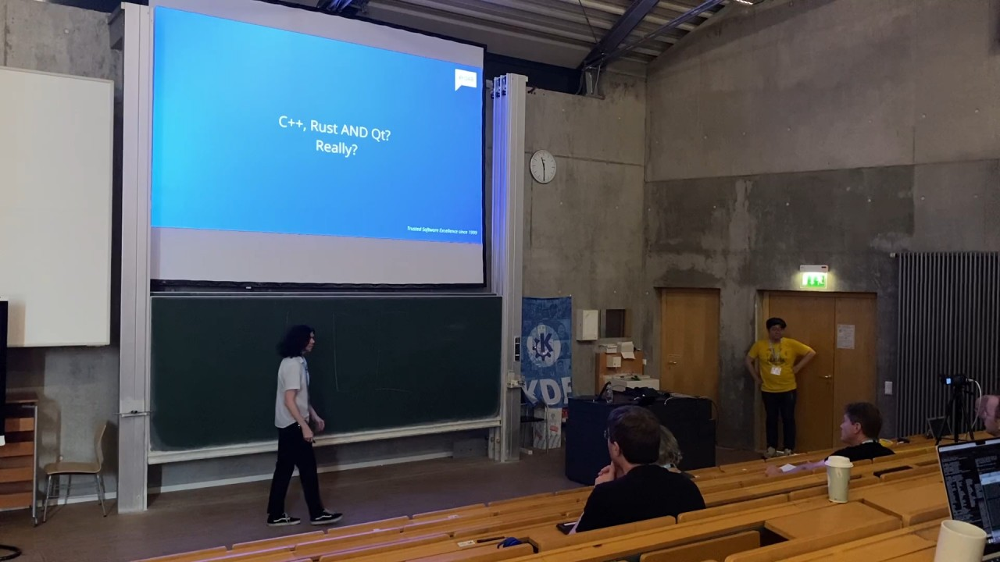

I attended [KDE's Akademy](https://akademy.kde.org/2024) and the [Qt Contributor Summit](https://wiki.qt.io/Qt_Contributor_Summit_2024) that happened this year. I also completed my personal goal of giving a talk at a conference! These conferences were back-to-back and were located in [Würzburg, Germany](https://en.wikipedia.org/wiki/W%C3%BCrzburg) during the 5th-8th of September.

# Travel

I stopped in [IAD](https://en.wikipedia.org/wiki/Dulles_International_Airport) before flying into [FRA](https://en.wikipedia.org/wiki/Frankfurt_Airport), and the journey was fortunately uneventful compared to last year. My IAD->FRA flight was delayed by an hour due to (another plane's) mechanical issues and the ATC was backed up. When they announced that they were "sequencing" departures, I was surprised to find them actually putting all of the departing planes in a physical line on the runway.

On the IAD->FRA flight, they were having some troubles with the satellite connection and tried restarting the in-flight entertainment. While that probably did not please many of the people enjoying their movies and shows, it did reveal the in-flight entertainment system for United flights were running Android. Boo, that's no surprise.

The trains I were on weren't too late and I quickly arrived in Würzburg after a transfer to Frankfurt Central Station. To save some money, I purchased a [Deutschland-Ticket](https://int.bahn.de/en/offers/regional/deutschland-ticket) which covered most local transportation, including the buses in Würzburg proper. The ticket was only 50€, which if I had paid for the trains separately would mean at least 65€! I didn't bother calculating how much bus fares would've cost. So the D-Ticket was definitely worth it during my stay.

On my returning overseas flight, the plane was half-empty. So I had a row with window seat all to myself, it was pretty sweet! Is this how flying first-class feels?

# Hotel

I stayed in [Hotel Amberger](https://hotel-amberger.de/), close to the central station. It's a cute little hotel, housed in a building that was clearly repurposed (my guess is some kind of hospital.) The hotel rooms are dead simple, but I didn't really care. The first few days were really hot and the lack of a central air conditioning was really noticeable. Once the weather cooled off, the room was much more hospitable.

The hotel room had a TV, but mine did not work. No German TV for me this time! There was multiple bus stops near the hotel, so it was very easy to get to the Akademy venue. The QtCS venue was within walkable distance, so I walked there each day.

# Qt Contributor Summit

This being my first Qt event, I didn't really know what to expect. The venue is hosted in this expensive-looking conference center ([Congress Centrum Würzburg](https://www.wuerzburg-b2b.de/ccw-das-haus/raeume-und-flaechen/)) near the river. There was catered food, which included lunch and coffee breaks. Dinner was served on the first day. I noticed the wait staff and looked young so I wonder if they were local culinary students.

The talks were a mixed bag of topics, but I still found value going there. Most of the non-Qt people there were either KDE or KDE adjacent, of course. One of the cooler things for me was meeting a bunch of Qt people in person. Of whom I only knew by name, mentioned in e-mails and Gerrit, so on. Lots of people recognized me by my work on qmlformat, so that was neat.

The talk that interested me the most [was Vladimir Minenko discussing "QML Next"](https://wiki.qt.io/QtCS2024_QML_Next), plans to use languages other than C++ with QML. Some languages discussed were Swift, and C#. Curiously Rust was absent, which he did duly note. They did mentioned they were hiring a developer to work on Rust support later this year. The talk itself the concept was a bit vague, but that's because they're still in the exploratory stage.

If you're interested in the other talks in this conference, there are notes and slides available from [the Qt Wiki](https://wiki.qt.io/Qt_Contributor_Summit_2024_-_Program).

# Akademy

Akademy was hosted in [Julius-Maximilians-Universität Würzburg](https://www.uni-wuerzburg.de/en), which was much farther than the venue for QtCS. That necessitated travel by bus, but that was also covered by the D-Ticket. The talks were hosted in two identical-looking lecture halls. On a bus heading towards Akademy one day, I noticed one of the screens didn't work. Of course, I had to take a picture...

My talk [was about integrating C++, Qt, Rust (and KDE Frameworks.)](https://conf.kde.org/event/6/contributions/203/) For proper disclosure, this talk is on behalf of my company for spreading the word of [our cxx-qt library](https://github.com/kdab/cxx-qt) which eases integration of all of these technologies. I think was a bit too rough structurally but lots of people seem to enjoy it. One of my goals was to raise awareness of the usage of Rust you can find in KDE today, and that seemed to be successful! I want to express my gratitude to my fellow colleague Leon Matthes for helping review my slides. Also thanks to [Darshan Phaldesai](https://github.com/dphaldes) for his KDE work featured in the presentation.

The results of my talk I think were really cool! Within the KDE community, there seems to be some interest in picking up Rust. Lots of KDE developers were in varying stages of Rust interest. No one told me how stupid it was to glue the two together, so the general vibe I think is "it's pretty neat, let's see how well this works." ~~Unfortunately due to technical issues my talk was not recorded properly. A colleague recorded my talk on his phone, and will hand that over to the Akademy organizers soon.~~

The talk is now available on [PeerTube](https://tube.kockatoo.org/w/bdDAWwGXRyWmyVBn9mdbnP). [The slides are also available online](https://conf.kde.org/event/6/contributions/203/attachments/133/169/akademy-2024-qt-rust.pdf).

Oh yeah, and the KDE goal I'm championing ["We care about your Input"](https://phabricator.kde.org/T17433) was selected! I'm pretty excited to keep hacking away on graphics tablets in KDE Plasma. Thanks to [NLnet](https://nlnet.nl/) for sponsoring us to work on that, along with Wayland accessibility improvements.

One of my favorite talks was [Xaver Hugl's "What even is color?"](https://conf.kde.org/event/6/contributions/221/). The work he's doing in KWin is excellent, and I think he did a really great breakdown to understand what color management is.

# Day Trip

In the day trip we went to Rothenburg. It was rainy, cold and miserable most of the day but we still had fun. One of my favorite parts was climbing up the tower to get an excellent view of the town.

That's all I have to say about Akademy + QtCS, I had lots of fun this year! I'm happy that I was able to attend the talks this year, and meet a lot of people I missed last year. I hope everyone else were able to return home, and I'm excited to see what event I'll attend next. See you!
