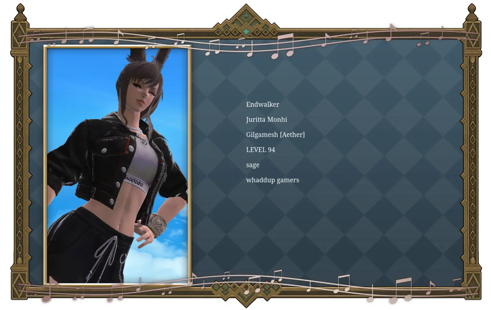

I'm excited to announce my next FFXIV-related project, _Auracite_! It's a tool that allows you to archive your character. I wouldn't call it a "backup" because there's no way to "restore" it... not yet, anyway. Currently the information it collects is limited, but I plan on expanding it further. You can view the [support table here](https://github.com/redstrate/Auracite?tab=readme-ov-file#supported-data).

The tool spits out a JSON file containing some basic information, such as your character's name, world/data center/etc. Also included is the server-generated portrait/avatar of your character from the Lodestone. If you happen to have [Dalamud](https://github.com/goatcorp/Dalamud) installed, then you can use my plugin. This allows Auracite to collect more info about your character from the game itself.

Something I've wanting to do for a while now was embed my adventurer plate into my website. Now it's starting to become possible thanks to Auracite:

You can use Auracite from [your browser](https://auracite.xiv.zone). Go ahead and try it!

## Technical Bits

I noticed that unlike other MMOs, FFXIV exposes a ton of information about it's user's publicly through the Lodestone! Not only that, but their CSS selectors aren't complete garbage like a typical modern website and it makes scraping it not a total chore. Otherwise, Auracite is your standard scraper but tuned to work with the Lodestone.

The tool is written in [Rust](https://rust-lang.org). The desktop version is written in [Qt](https://qt.io) via [cxx-qt](https://github.com/KDAB/cxx-qt). It can run on the web thanks to [WebAssembly](https://webassembly.org/). Source code is [available](https://github.com/redstrate/Auracite) as per usual. 
