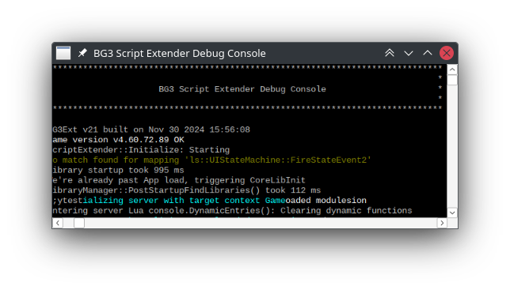

In Act 2, there's a battle with a big group of enemies and you fight alongside a group of allies. Said allies are infamously known for walking and dying to your own attacks (like a big stinky cloud). If an ally dies in your stink cloud, it's considered murdering a guard and they'll throw you in prison once the battle is over. There's apparently no way to get out of this situation in the vanilla game (as of Patch #7.) Your Tav is marked with an "Enemy of Justice" debuff which seems permanent:


To get rid of this crime and others we can use [Script Extender](https://github.com/Norbyte/bg3se). You'll need to install it, and then enable the console with `CreateConsole`. This is outside the purview of this guide, I assume you'll have it all setup already. Load into the save you need to fix, and then go into the "BG3 Script Extender Debug Console" window.



You need to press enter/return once to enable input, which we need to use to run some commands. First, we clear all of our crimes:

```lua
Osi.CrimeClearAll()
```

And also remove the status from your Tav (if you're trying to clear murder.) The status is called `GB_GUARDKILLER`:

```lua
RemoveStatus(GetHostCharacter(), "GB_GUARDKILLER")
```

And that's it! You can now walk back up to guards, and your character isn't stuck with the guilt. I hope this helps any other people stuck in this non-desirable game state. 

---

Side-tangent: The actual solution to getting rid of the "Enemy of Justice" status is becoming lost knowledge.. for some reason. [This Reddit post](https://www.reddit.com/r/BaldursGate3/comments/168v4ct/fix_for_enemy_of_justic) inspired my solution (it uses more commands, mine just uses the `CrimeClearAll` function.) The original post content is now gone, not even the Internet Archive has it.

There's a couple of mods too, for example ["Ring of No Justice"](https://www.nexusmods.com/baldursgate3/mods/7067) (this mod is deleted) and ["Enemy of Justice"](https://mod.io/g/baldursgate3/m/enemy-of-justice) (this mod doesn't work.)
