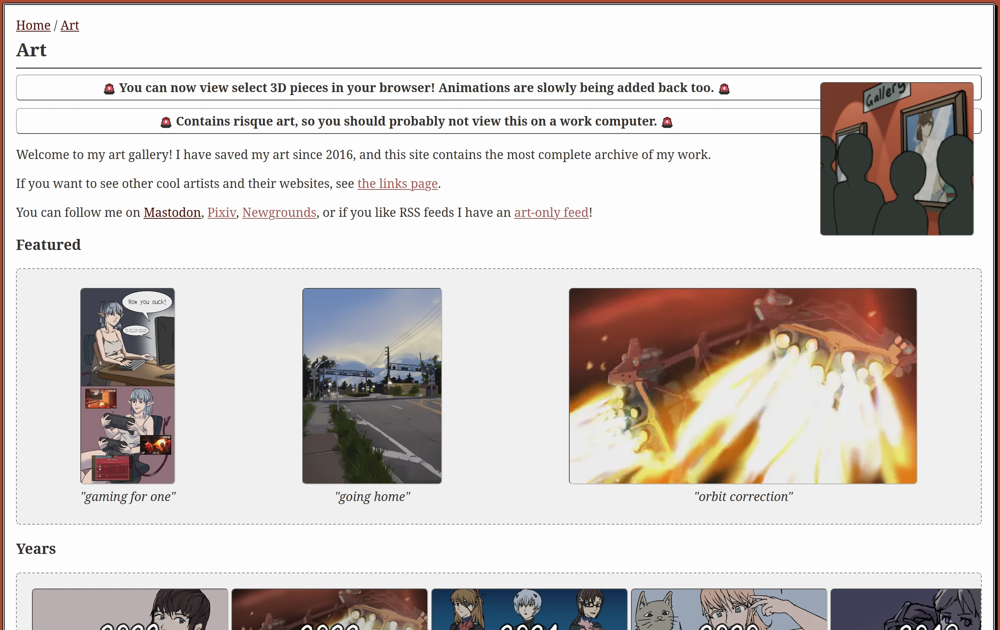
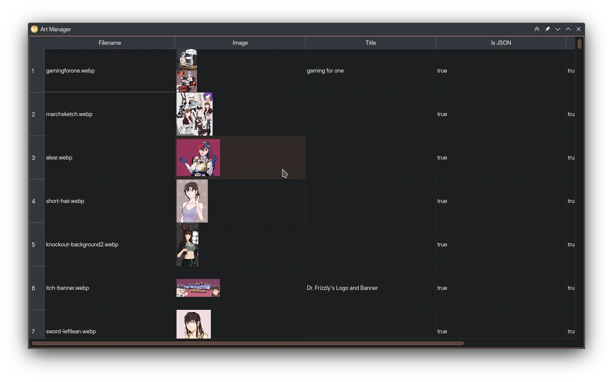

I realized today that I had inadvertently created a static art gallery. I think my system is interesting, so I wanted to write down how it works.

The gallery page is currently being served to you by my [web server](https://nginx.org/) without any kind of extra software like a dynamic scripting engine, or being read back from a database! This makes it extremely lean, cheap to operate and doesn't break often.



The whole page takes about ~1 megabyte, even with all of the images included! (This is without cache, I have a decent caching policy so it's even less on return visits.)

# Adding new pieces

Adding new artwork is extremely easy. In the site root I have a folder called `assets`, which is where I keep most of my website assets. Inside of the directory is where I keep images specifically for the gallery called `art`. Right now these are [WebP](https://developers.google.com/speed/webp/) but I'll probably be switching to [AVIF](https://en.wikipedia.org/wiki/AVIF) in the future! The first step is to place a optimized WebP into this directory, giving it a unique filename.

The second step is adding a new JSON file which describes the artwork's attributes, this is found in the `art` directory in the site root. I can tweak a lot of things like:
* The date that the piece was created (for more recent artwork, I can put exact dates but the system also handles "relative" dates where I only know the month/year).
* The alternative text for the artwork.
* Social links if the artwork was posted elsewhere.
* Whether the artwork is NSFW.
* What program was used.

The JSON is simple enough to write with a text editor, but I also made [a graphical application](https://git.sr.ht/~redstrate/redai) which makes mass editing a breeze:



When I'm done editing, I then run the `gen_art.py` Python script in the `scripts` directory found in the site root. I have described the technical ins-and-outs for  those inclined to know the technical details of how the art gallery functions below.

# How the art gallery is generated

I worked on my website gallery for years, pretty much [since the site's inception]() I had some kind of page like this. When I switched to [Hugo](https://gohugo.io/), I knew I wanted some way to have an easily maintainable gallery. This is the culmination of my efforts, and I think it works really well, although a lot of it is bolted on to Hugo.

1. The script blasts the `content/art` directory and all of it's contents.
1. It goes through the `art` directory in the site root, iterating over each and every piece definition.
2. For each piece, it generates a markdown file containing only Hugo front-matter information which will be needed later. The usual suspects (title, date, slug) used by standard Hugo pages are filled in too.
3. After it's done with the pieces themselves, two more pages are generated:
	1. The script keeps track of the set of years of the entire gallery, and generates stub pages so they are navigable.
	2. It also generates a statistics page, using some other stats calculated during it's run. Eventually I'd like to expand this in the future!
	
So each artwork has it's own markdown file (which is just a page) and the whole gallery is decked out in custom layouts. There's a separate layout for the main gallery page, the one used when searching by year, and of course when viewing the artwork individually.

I personally find this setup works really well, and requires very little JavaScript or anything dynamic. However, there is JavaScript used for properly laying out the gallery, adding comment/voting boxes but these are not required to view the page. Since everything can be fed into Hugo, the rest is statically generated!

Another neat thing is that I have three separate tagging systems on my website. One is used for blog tags, another is art tags, and the last are character tags. This was actually really easy to do, here's a snippet of my `config.toml`:

```toml
permalinks:
  arttags: 'art/tags/:title'
  characters: 'art/characters/:title'
  tags: 'blog/tags/:title'
  ...
```

I have set up different permalinks for each taxonomy, and then I simply attribute to it in the front-matter:

```toml
...
arttags:
- 3d
---
```

I'm pretty happy with how the art gallery functions right now, and I want to expand it more in the future. I already added animation support, and in-browser 3D models using [model-viewer](https://modelviewer.dev/). Some ideas I'm floating around:

* Dedicated character pages.
* More visually pleasing tags overview page, instead of the unordered list it is right now.
* Adding back the social media icons I've made, so the details pages aren't so text-heavy.
* Some kind of popular request/poll integrated into the gallery would be neat!
