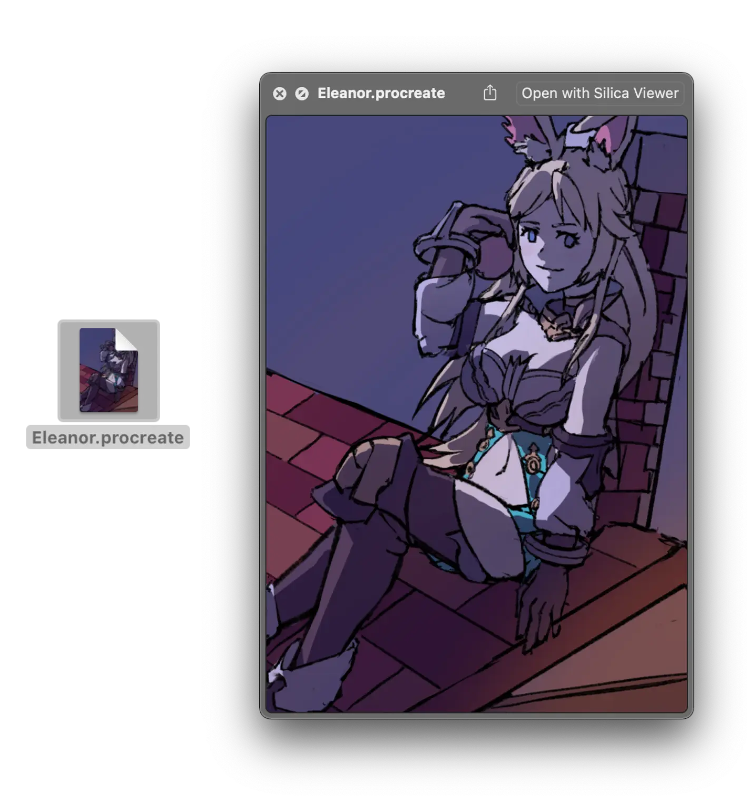
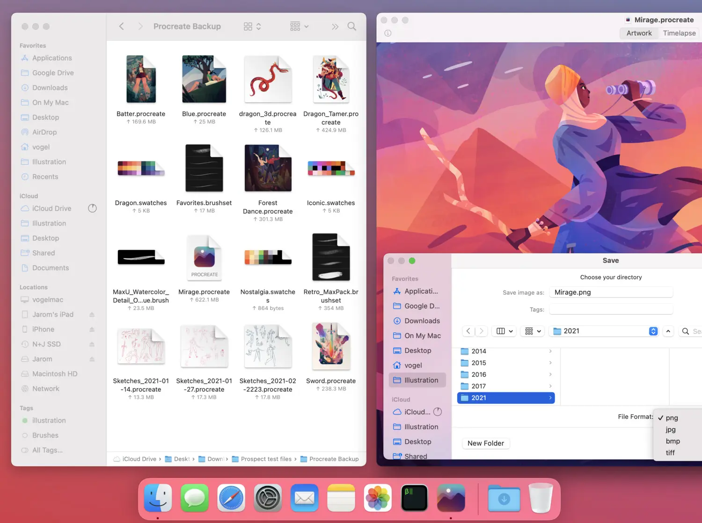

This is a retrospective of one of my more successful projects and first paid program, Silica Viewer.
<!--more-->
When developers want to make a living, a common way is to sell your software[^1]. I was interested in this, since I was researching alternative ways to earn income (and still looking!) I already make software, so why not sell something that's useful to people?

For context, [Silica Viewer](/software/silica-viewer) is a macOS software that allows you to view your Procreate files. People who are not familiar with Procreate might think "what's the point?" However there is no Procreate _for_ macOS and the software stores your work in their proprietary format.  Without getting too technical, it is an easy format to break open (they are actually just renamed zip files!) but it's troublesome for artists that just want to view their work on their laptop or desktop, there's just no obvious solution[^2]. It's also useful for artists that lose access to their iPad and need their artwork back. Silica Viewer is a fully-featured program, not only does it provide QuickLook previews and thumbnails, but it also allows you to view your canvas in full resolution and play back timelapses.

Even today, there is really only one other option: [Procreate Viewer](https://jaromvogel.com/illustration) (now renamed _Prospect_) by Jarom Vogel. When I initially started Silica Viewer development, it was initially a QuickLook plugin but has since expanded to canvas viewing and timelapses. It has the same limitations as Silica Viewer though, it's notably missing animation support and the 3D feature found in newer Procreate versions but alas, I don't use those features. I have no relations to Jarom, but my initial code was based on his original program and he's credited in [the README](https://git.sr.ht/~redstrate/silica-viewer#raster-canvas-data). Prospect does not seem to be open source unfortunately. I'm glad there are more people filling this niche in the Procreate ecosystem though!

I'm not a marketing person by any means, but when I released Silica Viewer on the App Store without any fanfare I was surprised by the amount of attention it has gotten. As of writing, I sold 69 units of my software which I was really proud of. The only marketing I did was a blog post, and a thread on the Procreate forums. I'm guessing most people typed "Procreate" into the App Store and just got my application. Even to this day, I still get a couple of units each week. The app only costs $0.99 (in USD, it differs in other countries but that's out of my control) and you technically don't have to pay - it's source code is licensed under MIT and you're free to build it yourself. The functionality is identical and the only reason why it costs money on the App Store is solely to pay back my developer license.

Oh yeah, my developer license. To sell units on the App Store, Apple requires you to pay $100 a year for the privilege. Not only that, **but they also take ~30% of your sales too**, if that wasn't enough! So for full transparency, I sold 69 units at $0.99. That's about $72.36 in sales. Now you might think, "hey that's enough to pay Apple back!" That's _before_ Apple's cut though, so my actual profit is a measly $47.86. Now I'm not complaining - I honestly didn't expect anyone to actually use my software - but right now it's just not close to a profitable venture to me. Maybe if I sold the program on its own, through my own website (which I probably will at some point) but breaking even on the App Store is just not possible for me. Even if more people bought the software, that's only just for _this_ year, **I would need an equal amount of units to break even for future years**. I just don't see that happening for such a niche software, even though it's cheap or in some cases free.

This is what makes me weary about developing stuff in the future exclusively for Apple platforms. Thanks to this model, I want to continue being the App Store, and I **have to continue paying Apple money**[^3]. Now that I have regular people using my software, I feel obligated to keep Silica Viewer on the App Store. This is sort of an interesting trap that Apple set up, and I'm unsure what to do since I have no interest in selling any more software though them.

[^1]: I'm specifically talking about small teams of developers, like 1-3 people. Companies of course are structured very differently, but usually these small teams are just one person or made up of profit sharing.

[^2]: Other programs exist that predate Silica Viewer of course, we will mention this later in the article!

[^3]: This is in stark contrast to something like Steam, where they continue to take their cut as long as you sell your software - but you are only required to send a one-time fee to Valve. Apple is the only big company that I know of that requires it's developers to pay annually for the privilege to release and notarize their software.