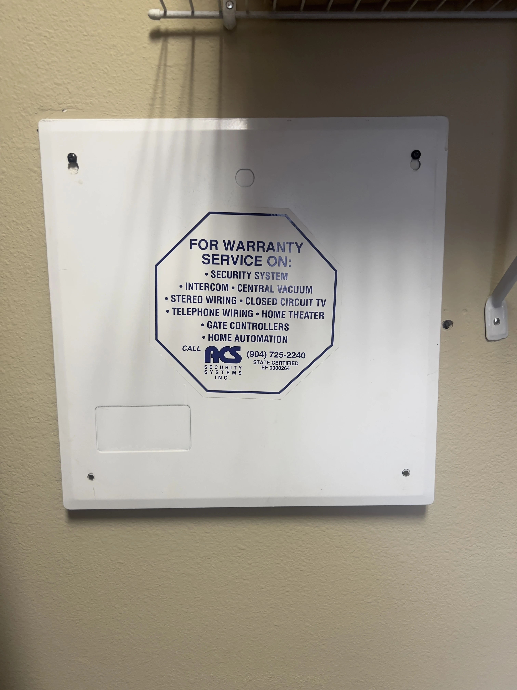
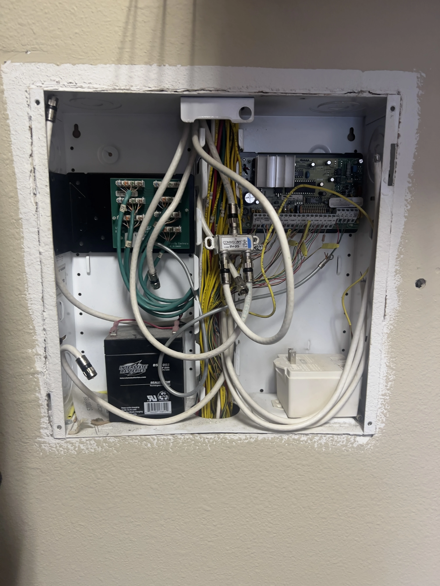
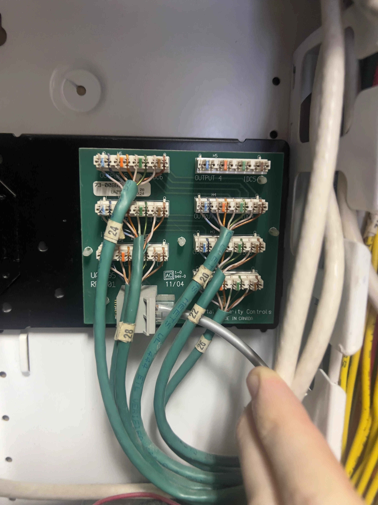
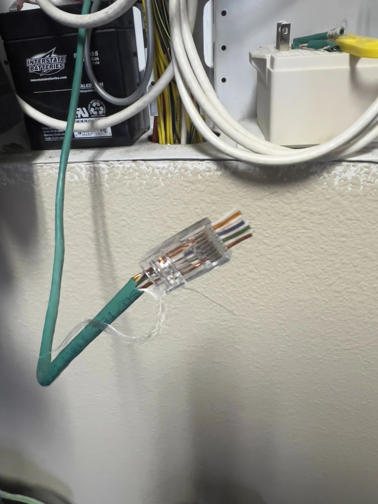
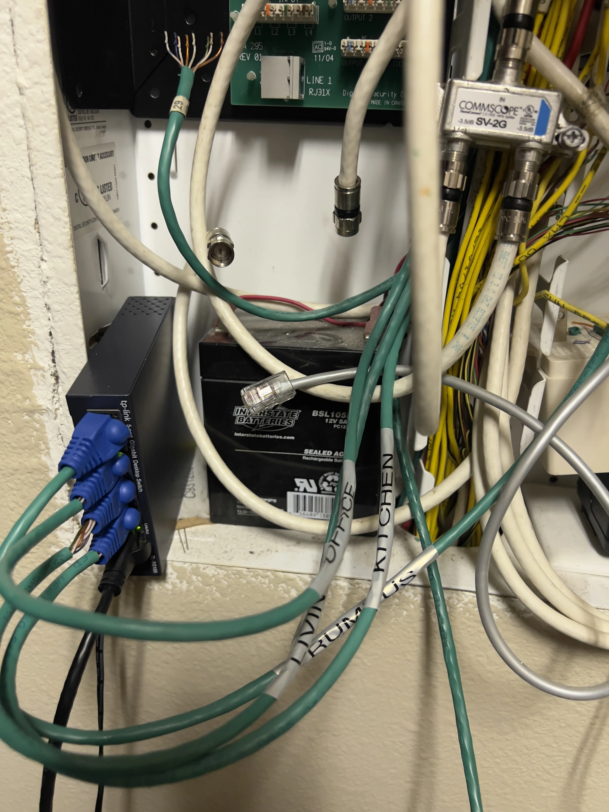

I recently moved into a new place, which has a few oddities in it's walls. For one, it does (fortunately) have CAT5 cables running through the walls. But there's a catch, they aren't for a network! When I opened up the patch panel, it revealed it's true purpose - it's for a security camera system.

This is an expanded version of [this Mastodon post](https://mastodon.art/@redstrate/112402572697844790).

I've never seen this kind of security system before - not that I look at many - but this intrigues me. These are normal CAT5 cables, along with normal RJ45 connectors on the walls (and in case you doubt it, the panels read "CAT5".) But they lead into this board which _presumably_ only looks at the image information and sends an alarm or notification when something moves. If someone knows more about this system I'm interested to hear it. I'm also curious if this was installed when the house was built or it was installed by the previous owners.

Anyway, this security system is functionally useless because I don't have cameras to hook up. The whole system is also unplugged and I'm worried I will accidentally call the police or fire department if I do. I wanted to hook everything up for a home network solution instead.  This should be "easy", all I needed to do was pull out the exposed wires and crimp my own RJ45 connectors. I have no idea who designed this board not to use the connectors and instead required the technician to wire them manually, seems like a waste of time to me,

Here's my first one, and that's way easier said than done! I'm not a networking person but I found crimping really difficult at first... it was hard getting the wires in the right order and feeding them through the plastic bit. But after my 2nd or 3rd crimping it started getting a little easier.

Feel free to judge my terrible networking skills here, but it does indeed work! If you're curious about the speed benefits, it's about the same download/upload speed but the latency is cut in half if not more. It also means there's less devices fighting for airspace, I'd like to keep that to a minimum.
