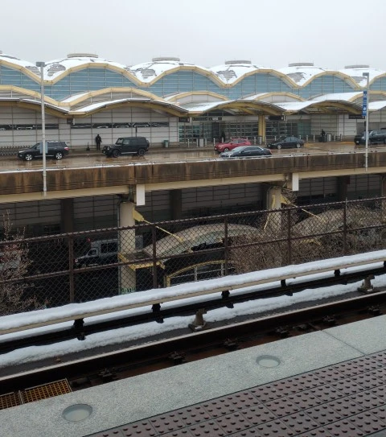
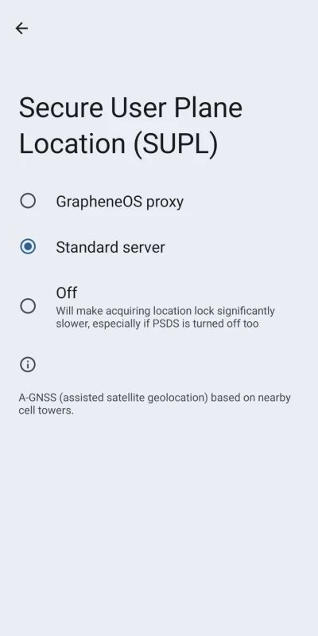
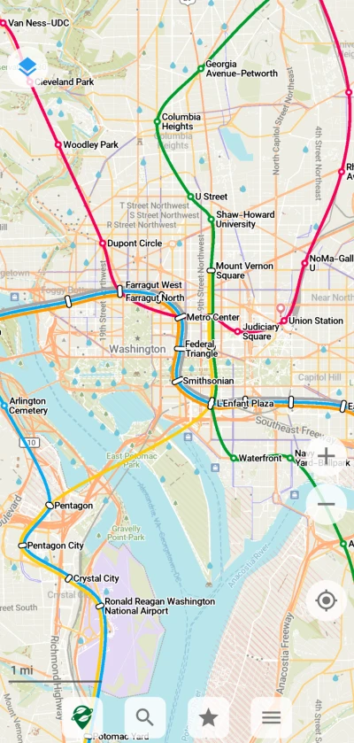
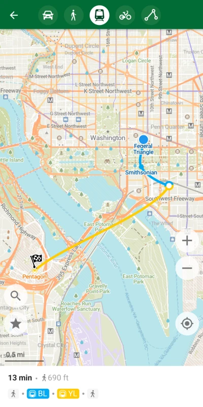
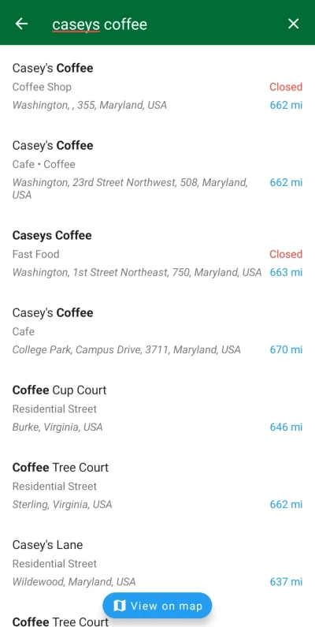

I visited [Washington, D.C.](https://en.wikipedia.org/wiki/Washington,_D.C.) recently and want to discuss the open-source software I used to navigate the city. I think my experiment was successful, although I had no control over what my partner used (e.g. Google and Apple Maps) so it wasn't 100% on me.

# Operating System

I use [GrapheneOS](https://grapheneos.org/) on my phone, which normally isn't notable but... the GPS didn't work! For some reason when I arrived in D.C. it refused to pick up any satellites, which was frustrating when trying to get around town. Fortunately it was easy to pick up on landmarks, but it really shouldn't have been an issue.

My only _guess_ as to what happened is some kind of weird issue with GrapheneOS's proxy servers for helping with geolocation. Once I got home and switched to the "Standard server" options I was able to get a lock on my location. I didn't have a problem with the proxy servers in my hometown before, so hopefully this is some kind of one-off error?

# Itinerary

Since I'm a KDE citizen, I of course use [Itinerary](https://apps.kde.org/itinerary) to record the general flow of the trip. Not all of it is trackable, unfortunately. There's no way to plan subway routes on the Metro, or keep tabs on gate changes for airlines. Despite that though, I took advantage of the [CitizenM](https://invent.kde.org/pim/kitinerary/-/merge_requests/162) and [American Airlines](https://invent.kde.org/pim/kitinerary/-/merge_requests/150) extractors I added to keep confirmation numbers handy.

_(I would show a screenshot if I could, but the entire thing is full of personally identifiable information!)_

# Maps

The primary (and only) map I used was [Organic Maps](https://organicmaps.app/), which is based on [OpenStreetMap](https://www.openstreetmap.org/about) data. There is a few caveats to it, unfortunately. The biggest I ran into is that transit navigation and searching feels underdeveloped.

If you wanted to travel the Metro it was obtuse. It will correctly navigate, but doesn't tell you the intermediate stops you actually need to take. The map itself is still useful to figure it out on your own though. You also can't _start_ a transit navigation unlike every other type and I'm not sure why.

The bigger problem for me was _searching_ for places and the UX leaves more to be desired. It's a fullscreen page, unlike other apps that can show this in list and map form at the same time.

I like how it shows you how far away things are from you - but it's based on your _current_ location. My location was wrong or inaccessible for most of the trip so this wasn't too useful. I would've preferred it to be based on where I was looking at on the map, or if I'm routing - the "From" point.

I really appreciate Organic Map's offline-first approach during the trip! Since I downloaded the Maryland map ahead of time, it was really fast and easy to access. If my partner was struggling to access something on Google, I could hastily find it using Organic Maps[^1]. One downside I noticed is that if I updated or added something to OSM in another app ([Vespucci](http://vespucci.io/), [StreetComplete](https://streetcomplete.app/)) it wouldn't show up in Organic Maps, obviously[^2].

I hope this doesn't sound like I'm super disappointed in Organic Maps, it was 90% of the way there to replacing proprietary maps for me which is really impressive. The ecosystem can only improve from here!

# Translating Google Maps Navigation to Organic Maps

There was an instance where I wanted to open a ["google.navigation" URI](https://developers.google.com/maps/documentation/urls/android-intents) but couldn't since I didn't have any applications that handle it. These links are written like "google.navigation:q=a+street+address", and there's a couple of places where this is used in Itinerary. [Organic Maps can't open these](https://github.com/organicmaps/organicmaps/issues/475) at the moment. I also found encountered some cases where geographic coordinates provided by Itinerary didn't line up with a feature in Organic Maps. The street address search is lacking in Organic Maps too, so I can't pass some queries directly to Organic Maps.

I quickly whipped together an Android app - before I left - that handles this URI scheme and a little bit more. It's only available in source-form [on my Codeberg](https://codeberg.org/redstrate/Navigator) with a _terrible_ placeholder name. I'm also new to Kotlin, so the code is functional but looks terrible. It [uses Nominatim to resolve queries](https://nominatim.openstreetmap.org/ui/about.html) and get latitude/longitude coordinates Organic Maps has no trouble displaying.

# Bonus Politics

I didn't attend any protests there unfortunately, there was one on the 14th but I didn't see the poster until the next day. There was a surprising amount of pro-LGBTQIA+ material we saw throughout the city too. Definitely way more than I see in my conservative hometown, but I guess that's not really a surprise.

**Update 3/14/25**: It soon after I posted this, the maintainers of GrapheneOS have been doing tons of work on the location service. I'm happy to report that my location locks *so much quicker* now, so I suppose this isn't an issue anymore. It also works better indoors!

[^1]: Even things like the Wikipedia blurbs were saved, which were neat to read.
[^2]: I don't consider that to be a real problem though, it's only because I was contributing data at the time.
