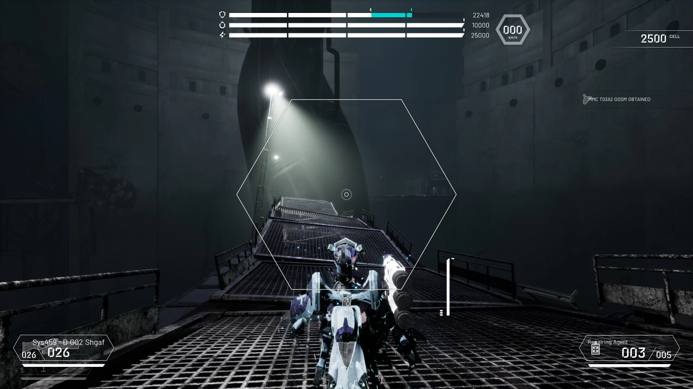
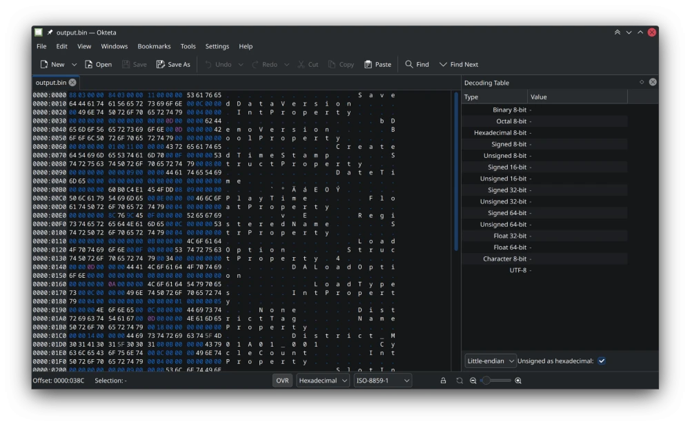

Doll's Nest [released a demo recently](https://store.steampowered.com/app/1839430/Dolls_Nest/), and I'm enjoying playing it (but it's still rough.) I wanted to crack open it's save data just to play around with and what's better than a recently released demo? I haven't touched Unreal Engine at all so I think this might be a good learning experience.



There are five `.sav` files in the saved games folder, but this is _not_ the GVAS format like other Unreal Engine games.

```shell
AR0XJGFWA6HNIQ1AAUJ9UR828/Level.sav
AR0XJGFWA6HNIQ1AAUJ9UR828/Persistent.sav
AR0XJGFWA6HNIQ1AAUJ9UR828/Player.sav
AR0XJGFWA6HNIQ1AAUJ9UR828/Slot.sav
LocalProfile.sav
```

_(I think "AR0XJGFWA6HNIQ1AAUJ9UR828" is just gibberish, a random string.)_

# Who Made These Saves?

Since it's not a standard Unreal format, I think it's safe to assume they're using an off-the-shelf plugin. I was also tipped off to the plugin idea because I saw references to other plugins in the game files before this. I eventually stumbled upon `users/steamuser/AppData/Local/DollsNestDemo/Saved/Config/WindowsNoEditor/Engine.ini` which has these lines:

```ini
[/Script/EasyMultiSave.EMSObject]
CurrentSaveGameName=AR0XJGFWA6HNIQ1AAUJ9UR828
CurrentSaveUserName=
```

Jackpot! 💰 They bought and used [the EasyMultiSave plugin](https://www.fab.com/listings/49f745a1-cbdd-4b18-8278-22ae1075d91d). As always I try to look around online first, and came [across this comment by the creator of uesave-rs](https://github.com/trumank/uesave-rs/issues/42#issuecomment-2159210519) but they didn't pursue this further. I think we have everything we need to begin unpacking these `.sav` files.

# Format Fun

For reference, this is the first 64 bytes of `Slot.sav`:

```shell
0000:0000 | C1 83 2A 9E  00 00 00 00  00 00 02 00  00 00 00 00 | Á.*.............
0000:0010 | 9B 01 00 00  00 00 00 00  8C 03 00 00  00 00 00 00 | ................
0000:0020 | 9B 01 00 00  00 00 00 00  8C 03 00 00  00 00 00 00 | ................
0000:0030 | 78 9C A5 52  CD 4E C2 40  10 5E A2 18  54 D4 68 3C | x.¥RÍNÂ@.^¢.TÔh<
```

The previous work on figuring out this format doesn't completely match up with this version of EasyMultiSave. I have ended up reading it as so:
* The first four bytes are magic and are the same between all files: `C1 83 2A 9E`
* The next four bytes seem to always be zeroed out: `00 00 00 00`
* The next four bytes are always `00 00 02 00`. Could be something like the compression method?
* The next four bytes are always zeroed out: `00 00 00 00`
* There are two identical chunks of:
  * Unsigned 64-bit integer representing the size of the compressed data.
  * Unsigned 64-bit integer representing the size of the data when uncompressed.

So if you read `Slot.sav` above it would be `411` bytes when compressed and `908` bytes uncompressed.

# Cracking Compression

To re-confirm, the `.sav` files are compressed as it says this on the plugin's store page:

> All saved data is compressed for minimum file size!

In the original GitHub comment they decompressed the .sav data using Oodle, but this didn't work out for me:

```shell
OODLE ERROR : OodleLZ_Decompress: data is either corrupted, not a valid Oodle stream, or was compressed with an unsupported legacy compressor!
```

_(If you look at compressed data streams regularly, you probably already know what the problem is 😅)_

OK, let's take a look at the compressed data like I probably _should've_ done in the first place. (In the snippet above, that's the last line.) Almost immediately we see two magic bytes in every file: `78 9C`. That's a zlib header! Once we fix that mistake and decode using zlib, we can get deserialized data.



I have no idea what this format is, but I think it's some Unreal Engine tagged data thing? That's for a future blog post to explore, though.

# Additional Notes

The plugin has [public documentation](https://docs.google.com/document/d/1wzSXrekSKkNXzoi1WenpTB3TAi39YW2kojhYXGW3afk/edit?tab=t.0#heading=h.904um6g7tfk2). It has a helpful blurb about the different `.sav` files and their purpose:

**/SaveGameName/Slot.sav**

"Holds information on the save slot, like level name, list of players and timestamp.
Slot info is always saved automatically when calling one of the save functions."

**/SaveGameName/Level.sav**

"This file holds all placed and runtime spawned level actors with the save interface."

**/SaveGameName/Player.sav**

"This file contains all the information on the player controller and pawn."

**/SaveGameName/\*Custom.sav**

"A custom save object file with the desired name."

---

Their only custom `.sav` file seems to be "Persistent.sav", which if I had to guess without looking is where the majority of the save data lives.

