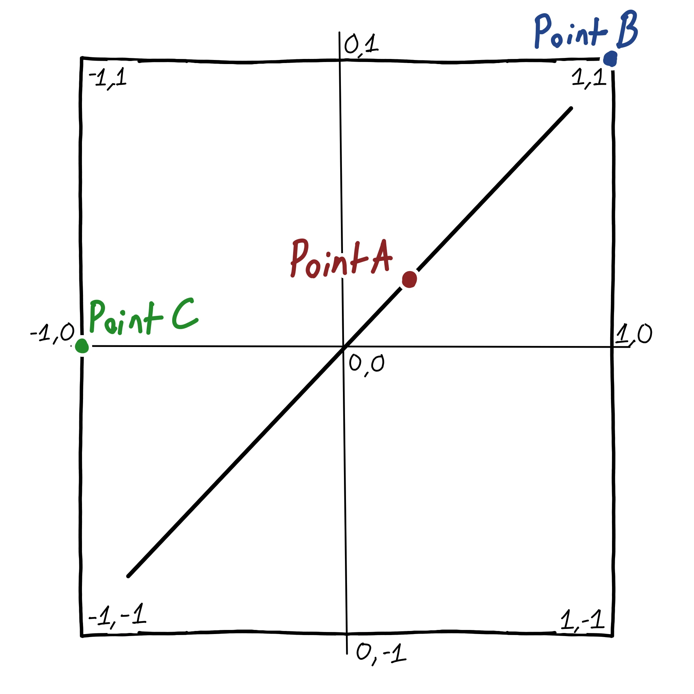

When writing debug graphics, one of the most common shapes you draw are cubes. They usually represent bounding boxes, but I think they're really versatile. I'll be showcasing a way you can draw prettier debug boxes. Normally if you try to render a cube and only draw the wireframe, you end up with something like this:



The diagonal lines are unnecessary and add visual noise. That's something you typically want to avoid, especially when in a debug view where the screen is already packed. However, I found a pretty neat trick for removing these without having to change the vertex data. I don't remember if I made this up originally or found it somewhere else, some precursory searches didn't turn up much.

Let's start by breaking it down to one face, in two dimensions:



Point A `(~0.25, ~0.25)` has one component at the maximum, on the digonal. Point B `(1, 1)` has two components at the maximums because it's situated in the corner. Point C `(-1, 0)` is on the left side. We want to filter out A, but keep B and C since those make up the outer edges and corners. Basically, we need it to be on one or more maximums and if they are in between (like `0.5`) then it needs to go.

In real GLSL, it would look something like this:

```glsl
bool is_x_okay = abs(position.x) != 1.0;
bool is_y_okay = abs(position.y) != 1.0;
bool is_z_okay = abs(position.z) != 1.0;

int num_components = 0;
if (is_x_okay) {
    num_components += 1;
}
if (is_y_okay) {
    num_components += 1;
}
if(is_z_okay) {
    num_components += 1;
}

if (num_components < 2) {
    outColor = color;
} else {
    discard;
}
```

This is pretty disgusting, not only for the programmer but likely for the poor GPU too. Luckily, GLSL has all of the tools necessary to write this more compactly. A better version could be written like this:

```glsl
void main() {
    if (length(vec3(notEqual(abs(position), vec3(1.0)))) > 1.0) {
        discard;
    } else {
        gl_FragColor = vec4(1, 0, 0, 1);
    }
}
```

Let's break this down, first we can simplify the many equality checks in the beginning with notEqual:

```glsl
notEqual(abs(inPosition), vec3(1.0))
```

This is component-wise, so it has the same exact meaning as before. We want to perform a length check on this, hence the `vec3` cast. Why do we do a length cast? It's the easiest way to detect how many booleans are true, I'm not sure of a better way. For example:

* `(1, 0, 0)` has a length of 1.
* `(1, 1, 0)` has a length of $\sqrt{2}$.
* `(1, 1, 1)` has a lenth of $\sqrt{3}$.

Hence, if we want to check if 0 or 1 components (but not more) we want a length less than 1. And here is the result:





Since this is using `GL_LINES` (or your API equivalent) you can use the line width - if supported by your GPU - to modify how the lines look. Is this is a little convoluted? Maybe, but I like how it's all neatly integrated into just the fragment stage. I think this is good enough for debug purposes at least.


