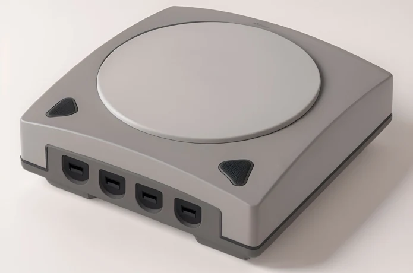
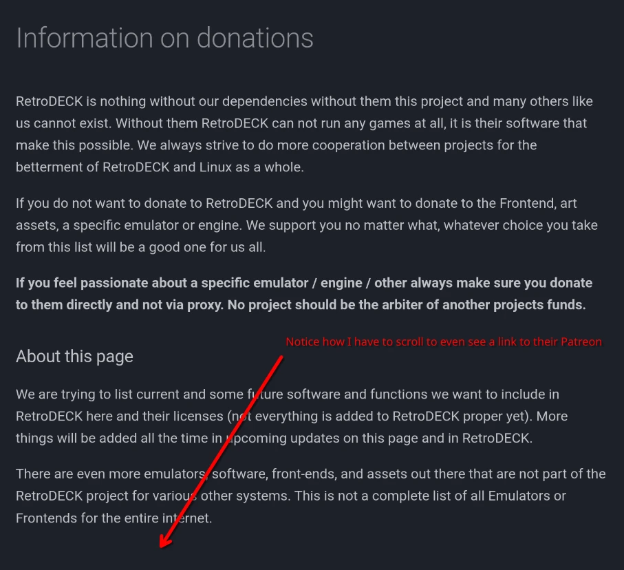

So... [EmuDeck](https://www.emudeck.com/) announced their first hardware product today, in a new line of "EmuDeck machines". I'm not here to talk about this beautiful product that does not exist:

No we're going to be talking about something more interesting than selling emulators. For those not in the know, EmuDeck is a "emulator installer" to put it simply. Instead of setting up your emulators one by one, it's supposed to be a simple way to install all of them at once. It will also do some miscellaneous tasks like exposing your games to your Steam Library as non-Steam games. It's called "EmuDeck" because it was originally written for the [Steam Deck](https://store.steampowered.com/steamdeck), but it has since supported other platforms like Windows (for Patreon users.)

I always wanted to dig deeper into how EmuDeck is funded. Outside of this IndieGoGo campaign, EmuDeck [has a Patreon](https://www.patreon.com/dragoondorise) where they collect funding to keep development happening. To be clear, I have no qualms with a person receiving funding for what they like to do, but I'm really stuck on this point [on the EmuDeck website](https://www.emudeck.com/#early):

> We will also give regularly donations to all the tools that EmuDeck uses, so donating to us will also allow us to contribute to the entire community.

The emulators they package (and will soon, sell apparently) are the real meat here and EmuDeck would not exist without them. So the fact they state - albiet in small text - they will donate back to the community is nice. _"Maybe they have some kind of financial report describing that they do donate"_ you are thinking in your head. Unfortunately, EmuDeck has no such thing. Nothing obvious shows up when searching online for "EmuDeck financial report". The only proof I have so far is that the EmuDeck creator sponsors two people on GitHub.

The [creator of Bazzite](https://github.com/KyleGospo), and [PCSX2 (a Playstation 2 emulator.)](https://github.com/KyleGospo) It should be noted that they only sponsored them starting in April and August of this year respectively. For context, they are supposedly shipping Bazzite on the EmuDeck machine.

This EmuDeck Patreon has existed since at least 2023. I'm going to assume in good faith that the creator is donating to the other emulators, just not in an obvious way. It would be really cool if they regularly posted status reports of where their money went though. If you say they do it through Discord I will come to your house and break you in half, that's not called "public information". They should post that on the internet.

(I almost got excited by https://emudeck.github.io/donations/, but that's just a list of _emulator donation pages_ for _you_ to donate to. Cool, I guess.)

OK, I can't help myself from asking questions about the hardware device they announced! Why is it called a "Emu**Deck** machine" when it has nothing to do with the Steam Deck? Also why are they advertising a feature that Valve created, not them?

---

Let's talk about [RetroDeck](https://retrodeck.net/). It's a very similar project - even down to the naming scheme - except for some differences which aren't relevant here. Like EmuDeck, they also accept donations but they link to [their donation page](https://retrodeck.readthedocs.io/en/latest/wiki_credits/donations-licenses/).

You'll immediately see the differences in how these two projects operate and treat donations. First of all, their income status is visible on [their Patreon](https://www.patreon.com/RetroDECK) which I find very transparent. Secondly, they state this while scrolling to find their link:

> **If you feel passionate about a specific emulator / engine / other always make sure you donate to them directly and not via proxy. No project should be the arbiter of another projects funds.**

(The bold is added by them, not even by me!)

No mention of some dubious "trickle down" donations either, they don't even attempt to make that claim. I think this is supposed to be an intentional jab at EmuDeck as well. The project also includes clear list of what the donation money is going to, although disappointingly no actual breakdown of how they spend their money.

And to be clear, I'm not _against_ EmuDeck making money. I just don't like how they are making the claim of trickle down donations, I would rather they stop claiming that or make it more transparent if that's what's really going on. Whatever they end up doing though, I like RetroDeck's idea better. People should be encouraged to donate to the invidual projects _they_ use and not let someone else be the arbiter. At least PCSX2 is definitely getting some of the Patreon money.

Give us more transparency!

---

Also I'm a little disappointed by some of the coverage about the EmuDeck machine. [Overkill.wtf for example](https://overkill.wtf/emudeck-announce-emudeck-machine-hardware/), does not mention _anywhere_ that they haven't created a prototype and yet advertises it like a real product:

> The EmuDeck Machines are available to preorder now via an Indiegogo campaign. Prices start at around €299 (£257, $322) and shipping is currently planned for December 2024 — so a potential Christmas gift for the retro fan in your life?

Pre-order what? They haven't even made one yet for themselves! The other articles I've seen are also very light on the skepticism.
