Oh me, oh my - there's a lot to talk about! It's been a couple of months, but I made some pretty huge changes.

# Moving to GitHub

I made [an executive decision](https://mastodon.art/@redstrate/112315184471699059) to move my FFXIV projects to GitHub, from sourcehut. I did it for two main reasons:

1. builds.sr.ht does not provide Windows/macOS images, which led to me dropping support for those.
2. Almost all FFXIV projects exist on GitHub. Being on GitHub reduces the barriers from those coming from other projects.

So now I have moved most (but not all) of the FFXIV related stuff over to [my GitHub](https://github.com/redstrate?tab=repositories&q=&type=source&language=&sort=). I'm still in the process of updating URLs and sunsetting the sr.ht. repositories.

## Continuous Integration

For [Novus](https://github.com/redstrate/Novus) and [Astra](https://github.com/redstrate/Astra), (for the first time in a while) Windows builds are available again! Right now you have to download them through GitHub actions - which requires a GitHub account - but I plan on uploading them to [xiv.zone](https://xiv.zone/) as before.

(Note that Physis documentation updating and Flatpak are missing from the GitHub CI at the moment.)

Also as of the time of writing, the Windows version of Astra is not expected to work out of the box.

I have no plans to support macOS, but would not turn down a contribution to add support for it again.

# Astra

Switched to [the new Dalamud distribution server and made the asset updater more resilient](https://github.com/redstrate/Astra/commit/51715ca3be52b231cbed1dc791f077fe95529edc).

Added [support for 64-bit only clients](https://github.com/redstrate/Astra/commit/516c0926a67d86a502d8b99ee02803cd9adf3314).

Bypass [the annoying FFXIV website browser check](https://github.com/redstrate/Astra/commit/f97204a422fc36f2153c9fa026cc19c20b9b7fc1) automatically when using the integrated web browser.

Added [the latest expansion logo to the login page](https://github.com/redstrate/Astra/commit/001e20b1b8ca5b3348d0b26b75b8c470e1e037da).

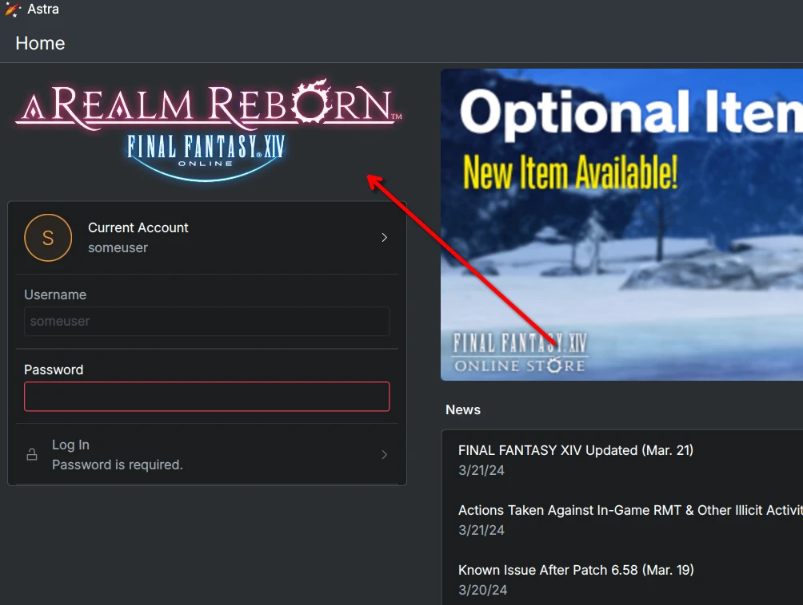

Expose a [RenderDoc capture option for easily capturing the game](https://github.com/redstrate/Astra/commit/b7c67b3f70fc1195d5afc3aa2d3e316fbc79bd9f) when launching it through Astra. It's located under "Developer Settings":

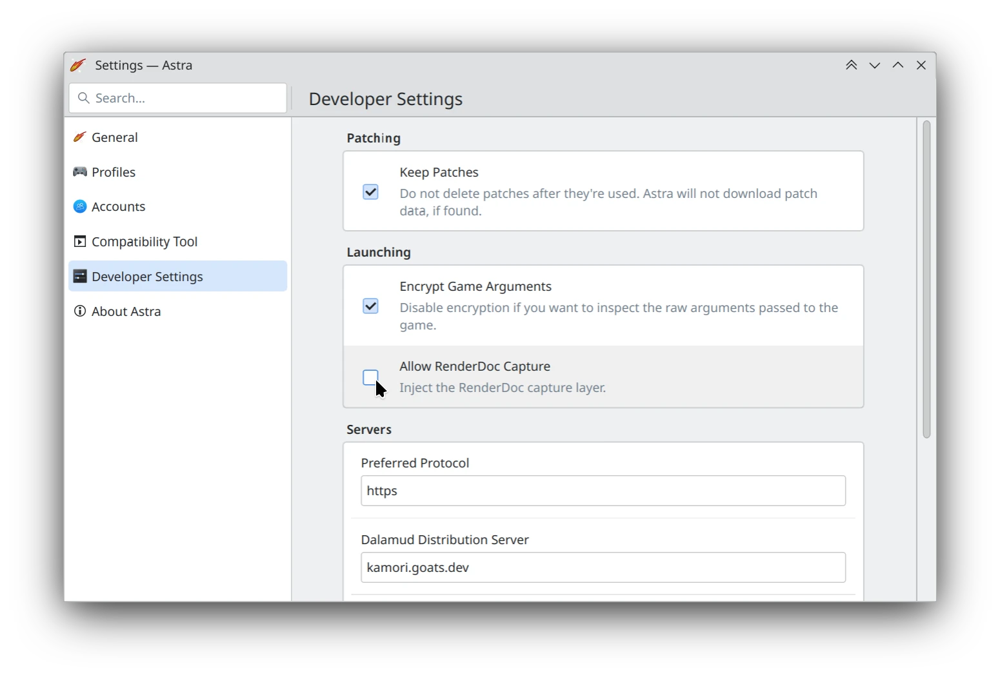

Added [preliminary support for launching the benchmark](https://github.com/redstrate/Astra/commit/49f8aae87736bfed1d1250ff2f24716adf3d1cc2). I still have to expose options for the benchmark and stuff.

Added [an option to open the user data folder](https://github.com/redstrate/Astra/commit/346f4eae9ec06d6d85b7eae6e668c23df290c700) easily from
settings.

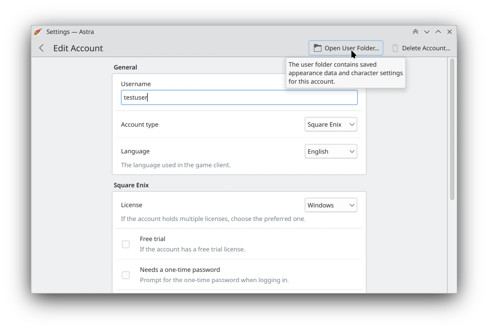

# Physis

Physis has gained experimental Dawntrail support. It can read stuff like models, materials and shader packages albeit not very well tested. This took a huge load off my back as I was worried Dawntrail was going to completely obliterate my existing code.

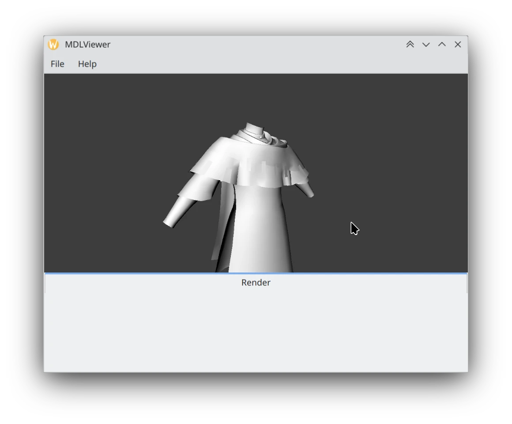

On the topic of Dawntrail, I [added support for index2 files](https://github.com/redstrate/Physis/commit/4fa77965c12abf2f972b5f2cdd936745d8fe0536) which means benchmark data is now properly supported in Physis.

I also added support for [basic reading of maps from the game, including terrain and layer files](https://github.com/redstrate/Physis/commit/256b3f9305a9bec152080fb3689b62edee7ec5e6).

I've been busy deepening model support, adding support for more vertex types and some form of shape data reading/writing (but that's not complete yet!)

I also made some [fixes for patches failing on recent game versions](https://github.com/redstrate/Physis/commit/8e6b0dd6b4b22050096f720730e372e0c443cc08).

I integrated Jim Kirisame's [vulgar words reader](https://github.com/Lotlab/ffxiv-vulgar-words-reader/) for reading .dic files, so [those can now be read by Physis](https://github.com/redstrate/Physis/commit/5574e75325b0ee6cf0989c11f21e6666861749db)!

Some boring refactoring these past few months too, including shrinking the amount of dependencies. Yay!

## C# Bindings

I want to announce a new project I started, but not sure how far I'm going with it yet.

Lots of stuff in the FFXIV world uses C#, so it only makes sense that Physis is available for that too. I started [PhysisSharp](https://github.com/redstrate/PhysisSharp) which is a set of bindings of Physis in C#. I still have to _write_ most of it, but I already figured out the hard part: the build process 😄

If you're curious about how the Rust <-> C# library is built, check out the README in the repository.

# Novus

## Gear Editor

Added [item icons to the gear list](https://github.com/redstrate/Novus/commit/1bddb6f8f0f6c88a5c3bdafdb1797fd053ac7e17). This is pretty greedy and can be cached better. Even then, everything still loads surprisingly fast.

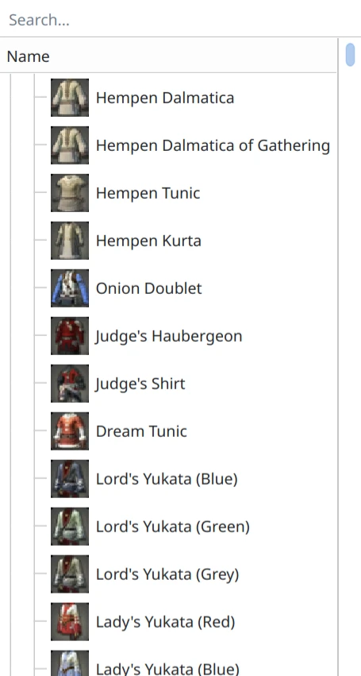

## Data Explorer

Added support [for importing or downloading the path list](https://github.com/redstrate/Novus/commit/5d455c4ce085592cd61cc8947fb8a9df507614bc). The import still takes way too long though.

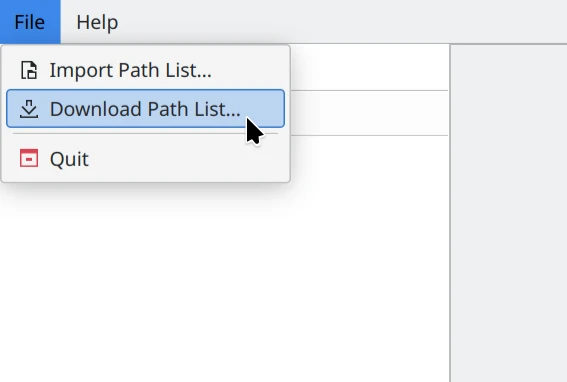

Added [an actual file type database](https://github.com/redstrate/Novus/commit/9d129163bb40626b32c745d3de6f11ccbfd0bbe7), including nice type names in the file properties and icons in the sidebar.

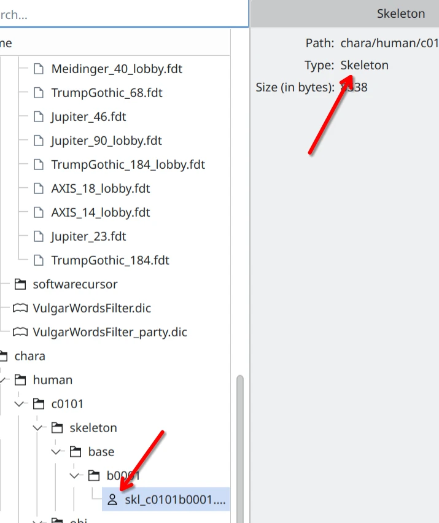

Added a menu item to [copy the file path when right-clicking files](https://github.com/redstrate/Novus/commit/ce29debf240fc56e81426b8beebf75dc18225682).

## Excel Editor

Added a [search bar for searching through available sheets](https://github.com/redstrate/Novus/commit/d58fcf7e984f11b22a4cc9cda8d832577a4e4493).

Added a function to [download or import Godbert definitions easily](https://github.com/redstrate/Novus/commit/f6c9d13b094d94845ed5e456a86fdfd71665b1da).

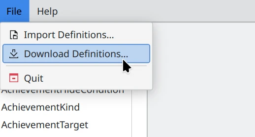

## Model Viewer

Added a way [to switch to wireframe mode](https://github.com/redstrate/Novus/commit/5c907b63da9d81d872722f51e63e3b24874954e0).

Added a statistics tab to [list the level of detail and triangle count](https://github.com/redstrate/Novus/commit/26c7fad3a064887b5d3cfe18c5ec2281c5b26eb3).

## Map Editor

Added a simple program to [view the map files from the game](https://github.com/redstrate/Novus/commit/c19ff1e132730baa2149e281a9371c8b3da31dc0). Still very basic but it does work!

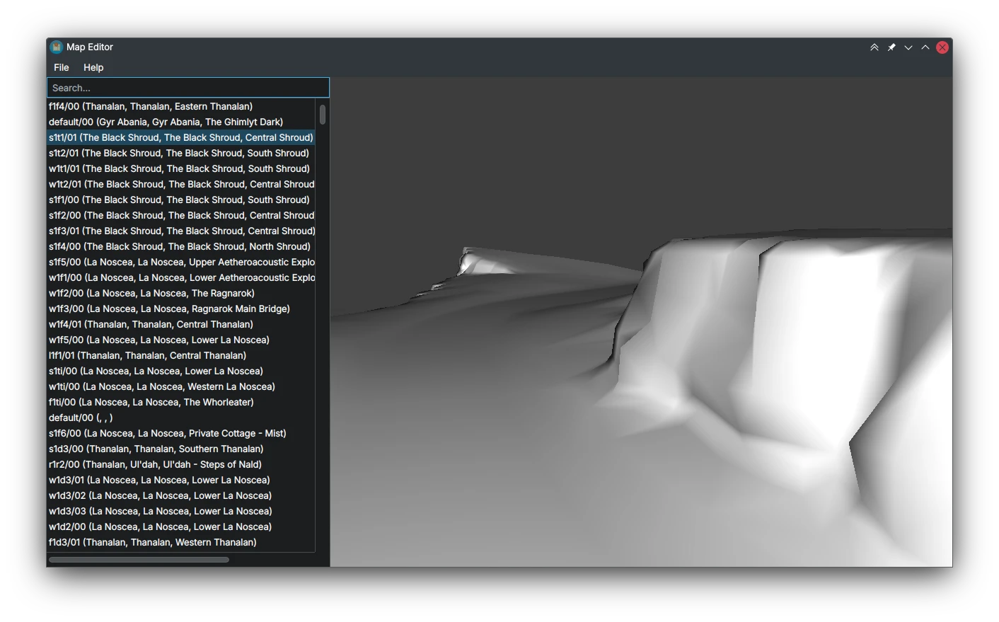

## Material Editor

A simple program to [view the material's shaders, parameters, etc](https://github.com/redstrate/Novus/commit/568b8f2eea33d542cf08b441707a90fcac797f92).

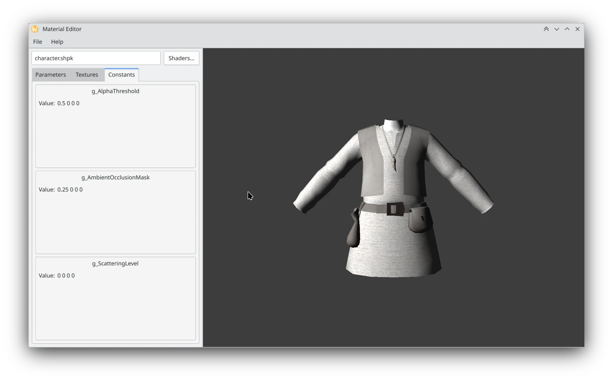

## Renderer

As I discussed in [the last blog post](), a big goal of mine this year was to re-create FFXIV's rendering system and I'm happy to say I was successful!

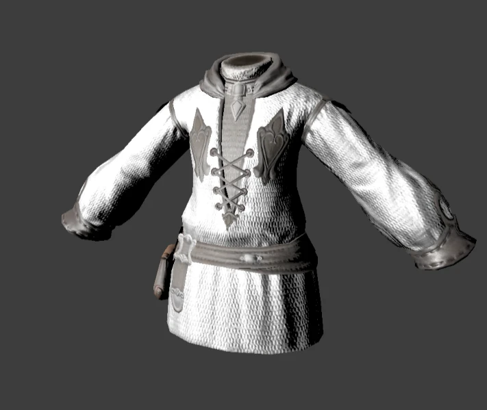

Here's a piece of armor being rendered without any custom shaders[^1], it's all read from game data. Big thanks to [Ouroboros](https://github.com/Shaderlayan/Ouroboros/) and the people in the FFXIV Discords for helping me along. Oh yeah, and [RenderDoc](https://renderdoc.org) for being a fantastic tool as always.

I'm working on adding support for Dawntrail shaders next, you can follow along [here](https://github.com/redstrate/Novus/issues/6).

---

See you next time!

[^1]: Technically there's some, such as the blit from composite to swapchain and the Dear ImGui overlay.

