As I'm nearing the release of [Astra](https://xiv.zone/astra) 0.5.0, and [Novus](https://xiv.zone/novus) 0.1.0 (which will be it's initial release) I have been hard at work squashing bugs and adding new features. Note that this isn't an exhaustive list of everything I've done, I just tried to pick out the most interesting parts.

# Astra

I have slightly updated the main window design again, which simplifies a lot of the presented options:

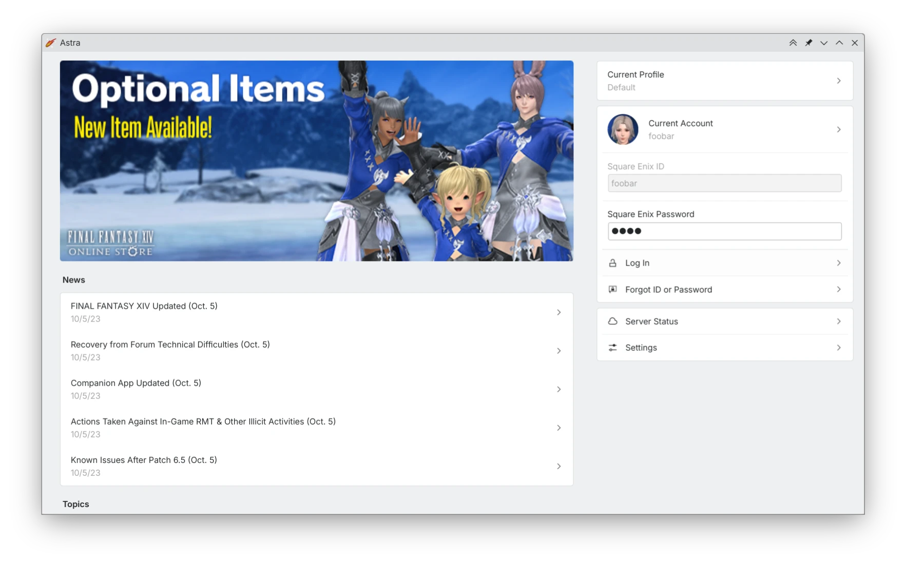

 Packagers (which is mostly me) will be happy, as Astra [now has tarballs automatically generated from the latest git](https://github.com/redstrate/Astra/commit/c1646e20f6cbd711833cba1fb4fc6966d0035ee5)! This includes vendored cargo dependencies, and any git submodules I use, so it's possible to compile Astra offline again. You can find these on [xiv.zone](https://xiv.zone/astra/beta/) 

 The [auto login](https://github.com/redstrate/Astra/commit/d39c702d0aa05e7bbf0f744a8a1f12a1fcfad961) now has more error handling, detailing why the auto login could fail. 

 Added [setting for the preferred protocol when making requests](https://github.com/redstrate/Astra/commit/be14785e61602683766d7adc2a0456f51e5996e0). An example is when connecting to a localhost server, and you need HTTP. Note that this isn't always honored, because most POST requests fail when not sent securely. 

 Added a setting to [configure the XIVApi server URL](https://github.com/redstrate/Astra/commit/1157f7b1ab4af8ca705a1fd8e8a8e7601bdb86b8) in the developer settings. 

 Added a button to [clear the Lodestone avatar cache](https://github.com/redstrate/Astra/commit/bc1b6fe2c87d0804f0a037b95a89e1ed53fb1247). 

 Made sure the [Flatpak credential keys will not collide with their non-Flatpak counterparts](https://github.com/redstrate/Astra/commit/f6c418d7d626546c8cda79671d2ee7bbefba8f6b). This is very unlikely to happen because everything is indexed by UUIDs, but you can never be too safe! 

 Moved to the [new Dalamud CDN](https://github.com/redstrate/Astra/commit/0e909c66709c84e952cc09dc2887fafd8ca1bd3b) with the notable feature that it's possible to develop Dalamud mods from that distribution. 

 The [last used profile](https://github.com/redstrate/Astra/commit/24f256338d1c52e913d9d6813414e645067c82b6) is now saved. 

 Added a [configurable screenshot directory setting](https://github.com/redstrate/Astra/commit/2d7538bae1afa198973c68651aaeb54294961bce) that applies to all profiles. 

 Now the [asset updater shouldn't crash in certain scenarios](https://github.com/redstrate/Astra/commit/fd19641e721796c9525615e11047440b45b25eaa). 

 The [patching UX is overhauled, again](https://github.com/redstrate/Astra/commit/81bd81e1b6ea714394fd089936a3bcb4b491b86f) to make sure it never freezes the UI. It's also harder to accidentally cancel the patching process by closing the window, causing corruptions. In the future I want to make it cancellable, but it's not right now. 

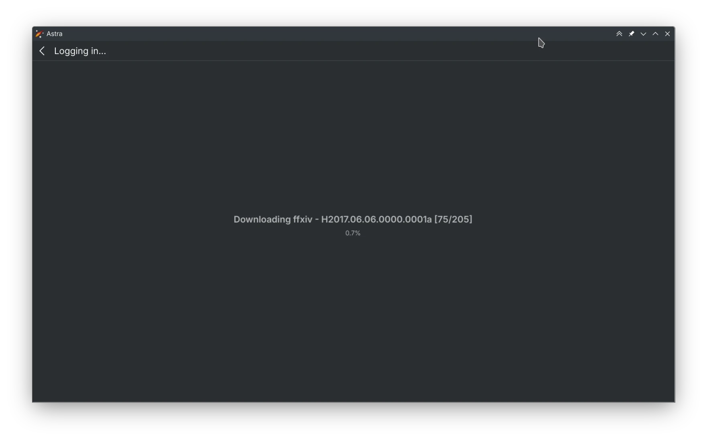

 Fixed a build error with the 0.4.1 release. 

# Novus

 Like with Astra, Novus [now has tarballs automatically generated from the latest git](https://github.com/redstrate/Novus/commit/ff4d5e8456289be968518662c29ca43550160684)! This includes vendored cargo dependencies, and any git submodules used, so it's possible to compile Novus offline. You can find these on [xiv.zone](https://xiv.zone/novus/install/) 

 Shaders and other required resources [are now embedded in the executable, so it's easier to run out of the box](https://github.com/redstrate/Novus/commit/0f75e9730ccc0b1a8275cd759cc97b96d2959ce9). 

 Sagasu (previously named "Explorer") now [uses a central database](https://github.com/redstrate/Novus/commit/4b19b7aeba0bf28bd80d3ffc249249d43d72c07e) to store file hashes, not unlike FFXIV Explorer. There's now a separate "indexer" program to initially populate the database. Pre-populated databases will be made available later. 

 You can [now easily extract files from Sagasu](https://github.com/redstrate/Novus/commit/4b19b7aeba0bf28bd80d3ffc249249d43d72c07e). 

 You can [view the raw hex data of any file in Sagasu](https://github.com/redstrate/Novus/commit/c7a3f9cf5a755a2c908c8605b6cb58c5af8c5ec0). I wanted to use an Okteta KPart for this originally, but it's not yet ported to KF6... 

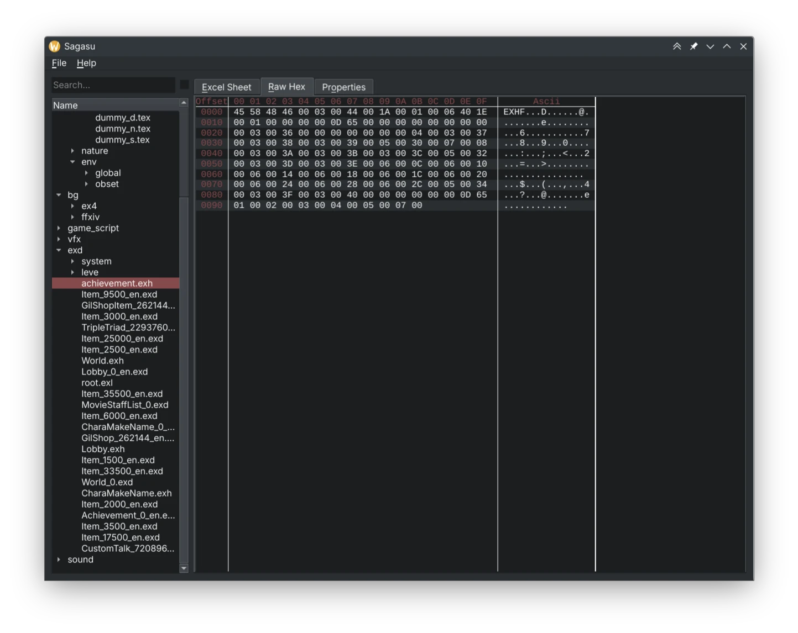

 Added a [search bar for filtering by filename in Sagasu](https://github.com/redstrate/Novus/commit/a0e87b914d40d94ff16ac60db6edfca3a60de947). 

 Added [model and EXDH (Excel data file) tabs to Sagasu](https://github.com/redstrate/Novus/commit/93b6380b3d8692c6ba0ca70120999e45f170bc65), allowing you to view those respective file types. 

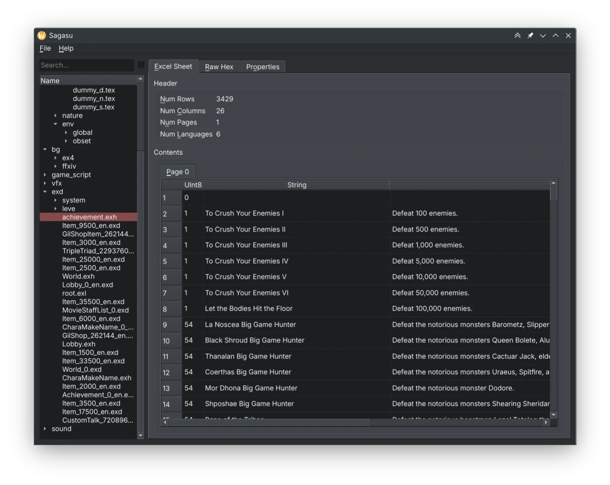

 Added [a texture tab to Sagasu](https://github.com/redstrate/Novus/commit/e5f0a9cd0072147fb3f0a82ff7ccadb5890160fc) to preview texture files. 

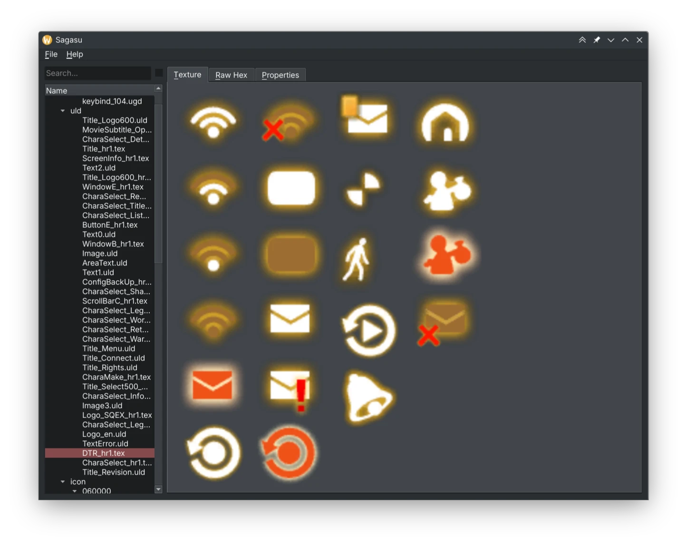

 Oops, [the Excel data should be a read only view and not editable](https://github.com/redstrate/Novus/commit/2844380a65dbe105085eea46367413508cecc5e1). 

 Added a [shader package tab to Sagasu](https://github.com/redstrate/Novus/commit/f8d7d04e782e57eb7b2d94e4831d9444daa986c4) to preview shader files from the game. The output isn't very usable yet. 

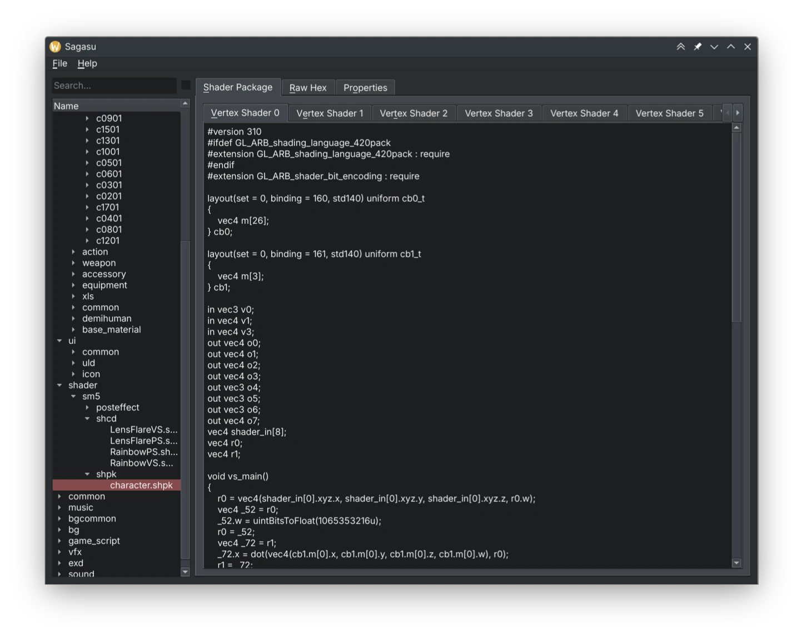

 Added a [CMP (Chara Make Parameter) tab to Sagasu](https://github.com/redstrate/Novus/commit/6caedba0d97d6bb390f3a2113fe8334b408d2e19) allowing you preview that filetype. 

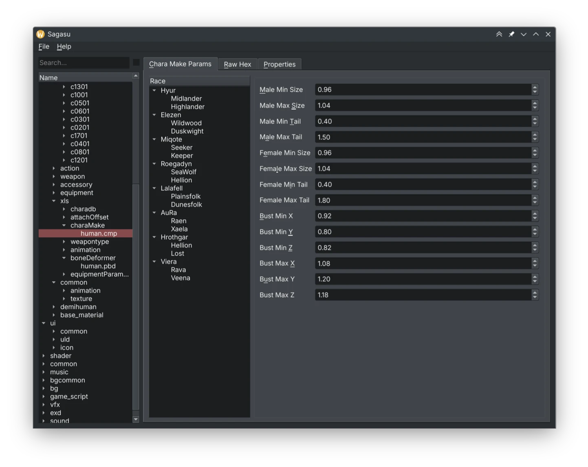

 Added a [skeleton tab to Sagasu](https://github.com/redstrate/Novus/commit/b0ccfbaf15a6195388b1ddac5d955859aa25bfe8) allowing you to preview skeletons from the game. 

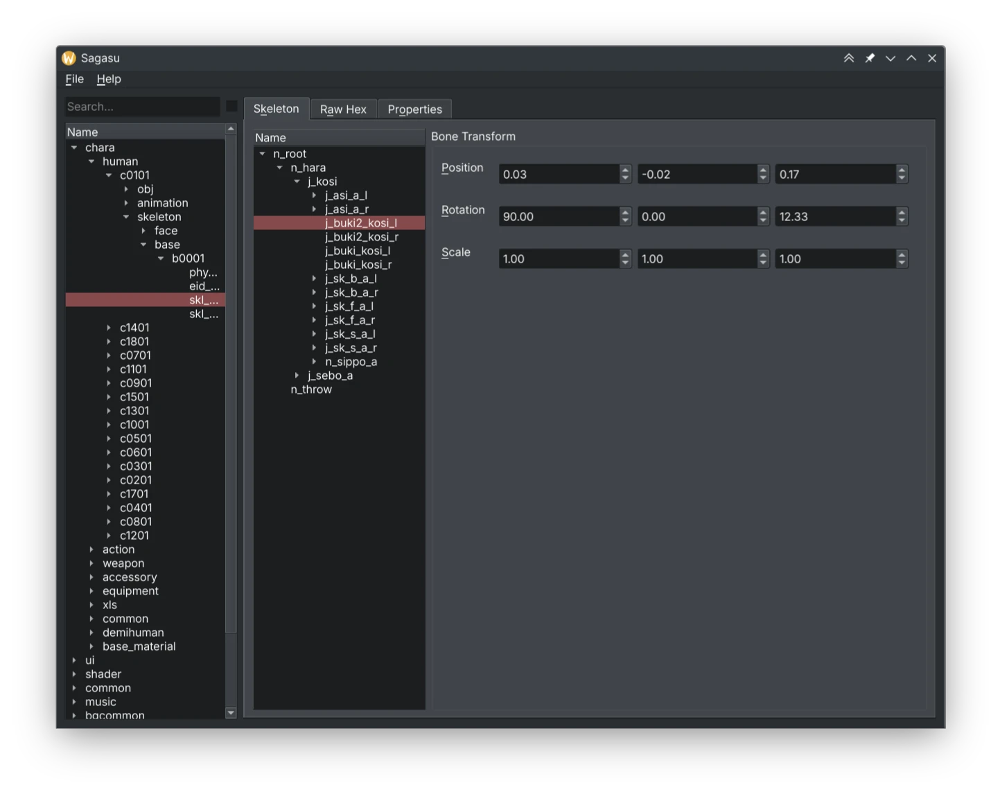

 Added support [in the Sagasu indexer for adding hashes by HTTP request](https://github.com/redstrate/Novus/commit/24461f362a51af54d5dccced0c5916556358de16), used in the indexer Dalamud plugin mentioned below.

# Physis

 Certain patches should [now apply correctly](https://github.com/redstrate/Physis/commit/267feae8cf42e07e596176c59d8aa0fff67ad026), this was an issue during the 6.5 which uncovered some assumptions about the signedness of certain fields. This has been corrected, and I [applied some more corrections](https://github.com/redstrate/Physis/commit/0621ce03d7b034a1d5941f8b890bda970a69a2da) to protect against this in the future. 

 Fixed the [broken shader package reading](https://github.com/redstrate/Physis/commit/3243132a3fc50c3fb4fded285d25270a2c0a69e8). 

 Added [support for reading binary SKLB and PBD files](https://github.com/redstrate/Physis/commit/07582775cd1b69d73e59723bf523d2c0e92f1961)! This means we are no longer dependent on TexTools _or_ the official Havok SDK to parse the data that's held within these files. Code courtesy of [FFXIVTools](https://github.com/dlunch/FFXIVTools) which is adapted for our purposes. This also gets rid of the `serde` and `hard-xml` dependencies, which is pretty nice. 

 Drastically [improve performance when extracting files](https://github.com/redstrate/Physis/commit/b180adeb44c1f16d04d08a6ff9871b8cc30a06ba) by caching the index files used. This cache should have a pretty small memory footprint, and this makes tools like Novus way more usable. 

# Indexer Plugin

I made a pretty neat thing that I haven't really seen anyone else do before, despite most of it being taken from another plugin. So FFXIV does not pack in filenames for their compressed file format, it's all CRC32 hashes. so a big question is how to figuring out all of the different possible paths, some of which you can grep from the executable like this:

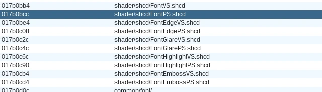

And then if you figure out the string format they use for dynamic stuff (e.g. skeletons, materials, and items) then it's possible to make a generator of sorts and have it "generate" a list of possible filenames used. This is really slow though, and really boring to write. These exist already (and I've written one), but there must be an easier solution. Well, if the game accesses everything via filenames anyway.... why not simply hook into the game and take the filenames while it's opening them?

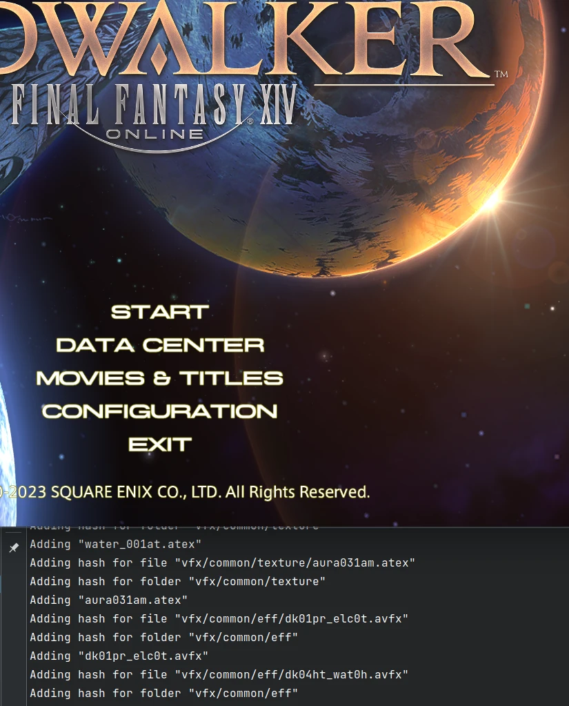

Because the indexer program is running natively and I run the game through Wine, I use HTTP as a form of IPC which works well enough as i just need to send filenames. I'm now getting way more interesting stuff, because the game is practically giving them up!

The Dalamud plugin is available on [GitHub](https://github.com/redstrate/sqpackindexer). It's designed to connect to Sagasu's indexer (as mentioned above) but it could really be dumped to anything that accepts the endpoint.

# XIV Docs

I overhauled [the documentation site](https://docs.xiv.zone) again, this time with usable a tree navigation structure and fixing more dead links. I also documented some more pages such as DAT and LOG but it's still a WIP.

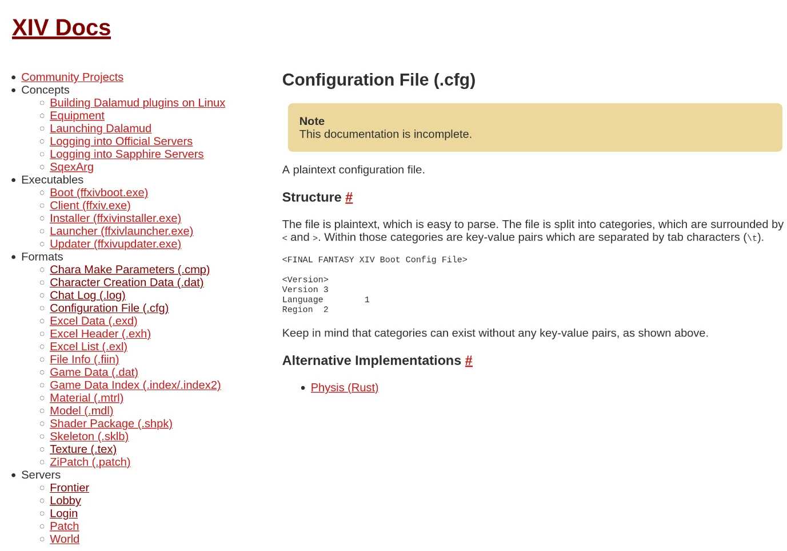

# Other work

 Fixed the [libcotp CMake, which was causing troubles when integrated into Astra](https://github.com/paolostivanin/libcotp/pull/49). Now we can use upstream instead of my fork! 

I also have begun [reverse engineering the current Square Enix login system](https://github.com/redstrate/kawari) which is currently used for testing Astra without hammering the official servers. Do note that I don't plan on extending the project much further than that.

