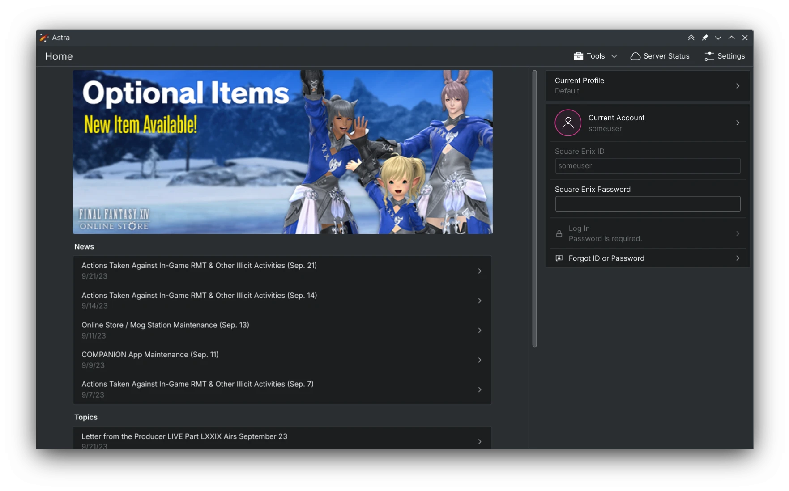
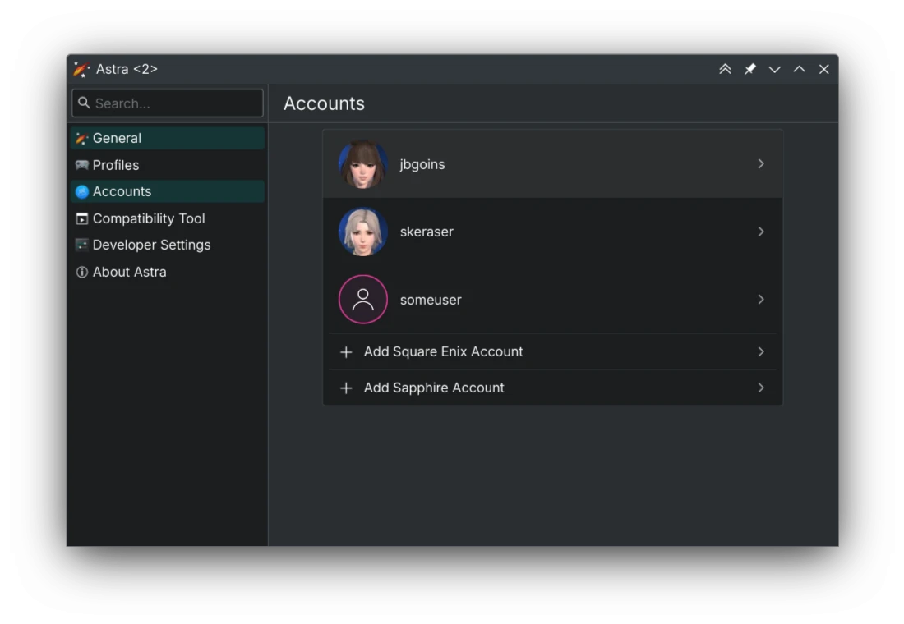
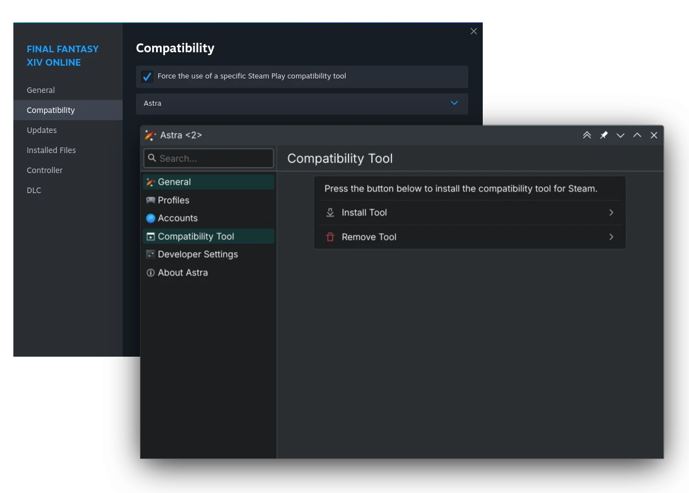
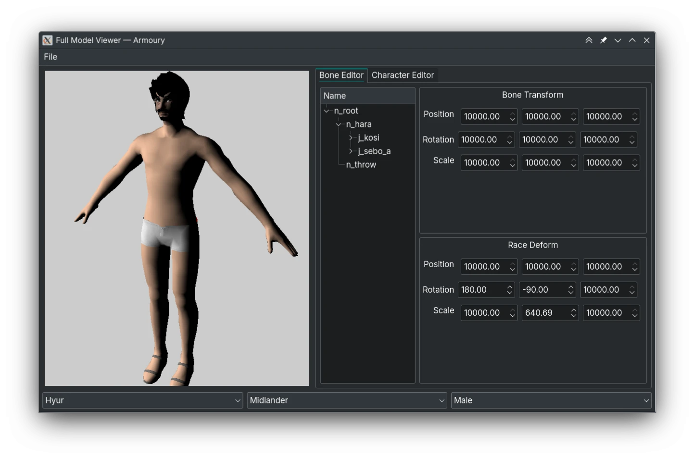
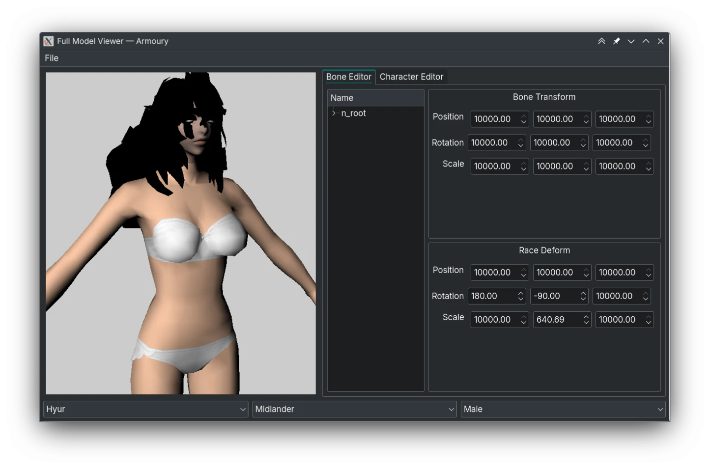
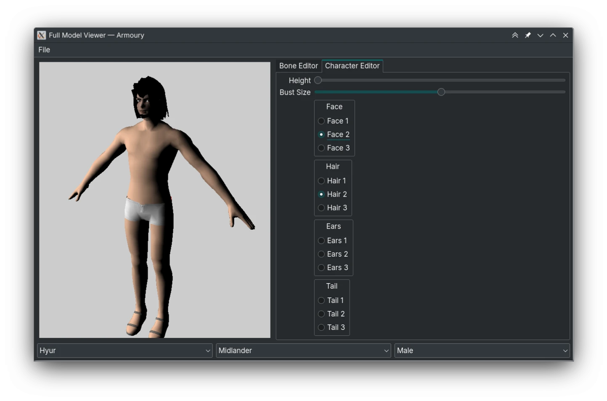

Hello! This is a new series of blog posts detailing the work I'm putting into [Astra](https://xiv.zone/astra), [Novus](https://xiv.zone/novus), and [Physis](https://xiv.zone/physis) (I can't fit the last one in the title.) I noticed that the [physis crate](https://crates.io/crates/physis) is turning almost one year old now, and I haven't had a new release of Astra in forever. That doesn't mean I stopped working on these, quite the contrary - I'm making great progress!

If you're not familiar with my software, here's a quick rundown:
* **What is Astra?** It's an unofficial Final Fantasy XIV launcher, designed for Linux usage. It predates [XIVCore](https://github.com/goatcorp/XIVLauncher.Core), and supports everything you'd expect it to like password saving and game patching. It's built on top of Physis, my FFXIV modding library.
* **What is Novus?** It's an unofficial Final Fantasy XIV modding SDK, built on top of Physis. This is like [TexTools](https://www.ffxiv-textools.net/), [FFXIV Explorer](http://ffxivexplorer.fragmenterworks.com/) and other Windows-only tools.
* **What is Physis?** This is my Rust-based FFXIV modding library. It's comparable to for [xivModdingFramework](https://github.com/TexTools/xivModdingFramework), [Lumina ](https://github.com/NotAdam/Lumina) and so on.

Since I don't want to retroactively cover my last year of progress, I'm only covering what I did in the last few months.

# Astra

If you haven't seen my updates on [my Mastodon](https://mastodon.art/@redstrate) I ended up rewriting the whole UI in QtQuick. This means it looks prettier, and has some nice side effects for touch users. It also uses [KDE technologies](https://develop.kde.org), which I contribute to anyway and I'm already helping upstream with bugs I notice. Also, it now uses Qt6 and KF6 (KDE Frameworks 6)!

Along with this visual upgrade, the backend has been almost completely rewritten to use a much better config system and accounts/profiles are finally split! That means you can have multiple profiles (with their own separate game directories, or maybe the same one) and switch accounts between them. Accounts can be assigned to multiple profiles, but profiles can only have one active account at a time. You can assign Lodestone characters to accounts to keep track of them too.

There's just way too many quality of life improvements to list:
* There's now a real application icon! It still needs some improvements because it's way too bright on a light theme.
* The game updating process now happens on another thread, and the whole login process is _much_ faster. Along with that, there's better error checking too.
* If you're on the Steam Deck, external links will open in an internal browser.
* There's an option to save patches in the application data folder, if you want to cache them for whatever reason.
* There's options to change some of the hardcoded server URLs, such as ffxiv.com. This isn't terribly useful yet.
* Passwords and other secrets can now be saved on the Steam Deck.

There's also a very new feature that I'm excited to announce, **Steam support!** Not "Steam account" support unfortunately, but support for launching the _launcher through Steam!_ What it does is install a new compatibility tool called "Astra" in Steam, and you use that in place of Proton. It will still call into the latest Proton version it can find. This will make it extremely easy to use on the Steam Deck, without having to launch a separate executable.

I'm very close to tagging a new version but due to the KF6 requirement, it will have to wait until it's disseminated to distributions. I'm currently setting up some repositories for the few distributions I do use (Arch, Gentoo, and Fedora) and will eventually update the Flatpak too.

# Physis

I added support for [CFG files](https://docs.xiv.zone/docs/physis/cfg/struct.ConfigFile.html) (those plaintext configuration files), [CHARDAT](https://docs.xiv.zone/docs/physis/chardat/struct.CharacterData.html) (character creation save data) and [SHPK](https://docs.xiv.zone/docs/physis/shpk/struct.ShaderPackage.html) (shader packages). More on what those are being used will be expanded on later! I'm trying to get the library in a state for a nice cool 0.2.0 soon.

I'm [almost done with support for writing MDLs](https://git.sr.ht/~redstrate/physis/commit/bbbbb7cd02c00f475ad08e949a486f3bbeccd12f), which is going to be huge! It's close to being complete, but some parts like vertex declarations are still off by some unknown amount of bytes.

I'm also doing a run-through of my [existing documentation](https://docs.xiv.zone/docs/physis/) and fixing up the new stuff I forgot to add docs for. I also hid a bunch of symbols unnecessary for external use.

# docs.xiv.zone

I have begun updating the documentation site again. I added an article on [SHPK](https://docs.xiv.zone/format/shpk) but it's still incomplete as I'm still working on support for it in Physis. I'm still experimenting with the best way to write information on byte offsets, but I'm wondering if I should auto-generate it at this point.

I did update the headings a bit, and reformatted some of the pages. I still plan on giving the website a makeover!

# Novus

A lot of full model viewer changes these past few months, and it's now able to display almost a full character (except it still looks ugly):

On top of that, remember that I said Physis gained support for CHARDAT files? It can load those too:

Race deforms are mostly done too, but the calculations still seem to be off some. And as a bonus, it even supports some basic character creation:

It isn't fully functional yet, because there's lots of files the game has to describe the supported character parameters that isn't implemented in Physis yet. But it's really exciting that the tooling is getting to this point! My next steps are going to be fleshing out the material system, and I plan on reusing the game's shaders if possible.

Lots of code shuffling and cleanup is happening as I'm trying to get this ready for release. I still need to sort out the major blockers in the coming months, such as how to export skeletons from Havok (without depending on the SDK, ideally) and improving the speed of Armoury. There's an [interesting project called Xande](https://github.com/xivdev/Xande) that calls the Havok SDK included with the game, which is really cool! I think this could work, if I could find some way to statically call those without having to run the game. That might be too much of a unicorn though...

# Other work

I recently had some trouble attempting to decompile the DX11 DXBC shader bytecode that the game ships with:



So I took the time to splice together a new library called [dxbc](https://git.sr.ht/~redstrate/dxbc) (yes, I know very creative name!) It's the DXBC decompiler used in DXVK, usable in library form. I plan on integrating this with Novus soon, so it can load the shader files from the game.


