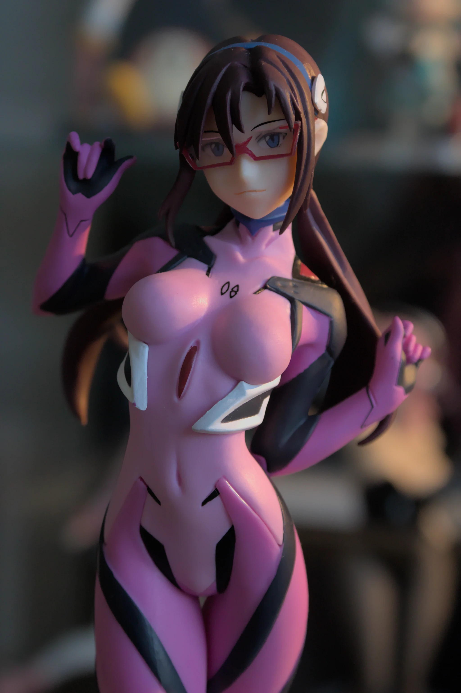
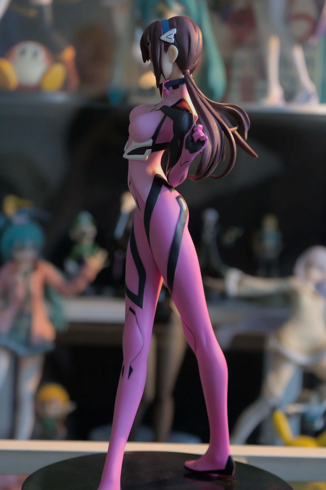
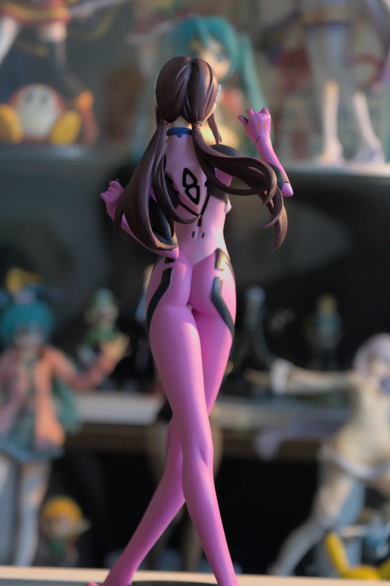

Hello again! This is my figure review of the [Mari Figure from Sega](https://myfigurecollection.net/item/945032). <!--more--> She was released around 2020 as a prize
figure celebrating the launch of "Evangelion 3.0+1.0", before it got pushed back to 2021. I
didn't preorder her on your typical reseller website but instead got her a little bit earlier by buying her on [buyee.jp](https://buyee.jp).

**Edit:** I have a new camera and I retook all of the photos. They should look much better, enjoy!

This is one of the few times that I think the figure looks much better than it does in real life than the photos provided by the company:

(Seriously?? Why doesn't she have _any_ background? I understand she is a prize figure but come on.)

The materials are surprisingly decent and it has a nice premium feel to it, but she doesn't end up looking too glossy. The paint
job is also well done on mine, even on and behind the glasses. In my photos, you can see the glasses have the whole thing filled in
with transparent plastic, which is something not a whole lot of ther Mari figures do. Unfortunately, this figure has a structural issue on the hair, which required me to glue it back on (hopefully I got it looking "just right"!)

The pose is excellent as well, it captures the "playful" aspect of her character and it doesn't look "stiff" like many Eva figures fall into the trap of. The base has a multicolored effect to it, and is very reflective as you can see in the photos. Unfortunately, it also collects fingerprints.

I'm pretty happy with the figure's quality and sculpt despite it being a prize figure. It's earned it's place as one of my favorite Mari figures!
