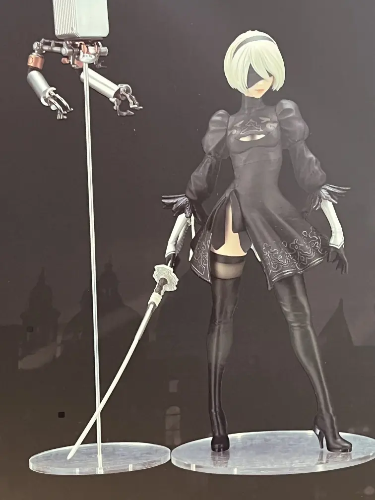
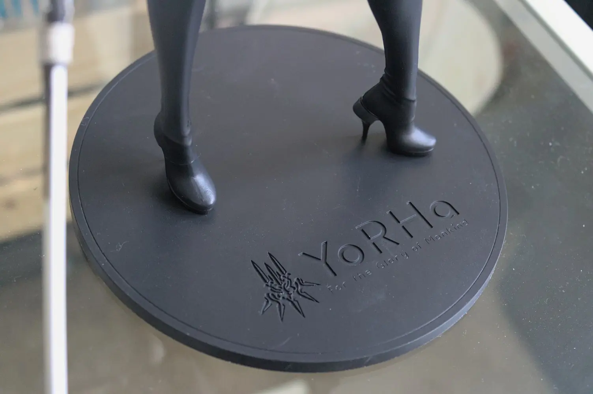
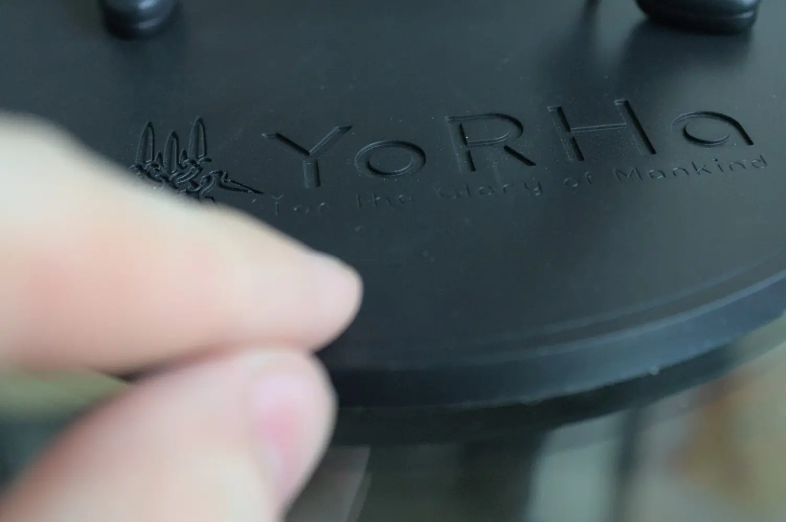
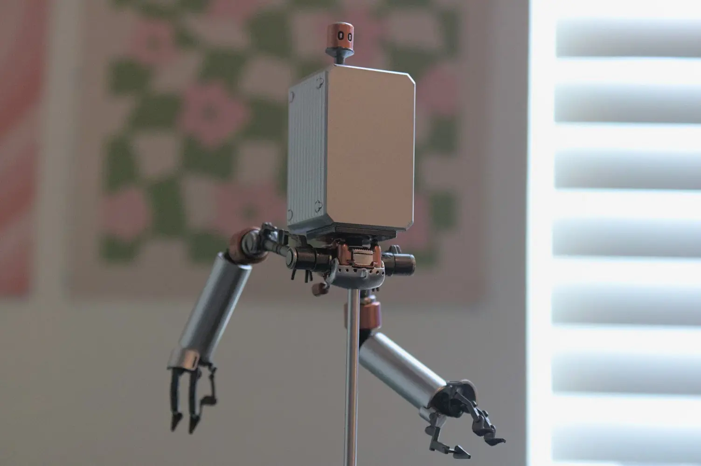
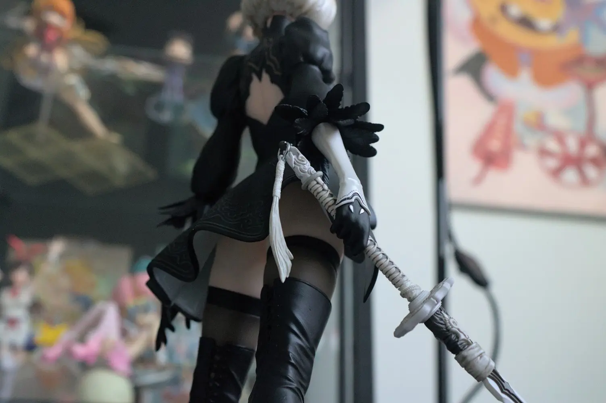
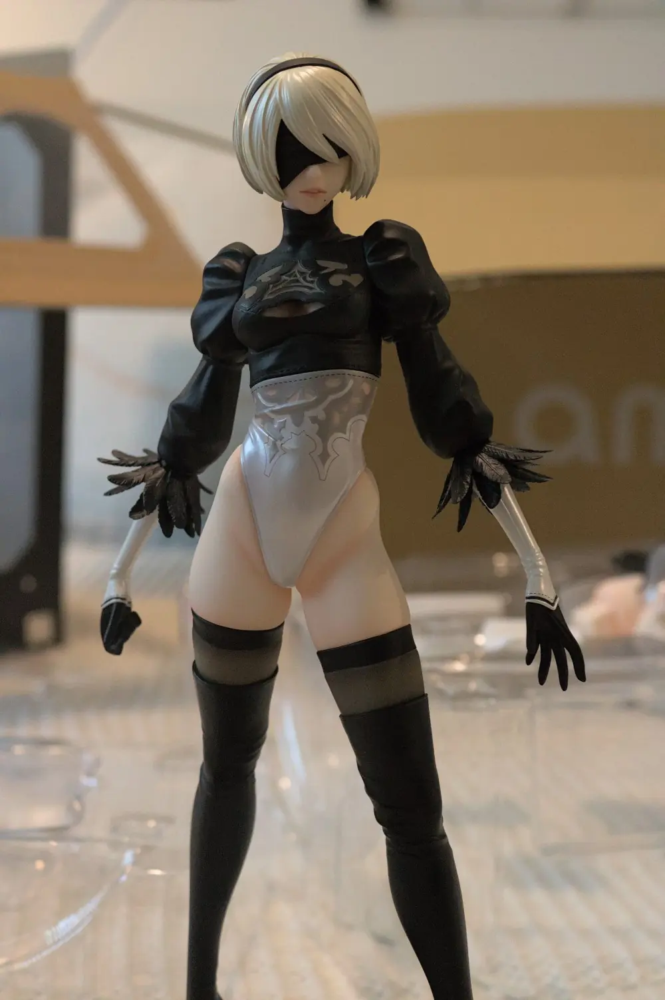
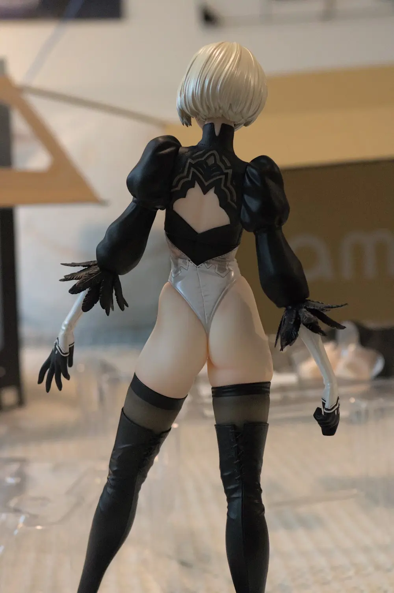
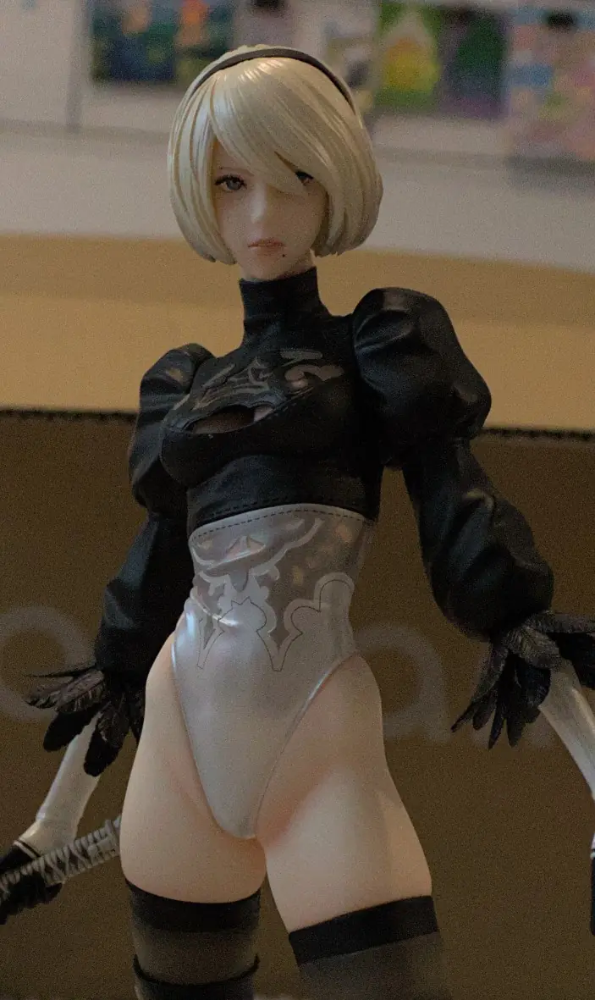
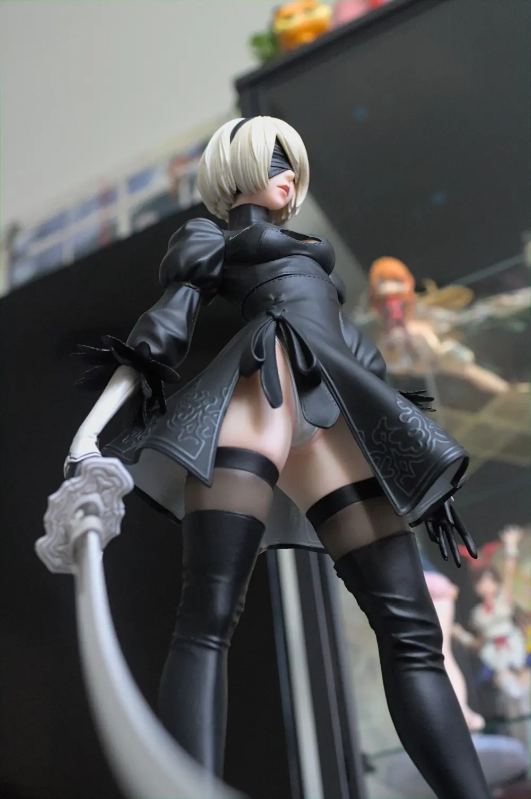

Today we're reviewing the Flare reissue of the YoRHa No. 2 Type B released by Square Enix, a company that despite being very, very controlling of their merchandise has the absolute worst online store ever. <!--more--> This isn't just a single case, you can read online where people have similar experiences with Square Enix's online store.

## The Buying Process

Buying through the (USA) Square Enix store is usually more expensive than what you can find elsewhere, and they take **forever to ship**. Not only this, but coincidentally, **the day after I received the figure** - a _better_, and _cheaper_ (overall) one showed up in the preorder listings on AmiAmi. Excuse me? Better as in this is the normally-$220-deluxe version. For **$129.** Of course, I'm picking that up! Despite the price tag difference, and a couple of accessories the two figures are virtually the same, so I'll be using them interchangeably between photos.

## The Figure

Despite the horrendous ordering process, the figure itself is very well put together! Starting with the base, which is has a transparent, mirror-like appearance like in this photograph provided on the box:

Wait a second! No it isn't!

Huh?? Is this false advertising on the _packaging?_ Now I'm not sure if this is common for figures (as I tend to buy cheaper, and most figures I buy don't show off the base on the box) but this is a pretty egregious error for sure. Despite this, I actually prefer the nice, matte black base that actually comes with the figure.

Be aware that this is a weird kind of plastic that will almost certainly attach itself to every dust particle in your vicinity as shown in this photo:

The sculpt itself is quite nice, and there's quite a bit of detail on every inch of this thing. The materials even feel different depending on which piece it's trying to emulate, like the skin _feels softer_ somehow which is pretty impressive (<--- dead giveaway that I don't own a lot of expensive figures.)

The Pod included in the deluxe version is pretty cool, and even posable. 2B herself is also ""posable"" as in you can twist her arms around, which is required to even put the sword on.

And here's a couple of more photos, specifically on the deluxe version, and it's exclusive self-destructing feature:

And one more thing, the face mask is removable as well:

Overall, I definitely recommend this figure as a fellow 2B-fan. However, please **do not buy from the Square Enix Store**. You can find this figure elsewhere, usually for much, much cheaper and will ship to you faster (even though that makes zero sense.)

