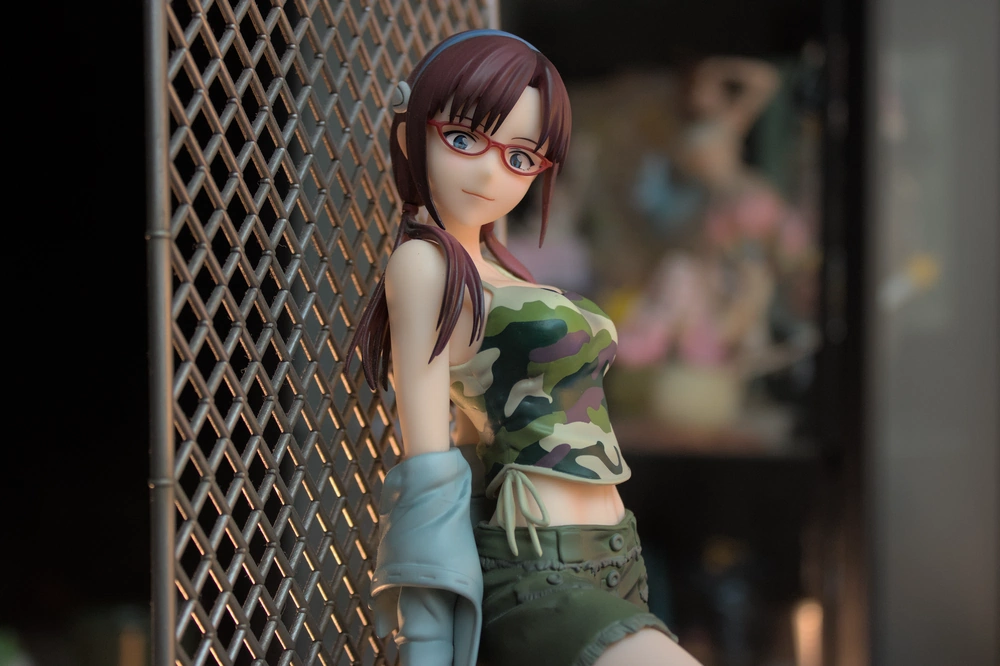
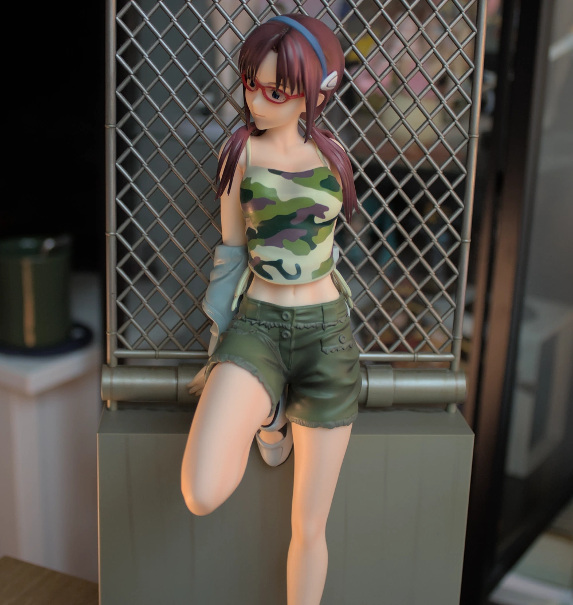
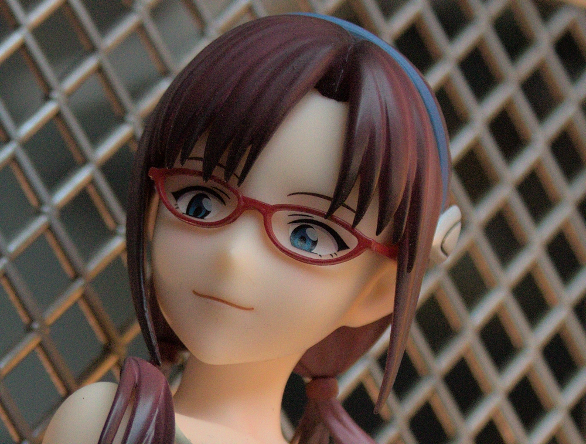
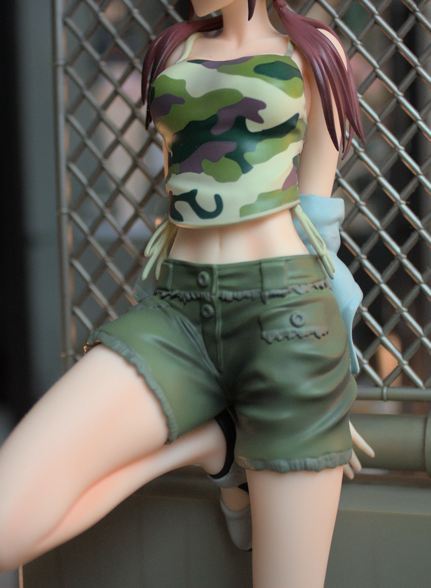
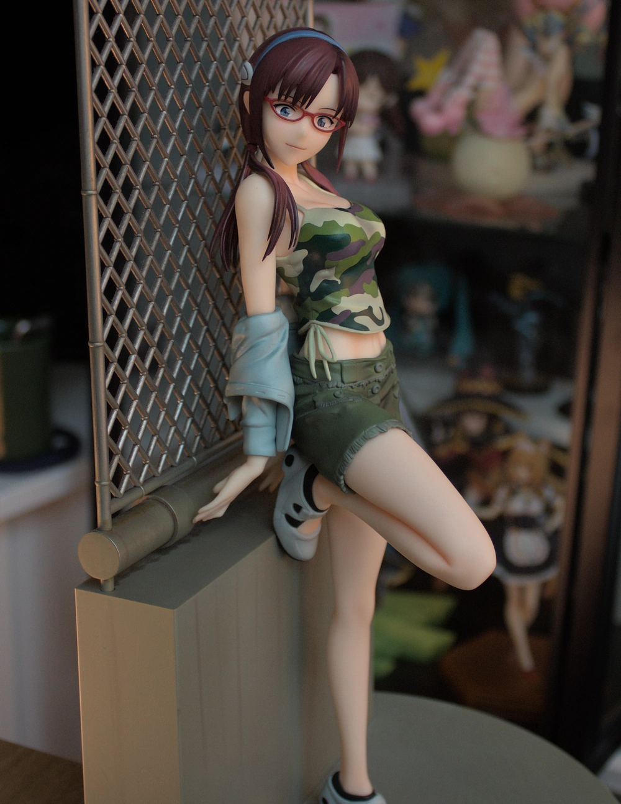

It's time to review another Rebuild of Evangelion figure, and this time it's Mari again! I was specifically drawn to [this figure](https://myfigurecollection.net/item/1090742) because it's not another plugsuit one[^1]. Yes, plugsuits are cool but I'm getting tired of seeing them in figure form. I purchased this one from AmiAmi as usual. This figure is also based off of a Takeshi Honda drawing used in a 2011 calendar:

Apparently Honda has a thing for drawing Mari in a tank top, which is funny because she doesn't even feature a similar outfit in any official media. Also while digging around, she apparently holds a book in another character drawing by him, which means that wasn't a one-off idea for her in the film - neat! Anyway, back to the figure:

So this figure features Mari in some casual wear, namely a tank top, a jacket she's not even wearing, and shorts. She's also leaning against a comically large wall base. Seriously, this figure is not only _huge_ in scale but also even bigger when you count the base she's leaning against.

The overall sculpt is nice, and she has a pretty cute pose. I love the fact that they put so much effort into sculpting her jacket that's not even normally visible. I quite like the fence and makes a nice set piece for the figure. As for the materials, they're _alright_. The best is the skin, which has the same nice material and finish as other similarly priced figures. However that's really the extent of my praise, her hair is alright but I wish the painting had more contrast and it didn't end up looking so flat. The glasses are alright, but _cheaper_ Mari figures have that fake-glass using transparent plastic - but I guess that was too much here?

Coming back around to the base for a second, in the original drawing you can see it's more a concrete material rather than - vague green? I kind of wish they broke up the _green_ with another color and that would've helped the base a lot. The clothes themselves are nicely painted, but design-wise I wish she didn't wear so much green. That's not the fault of the manufacturer, but rather just the original design they tried to emulate.

Of course we have to address the face, which is... alright? I'm a broken record here by saying this, but _cheaper_ Mari figures exist that look more _Mari_ than this one. I think the weird face would've helped with a more defined nose than the typical anime point type. Because of that, the nose just disappears under most lighting conditions and just messes it up.

The figure is ~$135 USD and I apparently paid for this over a year ago, according to MyFigureCollection. While it's a nice _scale_ I would argue it's not the best _Mari scale_. It looks like much better figures have come out since then... that are mostly plugsuit variants unfortunately[^2]. If you can pick it up for cheaper it might be easier to stomach, I think now I would hazard a second thought before buying it.

[^1]: This figure was purchased before the next set of Radio Eva was announced or released.
[^2]: I'm hoping we see a figure version of the newer, UCC Coffee Mari drawing with the other tank top design Takeshi drew. Ah who am I kidding, if it wasn't for Radio Eva it would be endless 2.0, 3.0 and 3.0 + 1.0 plugsuits.
