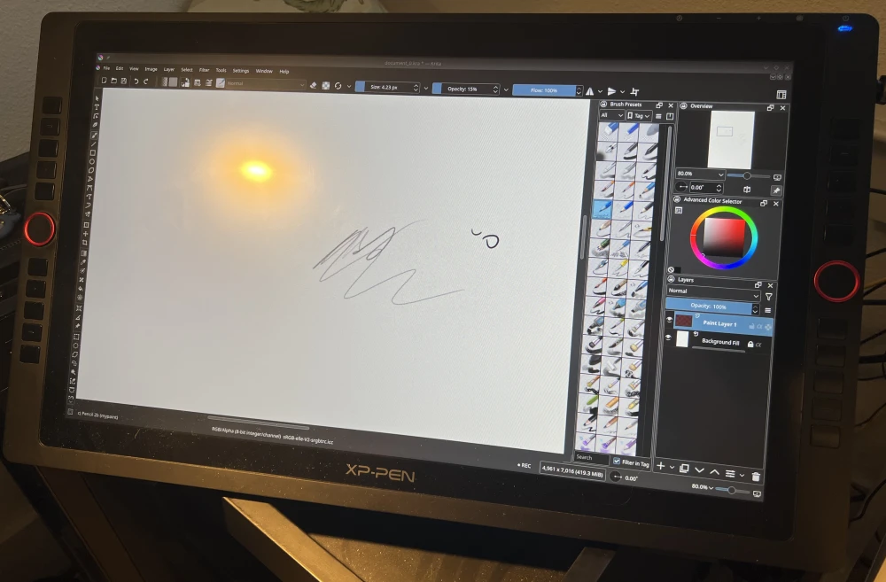
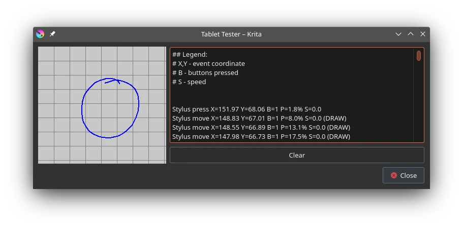

So I bought an art tablet this year, the XP-Pen Artist 22R Pro which comes with a pen. This pen does not work under Linux, sometimes.
<!--more-->




While almost every part of the tablet works, only one of the two stylus buttons is functional. One button is middle mouse click, and the other one is right mouse click. For some reason, only the first stylus button works! This is obviously troublesome, so where do we begin to fix this issue? Let me take you on a journey, if you have no experience with how input works on Linux - well that makes two of us!

## Figuring Out The Problem

I work in Krita, so the first place to check is Krita's tablet testing tool first. Looking at the log yields us something like this:



```
...
Stylus move X=120.37 Y=129.63 B=4 P=0.0% S=0.0 (DRAW)
Stylus release X=120.37 Y=129.63 B=0 P=0.0% S=0.0
...
```

According to the legend, we only care about the section named `B` which tells us which button is pressed. On my pen it's:

* 0 is released (not pressing on the screen)
* 1 is drawing (pressed on the screen, it doesn't count hovering)
* 4 is the "middle mouse" button
* The nonfunctional button does not show up at all of course.

So that at least means Krita isn't the root cause, also testing it on the desktop or any other application yields the same result - the button is non-functional. In some cases, I've found the button to actually turn off the stylus entirely, but I'm not sure why yet.

How does tablet input on Wayland actually function? Let's move down a layer and look at [KWin](https://invent.kde.org/plasma/kwin), the Wayland compositor for KDE Plasma.

On Wayland, input is typically handled using **libinput**, and now even recent X versions have a libinput driver. Digging through the libinput backend on KWin doesn't reveal anything particularly exciting, so we'll assume KWin isn't at fault either for now. Luckily, libinput has a built-on logging utility we can use to check what it sees!

First we want to check what devices `libinput` sees:

```
# libinput list-devices
...
Device:           UGTABLET 21.5 inch PenDisplay Mouse
Kernel:           /dev/input/event11
Group:            5
Seat:             seat0, default
Capabilities:     pointer
Tap-to-click:     n/a
Tap-and-drag:     n/a
Tap drag lock:    n/a
Left-handed:      disabled
Nat.scrolling:    disabled
Middle emulation: disabled
Calibration:      identity matrix
Scroll methods:   button
Click methods:    none
Disable-w-typing: n/a
Disable-w-trackpointing: n/a
Accel profiles:   flat *adaptive
Rotation:         n/a

Device:           UGTABLET 21.5 inch PenDisplay Keyboard
Kernel:           /dev/input/event12
Group:            5
Seat:             seat0, default
Capabilities:     keyboard
Tap-to-click:     n/a
Tap-and-drag:     n/a
Tap drag lock:    n/a
Left-handed:      n/a
Nat.scrolling:    n/a
Middle emulation: n/a
Calibration:      n/a
Scroll methods:   none
Click methods:    none
Disable-w-typing: n/a
Disable-w-trackpointing: n/a
Accel profiles:   n/a
Rotation:         n/a

Device:           UGTABLET 21.5 inch PenDisplay
Kernel:           /dev/input/event13
Group:            5
Seat:             seat0, default
Size:             477x268mm
Capabilities:     tablet
Tap-to-click:     n/a
Tap-and-drag:     n/a
Tap drag lock:    n/a
Left-handed:      n/a
Nat.scrolling:    n/a
Middle emulation: n/a
Calibration:      identity matrix
Scroll methods:   none
Click methods:    none
Disable-w-typing: n/a
Disable-w-trackpointing: n/a
Accel profiles:   none
Rotation:         n/a
```

So it looks like the device we're interested in is`/dev/input/event13`. We can now view the debug event log:

```
# libinput debug-events --verbose
...
 event2   POINTER_MOTION          +25.044s       -1.66/  0.00 ( -1.00/ +0.00)
 event2   POINTER_MOTION          +25.045s       -1.66/  0.00 ( -1.00/ +0.00)
 event2   POINTER_MOTION          +25.046s       -1.87/  1.87 ( -1.00/ +1.00)
 event2   POINTER_MOTION          +25.047s       -1.87/  0.00 ( -1.00/ +0.00)
 event2   POINTER_MOTION          +25.049s       -1.38/  0.00 ( -1.00/ +0.00)
 event2   POINTER_MOTION          +25.050s       -1.38/  0.00 ( -1.00/ +0.00)
 event2   POINTER_MOTION          +25.051s       -1.66/  0.00 ( -1.00/ +0.00)
 event2   POINTER_MOTION          +25.053s       -1.38/  0.00 ( -1.00/ +0.00)
 event2   POINTER_MOTION          +25.055s       -1.11/  0.00 ( -1.00/ +0.00)
 event2   POINTER_MOTION          +25.057s       -1.11/  0.00 ( -1.00/ +0.00)
...
```

Oh right, there's a lot of junk in there. We can slim it down to the only device we care about though:


```
# libinput debug-events --verbose --device /dev/input/event13
...
event13  TABLET_TOOL_AXIS        +9.455s               371.93*/88.01*  tilt: 8.06/15.12        pressure: 0.00
event13  TABLET_TOOL_AXIS        +9.545s               371.67*/88.07*  tilt: 8.06/15.12        pressure: 0.00
event13  TABLET_TOOL_BUTTON      +9.549s       331 (BTN_STYLUS) pressed, seat count: 1
event13  TABLET_TOOL_AXIS        +9.607s               371.38*/88.37*  tilt: 8.06/15.12        pressure: 0.00
event13  TABLET_TOOL_AXIS        +9.627s               371.38/88.56*   tilt: 8.19*/15.12       pressure: 0.00
...
```

As you can see, whenever I press the first stylus button it reports `BTN_STYLUS`, but when I press the second one it instead reports itself as `BTN_TOUCH` (not shown in the snippet).

Now before we go further, I just wanted to confirm whether or not the pen _actually worked at all_ so I booted up Windows real quick to test. And it does work as expected, darn.

## Going Deeper

Now it's easy to assume libinput is the culprit and the one to be fixed, [like I did](https://gitlab.freedesktop.org/libinput/libinput/-/issues/842). At first, I wrote up a quick patch to remap the wrong `BTN_TOUCH` inputs and inject proper `BTN_STYLUS2` events but honestly that's dirty. So what is beneath libinput? **evdev**!

So now that we know the (possible) culprit, we need to dig deeper into libinput. Like a good software project, libinput has [developer documentation](https://wayland.freedesktop.org/libinput/doc/latest/contributing.html#working-on-the-code) for us to look at.

Let's check the event device that Linux gives us, using the handy `evtest`:

```
# evtest /dev/input/event13
...
Event: time 1671823416.485402, -------------- SYN_REPORT ------------
Event: time 1671823416.517402, type 4 (EV_MSC), code 4 (MSC_SCAN), value d0045
Event: time 1671823416.517402, type 1 (EV_KEY), code 330 (BTN_TOUCH), value 0
Event: time 1671823416.517402, type 1 (EV_KEY), code 320 (BTN_TOOL_PEN), value 0
Event: time 1671823416.517402, type 3 (EV_ABS), code 26 (ABS_TILT_X), value 0
Event: time 1671823416.517402, -------------- SYN_REPORT ------------
...
Event: time 1671823416.825414, -------------- SYN_REPORT ------------
Event: time 1671823416.835640, type 4 (EV_MSC), code 4 (MSC_SCAN), value d0045
Event: time 1671823416.835640, type 1 (EV_KEY), code 330 (BTN_TOUCH), value 1
Event: time 1671823416.835640, type 3 (EV_ABS), code 26 (ABS_TILT_X), value 29
Event: time 1671823416.835640, -------------- SYN_REPORT ------------
```

Uh oh, the same bug appears here too. So it's time to *sigh* look deeper into the stack. Unfortunately, going deeper means stepping into the kernel. What is actually handling the input?

```
# lsusb -t
...
    |__ Port 4: Dev 5, If 0, Class=Hub, Driver=hub/2p, 480M
        |__ Port 1: Dev 8, If 0, Class=Hub, Driver=hub/4p, 480M
            |__ Port 3: Dev 9, If 0, Class=Human Interface Device, Driver=usbhid, 12M
            |__ Port 3: Dev 9, If 1, Class=Human Interface Device, Driver=usbhid, 12M
            |__ Port 3: Dev 9, If 2, Class=Human Interface Device, Driver=usbhid, 12M
...
```

It looks like the "usbhid" driver which makes sense, this is a USB HID device after all. However at this point is where I got stuck, because as far as I know there is no way to extract the _specific_ HID driver in use (unless you know the actual module name). This is annoying, so I went digging inside of the kernel  source tree for any mention of my device ID (0x091b). Nope. So in turn we can assume it's using the generic HID driver, which is actually kind of impressive.

So what is the proper HID driver for this device? Well after some research it turns out to be **uclogic** which handles a bunch of UGTablet, Huion and other misc Asian tablet devices. Unfortunately, they haven't added any support for this model but someone has.

## Digimend Project

Luckily there is a project dedicated to upstreaming device drivers for these tablets, and Aren Villanuvea (also known as "kurikaesu") known for userspace-tablet-driver-daemon has [reverse engineered the tablet already](https://github.com/kurikaesu/DIGImend-research/blob/main/xp-pen-22r-pro.md). Better yet, he even implemented **most of the work in uclogic already**! You can see the [PR here](https://github.com/DIGImend/digimend-kernel-drivers/pull/557/).

Now that's where the story ends, yay - except that my device still doesn't work. That's because the PR never made it into Digimend, and it was closed by the author without explanation. And because it never made it into Digimend, it never landed upstream. It looks like Aren has decided it was a better use of his time to implement it into [userspace instead](https://github.com/kurikaesu/userspace-tablet-driver-daemon).

The daemon is nice and all, but I would prefer kernel support for this device for numerous reasons. And what's worse is that it's _so close_ to being complete that it sucks that the work hasn't continued. Oh well...

## Kernel Hacking

So now I'm **trying to upstream the uclogic patch!** Oh how I wish it was a bug in a higher layer... I'll be taking over Aren's work and trying to clean up the patch and reduce it down to just supporting the 22R Pro, since that's the only tablet I own. Here's what works:

* Both stylus buttons work!
* Pen pressure works.
* Both dials work, although the right one is registered as horizontal scroll which is odd - that might have to be remappable on a higher layer.
* The tablet buttons "work" but some of them are not registered properly as there's more buttons than HID definitions for buttons. I might have to split this up into two devices, or something.

Now here's my to-do list:

* Hopefully recieve Aren's blessing to release the patches with his original ownership.
* Figure out a fix with the tablet buttons, and contact Nicolas Fella  (who is working on the remappable tablet buttons in 5.27) to see what needs to be done so they're remappable in the new GUI.
* Choose whether or not to contribute it directly to upstream (slow?) or back to Digimend.

If anyone is familiar with kernel contributions in the HID subsystem, or know the right people (like the ones mentioned in the article, hi!) I would love to get in [contact](/contact)!
