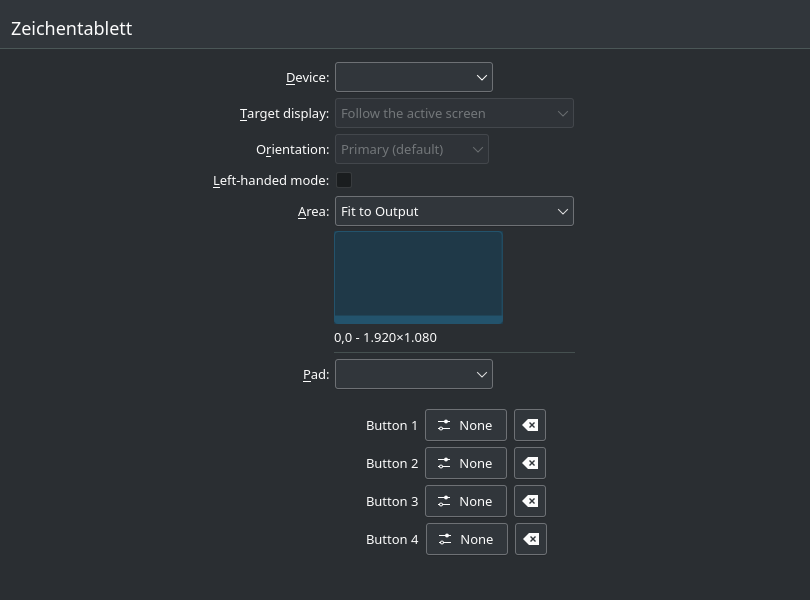
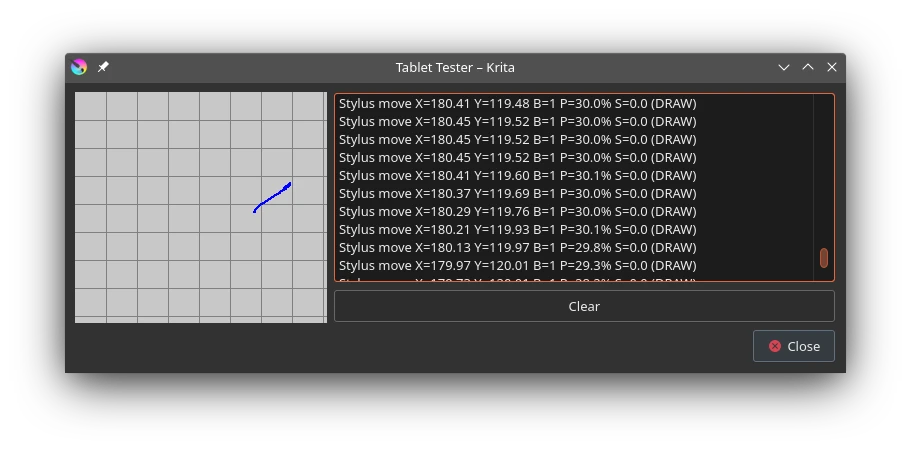
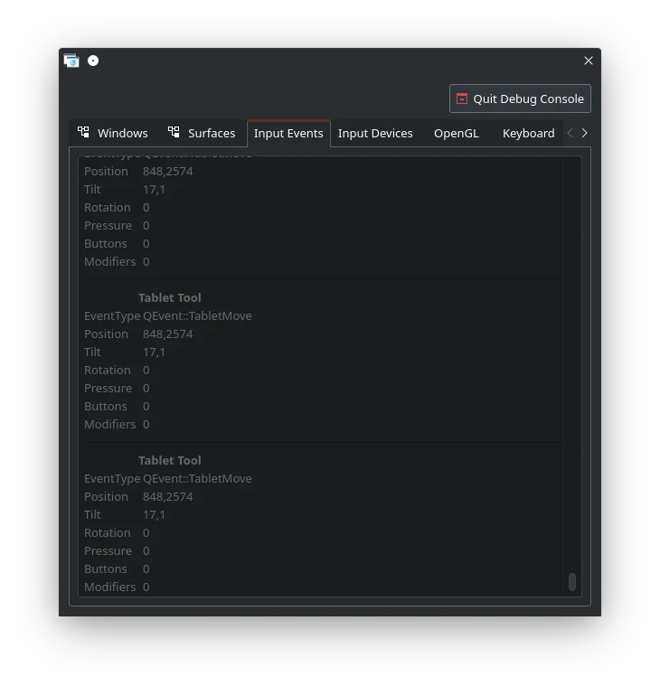

Some more progress has been made on fixing my newest drawing tablet!
<!--more-->

## Fixing up the patch

So as described in the [original post](), I have to patch
the uclogic HID driver. Let's start by going through the process of submitting a
patch upstream!

Before we even think about sending this patch upstream, I have to first - fix it.
While the patch is mostly fine in it's original form, there is one big issue I
would like to tackle - which is the tablet frame buttons. Not even the original
author seemed to figure out this issue, so I'm excited to jump in and figure it
out.

First I want to set an end goal, which is to be able to set the tablet buttons
through the new KDE Plasma 5.26 interface, like so:



Currently if you run my new uclogic patch, for some reason
it is not considered a "Pad":

![Screenshot of my tablet settings page, showing that no pads show up[^1].](Screenshot_26_094853.webp)

[^1]: The settings page is bugged when you have no pads, in 5.27 the combo box
will be disabled and say "None" like it should.

Looking through [the merge request](https://invent.kde.org/plasma/plasma-desktop/-/merge_requests/1116)
shows..  nothing of interest. That's because I actually needed to look at this
[KWin merge request](https://invent.kde.org/plasma/kwin/-/merge_requests/2881/diffs)
which actually talks to libinput! Oh yeah, libinput - our old friend is here again.
This MR mentions an event called `LIBINPUT_EVENT_TABLET_PAD_BUTTON` which is
handled by `evdev-tablet-pad.c` in libinput. Huh, whats this?

```c
...
static inline void
pad_button_set_down(struct pad_dispatch *pad,
		    uint32_t button,
		    bool is_down)
{
	struct button_state *state = &pad->button_state;

	if (is_down) {
		set_bit(state->bits, button);
		pad_set_status(pad, PAD_BUTTONS_PRESSED);
	} else {
		clear_bit(state->bits, button);
		pad_set_status(pad, PAD_BUTTONS_RELEASED);
	}
}
...
```

So this file seems to be handling "tablet pad" devices, which I didn't even
know were considered a separate device until now. Looking through the code
reveals logic that libinput uses to decide what buttons reported by the device
are meant for tablet pad usage:

```c
...

static void
pad_init_buttons_from_kernel(struct pad_dispatch *pad,
			       struct evdev_device *device)
{
	unsigned int code;
	int map = 0;

	/* we match wacom_report_numbered_buttons() from the kernel */
	for (code = BTN_0; code < BTN_0 + 10; code++) {
		if (libevdev_has_event_code(device->evdev, EV_KEY, code))
			map_set_button_map(pad->button_map[code], map++);
	}

	for (code = BTN_BASE; code < BTN_BASE + 2; code++) {
		if (libevdev_has_event_code(device->evdev, EV_KEY, code))
			map_set_button_map(pad->button_map[code], map++);
	}

	for (code = BTN_A; code < BTN_A + 6; code++) {
		if (libevdev_has_event_code(device->evdev, EV_KEY, code))
			map_set_button_map(pad->button_map[code], map++);
	}

	for (code = BTN_LEFT; code < BTN_LEFT + 7; code++) {
		if (libevdev_has_event_code(device->evdev, EV_KEY, code))
			map_set_button_map(pad->button_map[code], map++);
	}

	pad->nbuttons = map;
}
...
```

So I created a list of valid pad inputs and used those to remap all of the pad
buttons to valid inputs. This shouldn't affect existing tablets (especially considering
I don't think anyone has used a tablet with this driver with more than a couple buttons).

```c
...
/* Buttons considered valid tablet pad inputs. */
const unsigned int uclogic_extra_input_mapping[] = {
	BTN_0,
	BTN_1,
	BTN_2,
	BTN_3,
	BTN_4,
	BTN_5,
	BTN_6,
	BTN_7,
	BTN_8,
	BTN_RIGHT,
	BTN_MIDDLE,
	BTN_SIDE,
	BTN_EXTRA,
	BTN_FORWARD,
	BTN_BACK,
	BTN_B,
	BTN_A,
	BTN_BASE,
	BTN_BASE2,
	BTN_X
};
...
/*
* Remap input buttons to sensible ones that are not invalid.
* This only affects previous behavior for devices with more than ten or so buttons.
*/
const int key = (usage->hid & HID_USAGE) - 1;

if (key > 0 && key < ARRAY_SIZE(uclogic_extra_input_mapping)) {
        hid_map_usage(hi,
                        usage,
                        bit,
                        max,
                        EV_KEY,
                        uclogic_extra_input_mapping[key]);
        return 1;
}
```

And that's pretty much the only major change I did to the original patch! You can
see the [patch in linux-input here](https://lore.kernel.org/all/2068502.VLH7GnMWUR@adrastea/).

However that isn't the end of the story, as there's one issue - libinput doesn't
think my tablet pad is a... tablet pad?

```
# libinput record /dev/input/event12
...
  udev:
    properties:
    - ID_INPUT=1
    - ID_INPUT_MOUSE=1
    - LIBINPUT_DEVICE_GROUP=3/28bd/91b:usb-0000:2f:00.3-4.1
...
```

Okay, that's interesting - why is this a mouse? Uh oh, don't tell me...

## Fixing udev

So unfortunately before my tablet is fully functional, we have to touch _another_
piece of critical Linux infrastructure - _great_. I want to dive into how libinput
even decides device types, and I promise you it's harder than it should be.

If you never touched the Linux input stack before (like I did before I started
this project) you might think, "whats the big deal? the mouse says it's a mouse,
a keyboard says it's a keyboard, whatever." except it's never that simple.
If you've been reading my blog posts, you might think that's just information evdev
will hand over, which you're wrong there too. All evdev tells userspace is what
events the device will emit - that's it[^2]. So who figures out what is what?

**Unfortunately, it's a guessing game.** No you heard me right, _udev guesses
what devices are_. So how do we tell what devices are which? Luckily systemd
ships with a hardware database, which details stuff like id vendors and manual
fixes for esoteric devices. This is actually what the [original patch author did
in order to fix udev](https://github.com/DIGImend/digimend-kernel-drivers/pull/557#issuecomment-903159423)
classifying it as a mouse:

```
id-input:*:input:b0003v28BDp091Be0100*
 ID_INPUT_MOUSE=0
 ID_INPUT_TABLET=1
 ID_INPUT_TABLET_PAD=1
...
```

However I didn't like this solution, and it would be a _pain_ to find the modalias
for every single tablet that ever existed, that udev mistakenly categorizes. Is
there a better solution? Instead I changed the logic in `src/udev/udev-builtin-input_id.c`.
Let's take a look at the original codepath:

```c
...
is_pointing_stick = test_bit(INPUT_PROP_POINTING_STICK, bitmask_props);
has_stylus = test_bit(BTN_STYLUS, bitmask_key);
has_pen = test_bit(BTN_TOOL_PEN, bitmask_key);
finger_but_no_pen = test_bit(BTN_TOOL_FINGER, bitmask_key) && !test_bit(BTN_TOOL_PEN, bitmask_key);
for (int button = BTN_MOUSE; button < BTN_JOYSTICK && !has_mouse_button; button++)
        has_mouse_button = test_bit(button, bitmask_key);
has_rel_coordinates = test_bit(EV_REL, bitmask_ev) && test_bit(REL_X, bitmask_rel) && test_bit(REL_Y, bitmask_rel);
has_mt_coordinates = test_bit(ABS_MT_POSITION_X, bitmask_abs) && test_bit(ABS_MT_POSITION_Y, bitmask_abs);

/* unset has_mt_coordinates if devices claims to have all abs axis */
if (has_mt_coordinates && test_bit(ABS_MT_SLOT, bitmask_abs) && test_bit(ABS_MT_SLOT - 1, bitmask_abs))
        has_mt_coordinates = false;
is_direct = test_bit(INPUT_PROP_DIRECT, bitmask_props);
has_touch = test_bit(BTN_TOUCH, bitmask_key);
has_pad_buttons = test_bit(BTN_0, bitmask_key) && has_stylus && !has_pen;
...
if (has_mt_coordinates) {
        if (has_stylus || has_pen)
                is_tablet = true;
        else if (finger_but_no_pen && !is_direct)
                is_touchpad = true;
        else if (has_touch || is_direct)
                is_touchscreen = true;
}

if (is_tablet && has_pad_buttons)
        is_tablet_pad = true;

if (!is_tablet && !is_touchpad && !is_joystick &&
        has_mouse_button &&
        (has_rel_coordinates ||
        !has_abs_coordinates)) /* mouse buttons and no axis */
        is_mouse = true;
```

To explain a little of context, `udev` has several "built-in" commands to decide
what devices are what, and if any quirks or workarounds need to be applied. Notably,
the `input_id` builtin handles classifying input types for devices if they are
not already in the hardware database. If you turn on udev debug logging, you can
actually see the built-ins it runs whenever you connect, say a usb device to your
system. As you can see, evdev gives udev the supported event types of the device,
and then udev has to figure out what the device actually is. Now let's look at
the supported event types by the tablet pad:

```
# libinput record /dev/input/event12
...
devices:
- node: /dev/input/event12
  evdev:
    # Name: UGTABLET 21.5 inch PenDisplay Pad
    # ID: bus 0x3 vendor 0x28bd product 0x91b version 0x100
    # Supported Events:
    # Event type 0 (EV_SYN)
    # Event type 1 (EV_KEY)
    #   Event code 256 (BTN_0)
    #   Event code 257 (BTN_1)
    #   Event code 258 (BTN_2)
    #   Event code 259 (BTN_3)
    #   Event code 260 (BTN_4)
    #   Event code 261 (BTN_5)
    #   Event code 262 (BTN_6)
    #   Event code 263 (BTN_7)
    #   Event code 264 (BTN_8)
    #   Event code 265 (BTN_9)
    #   Event code 266 ((null))
    #   Event code 267 ((null))
    #   Event code 268 ((null))
    #   Event code 269 ((null))
    #   Event code 270 ((null))
    #   Event code 271 ((null))
    #   Event code 272 (BTN_LEFT)
    #   Event code 273 (BTN_RIGHT)
    #   Event code 274 (BTN_MIDDLE)
    #   Event code 275 (BTN_SIDE)
    # Event type 2 (EV_REL)
    #   Event code 6 (REL_HWHEEL)
    #   Event code 8 (REL_WHEEL)
    #   Event code 11 (REL_WHEEL_HI_RES)
    #   Event code 12 (REL_HWHEEL_HI_RES)
    # Event type 4 (EV_MSC)
    #   Event code 4 (MSC_SCAN)
...
```

I encourage you to read through the original systemd code, as the bug (I think)
is hilariously obvious. The **tablet pad never emits any BTN_STYLUS events**.
In fact, my tablet is not even configured on a firmware level to ever emit any BTN_STYLUS events,
because the attached log above is _without my patch_! Obviously this is bad, as
that means possibly other tablets are wrongly accused of being mice, and we should
fix that logic. That's also what I didn't want to simply shove a new entry into the
hardware database, as this turns out to be a udev bug.

So I made [a systemd PR](https://github.com/systemd/systemd/pull/25866) fixing the
logic, maybe that might fix your tablet too!

## Tilt support

One more thing I wanted to tackle was tilt support for the pen, which the driver
says it supported but I haven't tested yet. Simple, right? (you already know the
answer to that question)

The first thing to do is just evdev:

```
# evtest /dev/input/event11
...
Event: time 1672152523.926503, -------------- SYN_REPORT ------------
Event: time 1672152523.938496, type 3 (EV_ABS), code 0 (ABS_X), value 37529
Event: time 1672152523.938496, type 3 (EV_ABS), code 1 (ABS_Y), value 13166
Event: time 1672152523.938496, type 3 (EV_ABS), code 27 (ABS_TILT_Y), value 12
Event: time 1672152523.938496, -------------- SYN_REPORT ------------
Event: time 1672152523.952501, type 3 (EV_ABS), code 27 (ABS_TILT_Y), value 13
Event: time 1672152523.952501, -------------- SYN_REPORT ------------
Event: time 1672152523.956501, type 3 (EV_ABS), code 0 (ABS_X), value 37534
Event: time 1672152523.956501, type 3 (EV_ABS), code 1 (ABS_Y), value 13138
Event: time 1672152523.956501, type 3 (EV_ABS), code 27 (ABS_TILT_Y), value 14
Event: time 1672152523.956501, -------------- SYN_REPORT ------------
Event: time 1672152523.962497, type 3 (EV_ABS), code 27 (ABS_TILT_Y), value 15
...
```

So it looks like it's reporting tilt events, that's good. Let's go one layer up,
and check with libinput. Actually, instead of using `debug-events` or `record`,
libinput actually has a handy tablet testing function called `debug-tablet`:

```
#  libinput debug-tablet
Device: UGTABLET 21.5 inch PenDisplay Pen (event11)
Tool: pen serial 0, id 0
libinput:
tip: up
  x:                 299.38 [-------------------------------------------------|-----------------------------]
  y:                 140.64 [-----------------------------------------|-------------------------------------]
  tilt x:            -54.53 [---------------|---------------------------------------------------------------]
  tilt y:             41.21 [---------------------------------------------------------|---------------------]
  dist:                0.00 [|------------------------------------------------------------------------------]
  pressure:            0.00 [|------------------------------------------------------------------------------]
  rotation:            0.00 [|------------------------------------------------------------------------------]
  slider:              0.00 [---------------------------------------|---------------------------------------]
  buttons:
evdev:
  ABS_X:           29952.00 [-------------------------------------------------|-----------------------------]
  ABS_Y:           14077.00 [-----------------------------------------|-------------------------------------]
  ABS_Z:               0.00 [|------------------------------------------------------------------------------]
  ABS_TILT_X:        -55.00 [----|--------------------------------------------------------------------------]
  ABS_TILT_Y:         41.00 [-----------------------------------------------------------------|-------------]
  ABS_DISTANCE:        0.00 [|------------------------------------------------------------------------------]
  ABS_PRESSURE:        0.00 [|------------------------------------------------------------------------------]
  buttons: BTN_TOOL_PEN
```

Alright that's good, it looks like libinput is recording the tilt too. How about
inside of Krita, which has tilt support? Uhhh... let's check the tablet tester:



Wait, there's no way to _check for tilt here_! That was a really weird omission,
so I fixed that [in Krita 5.2](https://invent.kde.org/graphics/krita/-/merge_requests/1678).
Then I thought there was no way that no developer in Krita somehow didn't have
tilt information debugged somewhere, so after a bit searching I found a tool for
Tablet Event Logging activated by CTRL+SHIFT+T. Using that, we can find if Krita
has picked up the tilt from our pen:

```
$ krita
...
krita.tabletlog: "[BLOCKED 2:] MouseMove        btn: 0 btns: 0 pos:  828, 515 gpos:  859,2778 hires:  858.956, 2777.95 Source:2"
krita.tabletlog: "[       ] TabletMove       btn: 0 btns: 0 pos:  828, 516 gpos:  859,2779 hires:  859.281,    2779 prs: 0.000000 Stylus Pen id: 0 xTilt: 0 yTilt: 0 rot: 0 z: 0 tp: 0 "
krita.tabletlog: "[BLOCKED 2:] MouseMove        btn: 0 btns: 0 pos:  828, 516 gpos:  859,2779 hires:  859.281,    2779 Source:2"
krita.tabletlog: "[       ] TabletMove       btn: 0 btns: 0 pos:  828, 517 gpos:  859,2780 hires:  859.441, 2779.72 prs: 0.000000 Stylus Pen id: 0 xTilt: 0 yTilt: 0 rot: 0 z: 0 tp: 0 "
krita.tabletlog: "[BLOCKED 2:] MouseMove        btn: 0 btns: 0 pos:  828, 517 gpos:  859,2780 hires:  859.441, 2779.72 Source:2"
krita.tabletlog: "[       ] TabletMove       btn: 0 btns: 0 pos:  829, 517 gpos:  860,2780 hires:  859.562, 2780.25 prs: 0.000000 Stylus Pen id: 0 xTilt: 0 yTilt: 0 rot: 0 z: 0 tp: 0 "
...
```

Huh? No tilt information at all? That's slightly worrying. However, there is a
layer in-between Krita and libinput, that being the compositor - in my case KWin.
I actually didn't know until now, but KWin has a handy debug tool available by
searching KWin in KRunner:


Using that, we can check for the input events that it records:



Well that's a nice consolation, it looks like KWin is picking up the tilt
information from libinput too, so at least it's not throwing it out. But why does
Krita still not receive anything? For some reason,  Krita receives tilt information on X11.

To explain, Krita does not interface with KWin directly. Instead,
it uses standard protocols - either X or Wayland to communicate with the server or
compositor respectively. So why does tilt work when Krita is running under X11 and not when
running under Wayland? The trick is that **it doesn't matter**, currently Krita
is always running under X since it disables Wayland support for some reason. However,
XWayland is still technically a _Wayland client_, so naturally the next place to
look is how KWin sends Wayland events. That takes us to the class `KWaylandServer`

The protocol we care about here is the unstable "tablet" Wayland protocol, currently on
version 2. It supports tilt events, so what's the problem here? In reality, KWin
was never sending the events in the first place:

```cpp
...
const quint32 MAX_VAL = 65535;
tool->sendPressure(MAX_VAL * event->pressure());
tool->sendFrame(event->timestamp());
return true;
...
```

I actually came across this function when searching through relevant KWin merge
requests, notably [!3231](https://invent.kde.org/plasma/kwin/-/merge_requests/3231)
which has the unrealistic goal of complete tablet support in just one merge request!
I cleaned up the relevant tilt support part, and submitted a new [merge request](https://invent.kde.org/plasma/kwin/-/merge_requests/3364)
which means pen tilt/rotation is supported under KDE Wayland now! Yay!

# Dials

All is well and good now, right? That's what I thought, until I realized my **dials
don't work**! I was so entrenched in everything else, that I completely neglected
these little do-dads. To explain, these seem to be XP-PEN specific and are just
glorified scrollwheels:


However, these are **not Wacom rings**. Rings on a Wacom tablet (to my knowledge) are
actual rings, which report absolute positioning like a wheel. These dials are not those,
but are sending relative "scroll" events. I had considered remapping this to buttons on
the evdev layer, which was a bad idea since that meant that complicated things
further up. Another option was to instead, emulate a Wacom ring by disguising the relative
events and turning those into `EV_ABS`. I also threw that idea away, because that
also seems to hide the problem.

If you're curious, the dials actually worked without my patches - because remember that
udev was classifying the pad as a mouse - so libinput thought no further. But now
that it's considered a real tablet pad, it rejects scroll wheel events.

Honestly the best way to solve this issue is to - unfortunately - touch every
single bit of the input stack to accommodate these devices. Again.

* The Wayland tablet protocol must be changed to add a few new properties for dials
on pads. Tracking via [!122](https://gitlab.freedesktop.org/wayland/wayland-protocols/-/issues/122).
* Libinput must be modified to expose these dials and correctly map them. Tracking via [!845](https://gitlab.freedesktop.org/libinput/libinput/-/issues/845).
* KWin must be modified to support sending dial events in support of the tablet protocol changes.
Currently not tracking.
* These dials (and we should also include rings and strips too) should be exposed in the Tablet Settings KCM too.
Currently not tracking either.

As you can see, it's going to be a complex process to support these stupid little circles,
but I'm going all in. Luckily, with the rest of my patches going through - **everything
except for dials on the XP-PEN Artist 22R Pro device should be well supported now**. In the coming
months, I hope to make headway in supporting dials in KDE.

[^2]: Technically, there is HID device types defined but as far as I can
tell that's only used internally in the kernel.
