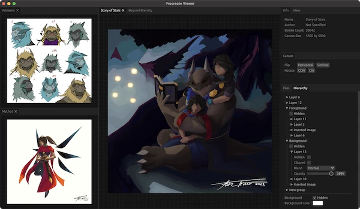

I will not be renewing my Apple Developer License for various reasons [I've already discussed elsewhere](). It is due to expire sometime in the summer, so there's still a couple of months before it disappears off the App Store. I'm actually _losing_ money by selling my software on the App Store, and I don't really work on a Mac anymore. Plus more fun problems related to Apple infrastructure:



If you already bought Silica Viewer, nothing will change - you can continue to re-download it into perpetuity. This just means you can't pay money for it now, although I wouldn't want you to because I don't keep up with active development. As always, Silica Viewer is open source and free to use still.

For people looking for alternative software, check out [Silicate](https://github.com/Avarel/silicate) by [Avarel](http://antran.io/). It works on more platforms than Silica Viewer, and has a better rendering engine, along with other cool features! Thank you all who have supported by using my software, as always :)
