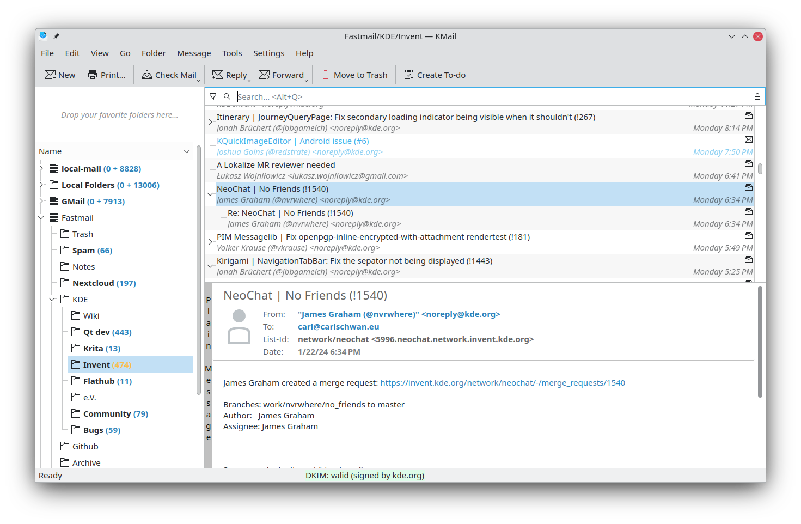
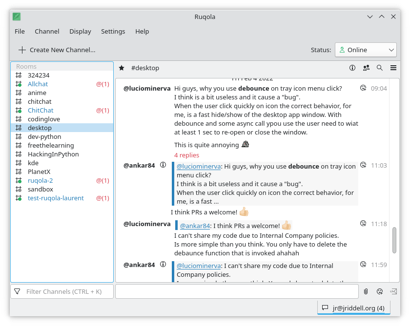
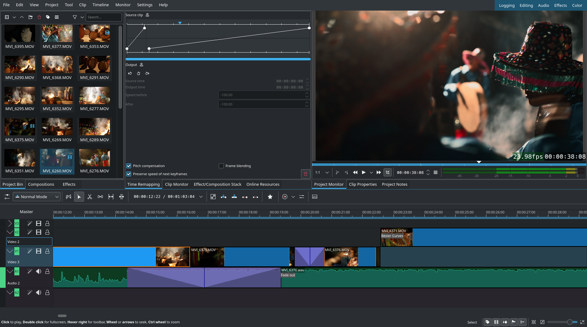
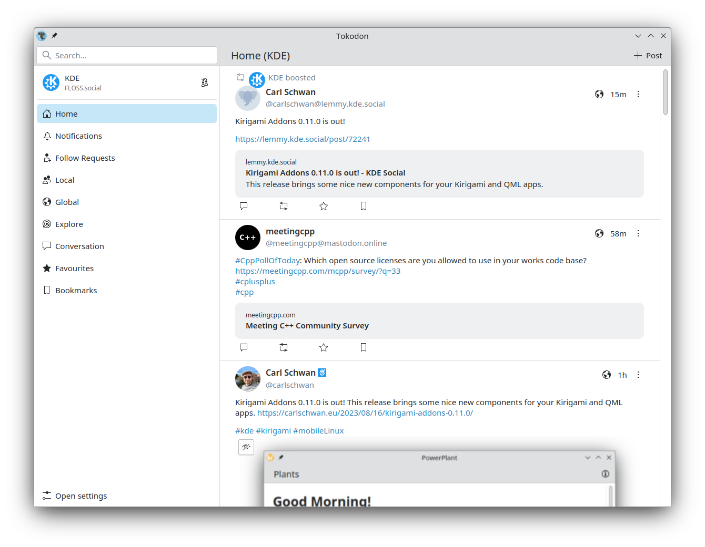
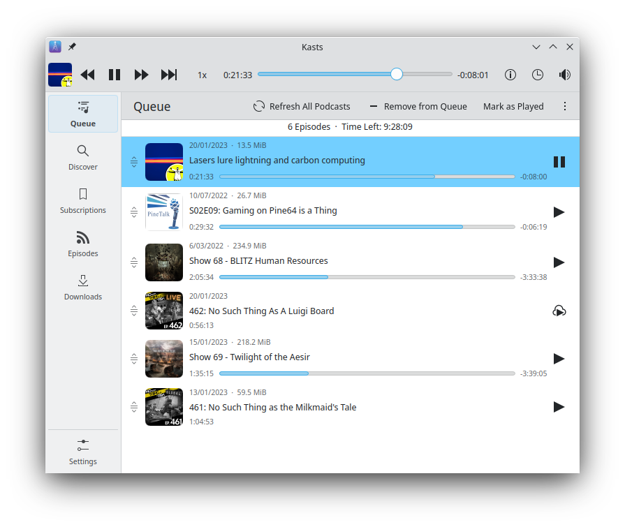

This is my anti-rant post, today I wanted to shine a light on the fantastic [KDE software](https://kde.org/) that I use daily. You can do similar things with GNOME and whatever else, but that's for someone else to write. There's bias here because I have contributed to several of these applications, but that doesn't detract from the point that I depend on them daily.

I check my work and personal mail using [KMail](https://apps.kde.org/kmail2/). I  keep track of tasks, events and meetings using [Merkuro](https://apps.kde.org/merkuro.calendar/). I can keep tabs on my calendar regularly because of the calendar applet in KDE Plasma, which is synced thanks to [Akonadi](https://en.wikipedia.org/wiki/Akonadi). My work uses [Rocket.Chat](https://www.rocket.chat/), and I use [Ruqola](https://apps.kde.org/ruqola/) for interacting with that. There's two programs I use in my day-to-day that's unfortunately not KDE applications. One is my web browser, which is [Firefox](https://www.mozilla.org/en-US/firefox/) of course. Another is my IDE, [JetBrain's CLion](https://www.jetbrains.com/clion/) which I depend on a lot and unfortunately [KDevelop](https://apps.kde.org/kdevelop/) doesn't even come close to it. Sorry 😢

Even when I'm not working, I still use KDE software in my hobbies. One of them is drawing, which I use [Krita](https://krita.org/en/) for (which is a great application in general, you should use it!) When I have to do video editing, my program of choice is [Kdenlive](https://kdenlive.org/en/) (which is a great application in general, you should use it!) I even use Krita when sketching on-the-go or in bed now instead of Procreate, since my Lenovo Yoga runs Linux and KDE Plasma.

My primary chat platform is [Matrix](https://matrix.org), so of course I use [NeoChat](https://apps.kde.org/neochat/) as my preferred client everywhere I can. I chose [Mastodon](https://joinmastodon.org/) as my Twitter-replacement, and I use [Tokodon](https://apps.kde.org/tokodon/) so much that I don't even open up the web interface anymore! The less I have to run in the browser the better, in my opinion.

There's also lots of small utilities that I use, such as [Spectacle](https://apps.kde.org/spectacle/) for screenshots and quick screen recordings. I use [Kate](https://apps.kde.org/kate/) for all of my text editing, such as this post right now! [Gwenview](https://apps.kde.org/kate/) is my image viewer of choice too. Of course I use [Okular](https://apps.kde.org/okular/) for reading the occasional PDF. Can't forget about [Okteta](https://apps.kde.org/okteta/) when I'm trying to dissect some binary file.

For consuming media, I use KDE applications for that too. I use [PlasmaTube](https://apps.kde.org/plasmatube/) to feed my YouTube addiction. I have started listening to some podcasts, and have been using [Kasts](https://apps.kde.org/kasts/) for those. Apparently it has a NextCloud sync feature, so now it's even more useful to me!

# Upcoming

Here's some software I recently learned about, and want to start using in the new year:

* [Accessibility Inspector](https://apps.kde.org/accessibilityinspector/), which is a KDE-based alternative to GNOME's Accerciser.
* [Codevis](https://apps.kde.org/codevis/), a code visualization program, I used it once before but I need to try it again.
* [Fielding](https://apps.kde.org/fielding/), a REST API client. I plan to expand it's features further so I don't have to depend on Insomina.
* [Powerplant](https://apps.kde.org/powerplant/), something to help keep your plants. I only have one plant to keep right now, so this is the perfect time to learn how to use it!

Hope this sheds some light on my favorite applications, and gives you ideas for using them!
