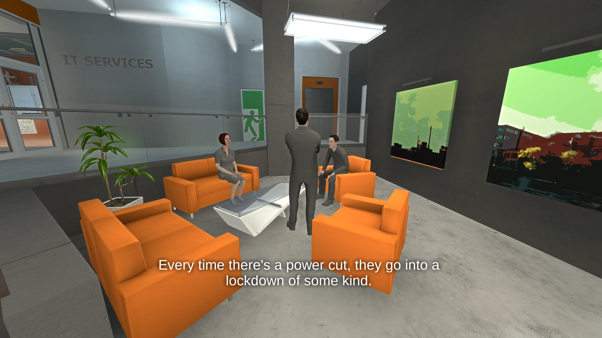
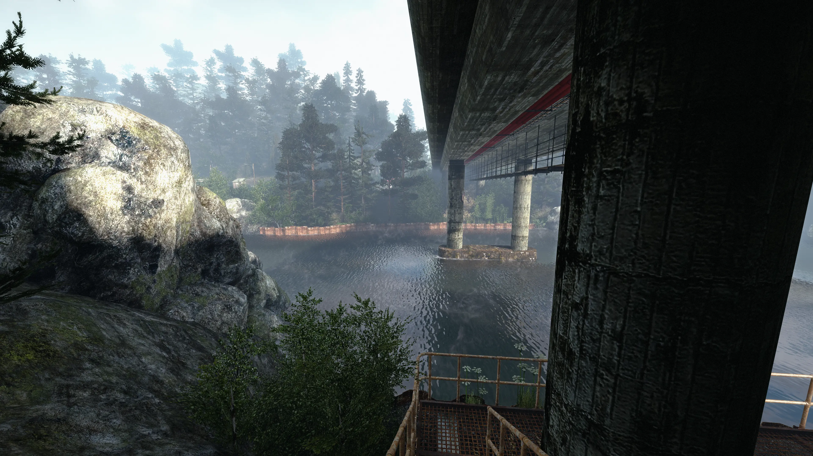

A little while ago, people suggested that I play INFRA. The premise is simple, you are
a man walking around and taking pictures. I won't spoil plot details of the
game, but I will show screenshots from several places in the game. So if you wish
to go in blind, I _highly_ suggest playing the game first.

---

The thing I absolutely love about this game is the environments, like the office
in the beginning of the game. INFRA is made in [Source](https://developer.valvesoftware.com/wiki/Source) (although I'm not sure
what branch it is) and the fantastic art direction combined with the outdated
Source lighting gives the game a unique vibe.

You are "Markku Siltanen", but called "Mark" by your coworkers. As part of a
consulting group, you are equipped with the gripping task of _"structural survey"_.
What this really means is taking an obscene amount of pictures on your camera
with a battery that only lasts five seconds if you leave it on. While there
is dialogue in typical Source game fashion there is not a wealth of cutscenes
and you'll have control of your character for a large part of the game. In
some sections, there are visible NPCs but you'll be lonely for most of the
game except for the occasional phone or radio call.

As you progress through the game you'll enter farther and farther into the
depths of the city. The gradual exploration aspect is really fascinating, and
there is a wealth of nature but also grimy underground facilities.

The game is not always a "walking simulator", but that's what you do for most
of the game. There is small puzzles here and there, and some segments
that are timed. At least for me, some of the obstacles were not straightforward
and I needed a walkthrough for later parts of the game. I never felt frustrated
though, but the game definitely does not hold your hand.

I'm not sure if the environments are supposed to be liminal, but it gives
off that feeling through most of the game. The sound design is also fantastic,
and I felt really immersed while playing. A lot of the game is not "signposted"
(as in, it warns you what's about to happen) so there is some intentional and
unintentional jumpscares. That's on top of the general creepiness. One of my
favorite locations is the metro, which is empty once you get there of course.

The later half of the game puts you (mostly) above ground, with a lot of city
and urban environments in a stark contrast to the first half of the game. I also
loved the gradual transistion into night time as well, which just added to the
creepiness and unease.

Despite being a Source game, the environment art is so good it really carries
the graphics - although it looks dated in some spots. For example, reflections
are really simple and some environments almost look like they have no lighting.
It's just a minor gripe though, this game released a while ago and probably
started development even farther back.

If you're a fan of Source games, and urban exploration (like I am) then this
game is definitely up your alley. You can buy it [on Steam](https://store.steampowered.com/app/251110/INFRA/). Enjoy!

