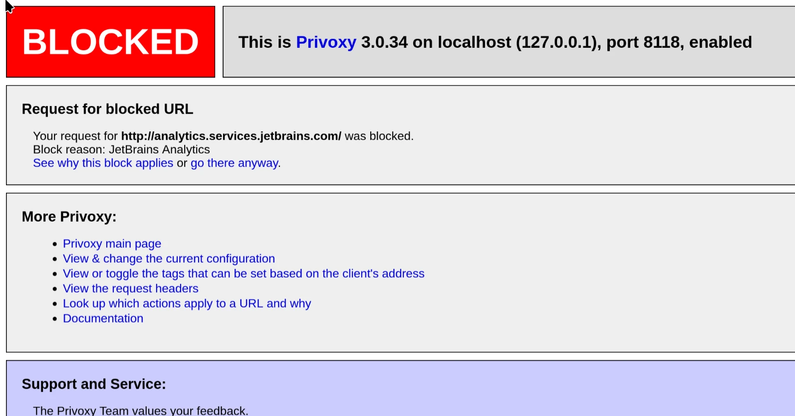

So recently JetBrains "properly" released RustRover (after removing the open source Rust plugin.) I don't work on Rust stuff at the moment in my dayjob, but fortunately they have a free non-commercial version. However there is one catch:

> While using a non-commercial license, the product will send usage data to validate your compliance with the license terms and anonymous feature usage statistics for product improvements to JetBrains.

The analytics I don't really care about too much, but the "license compliance" scares me a bit. How exactly do they know you're complying? What kind of information would they need to do that? I don't want JetBrains knocking down my door because they thinks I'm using their IDE in a "commercial environment". I only have one JetBrains account that's tied to my employers e-mail, but I use it a lot for non-commercial purposes too. More importantly, I don't want to set the precedent for data collection under the dubious guise of "license compliance"[^1].

Now you may be thinking: there has to be an interesting way to turn analytics off right? Maybe we can patch it out by doing some cool Java decompilation. Or how about doing some cool sandboxing trick? Could we simply write `analytics=off` into some unnamed config file!? Well actually it's simple, JetBrains includes a HTTP proxy option for IDE connections:


I needed a non-caching, simple and widely available proxy just to do some basic blocking. I stumbled across [Privoxy](https://www.privoxy.org/) which was perfect for this use case, and it's available in Fedora and other distributions. Install it, enable the systemd service and edit `/etc/privoxy/user.action`. Add this line to the file:

```
{+block{JetBrains Analytics}}
analytics.services.jetbrains.com
```
(It should take effect immediately.)

If you want to be doubly sure this works, temporarily set your browser to the Privoxy at `127.0.0.1:8118` and try going to the URL. You should see a blocked message:



Now in JetBrains, enter the HTTP proxy and watch it work it's magic! Of course you can't _see_ the analytics but you can block other URLs like `plugins.jetbrains.com` and see that the proxy blocks the Plugins tab. If someone knows other useful URLs to block, feel free to let me know.

---

On this note: my analytics checkbox is off (presumably because I had it off before) and now it's impossible to turn it on. So I have no idea if the IDE is even attempting to connect to the analytics server, although I can see plenty of DNS requests to it:


[^1]: I would argue they should focus less on "enforcing license compliance" and actually making good IDEs, you know - the thing they used to do. If they're so worried about people freeloading and letting them bleed money, they should consider stop wasting money on AI instead.
