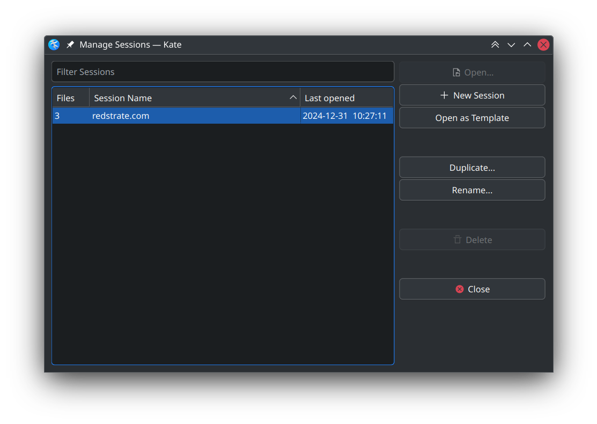
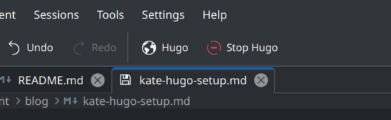
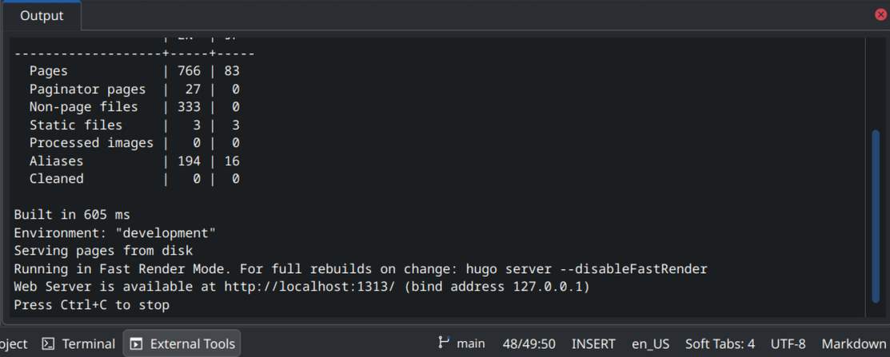

I use Hugo to build my website (which you can explore the source code to
on [GitHub](https://github.com/redstrate/redstrate.com).) And because I love using
KDE applications whenever I can, I do all of my editing - from config files, CSS
and Markdown for posts - in [Kate](https://kate-editor.org).

My song & dance when I want to edit my website is a bit inefficient. I
would use Kate, then manually navigate to my folder. Or I would invoke Kate from
the command-line to do the same. Then I would open a _separate Konsole window_
(and sometimes the integrated terminal) in order to launch Hugo to build the
site. I would then open up a separate terminal to perform git operations.

So I have created a neat workflow that I think is worth sharing, in case you
didn't know Kate had these features. This also serves as documentation to myself
whenever I want to re-create it.

# Sessions

The first and easiest improvement is to use
sessions. You can manage these under the "Session" menu item at the top of Kate.

Instead of opening a fresh Kate session each time, the folder I was in (which is
always my site's folder) and the open documents I have are saved automatically.
Note that you probably need the Projects plugin enabled to have access to the
"Projects" tab where it's state is also saved in the session.

# External Tools

The next thing to tackle is making it easier to launch Hugo. We can accomplish
this by using External Tools, which is managed under Settings or under the Tools
menu item. I have two, one for launching Hugo and the other for stopping it.

These external tools are self-explanatory, but I set the working directory to `%{Project:Path}`
to ensure it's running at the site root. I also have it set to spit out the Hugo
output into the pane, but it doesn't actually display until the process quits
which seems like a bug in Kate.

It's not a huge deal, as the output is displayed when I use the "Stop Hugo" action. I suggest using the "-O" argument of `hugo server` to automatically open your default web browser when Hugo completes initialization.

# Ideas

It would be cool to have a preview pane that automatically finds the Markdown file
you're editing and navigate to it, which seems possible. Another nicety would be
a native Kate plugin to handle launching/stopping/configuring the Hugo server. But
this workflow is already a big improvement over what I had before.
