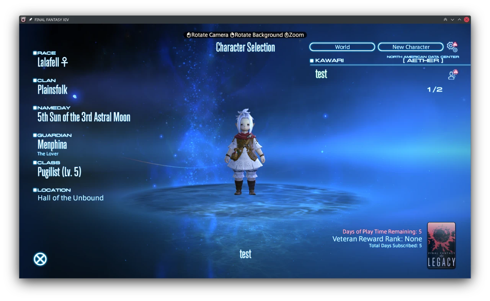
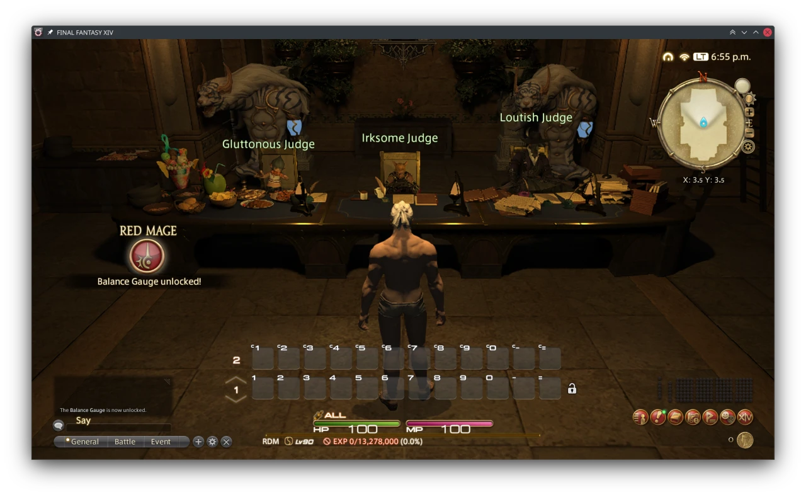

[Kawari](https://github.com/redstrate) is a FFXIV server emulator project that started a few years ago, and today I'm happy to report it can go from login to zone on 7.18 (the latest patch as of writing.) Before I rattle on, it should be noted that the goal of this project is not a "private server" (_sweating profusely as SqEx lawyers put away their pens_.) It's more of a research project, as I have very little interest re-implementing quests and story. I'm basically going to continue this until I get bored.

If you're wondering how this is different from [Sapphire](https://github.com/SapphireServer/Sapphire/), one of my goals is to be able to use the modern client - at least the latest expansion, but ideally the latest patch version. I don't think that goal will last very long, as once 7.2 releases it will break everything. I'm hoping the goal of sticking to the latest patch will inspire me to find some better way to identify packets... maybe.

Another difference between other server emulators projects is that I implement (almost) everything to allow a normal launcher[^1] to login, no special API (ala Sapphire) required. For a while Kawari already had a fake login/frontier/etc server to get the client to boot, the missing pieces were a Lobby and World server. Using Kawari with the official Lobby server will boot you out - of course - because you lack a valid session ID.

So, recently I stumbled upon [iolite](https://github.com/0xbbadbeef/iolite), which happened to be a Rust implementation of a lobby and world server for 7.16! ...but the current patch version was 7.18. This posed a problem, as FFXIV "randomizes" its IPC opcodes[^2] every version. I trudged through, and implemented a basic Lobby and World server that's compatible with today's client based largely on iolite:

<!-- [TemporalStasis](https://github.com/NotNite/TemporalStasis) was invaluable in making this happen, it's a proxy server that sits between the client and the lobby/world server. It reads packets on the fly (including decrypting and decompressing them!) Using the proxy, I was able to create a nice big list of the packets sent between the client & server when loading into a world. It also helped me implement/fix some missing pieces in Kawari, such as figuring out the Oodle compression is two-way and there are separate compressors for both clientbound and serverbound packets. -->

If you're looking to test the project casually, I suggest not bothering to. You currently need a library that I can't redistribute (RAD/Epic Game's Oodle) to even run the World server, and even then you can only walk around before the server panics and exits. Even if there isn't any more updates to Kawari after this, I still had tons of fun making this!

Thank you to [NotNite](https://notnite.com/) and [Asriel](https://camora.dev/) for TemporalStasis, which has been invaluable to making this work on 7.18. Of course, thanks to [0xbbadbeef](https://github.com/0xbbadbeef) for creating iolite, and the Sapphire project too.

[^1]: Note that I haven't tried to use the retail launcher, I use my own launcher [Astra](https://github.com/redstrate/Astra) as it allows me to plug in a custom game server to make testing way easier.

[^2]: Basically, the communication language between the client and the world server. It tells the client the difference between packets, e.g. what is "this player has spawned here", or "swing my sword".
