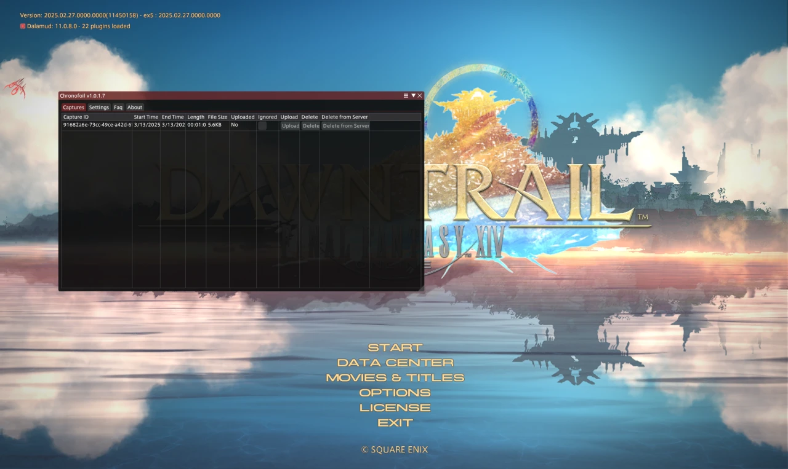
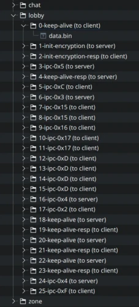

This isn't actually an update _on_ Kawari, but building tools to make my life easier. One of the manual tasks I have to do is collect and dissect packets, and my amateur process is too error prone and time-consuming. I want a neat, structured and ideally automatic process for collecting and organizing these.

In the last update, NotNite tipped me off to [Project Chronofoil](https://github.com/ProjectChronofoil), a project that helps create packet captures and upload them to a central server for archival & preservation. I'm not too interested in the server portion yet, but the ability to archive packets with Dalamud greatly interests me. It has the added benefit of collecting data in the background as I play on retail servers, something I wouldn't do otherwise if I had to do some manual setup every time.

However the project doesn't include a tool (that I could find anyway, maybe [FFXIVMon](https://github.com/takhlaq/ffxivmon)?) to extract the data of these captures. They have a library to read them in C#, but I don't work in C# so it's not too much use to me. After a few hours of hacking though, I whipped up a tool that extracts packets from `.cfcap` files and expands them into a nice directory structure. The project is [available on GitHub](https://github.com/redstrate/XIVPacketTools)[^1].

I designed the directory structure (probably not final) to make it easy to grep for existing IPC opcodes. The index of the segment is also the first part of the filename, so it can be easily sorted by a file manager or any other tool. Inside of each directory is the data of the packets - with the headers removed - and the IPC header too, if available.

[^1]: In case I have ideas for other packet-related tools, I kept the repository name suitably vague.
