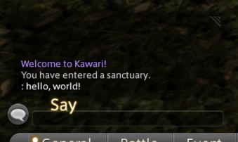

After the initial excitement of being able to load into a zone wore off, I spent some time polishing up the project and implementing more packets. I managed to get quite a bit done over the course of a few nights.

# Chat messages

This was a simple packet: it contains the player ID, timestamp, channel and of course - the message itself. In-game, your own name still doesn't show up, and I'm not sure why yet.



I added support for messages sent *by* the server too, which is used to print a message on login:


# Logging out

If you tried to log out, the server previously would panic, crash and kick you out. So I guess it worked in a way? Now the experience is much better though:



It turns out there are several packets involved, all of which are easy to implement (because I can fill them with nothing!)

# Player spawning

I copied the old "Player Spawn" packet from iolite initially, but it doesn't work in the latest patch because the structure of the packet subtly changed. They change just enough in these packets to be really annoying to fix, as it turns out. Packets like these are also relatively huge, like >500 bytes. So there's lots of places for it to go wrong, but now I fixed it. I can set the appearance, model ids, and the character state now:


I also fixed some other issues I noticed when sending customize data around, it should be more stable now.

# GM commands

Another thing I quickly implemented was GM commands. There are several in the game, normally inaccessible to regular users. The client is smart and won't even attempt to send them to the server unless the your "GM rank"[^1] is high enough, but that's easy to set. Now I can change the territory on the fly with `//gm teri <id>`!

# Positioning

I found when changing to a different territory there is a good chance you disappear into the aether, because your position might be somewhere in the ground or in the sky. Having a debug command to set your own position would be really helpful in general, too (to get around walled off areas and such.)


It locks up character movement for some reason afterwards, but it's still really useful.

# Upstreaming

Since the lobby and world server was initially based off of [iolite](https://github.com/0xbbadbeef/iolite), I sent [an issue](https://github.com/0xbbadbeef/iolite/issues/1) their way to update their opcodes. As a result, that server should now work with 7.18h now too! 0xbbadbeef also told me that the client actually accepts uncompressed world packets just fine, which is good to know.

They also reproduced an issue where the client takes a while to load into a zone, which is also something I see in Kawari. I started implementing some packets that were missing, but the loading hasn't improved. I really hope that the missing packets aren't inventory related...

# Character creation

This is one the features I implemented after I was tipped off to [Project Chronofoil](https://github.com/ProjectChronofoil/) (as described in [the previous update.]()) With it and [my cfcap-expand tool](https://github.com/redstrate/XIVPacketTools), it was trivial to dissect the lobby packets during character creaton. Not only was it easy, it was way faster than my previous methods. And now you can "create" a character!



But not really, because there is no database or persistence (yet.) I also implemented smaller bits like name rejection, to be used later. It might also be worth pointing out this is second time I saw the client & server exchanging JSON, for example this "CharaMake" thing. Here's the one used in the video demo:

```json
{
  "classid": 118,
  "classname": "CharaMake",
  "content": [
    [
      "1",
      "0",
      "1",
      "50",
      "1",
      "5",
      "161",
      "0",
      "3",
      "30",
      "103",
      "0",
      "0",
      "0",
      "1",
      "30",
      "4",
      "5",
      "2",
      "128",
      "35",
      "50",
      "0",
      "0",
      "0",
      "0"
    ],
    "1",
    "1",
    "1",
    "1",
    "1",
    "1"
  ]
}
```

I wonder why chose to use JSON here, but I suspect I'll get a better understanding soon once I implement more lobby character actions. If you're wondering what the content is, I documented [them here](https://github.com/redstrate/Kawari/blob/master/src/chara_make.rs) as the content does not have any field names, it's all arrays. Also yes, they seriously do encode all of their numbers as _strings_. So much for saving valuable space (these packets specifically can only hold 1024 characters of JSON.)

# Documentation

I moved the usage guide into [a separate file](https://github.com/redstrate/Kawari/blob/master/USAGE.md), in preparation for it to have more setups in the future. I also clarified the goals of the project [in the README](https://github.com/redstrate/Kawari/blob/master/README.md), hopefully making it clear that I don't codone hacks, or other kind of griefing on the official servers[^2]. Kawari is meant for fun and research, first and foremost.

[^1]: This is new to me, but I don't really know that much about GMs in FFXIV. I believe I saw somewhere that there's several levels of GM, the highest being 3.

[^2]: It might be wise to stay a patch behind in the future, to minimize any unintended effects. I'll have to see how updating to 7.2 works out.
