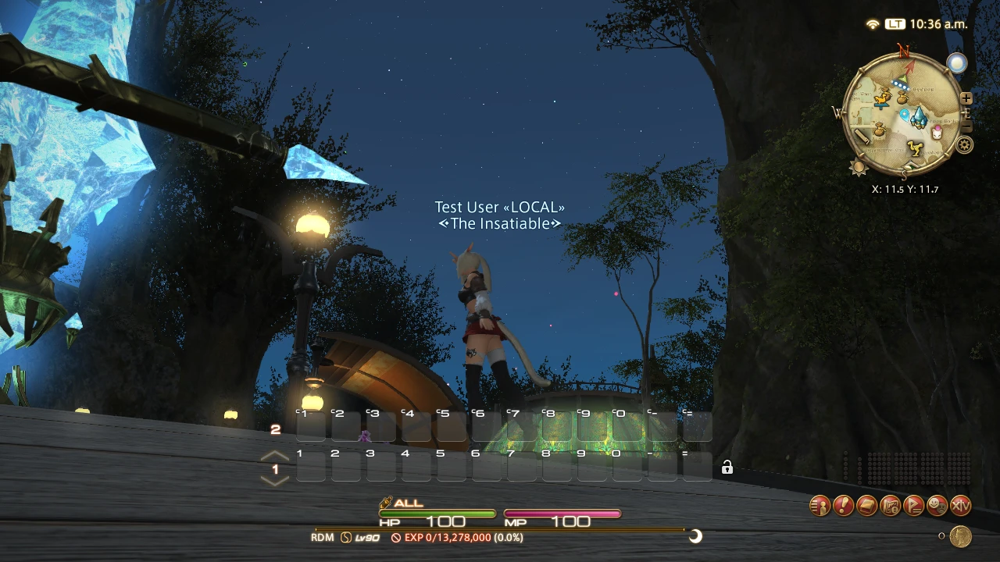
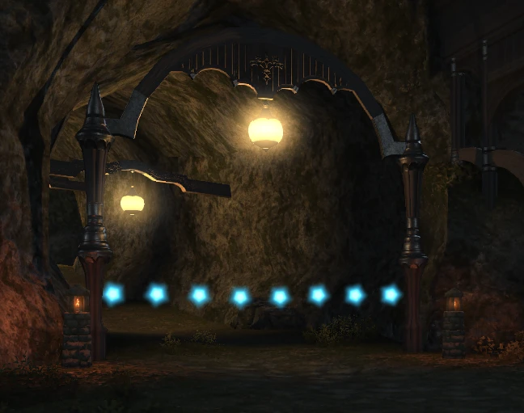
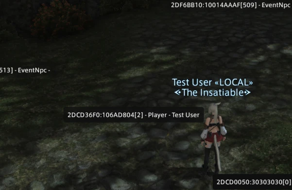
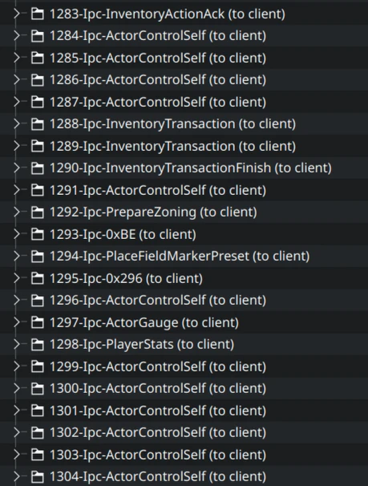
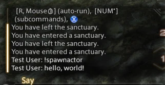

Not as big as the last update, but I implemented a few smaller fixes and finished another game feature.

# Weather

In the last update, the lighting looked bad when loading into a zone. This was because I set it to an invalid weather ID. Now its actually sunny:

I know the weather change packets too, so I'll probably implement the weather change GM command next.

# Zone transitions

While you can go to a specific zones using commands, sometimes you just want to walk into one of these things:

These are exits, and when entered your client sends a packet detailing which exit you used (and it's position, presumably to double check which one it is?) In the zone layout data, each exit has a reference to the destination zone ID and the location to place you in. We are also given the information of which way the player should be facing too, although Kawari doesn't use this information yet. Kawari can now follow exit paths, and you can walk through them:



I had a half-finished "layer group" parser based on [Lumina's](https://github.com/NotAdam/Lumina) in [Physis](https://github.com/redstrate/physis) already, so it took some polishing to get it into a state that could read these exit boxes. I'm glad that this information exists in the client game data to recreate this. I think the next step for navigation is Aetherytes or ferries.

# (No) actor spawning

I didn't get this to work yet, and I'm a little befuddled as to why. I send a "Player Spawn" packet, and the client _receives it_, _spawns the actor_ and then proceeds to make them invisible?!?![^1]

In the meantime I'll move onto spawning NPCs/objects and see if I have more luck there. If you have any ideas why the client would refuse to show players, I would like to hear them. My two current theories are:

* There's a specific state (that I'm accidentally setting) where the player is in a public instance, but the client can be told not to show players. But this doesn't make much sense, as the server can just hold off on sending spawn packets.
* There is something I forgot to send before/after spawning another player, and the client is waiting for that before showing them. I doubt this too, because they appear fine when forcefully showing them.

# Packet names

When going through my packet captures, I manually typed what each IPC opcode meant as I went along. But this was slow, time-consuming - you get the point. So I added a feature to [cfcap-expand](https://github.com/redstrate/XIVPacketTools) that takes an opcode.json and uses an  name for an IPC opcode if available.

The format is intentionally similar to the one used by [FFXIVOpCodes](https://github.com/karashiiro/FFXIVOpcodes) and other projects, there is documentation in the README on how to create one.

# Chat messages

I noticed recently that the player name now shows up in the chat log. I believe this is was a side-effect of some unrelated packet fixes I was doing.

# Refactoring

As the servers are growing more complex, there was several problems creeping up:
* Defining all of the packet parsing in one or two files was unwieldly. I started moving larger IPC structs into their own files, but it wasn't enough.
* IPC opcodes are separated, and are unique for both client & server, zone & lobby. But I put them all in _one_ enum which has started causing problems. For example, the "initialize chat" and "lobby error" packets share the same opcode.
* Related to the previous issue, it wasn't very clear what opcodes are sent by the server and which ones are sent by the client. I couldn't rely on the type system to check if I was accidentally sending a client packet from the server.

So I spent quite a bit of time refactoring my IPC code, and it also takes better advantage of Rust's type system. It didn't change anything functionally, but I'm glad I repaid this technical debt.

[^1]: On the client side, I see that the DrawObject's flags are set to something meaning invisible. If I forcefully make them visible, they show up correctly (albiet without a nameplate, because that's controlled by some other GameObject flag.)
