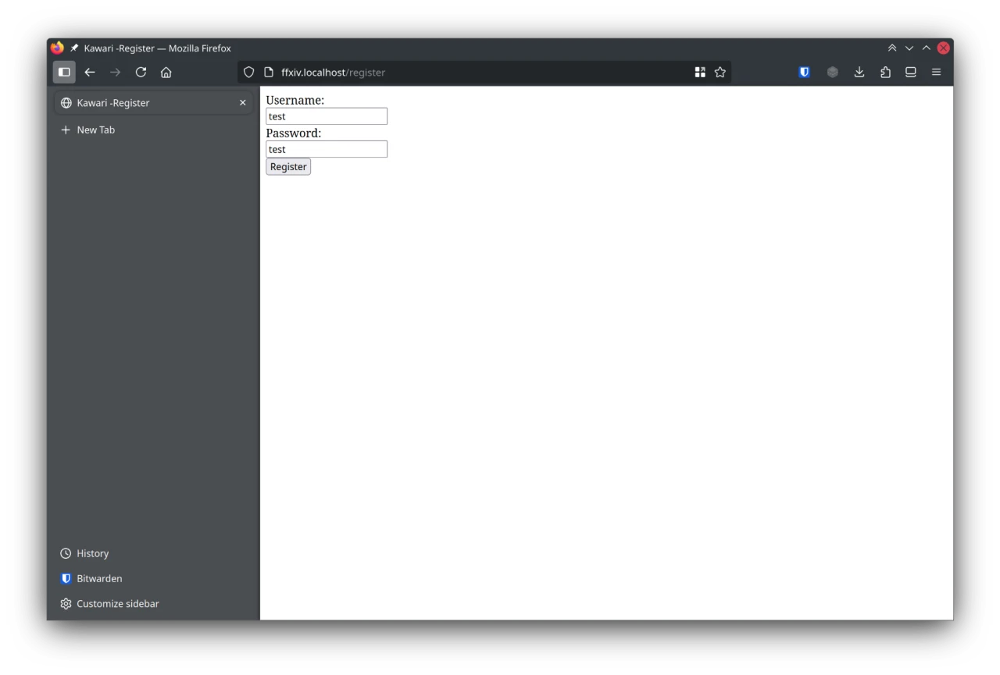
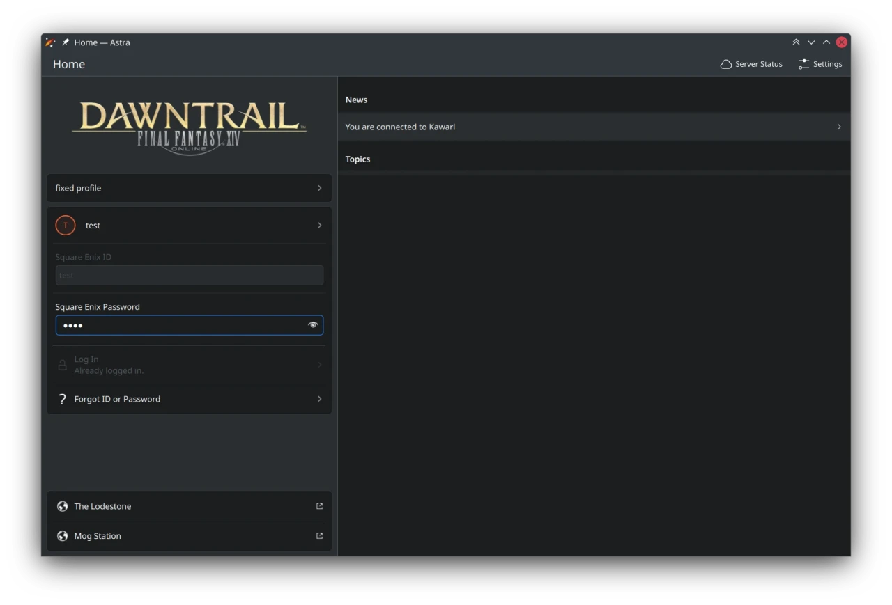
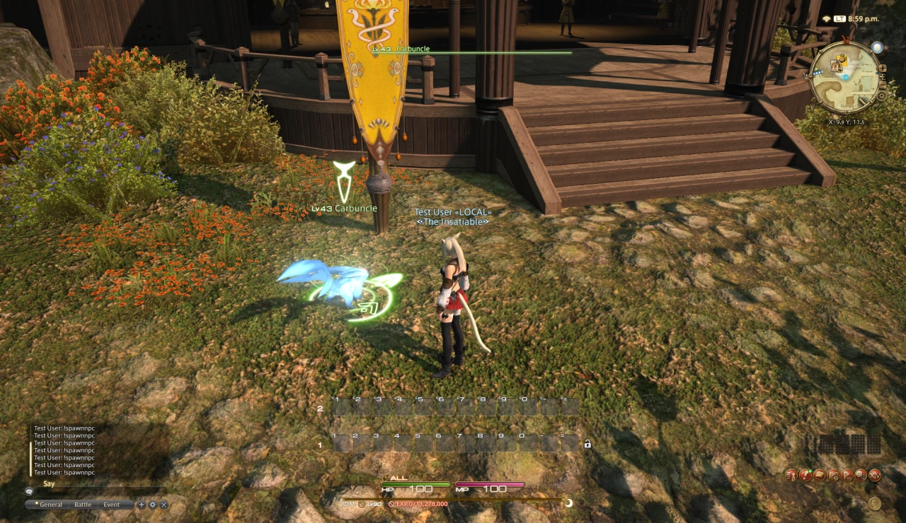
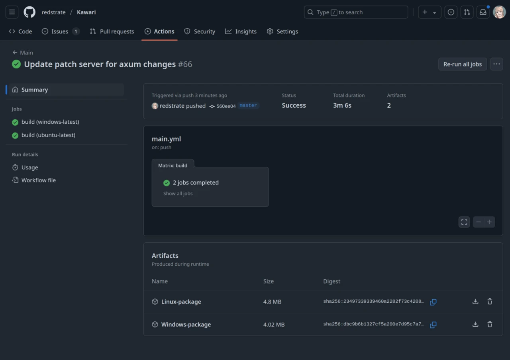
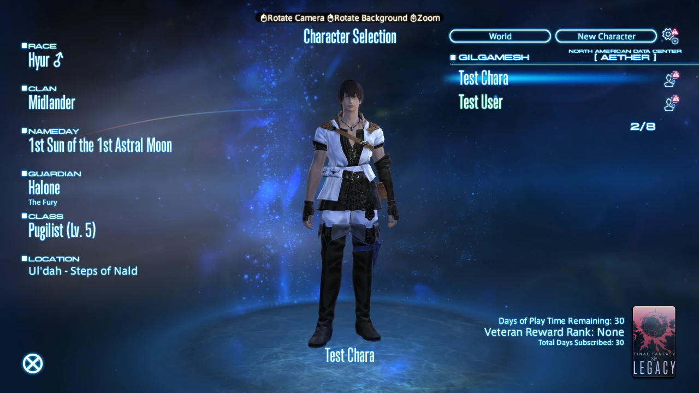

This is a pretty big update that includes actual logins, character management, pre-built binaries and more!

# Login

Kawari previously ignored any login information you entered, and just gave you a random session id. Now there's a "real" login database, and it's checked before logging you in. I made several guesses about the behavior of the retail server that I plan on following up eventually, but it's not a high priority.

It shouldn't be any surprise that this database is extremely insecure, and stores passwords in plaintext - among other security nightmares.

# Weather changing

I added support for sending weather changes to clients, which was an easy 8-byte packet. To make this more useful, I also added the `//gm weather <id>` command.

# NPC spawning

Like I said in the last update, I had a lot of trouble spawning players (and still do.) I had wanted to try spawning NPCs next, and have now successfully done so!

I haven't yet figured out which byte controls their aggression, so they're still friendly. But now the world can feel a little less lonely. I think a cool neat thing would be spawning proper, aggressive battle NPCs that you can fight.

# Actor control

The client & server have this one packet they like to exchange with each other, that controls a *ton* of stuff about actors (Players, NPCs, etc.) This includes animations, poses, death, all kinds of interesting things.

Thanks to a goldmine called [ffxiv_reverse](https://github.com/awgil/ffxiv_reverse), I now have more control categories than I know what to do with. One I noticed in packet dissecting and confirmed via ffxiv_reverse is the `ZoneIn` actor control - which presumably - does the fade-in effect when spawns through a door. It didn't have an effect on the invisible spawned player though. I'll keep trying!

# Actions

Previously in Kawari if you tried to trigger any action, it would crash the server. Now it will gladly eat up your action request, and give you sprint buffs (even if you weren't trying to use sprint!)

(I had tried to record a picture/video of this, but the World server crashes shortly after performing any action at the moment.)

# Artifacts

One of the hurdles with using Kawari was the lack of pre-built binaries. Even though I think the project is relatively easy to build, it shouldn't be a requirement.

So now there's Windows and Linux binaries built for every commit, and they are available via [GitHub Actions](https://github.com/redstrate/Kawari/actions). This requires a GitHub account to download unfortunately, but I plan on uploading them to my webserver to lift that requirement. (You still need to accept the Unreal Engine EULA and acquire Oodle yourself before the World server can be used.)

# Characters

Instead of the one hard-coded character seen in previous updates, the lobby screen is now semi-functional:

This means when you create a new character, it's actually saved to the World server (and you can login with them.) You can also delete characters too, but that's about as much character management I had implemented so far. This wasn't too difficult, but it involved untying various systems that needed to be given dynamic values from the database. I also spent a bit of time creating custom packets for the Lobby and World server to talk to each other, because they are separate processes[^1].

You're also put into the correct starting zone depending on your chosen class, and your character's City-State is also set accordingly. There's no separation based on your service account yet, because of a lack of Lobby <-> Login server communication. That's what I'm going to be working on next though, to pave the way for basic multiplayer.

# Configuration changes

The configuration file is now in YAML, and you can now change the listen address & ports of the various servers. You can also change the world id, it's no longer hard-coded.

[^1]: And technically, could be sitting on different physical servers with a separate IP address.
