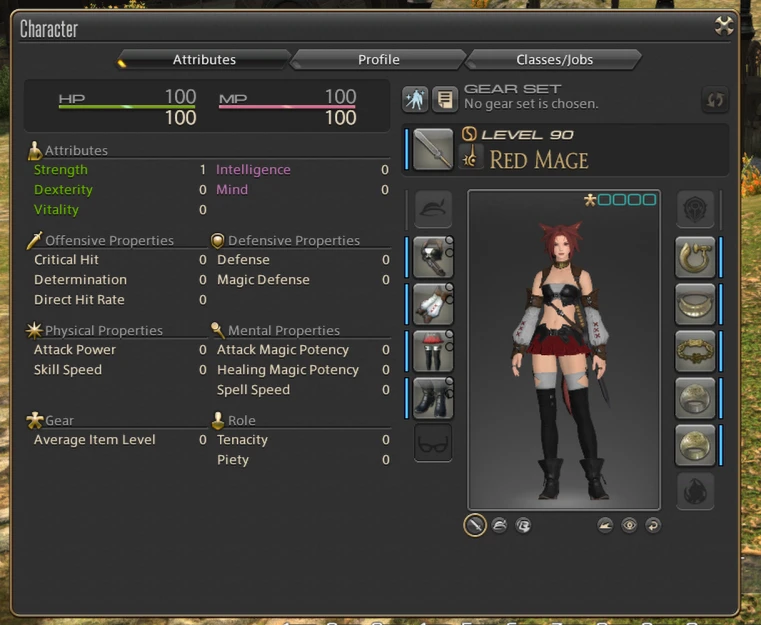
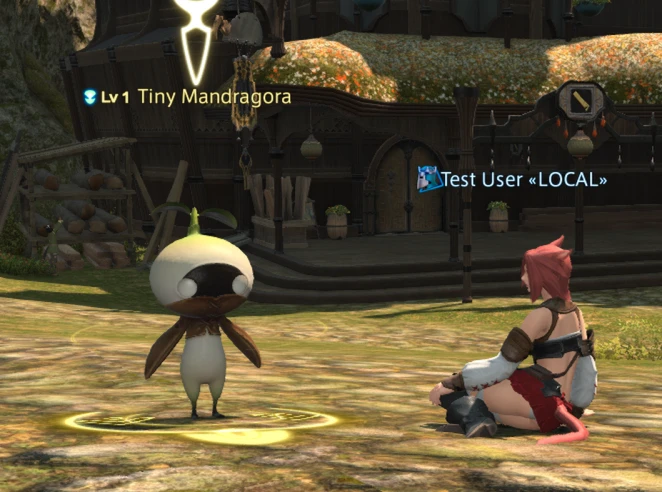

The 7.2 patch released earlier this week, and I'm happy to report that Kawari survived it's first major patch release! Unfortunately that means most of my time is spent fixing what's broken, so there's not that many new things.

# Patch 7.2

So a new major patch dropped, and this was perfect - I wanted to see how easy it would be to actually update Kawari. Thankfully, pretty easy!

The biggest thing was opcodes, but I took the majority from [FFXIVOpcodes](https://github.com/karashiiro/FFXIVOpcodes) and the rest are gathered from my own dissection. Some structs have changed a bit such as `PlayerSpawn`/`CommonSpawn` but it wasn't too hard to restore those. Having unit tests for structures _really_ helped here and sped up the process significantly.

There was a bit of a scare when SqEx "fixed" the account id dilemma in 7.2. Their solution apparently: obsfucate packet data when sent to the client. For some reason, the obsfucation is optional as it's up to the server's discretion. So while Kawari is safe for now, I made [an issue](https://github.com/redstrate/Kawari/issues/9) to look into implementing the obsfucation ourselves. If you have any idea where the deobsfucation function is, even that alone would be super helpful!

(If you're wondering how people are working around the obsfucation, they just hook into a client function that has a pointer to the packet data _after_ it's been deobsfucated. So much for that "security"...)

# Easier opcodes

A self-made problem I noticed is that it was a pain to update the opcodes themselves. So I moved all of the volatile opcode data into [opcodes.json](https://github.com/redstrate/Kawari/blob/master/resources/opcodes.json) that generates a Rust file at build-time. This is also useful to feed back into `cfcap-expand`, ensuring that the opcodes from packet captures line up with what Kawari uses.

# Inventory

I have begun implementing the inventory system, beginning with currently equipped items. These packets aren't as scary as I thought they'd be, but maybe my tune will change once I start tackling inventory actions.

Your equipped items aren't actually reflected on your character yet, and your initial starting weapon doesn't match your chosen class yet either.

# Enemies

Like I alluded to in the last post, I figured out enough of these NPC spawn packets to recreate a Tiny Mandragora:

I know the packets to move them, and I have a capture of a character fighting them so... I think we're close to being able to fight it! Something interesting is that the game server sends you NPC names in Japanese, despite the name being loaded client-side. Maybe there is custom named NPCs somewheres?

# Patch server

In preparation for 7.2, I added several features to the patch server. The most important one is version checking. Now Kawari has a specific hardcoded game version it's pinned to, and will reject clients that are newer. This is mainly to stop users from accidentally using the wrong version and thinking Kawari is broken[^1].

# Contributing guide

Info for my own records (but maybe useful for other contributors) is now recorded in a [CONTRIBUTNG](https://github.com/redstrate/Kawari/blob/master/CONTRIBUTING.md) file. This includes how to capture game packets, the general process of upgrading to the newest patch and more.

[^1]: I should also reject clients below the set version, but I think that's the rarer case. The eventual goal is to serve patch files (from your own sources) up to the desired version anyway.
