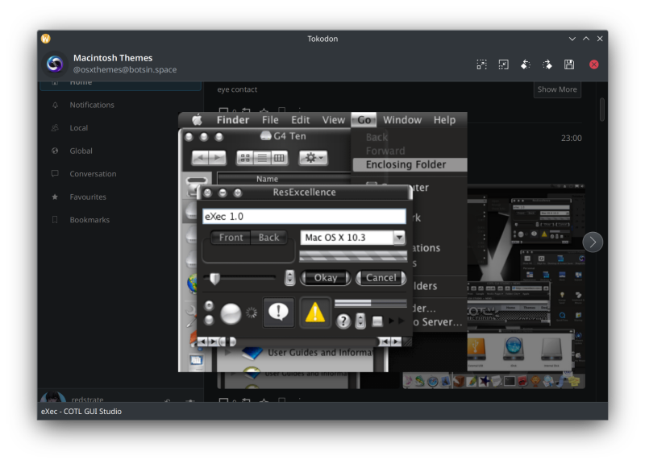
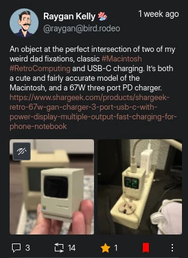
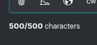
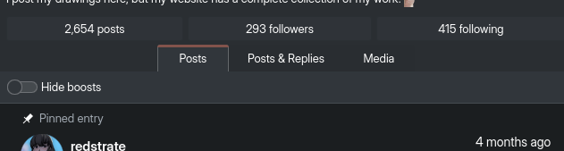
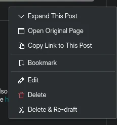
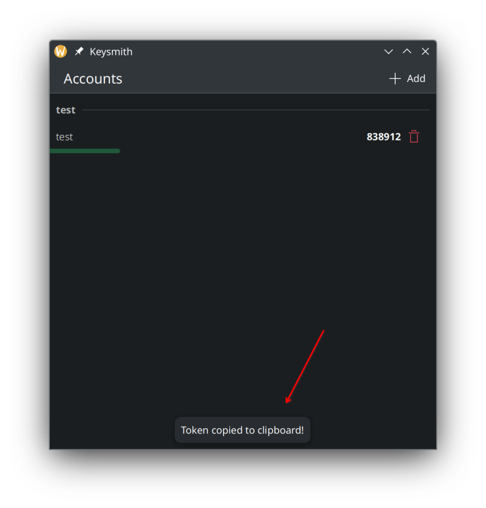
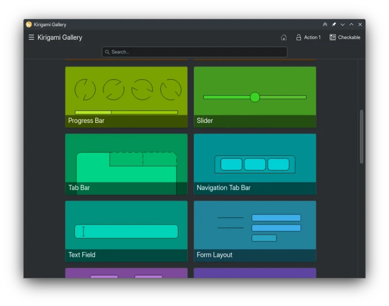

Here's my KDE contributions for this month! It's a little bit shorter than I'd like, but I'm still trying to find a nice balance between **$work** and KDE.

## Extra CMake Modules

I put up MRs for a bunch of small fixes related to the QML module:
* Plugin initialization files [didn't contain a target name, so they were always named `_init.cpp`](https://invent.kde.org/frameworks/extra-cmake-modules/-/merge_requests/346).
* Private QML sources are [now marked as internal in the generated qmldir](https://invent.kde.org/frameworks/extra-cmake-modules/-/merge_requests/348).
* Overhaul static plugin initialization, [to prevent the linker from possibly throwing away important plugin init symbols](https://invent.kde.org/frameworks/extra-cmake-modules/-/merge_requests/347).

These haven't been merged yet though, I still need to clean them up and give them some polish next month.

## Dr. Konqi

I didn't work on the new UI this month unfortunately, but I did submit two MRs:
* [Don't ignore quality unless explicitly requested by the environment variable](https://invent.kde.org/plasma/drkonqi/-/merge_requests/101).
* [Start loading backtraces immediately as Dr. Konqi opens](https://invent.kde.org/plasma/drkonqi/-/merge_requests/100).

Just like ECM this will be in my queue to merge these next month!

## Krita.org

I finally [merged the improved dark mode I started a while ago](https://invent.kde.org/websites/krita-org/-/merge_requests/18), for the new Krita.org website! Thanks to everyone, especially Phu and Scott for being patient with me. I can't wait to see this live soon :-)

## Tokdoon

I added [support for the new Maximize component](https://invent.kde.org/network/tokodon/-/merge_requests/200), which doesn't change anything functionality-wise but makes our code leaner:

I also [pushed along the MR to use the SearchPopupField component](https://invent.kde.org/network/tokodon/-/merge_requests/144) from Kirigami Add-ons too, which is another change that doesn't change anything functionally but will make the code much leaner.

[Interaction icons were overhauled, not just visually but also their layout has improved](https://invent.kde.org/network/tokodon/-/merge_requests/211). Below is a screenshot of a mobile sized window, where the icons now spread out which will make them easier to tap (I plan on increasing the size on mobile too!)

The [amount of characters you have left is now shown in the composer](https://invent.kde.org/network/tokodon/-/merge_requests/212), which should load from your server (I don't have anything but a 500-char limit to test with though):

It's not merged yet, but I'm adding [overhauling how you view posts on profile pages](https://invent.kde.org/network/tokodon/-/merge_requests/214)! It has the usual separation of _"Posts"_, _"Replies"_ and _"Media"_ tabs but you can hide boosts too:

As a cherry on top, [I added icons to some of the menus](https://invent.kde.org/network/tokodon/-/merge_requests/217) which makes them easier to quickly navigate:

Some more minor changes:
* Squashed [another binding loop](https://invent.kde.org/network/tokodon/-/merge_requests/206).
* Added [labels for replies](https://invent.kde.org/network/tokodon/-/merge_requests/215) so it's clearer especially when there's no @ mention.
* Only show statistics [on the selected post in a thread instead of all of them](https://invent.kde.org/network/tokodon/-/merge_requests/213) (if you don't have detailed stats enabled).

## Keysmith

I did some touching up work for Keysmith late this month: I fixed [a bunch of binding loops](https://invent.kde.org/utilities/keysmith/-/merge_requests/112), and added better keyboard navigation. I also [added a passive notification when you copy the code to your clipboard](https://invent.kde.org/utilities/keysmith/-/merge_requests/113) too:

There doesn't appear to be an active maintainer, so I'll get another reviewer and merge them next month. I also cleaned up some duplicate bugs, and moved some spam off of the tracker.

## Kirigami

While debugging Tokodon, I fixed [a rare case where a Kirigami application using our QQC2 Desktop style could crash](https://invent.kde.org/frameworks/qqc2-desktop-style/-/merge_requests/244) when closing. This same "fix" could apply to Breeze style too, it warrants further investigation :-)

I realized that NavigationTabBar doesn't have it's own page on the gallery, so I [proposed a new one in Kirigami gallery](https://invent.kde.org/sdk/kirigami-gallery/-/merge_requests/42):

I'm still looking for people who might know why [PlaceholderMessage fails handling overflow, which creates some recursive rearranges](https://invent.kde.org/frameworks/kirigami/-/merge_requests/1034). It might be a Qt upstream issue, so it's another thing to investigate soon!
