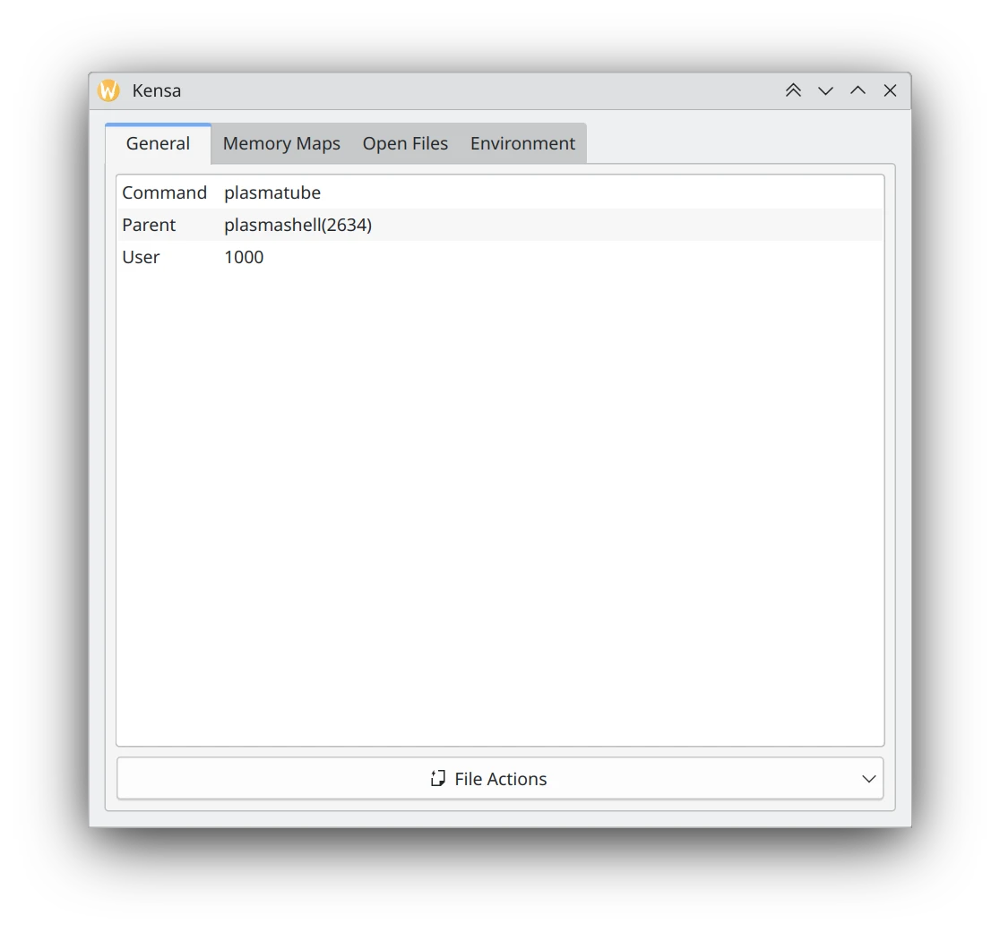
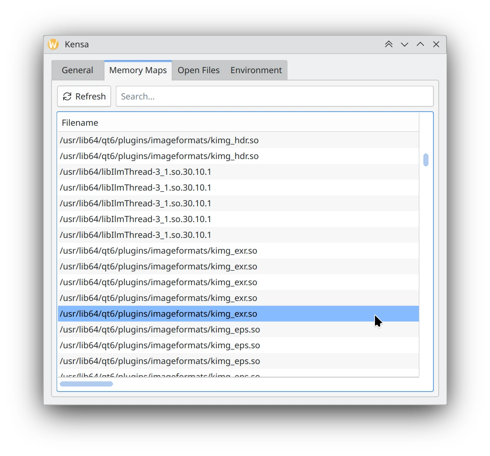
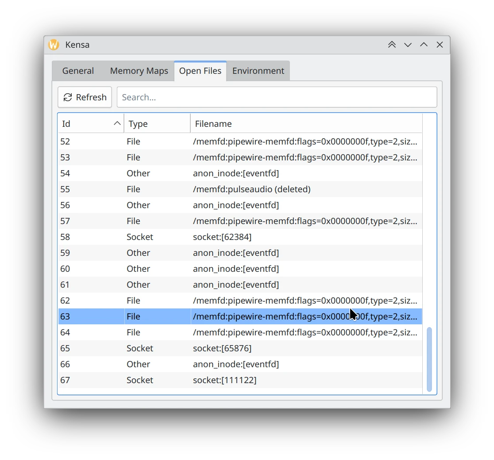
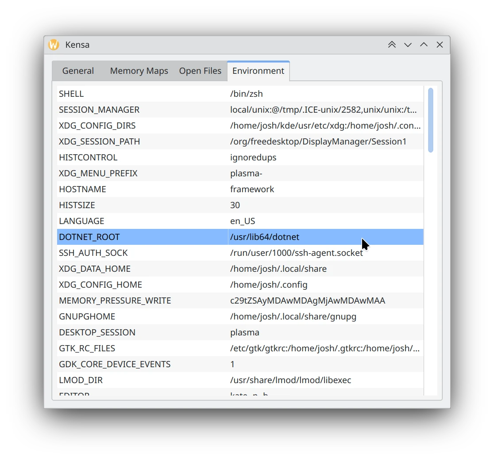
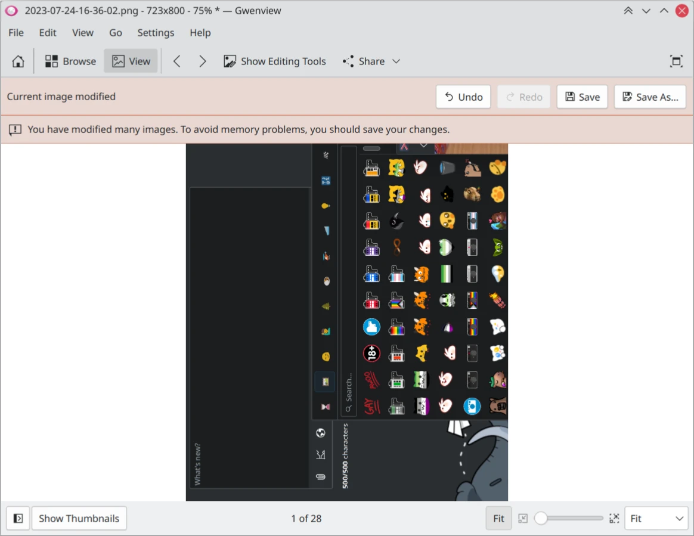

Hello and sorry about the late post. I've been busy moving and other stuff that's gotten in the way. I will also be idling the beginning of this month, so the next update may be shorter too.

Anyway, let's get into the changes!

# Kensa

I originally wanted to bring some of the "power-user" features from KSysGuard into the new System Monitor. I was rightfully turned down because they were hesitant of there being any use for most people and to prevent feature creep.

They suggested creating a seperate application instead. So [Kensa, the detailed process viewer](https://invent.kde.org/redstrate/kensa) is born! It's still mostly copy & pasted from old KSysGuard/libksysguard code, but updated for Qt6/KF6. And to make it clear, It's very clearly modeled after the Window's Process Explorer.

I have the general tab for viewing some basic information about the process. Said tab also includes an "Open With" so you can quickly open the executable in a hex viewer like Okteta.

The memory maps tab shows what the process has mapped, mostly notably which shared libraries it's currently using.

The open files tab makes it's return as well, extremely useful.

And one of my own design, an environment variables tab. In the future I want to add a "Strings" tab for quickly viewing the executable strings and the ones currently in memory.

Note that Kensa is very early in development and not user-friendly. You currently have it give it a PID manually and lacks a process list.

# Tokodon

 The window title [now corresponds to the current page](https://invent.kde.org/network/tokodon/-/merge_requests/485). This makes it easier to identify from a task bar, too. We know the title is duplicated inside the application as well (on desktop), but that's Kirigami's design decision. 

 If your server doesn't provide a human-readable error message, [the network error is displayed instead](https://invent.kde.org/network/tokodon/-/merge_requests/487). This is useful to see if the DNS lookup failed or some other network-related reason the server is inaccessible. 

 Support for [QtMultimedia](https://invent.kde.org/network/tokodon/-/merge_requests/488) has been added in situations where your system lacks or cannot use libmpv. This is preparatory work for a Windows version. 

 In the same vein as the patch above, [QtWebView is now optional](https://invent.kde.org/network/tokodon/-/merge_requests/489) and I included even more authentication fixes. Previously I enforced an in-app web view to facilitate authentication (compared to the external web browser method or auth code in previous versions.) This was only a stop-gap solution until I had more time to flesh out our authentication system, but now I feel much happier about it's current state. 

# System Monitor

 Fix the [column configuration dialog being shown too small on the Overview page](https://invent.kde.org/plasma/plasma-systemmonitor/-/merge_requests/280). 

 Add [the About KDE page to the hamburger menu](https://invent.kde.org/plasma/plasma-systemmonitor/-/merge_requests/276). 

 Made sure [cell tooltips shows up more reliably](https://invent.kde.org/plasma/plasma-systemmonitor/-/merge_requests/282). 

 Added a menu item to [copy the current column's text](https://invent.kde.org/plasma/plasma-systemmonitor/-/merge_requests/278). This makes System Monitor just as usable as the old KSysGuard for me now, because I tend to copy the command line a lot. (And PIDs.) 

# Ruqola

 Use a better fitting icon [for attaching files](https://invent.kde.org/network/ruqola/-/merge_requests/143). The previous icon - when viewed at 16px - turned into something completely different. 

# PlasmaTube

 Added support for viewing [a channel's playlists](https://invent.kde.org/multimedia/plasmatube/-/merge_requests/78). 

 I also added a [Craft blueprint for Android](https://invent.kde.org/packaging/craft-blueprints-kde/-/merge_requests/731). Note that this is only preliminary and the Android version is nowhere near ready yet. I guess this could be used for a future Windows version too.

 I implemented more functionality in the PeerTube backend, so now it's possible to log in and perform searching. Subscriptions work too, but I'm running [into an issue](https://invent.kde.org/multimedia/plasmatube/-/issues/40) where yt-dlp fails to pull certain videos. If you know anything about using yt-dlp with PeerTube, please let me know if there's a workaround. 

 Added a new [feature to import/export OPML subscriptions](https://invent.kde.org/multimedia/plasmatube/-/commit/8944e990d6ef2641ec1771d67883bf1211266c8c). This only works for YouTube channels at the moment, PeerTube support TBA. 

# Gwenview

 I changed the old save bar to [use the standard KMessageWidget widget](https://invent.kde.org/graphics/gwenview/-/merge_requests/265). This isn't just for looks, it fixes a lot of odd visual bugs and removes a ton of cruft in the process. 

# NeoChat

 Fixed the [share dialog not appearing properly, and improve the keyboard navigation](https://invent.kde.org/network/neochat/-/merge_requests/1674) inside of it. 

# Frameworks

 Remove [some redundant QML_ELEMENT declarations](https://invent.kde.org/frameworks/kdeclarative/-/merge_requests/234) which in turn reduces runtime warnings. 

 Two KMessageWidget improvements, by [fixing handling of color palette changes](https://invent.kde.org/frameworks/kwidgetsaddons/-/merge_requests/242) and [making the icon label vertically centered](https://invent.kde.org/frameworks/kwidgetsaddons/-/merge_requests/243). This is for that Gwenview patch. 

# Android

I once again sat down and fixed a ton of build and runtime issues for our Android applications, and started fixing some of the Qt 6.7 fallout. NeoChat and Tokodon build and run again, and spent some time ironing out their issues.

---

That's all this month!



