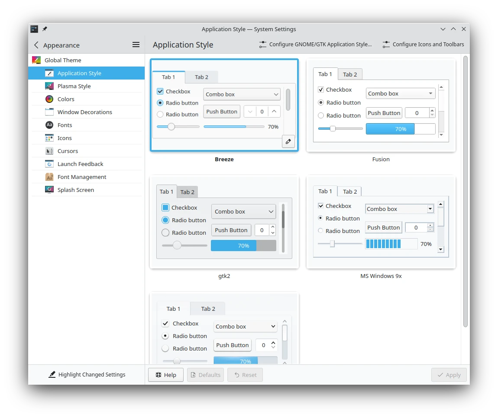
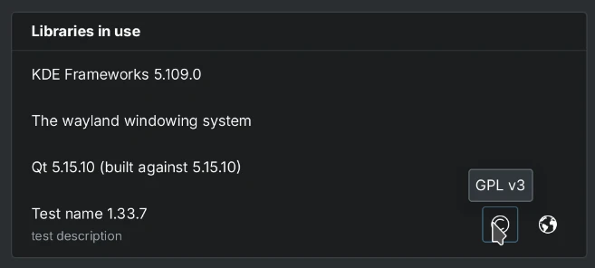
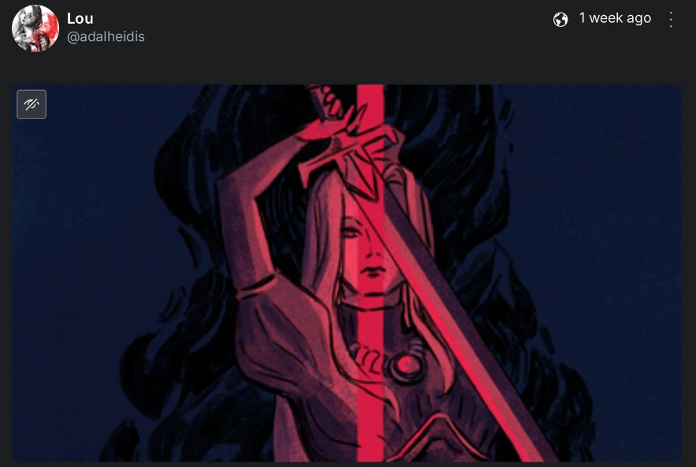
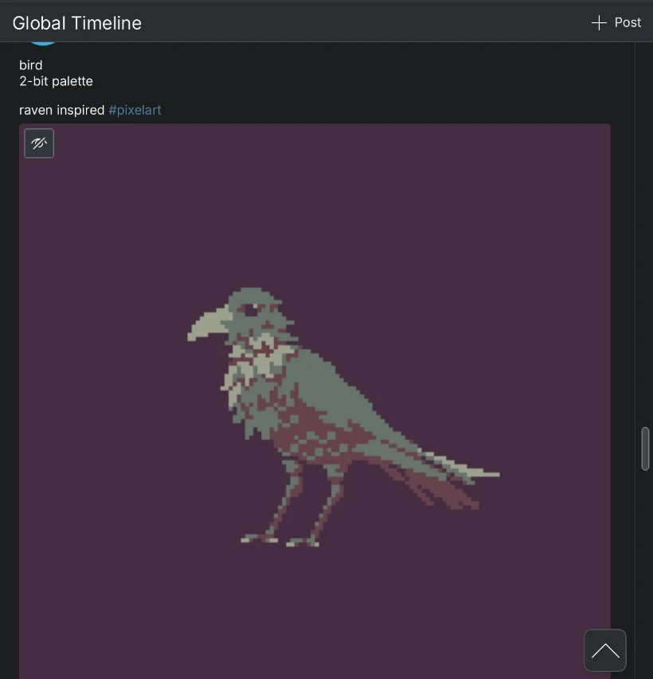
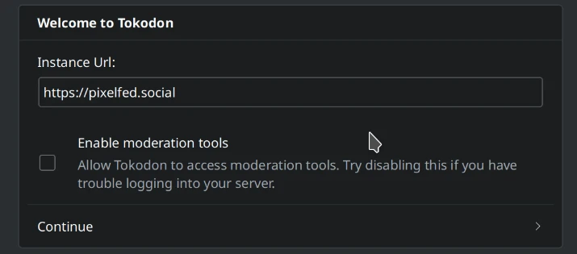
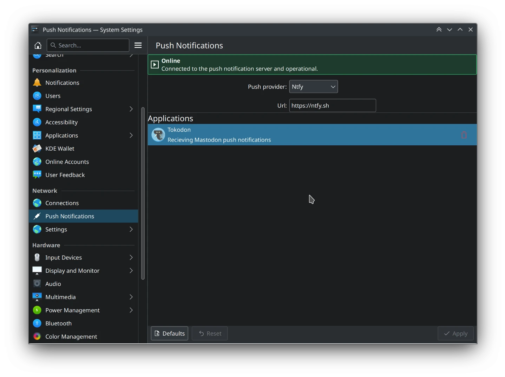
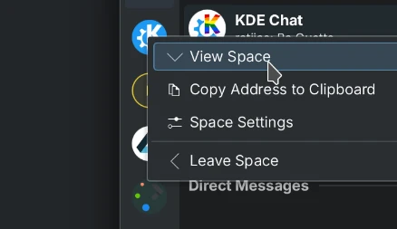
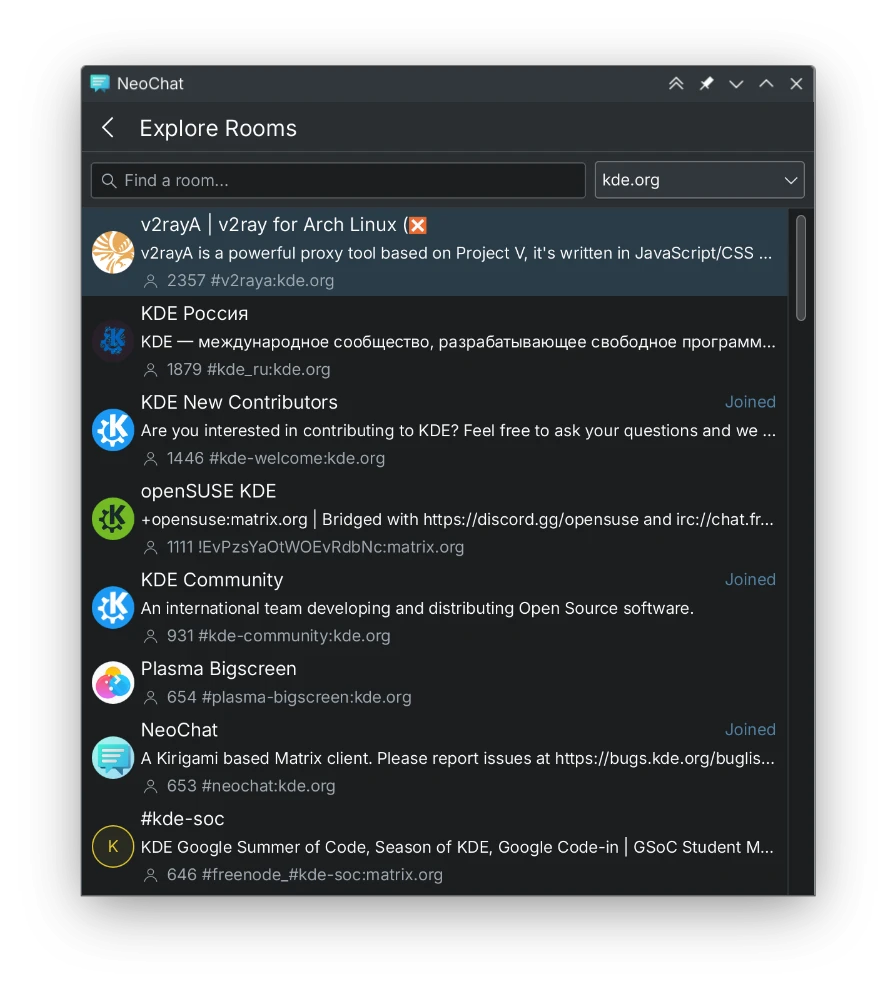
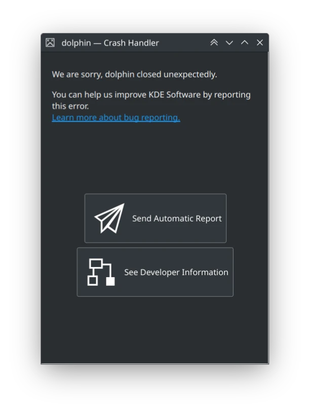

I'm posting this a little bit earlier this month, because I'll be busy until next week and won't have a chance to finish anything. I have a lot of new features to show, and important documentation work to showcase!

# Plasma

More KCMs [have their footer actions moved to the header](https://invent.kde.org/plasma/plasma-workspace/-/merge_requests/1391), such as Application Style:

# Kirigami

The Kirigami Add-ons AboutPage should be nicer to use for non-KDE projects, [and stops them from opening up the _QML file itself_ in your default text editor](https://invent.kde.org/libraries/kirigami-addons/-/merge_requests/126) when you click on certain links.

Components in AboutPage [now have support for viewing their licenses and webpage](https://invent.kde.org/libraries/kirigami-addons/-/merge_requests/132)!

Kirigami's FlexColumn now [respects the spacing parameter, allowing applications that use it to use Kirigami units](https://invent.kde.org/frameworks/kirigami/-/merge_requests/1205).

MobileForm/FormCard's SpinBox and TextField delegates [now use the disabled color when needed in it's labels](https://invent.kde.org/libraries/kirigami-addons/-/merge_requests/139).

MobileForm/FormCard's separator [now hides when navigating it via keyboard](https://invent.kde.org/libraries/kirigami-addons/-/merge_requests/140).

Kirigami Add-ons is [now REUSE compliant](https://invent.kde.org/libraries/kirigami-addons/-/merge_requests/142).

# Tokodon

I added support for [focal points in media attachments](https://invent.kde.org/network/tokodon/-/merge_requests/318)! This means that media won't be centered carelessly, but will be cropped to the author's wishes. This feature will appear in 23.12.

You can set the focal points in Tokodon as well! I really needed this feature because I post art on Mastodon, and had to use Mastodon Web because that was the only place I could set focal points.



I added a new floating button on the timeline [to scroll back to the beginning](https://invent.kde.org/network/tokodon/-/merge_requests/323). This feature will appear in 23.12.

Now you can [now share to the Fediverse via Tokodon](https://invent.kde.org/network/tokodon/-/merge_requests/324)! Right now it only supports URLs, but this can be expanded in the future. This feature will appear in 23.12.



When it comes to media in posts, it should be much easier to add them. Now [you can drop or paste them into the composer](https://invent.kde.org/network/tokodon/-/merge_requests/325)! This feature will appear in 23.12.

Account and hashtag links in profile descriptions [should now open inside of Tokodon](https://invent.kde.org/network/tokodon/-/merge_requests/327). This feature will appear in 23.12.

Do you use Pleroma or Akkoma? If you found the experience a bit lacking in Tokodon, it should now be a [whole lot better](https://invent.kde.org/network/tokodon/-/merge_requests/329). The language selector should no longer disappear, and the correct maximum character count is fetched. The local visibility option and custom poll limits are supported now too! Everything but the local visibility option will appear in 23.08.

There's now an option [to disable Tokodon asking for the admin scope](https://invent.kde.org/network/tokodon/-/merge_requests/330) when logging in. This is useful for admins who don't feel safe with giving Tokodon permissions, or if your server (like Pixelfed) does not correctly handle it when logging in. This will appear in 23.12.

For the cherry on top, the post margins [should now look much, much better](https://invent.kde.org/network/tokodon/-/merge_requests/341). This will show up in 23.12.

## Bug Squashing

Sometimes I wonder if it's worth describing each bug I fix, but I think it's important to make it known that we're fixing our old features too. Most of these apply to 23.08 as well:

* The instance name [should now be correctly shown in the account switcher](https://invent.kde.org/network/tokodon/-/merge_requests/328).
* The avatars used in notifications [should look nicer, and more resilient to weirdly shaped avatars](https://invent.kde.org/network/tokodon/-/merge_requests/338).
* Interacting with a post [no longer causes it to reload](https://invent.kde.org/network/tokodon/-/merge_requests/339), which is annoying if you're playing a video.
* [Extra slashes are no longer included in API urls](https://invent.kde.org/network/tokodon/-/merge_requests/340), which was causing some odd issues like WebSockets to not function. We use WebSockets to automatically refresh the timeline, among other things.
* [Stop UserInfo from reading from the pageStack before adding has been added](https://invent.kde.org/network/tokodon/-/merge_requests/334).
* Modify the placeholder text on the Explore page slightly, so [it discerns from trending posts and tags](https://invent.kde.org/network/tokodon/-/merge_requests/334).
* [The account card in settings now has an arrow](https://invent.kde.org/network/tokodon/-/merge_requests/334), so it's more obvious that it's a button you can press to edit account information.
* [The display name is now shown in HTML (so custom emojis are rendered) in the profile editor](https://invent.kde.org/network/tokodon/-/merge_requests/334).
* [The icons for the banner/avatar uploads are now upload icons, and not download ones](https://invent.kde.org/network/tokodon/-/merge_requests/334). This makes a little bit more sense now 😆
* When more than one account is available, and it's name shows up on the main timeline - [it now uses the same display name in HTML as everywhere else and not the username](https://invent.kde.org/network/tokodon/-/merge_requests/334).
* [Insert emojis at the cursor position, instead of at the end of the text](https://invent.kde.org/network/tokodon/-/merge_requests/333).
* [Adding more than one media attachment in the composer should work again](https://invent.kde.org/network/tokodon/-/merge_requests/322).

## Work In Progress

Here's a list of features I'm working on, but are not quite finished yet. The first is **Cross-account actions!** This means you can interact with a post from another account, without the hassle of searching for it again and losing your place on the timeline.



Ever wanted to still receive notifications, even though Tokodon is closed? Say hello to **Push Notifications!** (powered by [KUnifiedPush](https://api.kde.org/kunifiedpush/html/index.html). There's also going to be more granular notification settings, and the ability to turn off all notifications for an account.

You can check out the [work-in-progress MR here](https://invent.kde.org/network/tokodon/-/merge_requests/350) but it's still a little finicky to set up.

# NeoChat

When you paste an image that contains a URL and a bitmap, [NeoChat won't still put the URL in the textbox as well](https://invent.kde.org/network/neochat/-/merge_requests/1134).

The space drawer context menu [should behave and look a little bit nicer now, with icons](https://invent.kde.org/network/neochat/-/merge_requests/1142)!

The avatar used in notifications [should be more resilient, including transparent and weirdly shaped avatars](https://invent.kde.org/network/neochat/-/merge_requests/1143
).

The [attachment chooser dialog should now be functional again](https://invent.kde.org/network/neochat/-/merge_requests/1147), the one that asks if you want to "Paste from Clipboard" or "Choose Local File".

The room and user completion menu [should no longer show invalid entries](https://invent.kde.org/network/neochat/-/merge_requests/1147), such as rooms that have no canonical aliases (so you couldn't link them anyway!)

The ["Explore Rooms" page now looks nicer, and also functions better](https://invent.kde.org/network/neochat/-/merge_requests/1149). It should be clearer when it's still loading or there's actually no rooms.

[Image attachments are now resized](https://invent.kde.org/network/neochat/-/merge_requests/1150), improving memory usage and smoothing. In my testing, a 4K image (that didn't have a thumbnail) now takes up ~30 MB less memory.

More about images, NeoChat will soon [have support for sending blurhashes](https://invent.kde.org/network/neochat/-/merge_requests/1151), which improves the loading experience for clients that support it. Blurhash generation should be faster as well.

And of course, [logging out](https://invent.kde.org/network/neochat/-/merge_requests/1153) shouldn't crash NeoChat anymore.

# Dr. Konqi

I made the [save report dialog a little clearer, and it now defaults to your home folder](https://invent.kde.org/plasma/drkonqi/-/merge_requests/144).

When on a mobile device, [the buttons on the main page are now laid out vertically](https://invent.kde.org/plasma/drkonqi/-/merge_requests/146).

# Discover

Fixed a [bug in the Flatpak backend where Discover could crash... when trying to log an error](https://invent.kde.org/plasma/discover/-/merge_requests/606).

# Documentation

There's an obvious documentation problem in many KDE repositories: they have **no README!** This month, I took some time to write out a basic template (with the help of Thiago, thanks!) and pushed them to some projects that desperately needed one.

If you haven't heard me soapbox about this before, READMEs are small but vital lifeline for a project. To some people (including myself), if a project doesn't have a detailed README **it feels more "dead" even if the commit history is active**. Some repositories are closely related (e.g. Breeze and Breeze Icons) but have no visible link between them on Invent - and let's be honest, it's search functionality _sucks_. To make matters more complex, some of our projects may be viewed elsewhere, like from the official GitHub mirror!

Here's some important points I try to include a README:

1. What is the purpose of this project?
2. If this is a end-user facing application, what does it look like? (Note: not everyone knows what a "Gwenview" is but might be able to recognize it from a product screenshot.)
3. If this is a complex, multi-layered and multi-component library - what is the folder called "autotests" or "kcms"? What does it contain? For some projects, this information shouldbe separated into a CONTRIBUTING document if it's too long.
4. If I want to contribute, how do I do it? And link to the community.kde.org if you can, instead of trying to maintain manual instructions. There can be exceptions.

For new developers, it's important to strike down these blockers because it may not be totally obvious to some people _what_ a "Plasma Framework" is. Or that you're not actually supposed to open a GitHub PR or a GitLab issue. It's a document you really only need to write once, update sometimes and it passively helps everyone.

And here's the KDE projects I got to so far:

* [Breeze](https://invent.kde.org/plasma/breeze/-/merge_requests/341)
* [Tokodon](https://invent.kde.org/network/tokodon/-/merge_requests/344)
* [Kirigami Add-ons](https://invent.kde.org/libraries/kirigami-addons/-/merge_requests/141)
* [Fielding](https://invent.kde.org/utilities/fielding/-/merge_requests/2)
* [Alligator](https://invent.kde.org/network/alligator/-/merge_requests/71)
* [PlasmaTube](https://invent.kde.org/multimedia/plasmatube/-/merge_requests/55)
* [Kate](https://invent.kde.org/utilities/kate/-/merge_requests/1281)
* [NeoChat](https://invent.kde.org/network/neochat/-/merge_requests/1154)
* [Dolphin](https://invent.kde.org/system/dolphin/-/merge_requests/595)
* [Gwenview](https://invent.kde.org/graphics/gwenview/-/merge_requests/216)
* [Discover](https://invent.kde.org/plasma/discover/-/merge_requests/605)

I encourage anyone reading this to look at the README for the projects you maintain (or even contribute to), and see if there's room for any improvement!

Somewhat related, some repositories were missing Bugzilla links on Invent and someone told me how to fix them:

* [Kirigami Add-ons](https://invent.kde.org/sysadmin/repo-metadata/-/merge_requests/178)
* [PlasmaTube](https://invent.kde.org/sysadmin/repo-metadata/-/merge_requests/179)
* [Fielding](https://invent.kde.org/sysadmin/repo-metadata/-/merge_requests/180)
* [Francis](https://invent.kde.org/sysadmin/repo-metadata/-/merge_requests/181)

Thanks to everyone who helped review and push these along!

# Outside of KDE

For Akkoma users, [I contributed limited support for the Mastodon Preferences API](https://akkoma.dev/AkkomaGang/akkoma/pulls/625)! This is useful for Tokodon and other clients.

I fixed a [qmlformat bug that added an extra space after target bindings](https://codereview.qt-project.org/c/qt/qtdeclarative/+/494976). I hinted at what else we need to work on before qmlformat can be adopted in KDE [here](https://invent.kde.org/teams/automation/issues/-/issues/7#note_743345).
