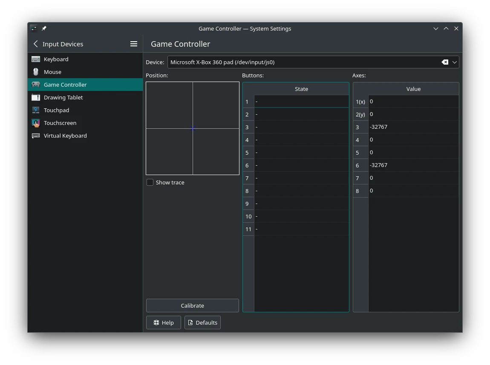
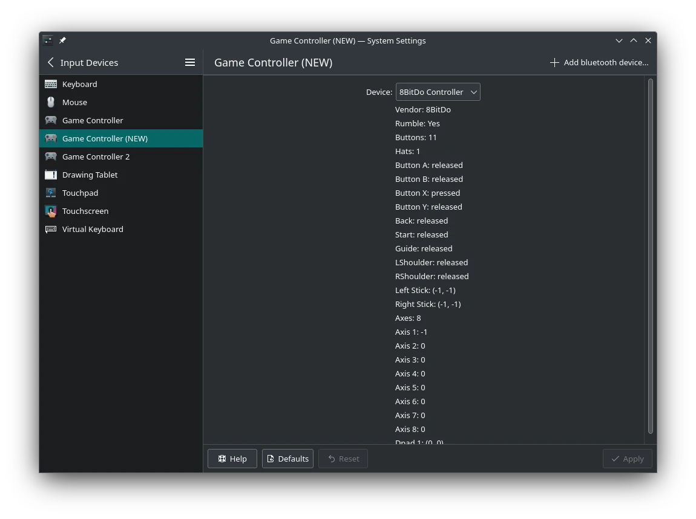
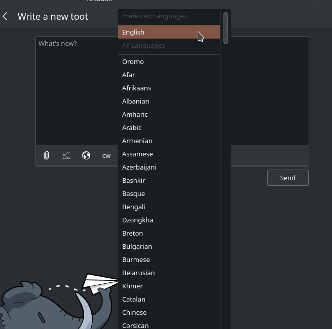
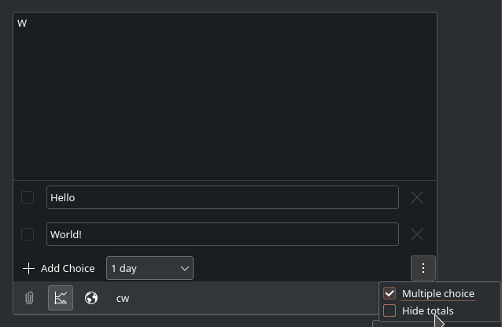
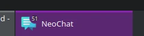
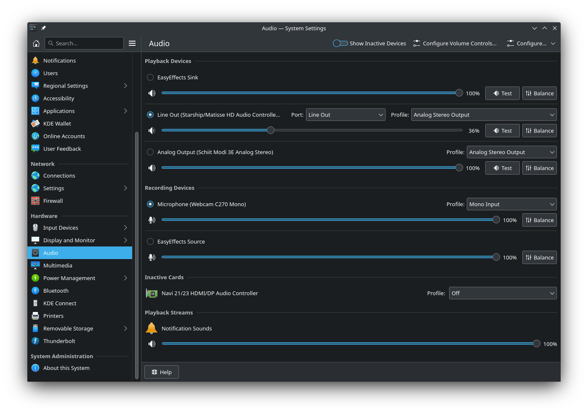
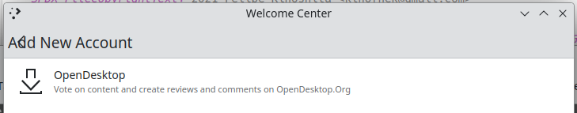
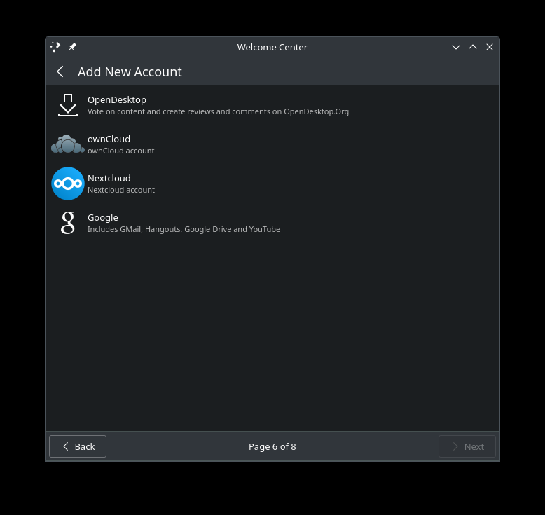
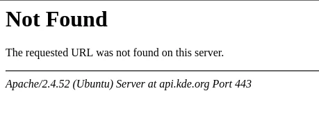
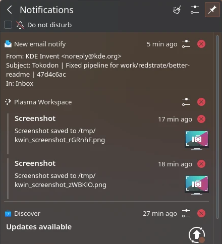

## New Gamepad KCM

The Joystick KCM is pretty bad shape right now, for numerous reasons:

* What the heck is a joystick?
* What is the purpose of this KCM if I can't even configure anything?
* Why is it telling me about device paths?
* What's up with all of the tables?

So one of my big "Plasma 6" goals is to rewrite the KCM with a few goals in mind:

* Rebrand it around "Gamepads" and "Game Controllers" instead of "Joystick". A lot of people have mentioned they didn't even know it supported regular game controllers.
* Based on modern APIs and frameworks such as Solid.
* QML-based, with clear a symbolic gamepad layout which makes it easier to test a controller. No more tables of buttons!
* Remap buttons for SDL games along with the regular calibration found in the old KCM.

I've been collaborating with [Jeremy Whiting](https://invent.kde.org/whiting) on this project, and it's been going through some technical turmoil but
it's making solid progress:

Next month hopefully we'll be able to get a proper UI working, now that mapping buttons is mostly sorted.

See my [merge request](https://invent.kde.org/plasma/plasma-desktop/-/merge_requests/1370) and Jeremy's UI [merge request](https://invent.kde.org/plasma/plasma-desktop/-/merge_requests/1379).

## Tokodon changes

I landed a bunch of features in Tokodon this month, including some much needed bugfixes for some rough edges of the project.

### Web+ap support

I landed support for the [web+ap url scheme](https://github.com/fedi-to/fedi-to.github.io/blob/main/webap.md) used to open ActivityPub objects in Tokodon! Just like matrix.to links in NeoChat, these allow linking to ActivityPub objects online. Once everything is in place, we will be one of the first clients to natively support it!

If you can't wait, it's also possible to open up regular `https` linked posts in Tokodon by passing it as an argument, if you want to hook it up somehow in your browser.

See the [merge request](https://invent.kde.org/network/tokodon/-/merge_requests/150) and the [wishlist bug](https://bugs.kde.org/464376).

### Post language support

You can now select the language you're posting in! You can't view a post's language or filter them from within Tokodon yet, but it's a start[^1]. Your preferred languages (chosen through the Languages & Formats KCM if you're using KDE) is shown at the top of the list.

See the [merge request](https://invent.kde.org/network/tokodon/-/merge_requests/156).

### Poll support

Tokodon has supported viewing polls already, but not posting them. Now you can create polls! All of your usual options are exposed, including some not even shown on Mastodon Web. This is not merged yet, but will be soon.

See the [merge request]https://invent.kde.org/network/tokodon/-/merge_requests/152).

## More Changes

* A bunch of Android bugs are squashed, including links not working. I just recently got my PinePhone working again too, so expect more mobile-related work soon! :) See the [merge request](https://invent.kde.org/network/tokodon/-/merge_requests/163).
* Soon you'll be able to configure the network proxy on the login page. See the [merge request](https://invent.kde.org/network/tokodon/-/merge_requests/165).
* Posting is much more reliable in general, and it's clearer when an error has occurred. Hopefully no more of your toots get eaten. See the [merge request](https://invent.kde.org/network/tokodon/-/merge_requests/162).
* The README finally includes a screenshot! See the [merge request](https://invent.kde.org/network/tokodon/-/merge_requests/167).

## NeoChat Notification Badge

One thing that always irked me with Neochat is the notification badge. The number never feels right, and no matter how many rooms I read it never changes:

Now the badge will actually update based on your current notification count, hurrah! See the [merge request](https://invent.kde.org/network/neochat/-/merge_requests/810).

## PulseAudio KCM

Last month I redid the Window Decoration KCM, and this month I did the same for the PulseAudio KCM, although the changes needed where much smaller.

See the [merge request](https://invent.kde.org/plasma/plasma-pa/-/merge_requests/157).

## Kirigami and QQC2 Desktop Style

For Kirigami, I tried to focus on fixing up Dialog behavior to mixed results. I wanted to change [the dialog closePolicy](https://invent.kde.org/frameworks/kirigami/-/merge_requests/960), but that's been more complex than expected. I attempted to fix [the extra horizontal scrolling bug in Dialogs](https://invent.kde.org/frameworks/kirigami/-/merge_requests/966)[^2], but that has unintended regressions in Discover and I'm not really happy with the solution. I also have [a bunch of OverlaySheet fixes that I need to rebase](https://invent.kde.org/frameworks/kirigami/-/merge_requests/957)[^3] :) So a bunch of half-baked things I should start finishing next month!

I noticed an issue [where Breeze Icons on Android wouldn't work](https://invent.kde.org/frameworks/kirigami/-/merge_requests/976) if you had a custom icon theme in your application - which I tried to fix but I'm not happy with the solution. It looks like the built-in icons index.theme is not installed properly, and I want to figure out if we can fix that first.

For qqc2-desktop-style, I [fixed an odd case where you could select text in TextAreas](https://invent.kde.org/frameworks/qqc2-desktop-style/-/merge_requests/230) that explicitly disabled it by using the right-click context menu.

## Plasma Welcome

Oliver landed the Plasma Welcome redesign for 6.0, which looks _wonderful_. As with all great features, this has had it's fair share of technical issues which I had the pleasure of helping with, including fixing this bug:

Embedded KCMs create and manage their own QML engine. Objects like `Kirigami.ApplicationWindow` are separated though, because that exists in Plasma Welcome's engine and not the KCMs, which breaks a lot of things including the global toolbar. I figured out that you can inject your own QML engine to KDeclarative, which will fix most of the issues. While doing this, I also simplified embedded KCMs in Plasma Welcome which will help developers creating their custom pages.

There's one lingering issue -- KDeclarative get's a little bit too greedy with the engine we give it and will try to destroy it to due to `std::shared_ptr` shenanigans, but fixing it will require changes to the framework. Right now we work around the issue by not assigning a parent, but I want to look into changing that soon.

See Oliver's [merge request](https://invent.kde.org/plasma/plasma-welcome/-/merge_requests/41).

## Fun with Doxygen

This month we had a strange incident where [api.kde.org](https://invent.kde.org/frameworks/kapidox/-/issues/17) fails to generate a page for IconItem, but why?

Of course the first thing I tried was running [kapidox](https://invent.kde.org/frameworks/kapidox) locally for plasma-framework, but there's still a doc page for IconItem generated. Huh. So I started looking into what the [binary factory](https://binary-factory.kde.org/job/Generate_API_Documentation/) actually does to see if there's some inherent issue with our system. What I ended up with is a bash script which emulates what binary factory does, but locally.

What I noticed is terrifying, the _doc page doesn't show up_ here! So I had an idea, what if the problem is that the name is _colliding_? After some quick global code searches using our LXR, I discovered that [Maui recently introduced a new type called IconItem](https://invent.kde.org/maui/mauikit/-/commit/12fd01054aaf40d53729ab2e266f41ea87bb289b) which coincidentally fits within the timeline of IconItem disappearing. How can this even happen in the first place?

I'm no expert in doxygen (is anyone?) but there is something called "tags" which is basically an index of every type that doxygen indexes. Doxygen also uses these tags to interlink doc pages together, so what's going wrong? Well, kapidox actually runs the doc generation twice, once initially and then another time to interlink dependencies. What I theorize is that when it's plasma-framework's turn to generate, doxygen sees that "IconItem" is already in Maui's tagfile and refuses to generate the page again.

With this new caveat in mind, I submitted two MRs to hopefully fix the documentation problems:
* [Renaming unnamespaced classes on the doxygen side](https://invent.kde.org/frameworks/plasma-framework/-/merge_requests/724).
* [Removing unnecessary qmldirs that were exposing private APIs](https://invent.kde.org/frameworks/plasma-framework/-/merge_requests/722).

... Except that I forgot about the KF5/KF6 split, which makes this harder. Next month will be focusing on rebasing those into KF5, and then creating KF6-specific MRs if needed (but a lot of fat is being cut here, so it might not be).

## KDevelop.org

I took the responsibility of converting the bitrotting kdevelop.org site to Hugo, which should be live soon! Most of the old site content is brought over (and converted to Markdown) while pages are updated where needed. The new site is now live at [kdevelop.org](https://kdevelop.org)!

See the [new repository](https://invent.kde.org/websites/kdevelop-org).

## Updating go-kde-org

I opened an MR to update the matrix.to redirector hosted at [go.kde.org](go.kde.org/matrix) which should include a link to open in NeoChat! Once it's merged, I plan on replacing the links on the KDE Community Wiki with these instead of the WebChat links we have now.

See the [merge request](https://invent.kde.org/websites/go-kde-org/-/merge_requests/1).

## Changing Notification History Order

This is something that's been sitting on my backlog, but I'm super annoyed about the ordering of notification history. Whenever I miss a notification[^4] I scroll through my notification history. However, it's ordered seemingly randomly, because it's sorted by "type and urgency". That's not too helpful because neither criteria is really exposed in the UI. I propose changing it to "Date" which makes way more sense for a history view of notifications.

See the [merge request](https://invent.kde.org/plasma/plasma-workspace/-/merge_requests/2659).

[^1]: If you're looking for a way to configure the default posting language, it's unfortunately not exposed in the Mastodon API yet, including some other preferences. Since the issue hasn't moved much, I want to look into another way to easily access those settings.

[^2]: Ivan looked into this issue recently and is fixing the issue on the Flatpak KCM end, so my fix may not be needed after all.

[^3]: OverlaySheets were recently overhauled, so these fixes only apply to KF5 now.

[^4]: Which happens surprisingly often, despite me using the default notification timeout...
