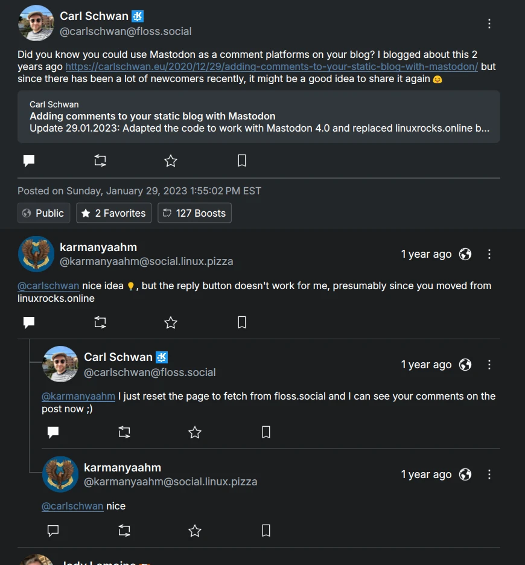

It's February already, and as expected I didn't have too much time on my hands this month. I have some exciting related news though:

# KDE Megarelease 6

If you somehow haven't heard, a bunch of KDE 6-related stuff released yesterday! I highly recommend looking at the [very nice announcement](https://kde.org/announcements/megarelease/6/) Carl and the rest of the KDE Promo team put together, it looks so good. Some of my changes in KCMs, Kiten, UnifiedPush support in Tokodon & NeoChat, PlasmaTube, and Tokodon are showcased there 🤩 One of my favorite changes is probably in KWin and the Wayland session, it's near-perfect on my machine now.

# NLnet Grant

For a while now, people have been asking about funding work on important Wayland features for artists and people who depend on accessibility features. We have been turning down offers from individual fundraisers, because behind the scenes my employer [arranged a grant us to work on this task from NLnet](https://nlnet.nl/news/2024/20240212-announcing-projects.html)! "Us" here means me and [Nicolas Fella](https://nicolasfella.de/). I hope to begin in early April.

# Tokodon

 I changed the thread visuals to [improve the readability of replies](https://invent.kde.org/network/tokodon/-/merge_requests/468). Note that it's only one level deep, but even with that limitation I find it to be way better than it was before! 

 I did some neat notification changes, such as [enabling group notifications by default](https://invent.kde.org/network/tokodon/-/merge_requests/466) and [hiding the post actions unless required for notifications](https://invent.kde.org/network/tokodon/-/merge_requests/467). The notifications page should have less visual noise now. 

 Tokodon now warns if replies may be hidden from your server [and suggests to open the original post in your web browser](https://invent.kde.org/network/tokodon/-/merge_requests/465). This isn't the greatest solution yet, eventually I want a way to load the post on the original server within Tokodon. This is a good start though, instead of showing nothing. 

# NeoChat

 Rebased and cleaned up my [bugfix to prevent editing messages destroying the formatting.](https://invent.kde.org/network/neochat/-/merge_requests/1283) This should be integrated soon!

# Frameworks

 Fixed [my typo that caused KFileMetadata to fail when not building with KArchive support](https://invent.kde.org/frameworks/kfilemetadata/-/merge_requests/132), oops! 

 Add the [missing and new Breeze icons dependency to kiconthemes](https://invent.kde.org/frameworks/kiconthemes/-/merge_requests/121). 

