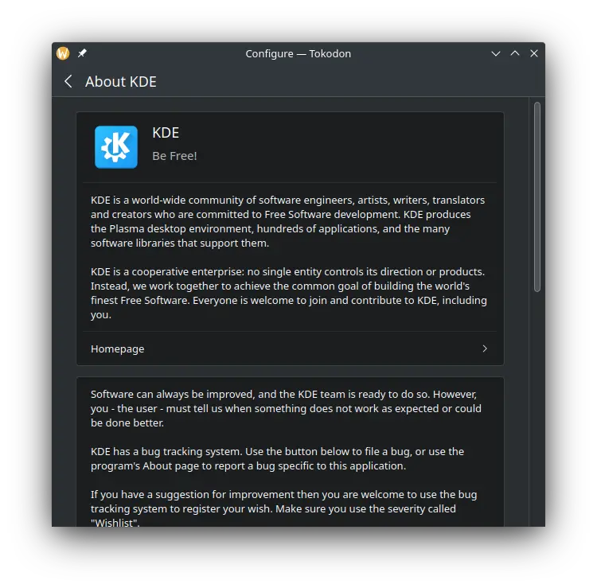
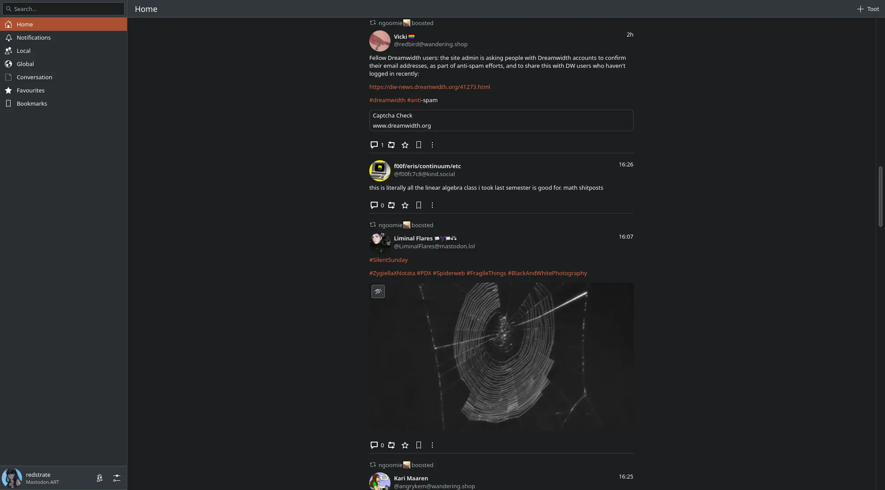
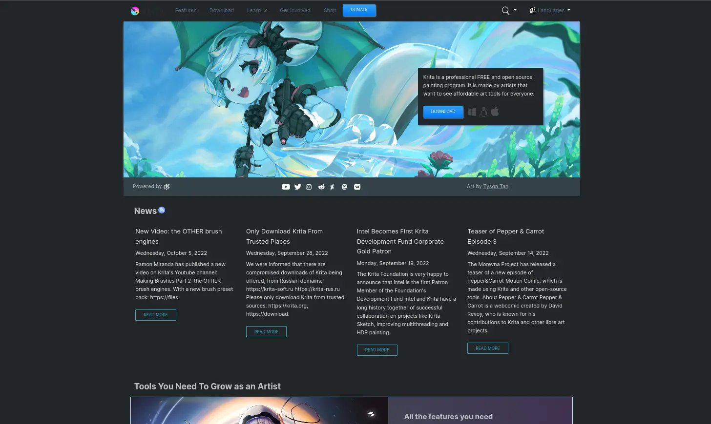
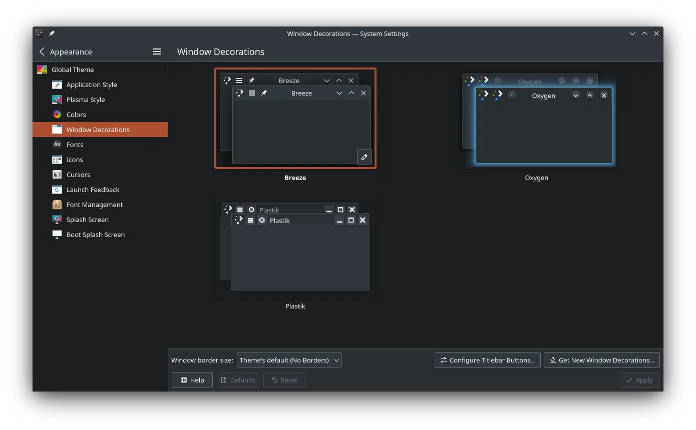

This is a non-comprehensive list of all of the major work I've done for KDE this month of January. I think I got a lot done this month! I also was accepted as a KDE Developer near the start of the month, so I'm pretty happy about that.

Sorry that it's pretty much only text, a lot of this stuff isn't either not screenshottable or I'm too lazy to attach an image. Next month should be better!

# Custom icon theme in Tokodon

I threw all of the  custom icons we use in Tokodon into a proper custom icon theme, which _should_ automatically match your theme and includes a dark theme variant. In the future, I'd like to recolor these better and eventually upstream them into Breeze.

See the [merge request](https://invent.kde.org/network/tokodon/-/merge_requests/130).

# KXMLGUI tooltips

As part of cleaning up some KDE games-related stuff, I also looked into the issue of duplicate "What's This?" tooltips. This also fixes that visual bug where you can close normal tooltips that don't have "What's This?" information to actually open.

See the [merge request](https://invent.kde.org/frameworks/kxmlgui/-/merge_requests/139).

# KBlocks background changes

This one isn't merged yet, but in the future - KBlock themes authors will be able to specify where to pin the background instead of having it stretched by default.

See the [merge request](https://invent.kde.org/games/kblocks/-/merge_requests/18).

# Kirigami "About KDE" dialog

I added something that's been wanted for a while, Kirigami's own "About KDE" dialog! It's currently sitting in Add-ons, but will most likely be moved in the future. If you would like to suggest what we do about the About pages/windows in KDE, please [check out the proposal](https://invent.kde.org/libraries/kirigami-addons/-/issues/6).

See the [merge request](https://invent.kde.org/libraries/kirigami-addons/-/merge_requests/70).

# Media improvements in Tokodon

I did a lot of work improving media in Tokodon this month, including fixing the aspect ratios scaling correctly, video support (not merged yet) and other miscellaneous fixes. I also caught a bunch of blurhash bugs along with making the timeline fixed-width so images aren't absurdly sized on a typical desktop display.

See the [media layout fixes](https://invent.kde.org/network/tokodon/-/merge_requests/124), [three attachment fix](https://invent.kde.org/network/tokodon/-/merge_requests/131), and the [video support](https://invent.kde.org/network/tokodon/-/merge_requests/143) merge requests.

# Krita.org dark theme

I'm starting to get involved in improving the KDE websites, and currently working on the new Krita.org website and adding a proper dark theme to it.

See the work-in-progress [merge request](https://invent.kde.org/websites/krita-org/-/merge_requests/18).

# Gwenview MPRIS fixes

Not merged yet (due to MPRIS bugginess in general?) but I cracked a shot at improving the MPRIS situation with Gwenview. Notably, slideshow controls no longer "hang around" until a slideshow is actually happening.

See the open [merge request](https://invent.kde.org/graphics/gwenview/-/merge_requests/180).

# CMake Package Installer

I worked a little on solving the kdesrc-build issue of manual package lists, and created cmake-package-installer. It parses your CMake log and installs the relevant packages for you. I want to start looking into hooking this into kdesrc-build!

See the [repository](https://invent.kde.org/redstrate/cmake-package-installer).

# KDE Wiki improvements

I made some misc changes to the Community Wiki this month, mostly centered around fixing some long-standing formatting issues I've noticed. The homepage should be more descriptive, important pages no longer misformatted (or just missing?) and the [Get Involved/Development](https://community.kde.org/Get_Involved/development#Set_up_kdesrc-build) page should be better organized.

# Misc Qt patches

I cherry-picked a Qt6 commit fixing video playback in QML, which should appear in the next Qt KDE Patch collection update, mostly for use in Tokodon when video support lands. I also submitted an upstream Qt patch fixing WebP loading, meant for NeoChat where I see the most WebP images.

See the [GStreamer cherry-pick](https://invent.kde.org/qt/qt/qtmultimedia/-/merge_requests/3) and the [WebP patch](https://codereview.qt-project.org/c/qt/qtimageformats/+/455097).

# Window Decoration KCM overhaul

This isn't merged yet (but it's close!) so it barely misses the mark for January, but I'll include it anyway. I'm working on making the Window Decoration KCM frameless and give it a new look that matches the other KCMs.

See the [merge request](https://invent.kde.org/plasma/kwin/-/merge_requests/3524).
