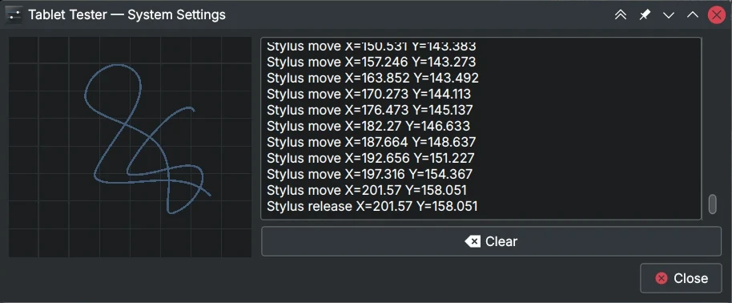
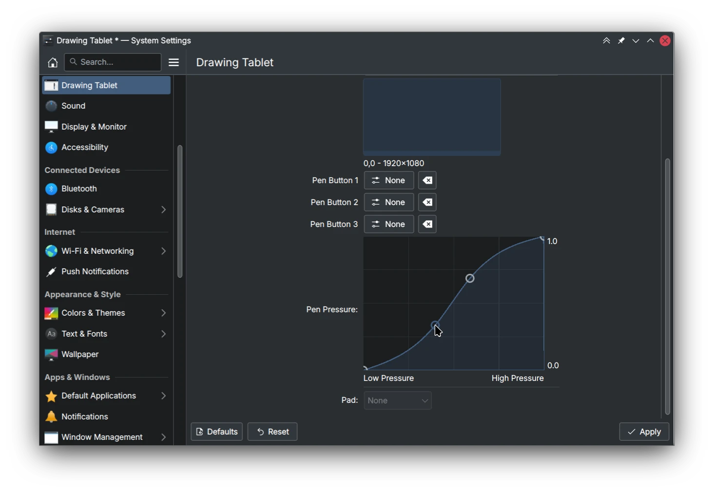
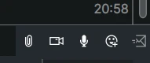
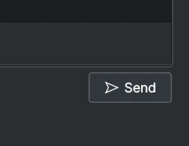
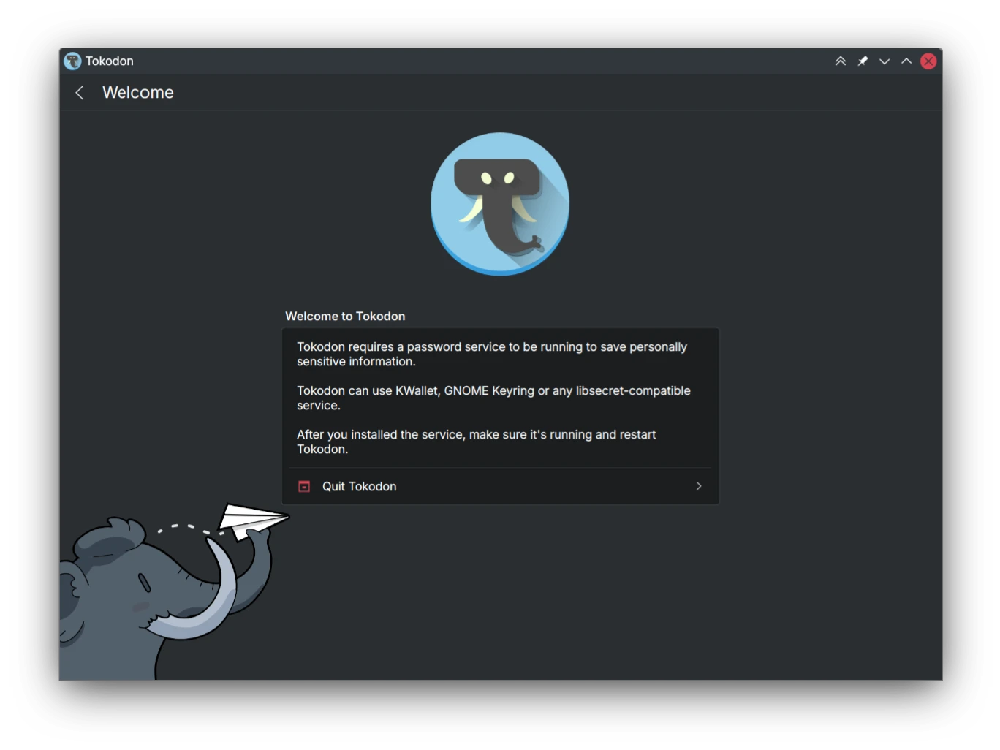
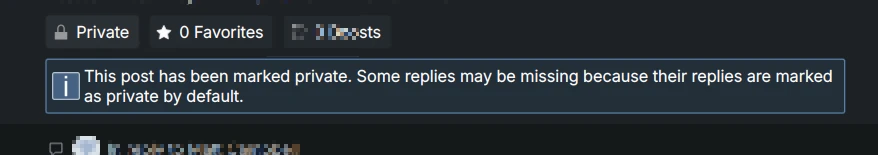
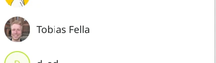
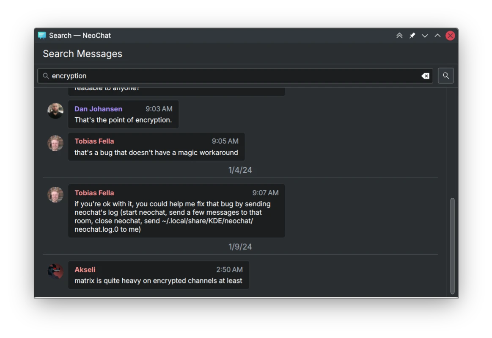

Now it's full circle, a whole year of KDE has started again! This is a bit of a smaller post, for two reasons. First I have begun stripping out of the less interesting stuff I do - like really boring bugfixes, whoop. Secondly, I'll be busy at `$work` for the next few months and I don't know what my schedule is going to look like yet.

# Plasma

 Finished up Aleix's QML API for [Layer Shell Qt](https://invent.kde.org/plasma/layer-shell-qt), and [exposing it via a proper installable QML module](https://invent.kde.org/plasma/layer-shell-qt/-/merge_requests/53). This is only useful for developers. 

 Working on adding [a simple tablet tester to the Drawing Tablet KCM](https://invent.kde.org/plasma/plasma-desktop/-/merge_requests/1970), modeled after a certain KDE application's own. 

 Also working [on adding a configurable pen pressure curve](https://invent.kde.org/plasma/plasma-desktop/-/merge_requests/1972), allowing artists to tweak the pen pressure curve of their pen or eraser. It will have two fully-controllable points of articulation and two partially-fixed points for adjusting the thresholds. 

 Fix [camera-video-symbolic being coloured wrong](https://invent.kde.org/frameworks/breeze-icons/-/merge_requests/315), when using dark color schemes like Breeze Dark. I also [fixed document-send-symbolic using the wrong icon](https://invent.kde.org/frameworks/breeze-icons/-/merge_requests/318) at 16x size. 

 I [added more common keywords](https://invent.kde.org/plasma/kscreenlocker/-/merge_requests/200) for Screen Locking settings. 

 [Removed some Wayland-techno terminology from Drawing Tablet settings](https://invent.kde.org/plasma/plasma-desktop/-/merge_requests/1971), "Pen buttons" should be called that. 

# KWin

 I opened [a merge request for the necessary things]( (https://invent.kde.org/plasma/kwin/-/merge_requests/4920)) on the KWin side needed for configuring pen pressure. 

# Tokodon

The next major release is upon us, so I started doing some last-minute bugfixing. This is also when we branch, so I can start breaking strings again! I hope to start adding new features next month.

 There has been an excess of bug reports of people using Tokodon without a way to store passwords. And if you use Tokodon on Android, it would be helpful to enable notifications but we have no way to ask you yet. To solve both of these problems (and possibly more in the future) I added a new [initial setup flow](https://invent.kde.org/network/tokodon/-/merge_requests/456). Said system will also prevent you from starting Tokodon without a way to save account data, hopefully preventing more of these bug reports in the future! 

 Tokodon now warns you when you're viewing a private post, [noting that this affects replies in an unusual way](https://invent.kde.org/network/tokodon/-/merge_requests/459). I want to add more tips about Mastodon and ActivityPub-isms to work around these issues that are out of our hands. 

And now some smaller stuff:

*  The [display of the home timeline name now makes more sense on desktop](https://invent.kde.org/network/tokodon/-/merge_requests/464), preventing some duplicate text. 
*  Don't [show empty biography cards on profiles](https://invent.kde.org/network/tokodon/-/commit/37e718f093ac281d6ff5e8788d40c74d5d0567f5). 
*  Visually [separate the active account in the switcher](https://invent.kde.org/network/tokodon/-/commit/0963950b48978b1793c2cda7a5dc181d4899861c). 
*  Improve the "login error" message [with icons, and better help text](https://invent.kde.org/network/tokodon/-/commit/8ae2268deeba212fdb991f8dc55da47ddc2879c0). 
*  Fixed numerous alignment and padding issues everywhere. 

# PlasmaTube

Same as Tokodon, I've been doing some more bug-fixing in preparation for the February mega-release and will continue to do so.

*  Added [a proper video thumbnail placeholder](https://invent.kde.org/multimedia/plasmatube/-/commit/faf9dad6a5009c223560999df45b67d3d2257a2a), instead of loading videos being displayed as empty space. 

*  Added a [way to go directly to the channel page from a video item](https://invent.kde.org/multimedia/plasmatube/-/commit/946ccbb82ab2d6c0775d04093160f7f6b364988b). This stops having to load the video, wait for it to finish and then navigate to the channel from the player. 

*  Use the [standard ItemDelegate component](https://invent.kde.org/multimedia/plasmatube/-/commit/6da012d7d3c2727895cf753e29c516135569cd78) everywhere now. It should look and feel like expected. And it makes my life as a developer way better! 

*  Added a [share button to the video player](https://invent.kde.org/multimedia/plasmatube/-/commit/6677e4ae74b01ece30914b7c4bd208dbbd024ea3). 

*  Added a [date chip to the video player for checking the published date](https://invent.kde.org/multimedia/plasmatube/-/commit/a815d3576a6fca1deb313791a1ce1f1efe009157). 

# Kongress

 Fixed [two instances of ](https://invent.kde.org/utilities/kongress/-/commit/e485b9249458b5fcbfed2edd6bbd9bbe73acfa11) [broken section headers](https://invent.kde.org/utilities/kongress/-/commit/a6b5be9e0ad6d416660d99c4f0b5c73aacb96b51). 

# NeoChat

 The room list [now hides subtitle text when there is none, slightly improving the alignment](https://invent.kde.org/network/neochat/-/merge_requests/1525). 

 Improved [the look of the search message dialog](https://invent.kde.org/network/neochat/-/merge_requests/1521), like I did for the Explore Rooms dialog before. 

# Frameworks

 Fixed [symbolic icons being wrongly matched with a non-symbolic fallback](https://invent.kde.org/frameworks/kiconthemes/-/merge_requests/118), even if a symbolic version of said icon exists. This notably will fix lots of wrongly coloured icons in the system tray. 

 Small improvements to the [Kirigami platform plugin error message](https://invent.kde.org/frameworks/kirigami/-/merge_requests/1411). This means that it's easier to debug this issue when you give us logs. 

# Websites

I spent some time trying to put in some small improvements to our [Human Interface Guidelines](https://develop.kde.org/hig), many of them are merged now but still need to take care of the rest.

* [Don't mention devicePixelRatio at all, remove mentions of Plasma Units that are no longer relevant in 6.](https://invent.kde.org/documentation/develop-kde-org/-/merge_requests/336).
* [Fix capitalization and shorten wording of 3rd-party theme note](https://invent.kde.org/documentation/develop-kde-org/-/merge_requests/338).
* [Remove some lingering mentions of PC2](https://invent.kde.org/documentation/develop-kde-org/-/merge_requests/337).
* [Move the "Generate Media" page underneath the "Contribute" category](https://invent.kde.org/documentation/develop-kde-org/-/merge_requests/340), since it's only useful for that.
* [Don't put the mobile bullet point so far down the page](https://invent.kde.org/documentation/develop-kde-org/-/merge_requests/341).
* [Remove the useless and incomplete KCMGrid page](https://invent.kde.org/documentation/develop-kde-org/-/merge_requests/339).
* [Mention the ellipses unicode character](https://invent.kde.org/documentation/develop-kde-org/-/merge_requests/335) in the label writing docs.
* [Make a note that disabled context menu items should be avoided](https://invent.kde.org/documentation/develop-kde-org/-/merge_requests/334) in most circumstances.

# Smaller stuff

* Updated [Konvex](https://invent.kde.org/redstrate/konvex) to Qt6, I still plan on sitting down with it and getting it ready for review.
* Participated in the [AMA today](https://lemmy.kde.social/post/750876).
* Rebased and integrated lots of fixes that were stalling due to lack of an author around to rebase.

I hope to see you next month with more KDE stuff!



