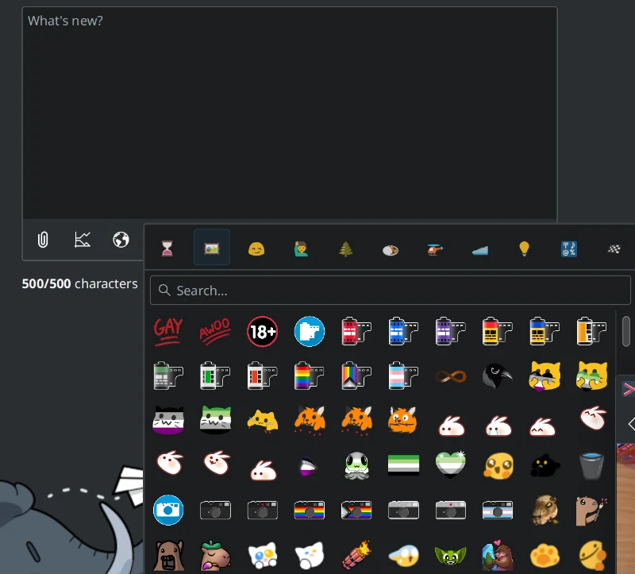
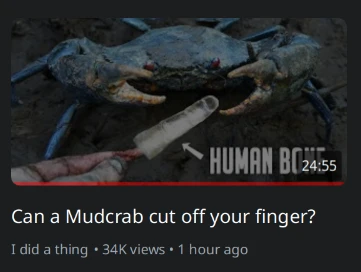
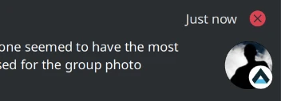
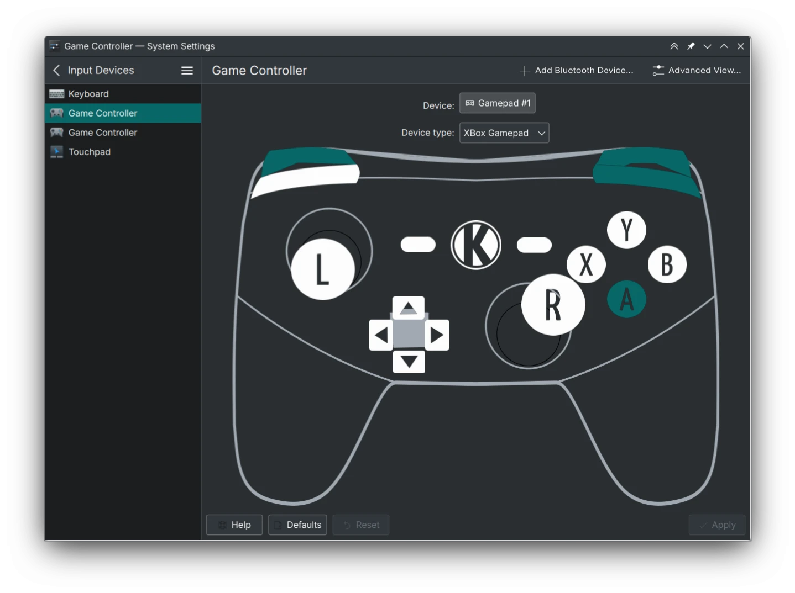
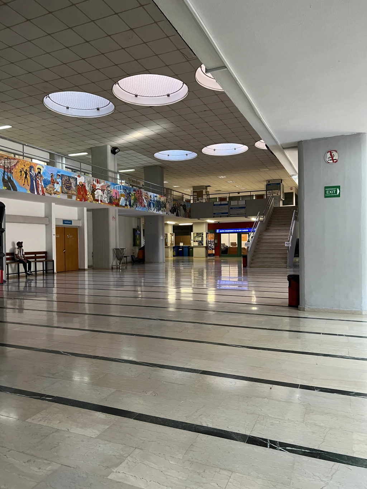

The month of July is already wrapped up, I can't believe it! I went to Akademy this year, and it was really great! Between Akademy and the imminent gear release, I didn't get much work done this month - but oh well.

I also closed the majority of my old MRs, which either aren't needed anymore or
not applicable. Whats left is features that are still on the backburner (like tablet dial support,
Kirigami context menus, etc) that I want to finish.

# Tokodon

The next release of Tokodon (23.08) is approaching next month, so I'm focusing on small improvements again. A round of [bugfixes for accounts](https://invent.kde.org/network/tokodon/-/merge_requests/283), [the fullscreen image viewer not closing](https://invent.kde.org/network/tokodon/-/merge_requests/284), [improving the conversation page](https://invent.kde.org/network/tokodon/-/merge_requests/285), [removing papercuts for statuses](https://invent.kde.org/network/tokodon/-/merge_requests/286), and [making the profile page even better](https://invent.kde.org/network/tokodon/-/merge_requests/287) landed early this month.

I have a touchscreen laptop now, and I've been able to [improve the touch experience for interaction buttons](https://invent.kde.org/network/tokodon/-/merge_requests/291). Expect more touch-related improvements in the future, as before I only had a PinePhone and an Android device to test with. Carl did a lot of profiling work, and I specifically [updated the blurhash implementation](https://invent.kde.org/network/tokodon/-/merge_requests/294) which makes it oh-so slightly faster to generate. This and the other performance improvements makes scrolling the timeline much smoother.

A big feature I've personally been waiting for has now landed, [an emoji picker for the status composer](https://invent.kde.org/network/tokodon/-/merge_requests/304)! I took this from NeoChat (of course) and slightly modified it for our needs. This is something that could use some improvement in the future, but I'm glad we have this now.

Another smaller but great feature is that [account mentions](https://invent.kde.org/network/tokodon/-/merge_requests/308) now open inside of Tokodon (like hashtags do already) without kicking you back to a web browser.

# PlasmaTube

This is something I've wanted for a while now, [watch indicators now work for
logged in Invidious accounts](https://invent.kde.org/multimedia/plasmatube/-/merge_requests/54)! These are synced to your Invidious account,
so they show up on the website and other 3rd party clients. Partial watches are not yet supported, but I do have an idea of how they could work. Eventually, I want to expose a
way to mark videos as "unwatched".

I also added [pagination for the subscription feed](https://invent.kde.org/multimedia/plasmatube/-/merge_requests/52) but the merge request is currently awaiting review.

# NeoChat

Three small changes to NeoChat this month, I fixed the [emoji popup shadows](https://invent.kde.org/network/neochat/-/merge_requests/1101) and added [a more obvious upload button for avatars](https://invent.kde.org/network/neochat/-/merge_requests/1104). And finally [gave NeoChat the
prettier notifications](https://invent.kde.org/network/neochat/-/merge_requests/1103), like I did for Tokodon last month.

# Gamepad KCM

The Gamepad KCM is being prepared to [enter KDE Review soon](https://invent.kde.org/redstrate/gamepad-kcm/-/issues/1)! See the [current repository](https://invent.kde.org/redstrate/gamepad-kcm) and it already runs in Plasma 6. Jeremy
Whiting and I have been working to get the KCM in a nicer state, see [my merge request](https://invent.kde.org/redstrate/gamepad-kcm/-/merge_requests/18) overhauling the C++ backend (I still need to finish it...)

While the KCM isn't perfect yet, I'm hoping to get it in a "good enough" state
to attract more help. If you are interested in fixing the design, code, or drawing
controller SVGs we welcome your help!

# Akademy

Since I arrived late to Akademy, I only attended BoFs and didn't have the chance to
view the talks. I plan on detailing more of my trip in a future post, but I
haven't had the energy to write.

I went to Carl Schawn's Plasma Mobile BoF, and the "Contributor On-ramping" BoF held by Joseph De Veaugh-Geiss. It was good, but I arrived late and wasn't able to catch much of it. I also went to the Plasma 6 BoF afterwards, but most of the time was spent talking about the release date schedule. One of my favorite BoFs was probably Joseph's Wiki BoF. There was a surprising number of people and it was very productive. We decided on a lot of things: getting on the same page about techbase/userbase (and the problems with keeping them around), removing the wiki theme, and more. You have probably noticed some of the changes even now!

On Thursday, I attended Carl's Accessibility BoF. I learned how to use [Accerciser](https://gitlab.gnome.org/GNOME/accerciser), and I noticed some accessibility issues in Tokodon which are fixed now! I also spent some time on Thursday [improving the Matrix page](https://community.kde.org/Matrix), which I'm very happy with. I also hooked up with Volker Krause to help Tokodon on Android along, which is now fixed. (Thanks so much!) We also discovered an error in [the Android build documentation](https://develop.kde.org/docs/packaging/android/building_applications/), as it turns out the docker registry version of the images is no longer maintained. That caused a bunch of issues since NDK paths changed since the old Docker image was updated, which Volker fixed.

It was nice meeting everyone at Akademy, I wish I came sooner because I didn't have
the chance to talk to some people. See you next month!


