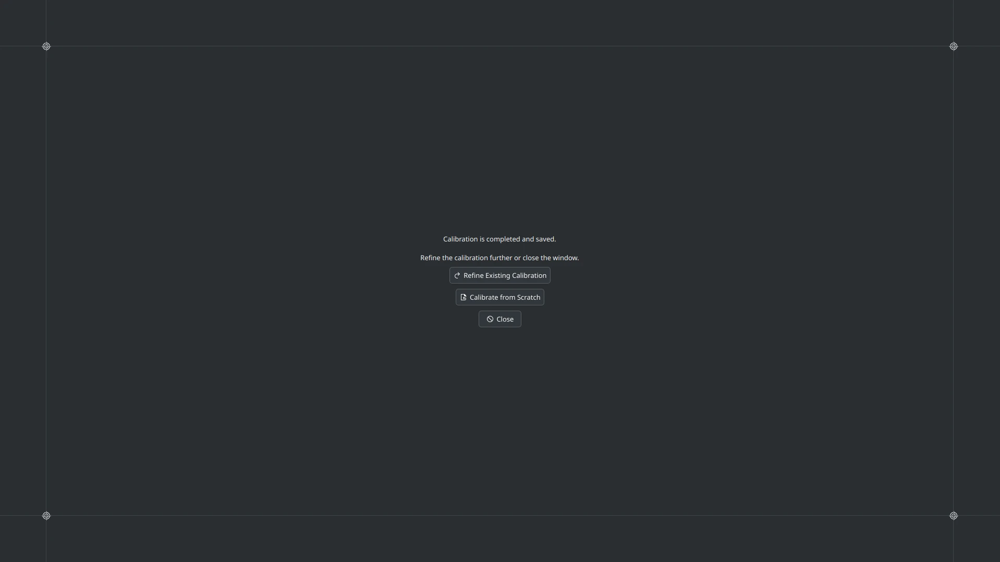
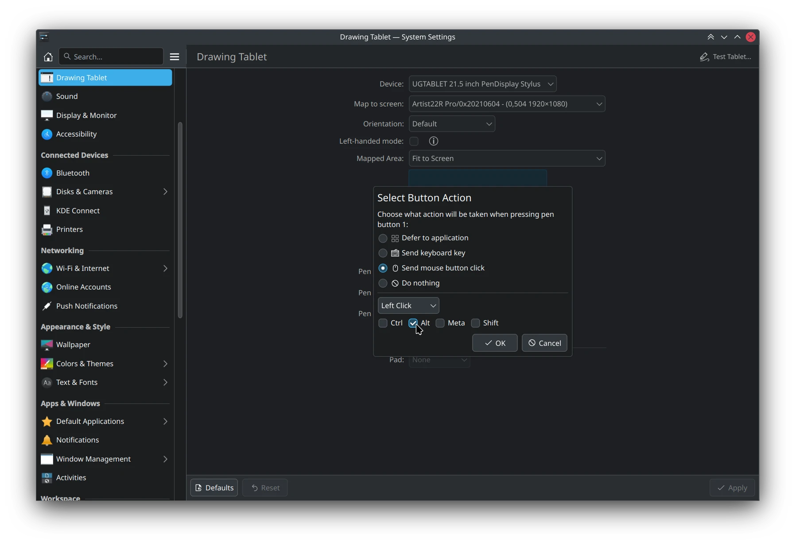
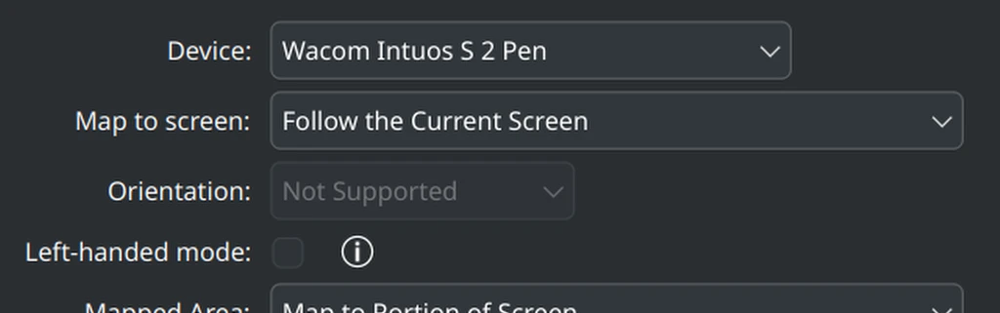
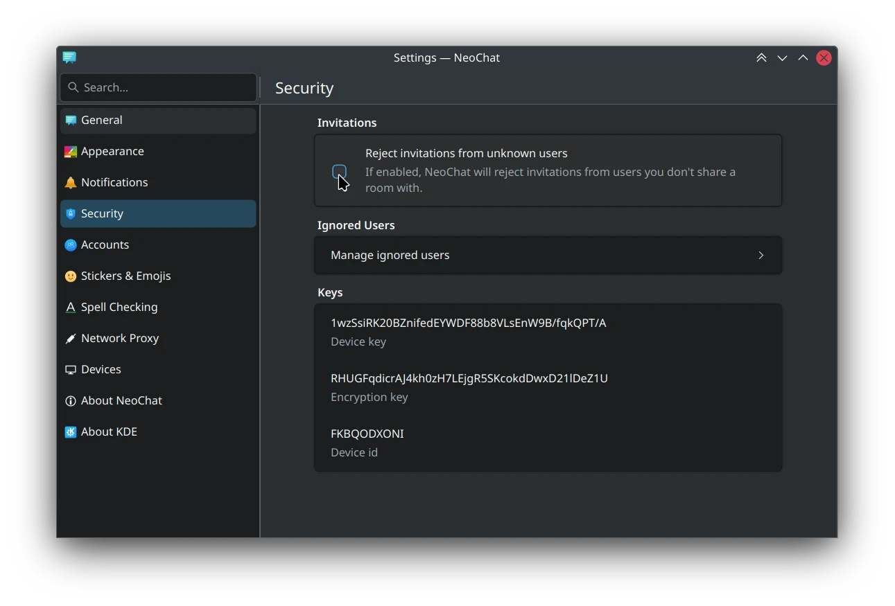
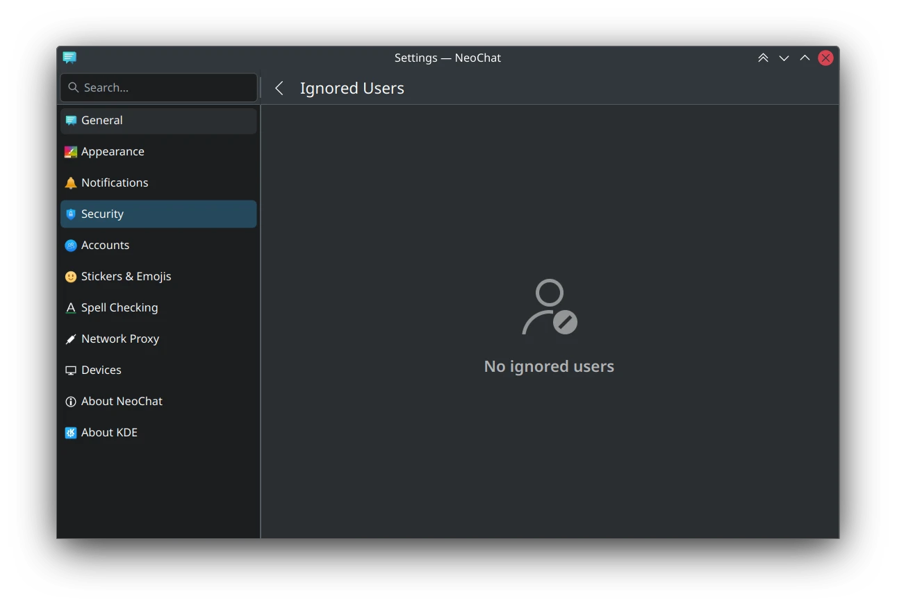
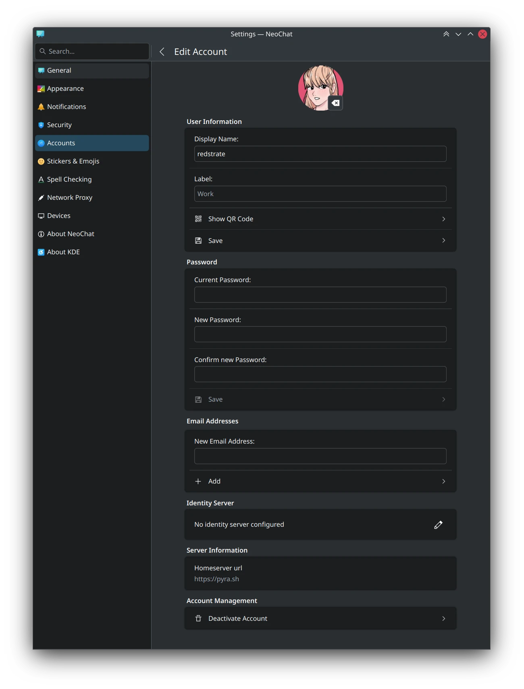
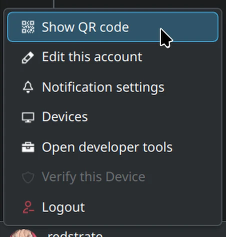
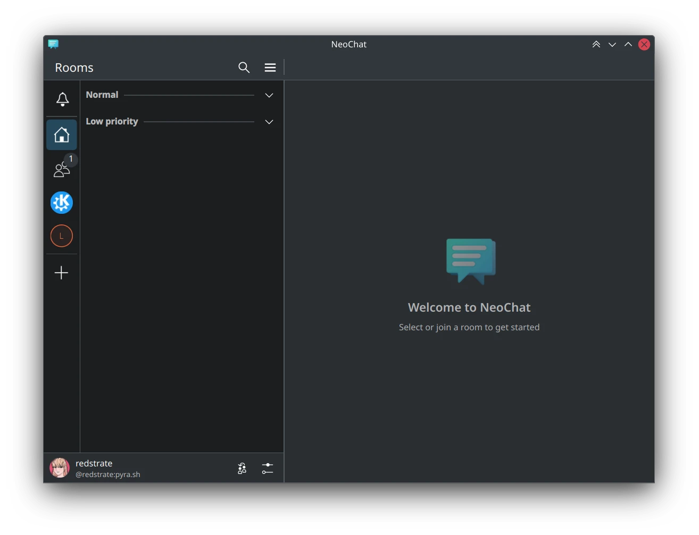
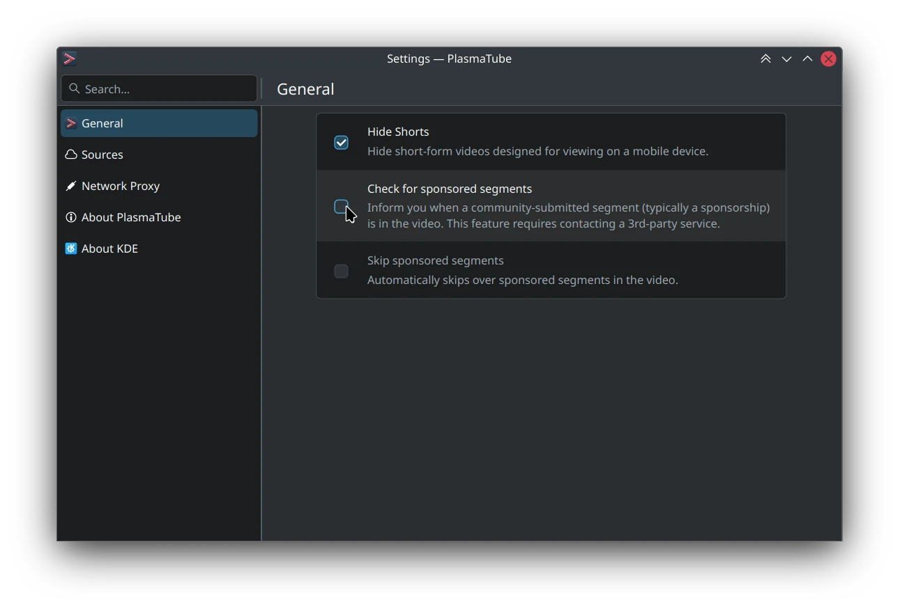
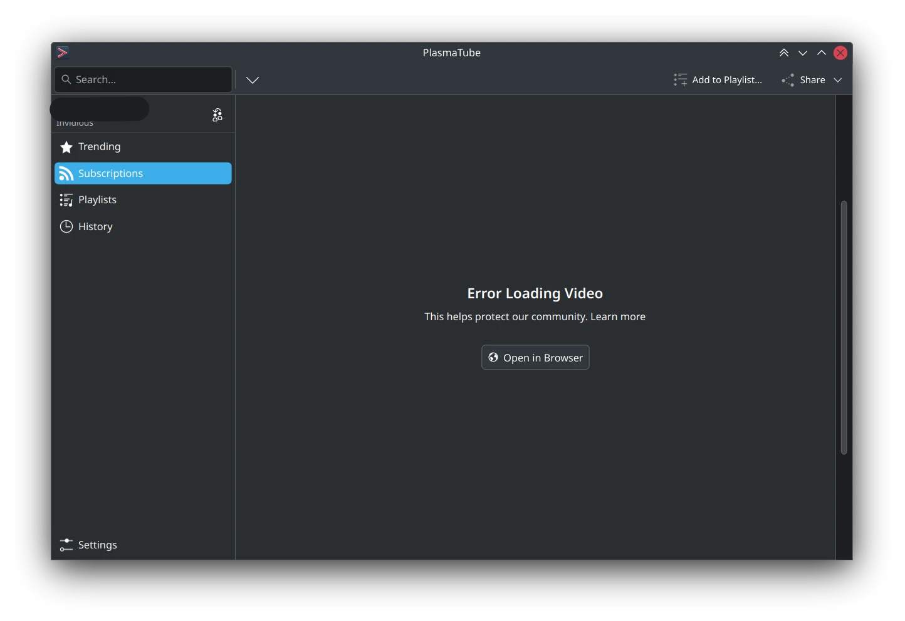

This is a very exciting month if you're waiting for more artist-oriented improvements in the Wayland session!

# Plasma

 [Pen calibration is merged](https://invent.kde.org/plasma/plasma-desktop/-/merge_requests/1833)! If you have the time and supported hardware, try it out in [Neon Unstable](https://neon.kde.org/download) and see if the math needs tweaking. I also begun adding [tests for this calibration tool](https://invent.kde.org/plasma/plasma-desktop/-/merge_requests/2374).  

 You can [now bind mouse buttons (with modifier keys) to tablet pen or pad buttons](https://invent.kde.org/plasma/plasma-desktop/-/merge_requests/2384), or disable them entirely!  

 Fixed the [pen tester ahead of it breaking in Qt 6.8](https://invent.kde.org/plasma/plasma-desktop/-/merge_requests/2375) since tablet pens can drag the window. 

 Mention that [setting the orientation is not supported, on hardware where it isn't](https://invent.kde.org/plasma/plasma-desktop/-/merge_requests/2400). Some people have already commented we can do even better than this, so I plan on tackling that next month. 

 Disable the [tablet tester when no tablets are connected](https://invent.kde.org/plasma/plasma-desktop/-/merge_requests/2408). This is because the tablet tester only responds to pen input, so it's useless without any. 

# KWin

 Support [disabling buttons in the rebind filter](https://invent.kde.org/plasma/kwin/-/merge_requests/6092).  

 Support [pressing keyboard modifiers alongside mouse buttons](https://invent.kde.org/plasma/kwin/-/merge_requests/6095).  

 Set the [mouse cursor position when rebinding tablet buttons to mouse buttons](https://invent.kde.org/plasma/kwin/-/merge_requests/6146). This is to fix odd situations where you have a tablet button bound to right-click, and context menus open in the wrong place.  

Added [more test coverage for the ButtonRebindFilter](https://invent.kde.org/plasma/kwin/-/merge_requests/6149). 

# NeoChat

 Add an option to [block invites from users who you may not know](https://invent.kde.org/network/neochat/-/merge_requests/1819), to help users being spammed by bad actors on Matrix. This is could also be useful if you're only using your Matrix account to communicate with friends & family. 

 Try [not to display ghost notifications for invites](https://invent.kde.org/network/neochat/-/merge_requests/1820). This is meant to be an addition to the above feature, to prevent users from being spammed. 

 Don't [mark invite notifications as persistent](https://invent.kde.org/network/neochat/-/merge_requests/1821). This is also meant to cut down on the possible notification spam. This is especially important on KDE Plasma Desktop which doesn't handle notification spam well at all, at the moment. 

 Made [the ignored list look better](https://invent.kde.org/network/neochat/-/merge_requests/1823) when you have no one in it. 

 Cleaned up the [account editor page](https://invent.kde.org/network/neochat/-/merge_requests/1825) and also add some icons to break up how text-heavy it is here. 

 Added a ["Show QR code" button to the account menu](https://invent.kde.org/network/neochat/-/merge_requests/1826) so you don't have to dig into the settings to find this. 

 Suggest [what to do on the empty welcome screen](https://invent.kde.org/network/neochat/-/merge_requests/1828). 

# Tokodon

 Added an option to [open the pop-out status composer by default](https://invent.kde.org/network/tokodon/-/merge_requests/513). 

 Allow pasting images [directly from the Internet](https://invent.kde.org/network/tokodon/-/merge_requests/514) and just make pasting images all-around better. 

 Silently fail [when servers don't implement featured tags on profiles](https://invent.kde.org/network/tokodon/-/merge_requests/515). This is common for lots of non-Mastodon servers. 

# PlasmaTube

 Added [basic support for SponsorBlock](https://invent.kde.org/multimedia/plasmatube/-/merge_requests/82) which is turned off by default, but you can enable under Settings. You can't configure which server to use (it's possible, just not through the UI) or what specific categories to block yet. You do have the option to have PlasmaTube inform you when you're inside of a sponsored segment or have it auto-skip. 

 Added a [proper error page to the video player](https://invent.kde.org/multimedia/plasmatube/-/commit/3961d5c2b79866fc27859052256e0520096d5638) while my Invidious server is borked due to YouTube changes. It will display the error given by Invidious, and also a button to open the original webpage. 

---

That's all for this month!
