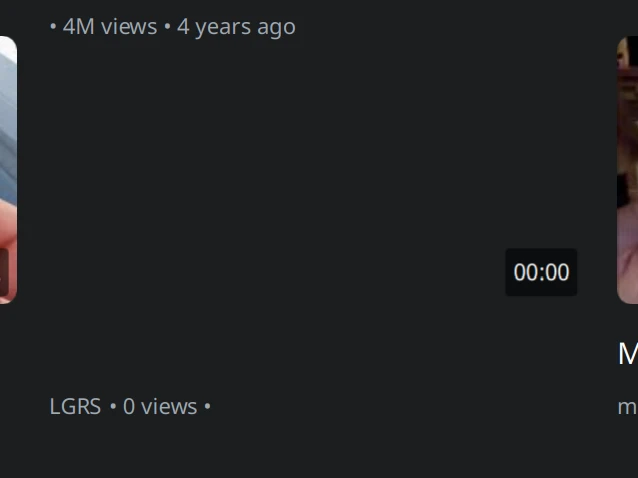
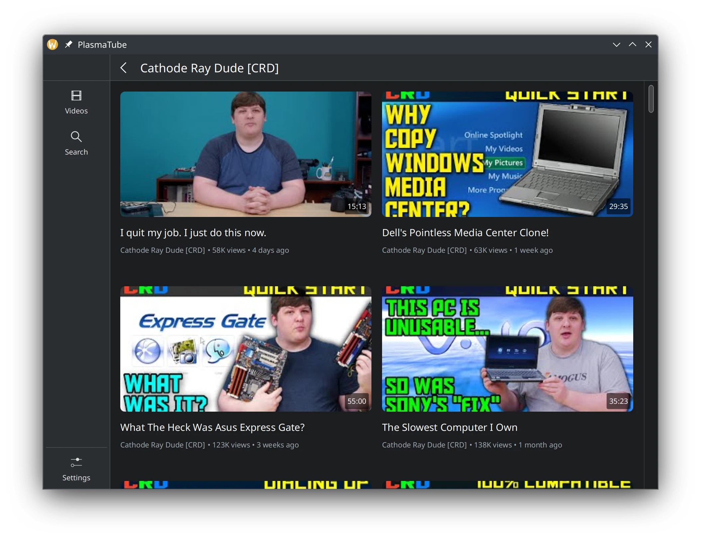
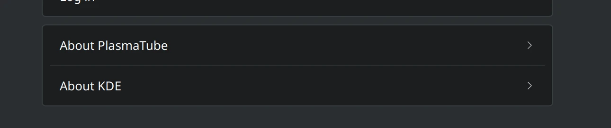
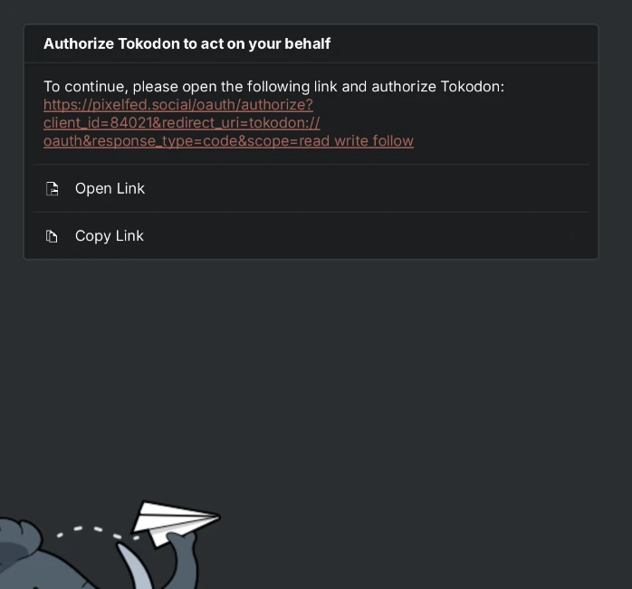
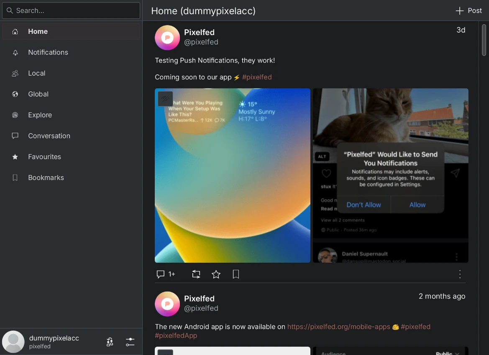
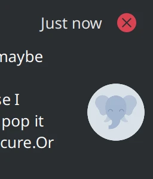
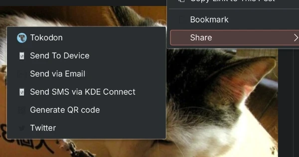

We're about halfway through year! This update is a bit smaller than usual, and more focused on applications than Plasma. This isn't for lack of time or trying, but I tried to deliberately clear out my backlog. That goal didn't really pan out, but I'll be trying again next month.

# Craft

The Android build for Tokodon (and consequently it's CI) was broken because I replaced the video player with libmpv, so I spent a good chunk of this month making sure it's working again. This was a little difficult to fix, but I feel much more confident with Craft now.

If you're not familiar with [Craft](https://community.kde.org/Craft), it's a [meta-build system](https://en.wikipedia.org/wiki/List_of_build_automation_software#Meta-build) created by KDE. Craft and it's blueprints are written in Python. Blueprints describe how to build the application or library, and has easy utilities for working with existing build systems (AutoTools, CMake, Meson, etc). It may be a little daunting, but these blueprints  easy to write and maintain. More importantly, Craft enables easy cross-compilation since it contains blueprints for the underlying libraries for KDE applications: OpenSSL, zlib, and so on.

Tokodon is (to my knowledge) the first KDE application to use libmpv on Android, so I needed to break a lot of new ground to make this happen. What's exciting though is that any KDE application that uses libmpv (PlasmaTube?) doesn't have to jump through hoops to make it build on Android.

Sorry, this section will be mostly text because I can't exactly visualize build files!

## zlib

zlib is already included in the Android NDK, but for some reason they don't ship pkgconfig files for it (or anything, really). For example, Freetype declares a dependency on zlib in it's pkgconfig, and then pkgconfig (the program) starts complain that it can't "find zlib" although the library itself exists. That's because pkgconfig is searching for zlib's config, and doesn't care if the `.so` or `.a` file exists on disk anyway.

For now, I propose [enabling zlib on Android anyway](https://invent.kde.org/packaging/craft-blueprints-kde/-/merge_requests/580). It's odd that we have to build it again, but I don't see an easier solution right now.

## kirigami-addons

This is a really simple fix, QtMultimedia was missing as a dependency for this library. The new fullscreen image viewer uses QtMultimedia under the hood to display video, but it wasn't declared in the blueprint yet.

See the [merge request](https://invent.kde.org/packaging/craft-blueprints-kde/-/merge_requests/592) adding it as a dependency.

## libarchive

The versions of libarchive currently in Craft had an Android-breaking header inclusion bug, preventing compilation if you use any of it's headers.

Now it's bumped to 3.6.2 (the latest version as of writing), see [the merge request](https://invent.kde.org/packaging/craft-blueprints-kde/-/merge_requests/590). Support for the last version is also being dropped, let's see if that breaks anything!

## ffmpeg

Tokodon uses libmpv to display videos from Mastodon and other services, which are served over HTTPS. libmpv uses ffmpeg to fetch video data, but the Craft blueprint for ffmpeg didn't enable the TLS backend.

See the [merge request](https://invent.kde.org/packaging/craft-blueprints-kde/-/merge_requests/591) which enables the OpenSSL backend for all platforms, which could benefit other KDE applications!

## fribidi and mpv

When deploying to Android, we use a tool called [androiddeplyqt](https://doc.qt.io/qt-6/android-deploy-qt-tool.html) to package the libraries required by an application. One of the checks it deploys is checking the version of the `.so` before putting it inside of the APK. If your application links to, say `libmpv.so.1` then androiddeployqt will stop in it's tracks. Fribidi and mpv felt the need to set versions, without a way to tell them to stop.

See this [merge request](https://invent.kde.org/packaging/craft-blueprints-kde/-/merge_requests/593) which now builds these two libraries statically completely side-stepping the issue. I think this is an okay solution for now, as a shared library doesn't make much of a difference on Android. If someone knows a better way to force them to stop putting out versioned shared libraries, let me know.

## Meson

Some dependencies of mpv (Such as fribidi) used Meson as it's only build system, which didn't have cross compilation support in Craft yet. Meson is nice and all, but it's cross compilation system is really obtuse, as [I need to write a file](https://mesonbuild.com/Cross-compilation.html)! This is fed into the meson command, but I don't understand why we can't pass these as arguments or environment variables.

See the [merge request](https://invent.kde.org/packaging/craft/-/merge_requests/125) for enabling cross compilation for Meson projects under Craft. There's still a bit of work left to do for me, like figuring out how to handle switching between toolchains.

# PlasmaTube

I've been using PlasmaTube more lately, so that means more and more fixes to it! First, [non-video results are no longer displayed](https://invent.kde.org/multimedia/plasmatube/-/merge_requests/48). That's these blank little fellows in the video grid:

The two player modes (minimized and maximized) [are now stored as a binary flag](https://invent.kde.org/multimedia/plasmatube/-/merge_requests/46), instead of guessing it. In simpler terms this means that when you maximize the window, it doesn't enter a weird state where half of the player is open.

I improved [the video loading experience a bit](https://invent.kde.org/multimedia/plasmatube/-/merge_requests/47). Now when you explicitly stop a video it doesn't momentarily reappear too soon when you click on another one. This doesn't affect clicking between videos while it's still playing or paused though.



The [videos on a channel page](https://invent.kde.org/multimedia/plasmatube/-/merge_requests/44) load now! It's not categorized or anything yet, but it's a good start.

And of course, [add an "About KDE" page](https://invent.kde.org/multimedia/plasmatube/-/merge_requests/45) to the settings!

# Tokodon

I completed some important tasks for Tokodon this week! It may seem boring, but this includes important groundwork (including the Android stuff above) so we can focus on implementing more useful features.

## Better authentication

I'm starting to remove the [manual authentication code step](https://invent.kde.org/network/tokodon/-/merge_requests/266) which means it's now even easier to login to Tokodon. Once you complete the login flow in your browser, it will return you to Tokodon *magically*. How to get this working in a Qt/KDE application is a mystery apparently (and on Android) so that might be future blog material.

I have some local changes enabling support for this on Android, and I'm hopeful this will appear in the next release. As a bonus, it lets you log into [Pixelfed](https://pixelfed.org/)! For some reason, they don't support copying the authcode and only support URI callbacks to return to the application. Once this lands, Tokodon can work as a Pixelfed client!

## Notification improvements

Now the notifications coming from Tokodon is a little bit better. I merged a change that [fixes the notification identity so it's coming from who actually did the action](https://invent.kde.org/network/tokodon/-/merge_requests/260). On top of that, the avatar is rounded which matches what we do inside of Tokodon as well:

## Android improvements

I [merged a bunch of small fixes](https://invent.kde.org/network/tokodon/-/merge_requests/269) which makes the Android experience a little bit better.
* The settings page no longer crash because Sonnet was erroneously included on Android.
* There was a bunch of missing icons on Android, now they are included!
* When entering the instance URL during the login flow, the keyboard doesn't try to uppercase the first letter.

## Config improvements

I landed the [much needed config overhaul](https://invent.kde.org/network/tokodon/-/merge_requests/248) which fixes two major pain points: configuration location and security. We used KConfig but only for the main configuration options, not for the account information. This meant there was this odd `~/.config/KDE/tokodon.conf` and contained secret information to boot. Now everything is handled by KConfig, and the volatile account information is stored separately from the main configuration options in `~/.local/share/Tokodon/tokodonstaterc` (possibly moving to `~/.local/state` in KDE Frameworks 6).

The account token and client secrets are now stored in your system keychain (like KWallet or GNOME Secrets)! When you start Tokodon 23.08, it will automatically migrate your config files, so there's nothing you need to do.

## Sharing

Now you can [share posts, images, and profiles directly from Tokodon](https://invent.kde.org/network/tokodon/-/merge_requests/267)! I think this is useful for quickly sharing between devices.

I'm also working on sharing _through_ Tokodon! It still needs some work. My current plan is to have it open the composer if already running, or open in a standalone composer window if it isn't.



See you next month!



