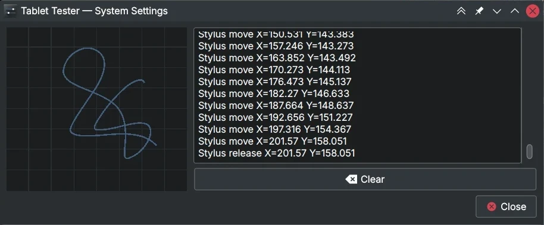
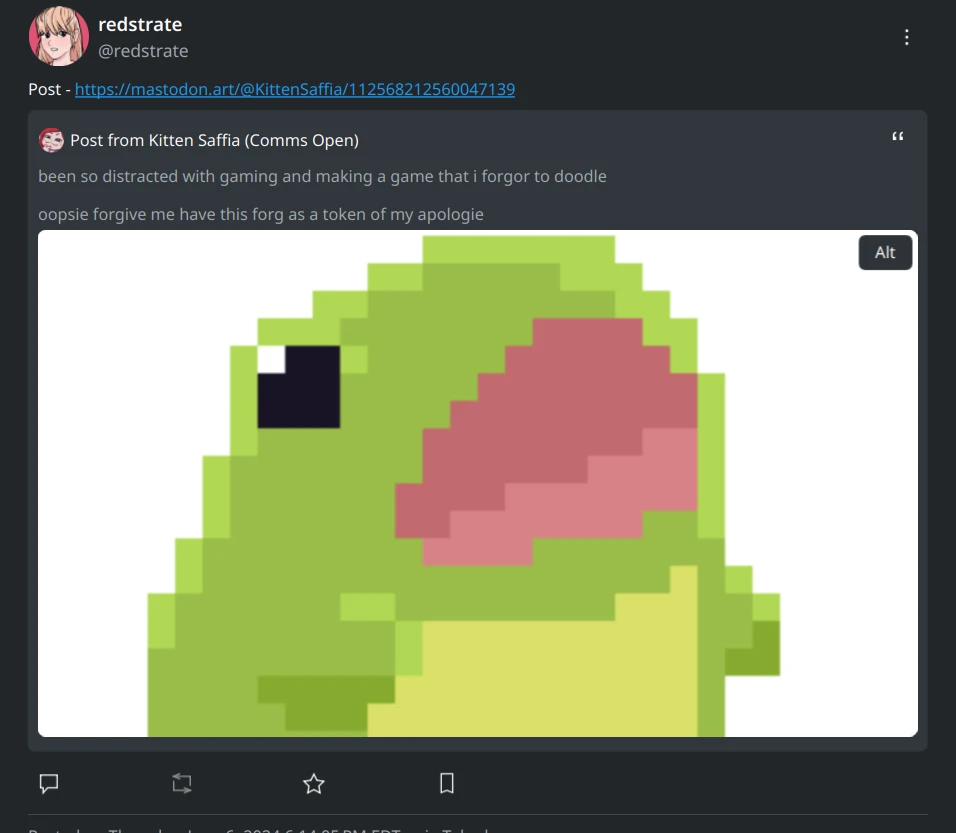
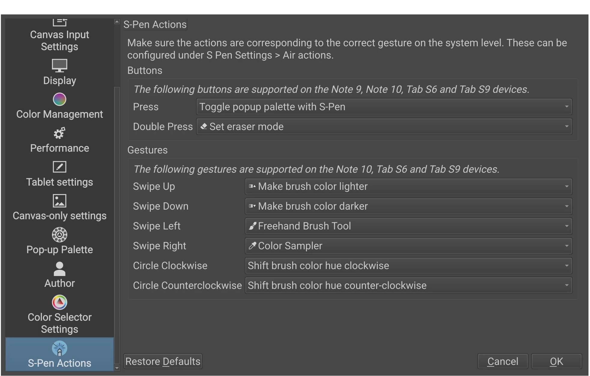

Hello! I intentionally skipped last month because I was busy with other tasks, and I didn't have much to discuss KDE-wise. Anyway, let's get started:

# Akademy

I have booked my travel plans for [Akademy 2024](https://akademy.kde.org/2024/), and hopefully this time my travel will be uneventful. I'll be attending [QtCS 2024](https://wiki.qt.io/Qt_Contributor_Summit_2024) in Würzburg too. At the time of writing, the program has not been announced yet - so I'm not sure if I'm giving a talk yet, but fingers crossed 🤞

# Art on Wayland

A common problem with artists inquiring about the KDE Wayland session is that a lot of information is passed down. Some of the information is clearly out of date, and it spreads like wildfire. On top of that, factual information is scattered across multiple wiki pages, forum posts, and chat messages. I wrote up a page (personally maintained by me, mind) hosted at https://artonwayland.redstrate.com/. (If all goes well, I hope to retire this page in a year or two.)

In terms of software, [gsetwacom](https://github.com/linuxwacom/gsetwacom) was recently released by Peter Hutterer. So, I created our own (intentionally a seperate tool), called [ktabletconfig](https://invent.kde.org/redstrate/ktabletconfig). I personally don't have a use for this tool, but I wanted to create it anyway. I hope it serves someone well!

I do plan on expanding ktabletconfig's features, as the Wayland session continues to mature.

# Plasma

 I [merged the tablet tester](https://invent.kde.org/plasma/plasma-desktop/-/merge_requests/1970), finally! Thanks to Nate for pushing it past the finish line, as always. 

 Clearly explain [what left-handed mode does in the Tablet KCM](https://invent.kde.org/plasma/plasma-desktop/-/merge_requests/2300), because even I didn't know until I looked it up! 

 Rebased and [merged Aki Sakurai's "Map to Workspace"](https://invent.kde.org/plasma/plasma-desktop/-/merge_requests/2304) (aka all monitors) feature for the Tablet KCM. 

 I also [fixed the wrong aspect ratio for the output preview in the Tablet KCM](https://invent.kde.org/plasma/plasma-desktop/-/merge_requests/2305). Now mapping between 4:3 and 16:9 screens should make more sense in the UI. 

 Went [through the whole Tablet KCM and cleaned up the terms](https://invent.kde.org/plasma/plasma-desktop/-/merge_requests/2303) we use. It's a small thing, but I hope it makes the features we have more understandable. 

# Frameworks

 I have begun [adding a way for Kirigami applications](https://invent.kde.org/frameworks/kconfig/-/merge_requests/316) to save and restore window state like our QtWidget applications do. I have stalled on it because of something else, but this is something I want to finish soon. 

 Added [a generic "translate" icon for applications](https://invent.kde.org/frameworks/breeze-icons/-/merge_requests/382) based on the crow-translate icon we already have. 

# Tokodon

 I finished up [and merged quoted posts support](https://invent.kde.org/network/tokodon/-/merge_requests/483)! I'm also pretty happy with the implementation. 

# Krita

 Fixed [the "DEV BUILD" badge going to a 404](https://invent.kde.org/graphics/krita/-/merge_requests/2171). 

 Fix the [lag in the tablet tester when using it with a S-Pen on Android](https://invent.kde.org/graphics/krita/-/merge_requests/2172). 

 Multiple small [improvements for the S-Pen on Android](https://invent.kde.org/graphics/krita/-/merge_requests/2170). 

# NeoChat

 Prevented the [location map showing up even though no locations were shared](https://invent.kde.org/network/neochat/-/merge_requests/1763). That also fixes copyright link activation! 

 Fixed [the QR code not showing up](https://invent.kde.org/network/neochat/-/merge_requests/1765) on the account page. 

 Added [a focus border to the appearance page modes](https://invent.kde.org/network/neochat/-/merge_requests/1764), which helps users who solely depend on the keyboard. (It was navigable before, but you would have no idea which one was selected.) 

 Removed [room members being highlighted on tap](https://invent.kde.org/network/neochat/-/merge_requests/1766). This makes the member list appear slightly less buggy. 

 Added [basic keyboard navigation for the server selection popup](https://invent.kde.org/network/neochat/-/merge_requests/1768). 

 Fixed [keyboard navigation in the space drawer](https://invent.kde.org/network/neochat/-/merge_requests/1769). 

 Fixed [keyboard navigation on the room & user search pages](https://invent.kde.org/network/neochat/-/merge_requests/1767). 

# Other

 Fixed [keyboard navigation for Kirigami Add-on's FormComboBoxDelegate](https://invent.kde.org/libraries/kirigami-addons/-/merge_requests/248), which improves keyboard navigation in lots of Kirigami applications! 

I updated the [Plasma Desktop README](https://invent.kde.org/plasma/plasma-desktop/-/merge_requests/2299) in line with the other README things I did this year!
