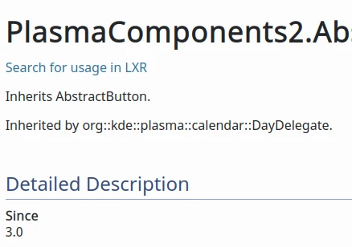
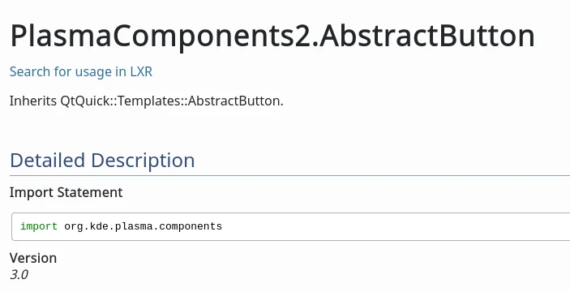
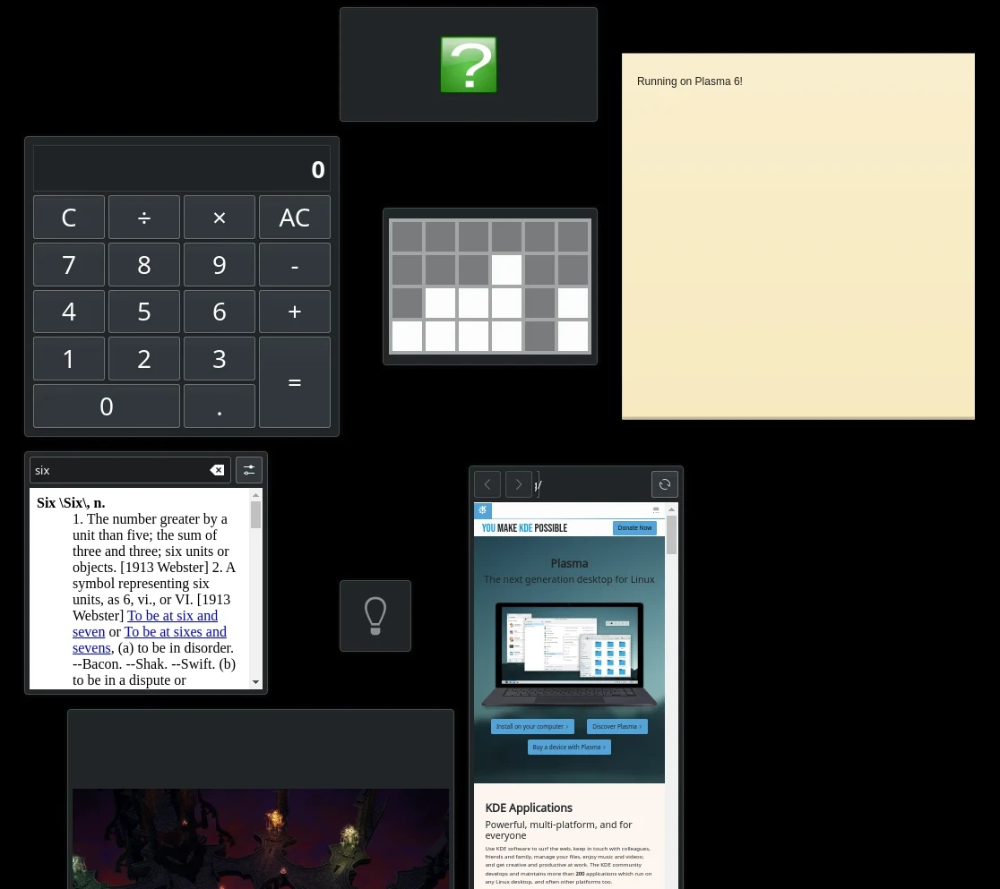
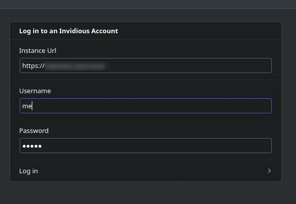
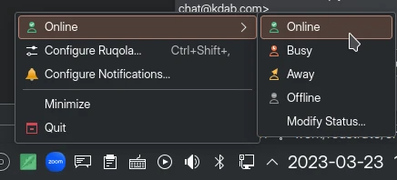
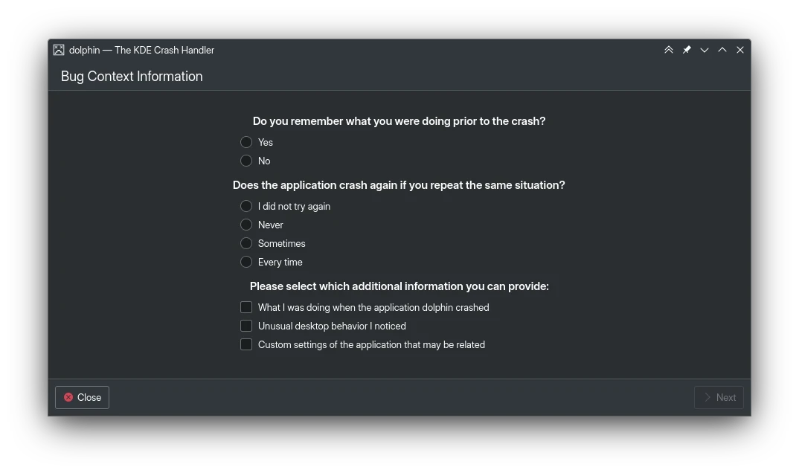
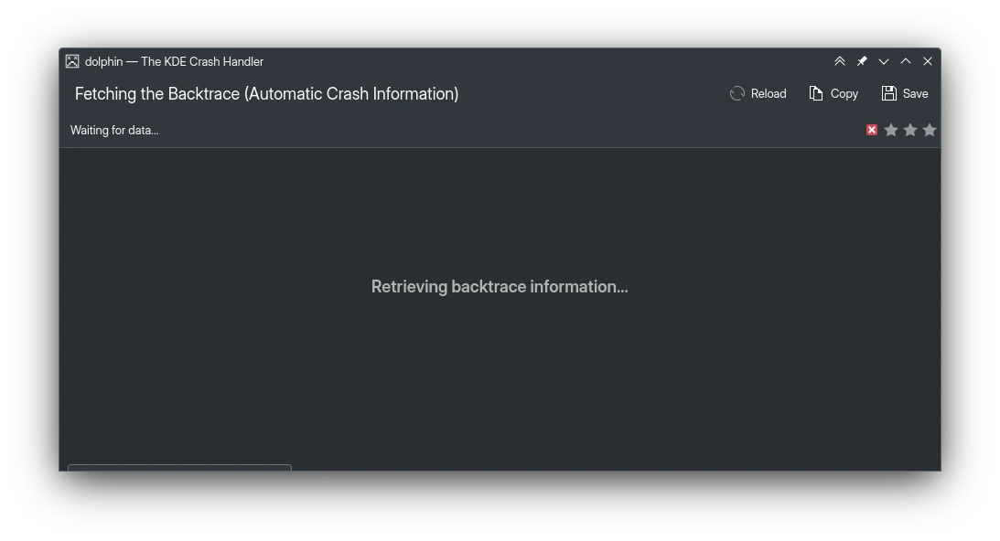
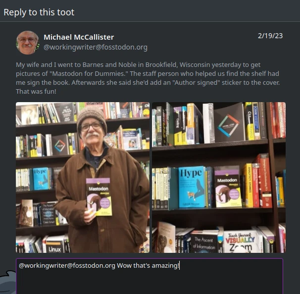
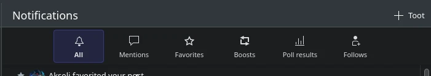
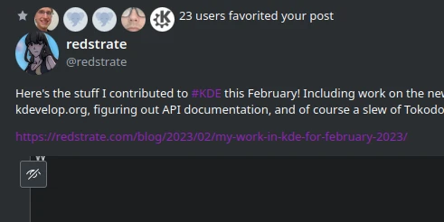

Another month in the year, another collection of bugfixes and features I contributed to KDE!

# Documentation Improvements

Something I want to improve for KDE Frameworks 6 is the API documentation, it's pretty bad
sometimes:

For plasma-framework, [we started marking private QML types as internal](https://invent.kde.org/frameworks/plasma-framework/-/merge_requests/722). I'm in the process of manually fixing up the custom QQuickItem types in plasma-framework
too, although I haven't gotten around to opening up a merge request for that.

I opened a doxyqml[^1] [merge request to make it's output more useful](https://invent.kde.org/sdk/doxyqml/-/merge_requests/16), by automatically
adding import statement hints to the page:

# Plasma 6 Porting

Early this month, I ended up porting most of our applets to Plasma 6! The current
hitlist is:
* [Sticky Notes](https://invent.kde.org/plasma/kdeplasma-addons/-/merge_requests/339)
* [Binary Clock](https://invent.kde.org/plasma/kdeplasma-addons/-/merge_requests/340)
* [Color Picker](https://invent.kde.org/plasma/kdeplasma-addons/-/merge_requests/341)
* [Fuzzy Clock](https://invent.kde.org/plasma/kdeplasma-addons/-/merge_requests/344)
* [Web Browser](https://invent.kde.org/plasma/kdeplasma-addons/-/merge_requests/352)
* [Konsole Profiles](https://invent.kde.org/plasma/kdeplasma-addons/-/merge_requests/347)
* [Media Frame](https://invent.kde.org/plasma/kdeplasma-addons/-/merge_requests/348)
* [Quick Launch](https://invent.kde.org/plasma/kdeplasma-addons/-/merge_requests/349)
* [Quick Share](https://invent.kde.org/plasma/kdeplasma-addons/-/merge_requests/350)
* [Timer](https://invent.kde.org/plasma/kdeplasma-addons/-/merge_requests/351)
* [Input Method](https://invent.kde.org/plasma/plasma-desktop/-/merge_requests/1420)
* [Activity Manager](https://invent.kde.org/plasma/plasma-desktop/-/merge_requests/1421)
* [Kicker](https://invent.kde.org/plasma/plasma-desktop/-/merge_requests/1419)

The two I'm still working on and need further testing and reviewing:
* [Comic](https://invent.kde.org/plasma/kdeplasma-addons/-/merge_requests/342)
* [Kate Sessions](https://invent.kde.org/plasma/kdeplasma-addons/-/merge_requests/346)
* [Disk Quota](https://invent.kde.org/plasma/kdeplasma-addons/-/merge_requests/343) (if you have disk quotas, please help me test this one!)

I also [fixed activity switching](https://invent.kde.org/frameworks/kactivities/-/merge_requests/24), and fixed [KRunner's broken layout](https://invent.kde.org/plasma/milou/-/merge_requests/54).

For those who are building Plasma 6 for the first time, [extragear modules are now built by default](https://invent.kde.org/sdk/kdesrc-build/-/merge_requests/208)!

# PlasmaTube

I started using PlasmaTube which is KDE's Youtube Client, to replace FreeTube. I started by
[cleaning up and overhauling the account management](https://invent.kde.org/multimedia/plasmatube/-/merge_requests/43), so it flows better.

I also made the [info chips non-interactable](https://invent.kde.org/multimedia/plasmatube/-/merge_requests/41), fixed the [spacing on video grid text](https://invent.kde.org/multimedia/plasmatube/-/merge_requests/40), added [more loading placeholders](https://invent.kde.org/multimedia/plasmatube/-/merge_requests/42) and
[stop desktop users from being able to drag the video page](https://invent.kde.org/multimedia/plasmatube/-/merge_requests/38).

# Ruqola

Because of `$work`, I discovered that we have a Rocket.chat client! I miss being able to quickly switch my presence
via the tray icon, so that's the first thing I opened a [merge request](https://invent.kde.org/network/ruqola/-/merge_requests/110) for.

# Dr. Konqi

Someone pointed out that the margins in the bug reporting wizard was terrible, so I [started a redesign of the whole UI](https://invent.kde.org/plasma/drkonqi/-/merge_requests/96) trying to update it to look similar to our modern applications:

# Tokodon

In preparation for the 23.04 gear release, I added a slew of new features and bugfixes!

* The Status Composer is [now automatically focused, and you can press CTRL+Enter
or CTRL+Return to submit](https://invent.kde.org/network/tokodon/-/merge_requests/182).
* You can [now check, allow and deny follow requests](https://invent.kde.org/network/tokodon/-/merge_requests/175).
* When replying to a post, [the post now shows up inline in the composer](https://invent.kde.org/network/tokodon/-/merge_requests/174)!

* There are now [way more notification filter types, not just "All" and "Mentions"](https://invent.kde.org/network/tokodon/-/merge_requests/184).

And of course, there are of course many bugfixes:

* Account strings that are just "@" are [now detected and handled properly, so it doesn't get stuck](https://invent.kde.org/network/tokodon/-/merge_requests/194).
* When searching, it's [clearer for slower connections that the list is temporarily empty because it's loading](https://invent.kde.org/network/tokodon/-/commit/8bad39b41083e43a6b63be9f2ab9b7dfd31e3927).
* Don't allow users to [edit the visibility of existing posts, which doesn't work](https://invent.kde.org/network/tokodon/-/merge_requests/162).

As a treat for people who manage popular accounts - like our great KDE and Krita promo teams - I have a [work-in-progress merge request to allow you to group notifications](https://invent.kde.org/network/tokodon/-/merge_requests/181)! I expect to find time next month to finish and polish this feature, but no promises yet.

# Miscellaneous

* Finished Nate's work on [hiding separators when the kickoff is sorted alphabetically](https://invent.kde.org/plasma/plasma-desktop/-/merge_requests/1433), this will land in 5.27!
* Added a [unit test to Kalendar](https://invent.kde.org/pim/kalendar/-/merge_requests/325).

[^1]: Doxygen doesn't support QML natively, so doxyqml is a plugin to help generate doxygen pages for QML types.
