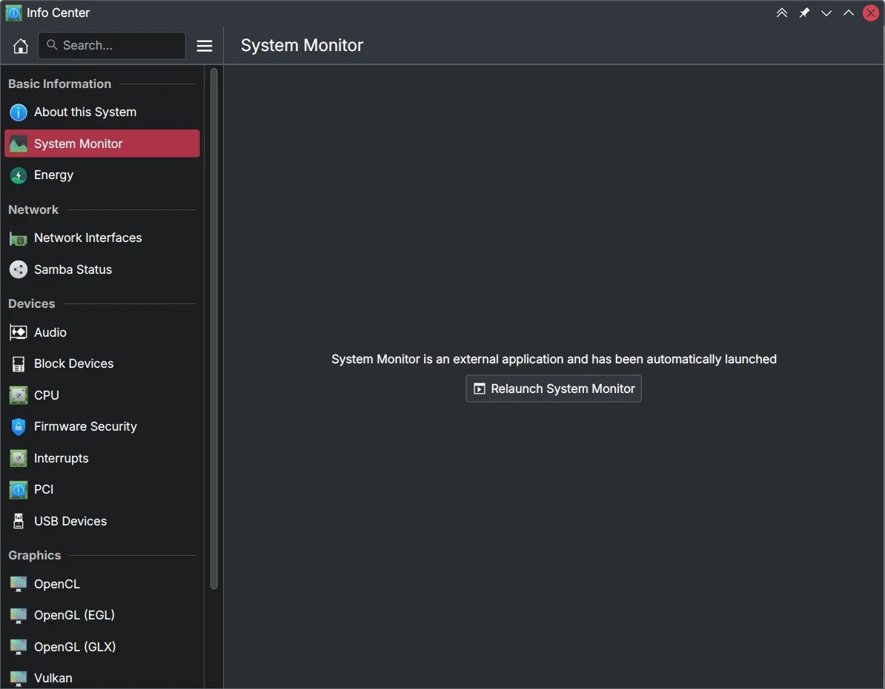
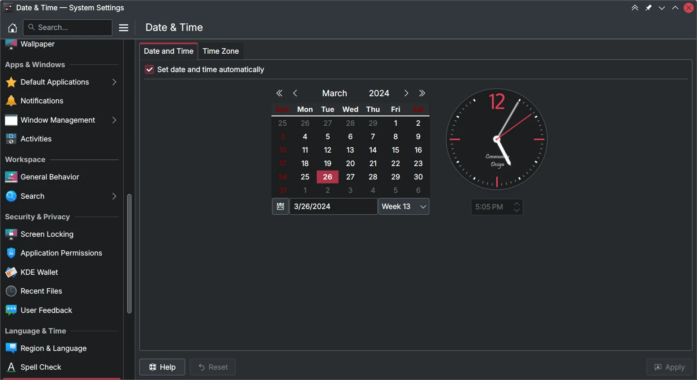
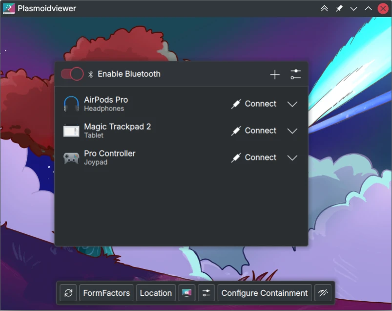
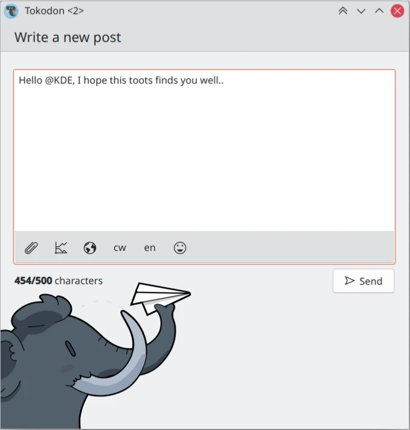
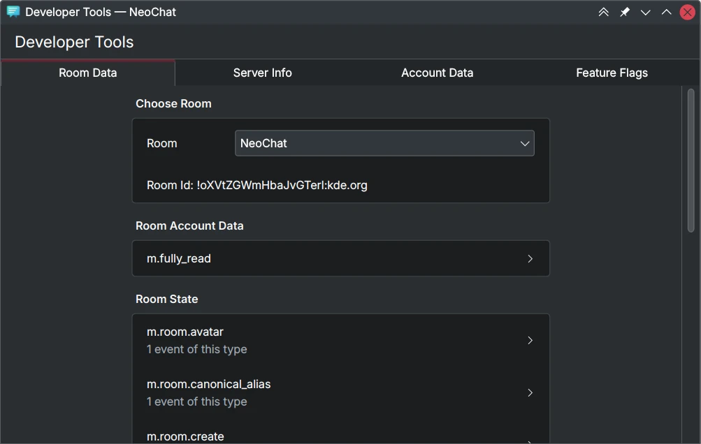
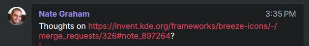

I didn't work much on KDE for the first half of March, but still managed to squeeze out some good features and bugfixes. I'm also starting on the Wayland grant work I teased soon, so look forward to news on that next month.

# Plasma

 The text and buttons [are now centered in KCMs that launch external applications](https://invent.kde.org/plasma/systemsettings/-/merge_requests/304), such as the System Monitor in KInfoCenter. 

 Fix numerous [spacing and layout issues in the Date & Time KCM](https://invent.kde.org/plasma/plasma-desktop/-/merge_requests/2150). 

 Actually disable [the calendar in the Date & Time KCM when NTP is enabled](https://invent.kde.org/plasma/plasma-desktop/-/merge_requests/2149). Basically fixing the bug you see in the above screenshot where the date picker is still enabled. 

 (Haven't been able to continue it yet) but [disable the searchbox and filter actions when there's no command output](https://invent.kde.org/plasma/kinfocenter/-/merge_requests/198). If you don't have the "aha" installed you shouldn't be able to search for non-existent text under "Firmware Security". 

 In the Bluetooth KCM, ["game controllers" are now called as such](https://invent.kde.org/plasma/bluedevil/-/merge_requests/163) where it was previously "joypads". 

 The same [device type names used in the Bluetooth KCM, are now used in it's applet](https://invent.kde.org/plasma/bluedevil/-/merge_requests/164).

# Tokodon

 Added [an alert badge for pages in the sidebar](https://invent.kde.org/network/tokodon/-/merge_requests/479). Currently only used for follow requests, but plan on adding it on other pages soon. 

 Allow [popping out the status composer](https://invent.kde.org/network/tokodon/-/merge_requests/480) on desktop. This allows you to compose toots while doing something else in the application, like browsing or searching for the correct hashtag. 

 I implemented more [key navigation fixes](https://invent.kde.org/network/tokodon/-/merge_requests/478). This set of fixes are centered around interacting with media attachments. There's still a long way to go before you can use Tokodon from a keyboard alone, but it's getting there. 

 Ported from [Qt5Compat.GraphicalEffects](https://invent.kde.org/network/tokodon/-/merge_requests/481). I usually don't mention boring refactors, this one is special. [Volker found that this old GraphicalEffects module eats up 4 MB of storage on Android](https://volkerkrause.eu/2023/12/16/kf6-android-porting-status.html#apk-optimizations) so this is a pretty big win! 

 Numerous [UnifiedPush notification fixes](https://invent.kde.org/network/tokodon/-/merge_requests/477). It's not perfect yet, but much better than it was before. 

# NeoChat

 Simple change, I made the [tabs in the developer tools full-width](https://invent.kde.org/network/neochat/-/merge_requests/1619). 

 Now [lonely question marks are excluded from links](https://invent.kde.org/network/neochat/-/merge_requests/1625) as they should be. Websites that don't handle this will throw up an error instead, so this eliminates lots of user error. 

 Fixed the [quick format bar not working](https://invent.kde.org/network/neochat/-/merge_requests/1626). 

# PlasmaTube

Lots of small UX changes this month. Including moving more actions to the header, reducing video title duplication and more. I can't make a good screenshot right now because [Invidious is currently broken due to Google's changes](https://github.com/iv-org/invidious/issues/4498). 

# Kirigami

 I did a little digging on where one of the color roles came from, and now noted where the [disabled text color comes from (on KDE Plasma)](https://invent.kde.org/frameworks/kirigami/-/merge_requests/1486). Still needs approval though 🙂 

 (Not approved yet) Stop the [back button from appearing even when we explicitly requested it gone](https://invent.kde.org/frameworks/kirigami/-/merge_requests/1495). 

# Documentation

Note that Plasma Framework is now [libplasma in the Breeze README](https://invent.kde.org/plasma/breeze/-/merge_requests/448). 

Clarify that the default alignment for Kirigami's ActionToolbar is [AlignLeft, not AlignRight](https://invent.kde.org/frameworks/kirigami/-/merge_requests/1496).  

---

That's all for this month!
