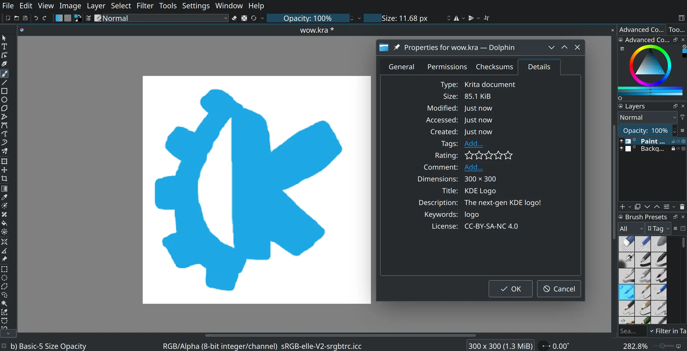

I can't believe it's already the end of May! This month turned out a little meatier than last month I think, but I still have a large backlog of merge requests and TODOs to go through.

# Plasma

 Now when there isn't enough space to display the QR code in the clipboard applet, there [is a clearer message of what to do next](https://invent.kde.org/plasma/plasma-workspace/-/merge_requests/2952).


 On the topic of QR codes, the menu [is now a menu of radio buttons and not checkboxes](https://invent.kde.org/plasma/plasma-workspace/-/merge_requests/2953) which didn't make sense because it's an exclusive option.


 There [is now a separator above the "Close" action](https://invent.kde.org/plasma/kwin/-/merge_requests/4132) in the window menu!


 I added [a metadata extractor for Krita files](https://invent.kde.org/frameworks/kfilemetadata/-/merge_requests/97), which means certain information about your Krita artwork can show up in Dolphin, Baloo and other programs that can take advantage of it! This includes helpful information such as canvas width, height and creation date.



 Soon, the Language and Region settings [will support the `$LANGUAGE` environment variable](https://invent.kde.org/plasma/plasma-workspace/-/merge_requests/2946). This only affects users who did not configure the language explicitly from KDE, like those coming from another computing environment. We already supported loading your pre-existing language from `$LANG`. Included in that merge request is a fix that stops an erroneous warning message telling you that your language isn't supported, even though it clearly is.

## Plasma SDK

 For new users of the Plasma SDK, [there is now a clearer and more helpful message when you start](https://invent.kde.org/plasma/plasma-sdk/-/merge_requests/75) `plasmoidviewer` without an applet specified.

```
$ plasmoidviewer
An applet name or path must be specified, e.g. --applet org.kde.plasma.analogclock
````

 I proposed [making the icon name selectable](https://invent.kde.org/plasma/plasma-sdk/-/merge_requests/76), because I can't stop myself from clicking on it!


## Gamepad KCM

Jeremy Whiting has been hard at work improving the backend code, and I finally took a shot at creating a proper art prototype of the controller that will be featured in the KCM.


This will be the base image for the different controller types, and it will change depending on what controller we detect. Neither of us are experts in Inkscape, so we plan for the this to be easily tweakable by actual designers who do not need to know the fine details of the KCM. This is possible because we're also developing an Inkscape extension to automate exporting SVG files into QML templates that describe button, trigger positions and so on.

The concept is already working in the KCM, but it looks a little off right now and isn't ready for showcasing yet :-)

# Tokodon

 Many users (including myself) have been experiencing crashes because of the video support added in the last release. QtMultimedia - the library we used for video support - in Qt5 is frustratingly buggy, but has improved in Qt6. Unfortunately, we still have a few more months before KDE Gear applications like Tokodon can switch to Qt6 only and we need a solution for the crashes _now_. I started [porting Tokodon's video support to mpv](https://invent.kde.org/network/tokodon/-/merge_requests/222) which is also used in PlasmaTube!

Playing videos and GIFs should be less crashy, but with worse scrolling performance. However, I worked hard to make sure this only affects auto-play, so if you don't that option enabled then you shouldn't notice a difference. This change is almost ready and should appear in the next release, but it lacks testing on Android.

 You can now [change certain account preferences](https://invent.kde.org/network/tokodon/-/merge_requests/238), but the selection is limited due to lack of a proper API. These are preferences that were supported before, but now you can change them from within Tokodon.


And a whole slew of smaller stuff, some which are appearing in the next bugfix release:

*  [Link previews are no longer broken](https://invent.kde.org/network/tokodon/-/merge_requests/246).
*  When switching between toplevel pages (Home, Explore, etc), [clear the entire page stack instead of part of it](https://invent.kde.org/network/tokodon/-/merge_requests/244).
*  The duplicate account [bug should _finally_ be fixed](https://invent.kde.org/network/tokodon/-/merge_requests/229)!
*  [Fix icons on non-KDE environments, such as GNOME](https://invent.kde.org/network/tokodon/-/merge_requests/228).


 For the current and future contributors, I started working on better and more detailed documentation. The first two areas I covered was [timeline models](https://invent.kde.org/network/tokodon/-/merge_requests/237) and the [account classes](https://invent.kde.org/network/tokodon/-/merge_requests/236)!

 In terms of starting even more future work, I started implementing [QtKeychain support, and rewriting the current, and buggy, account saving mechanism with KConfig](https://invent.kde.org/network/tokodon/-/merge_requests/248). This will hopefully land in the next release, and fix a whole slew of nagging security and account duplication bugs.

# qqc2-desktop-style

If you've been noticing that qqc2-desktop-style on Plasma 6 is spitting out some weird stuff in your logs:

```bash
Warning: file:///home/josh/kde6/usr/lib/qml/org/kde/desktop/private/MobileCursor.qml:33:13: Unable to assign [undefined] to bool (file:///home/josh/kde6/usr/lib/qml/org/kde/desktop/private/MobileCursor.qml:33, )
Warning: file:///home/josh/kde6/usr/lib/qml/org/kde/desktop/private/MobileCursor.qml:33:13: Unable to assign [undefined] to bool (file:///home/josh/kde6/usr/lib/qml/org/kde/desktop/private/MobileCursor.qml:33, )
Warning: file:///home/josh/kde6/usr/lib/qml/org/kde/desktop/private/MobileCursor.qml:33:13: Unable to assign [undefined] to bool (file:///home/josh/kde6/usr/lib/qml/org/kde/desktop/private/MobileCursor.qml:33, )
Warning: file:///home/josh/kde6/usr/lib/qml/org/kde/desktop/private/MobileCursor.qml:33:13: Unable to assign [undefined] to bool (file:///home/josh/kde6/usr/lib/qml/org/kde/desktop/private/MobileCursor.qml:33, )
```

 I [fixed that](https://invent.kde.org/frameworks/qqc2-desktop-style/-/merge_requests/254)! It also [needs these ECM changes to work](https://invent.kde.org/frameworks/extra-cmake-modules/-/merge_requests/359). It turns out ECMQmlModule didn't handle singleton types, and other nagging problems that qqc2-desktop-style needed. I've been dabbling in this module for the past month or so so it's exciting to be able to help here.

# Kiten

I took some time to improve the codebase of our Japanese reference tool [Kiten](https://apps.kde.org/kiten/), because it seems to have not been very active the past few years. I think it was written before we used C++11. I found a bunch of places where `0` was used to set pointers to null!

I started [replacing the old foreach macro](https://invent.kde.org/education/kiten/-/merge_requests/37), [use auto to prevent duplicate types](https://invent.kde.org/education/kiten/-/merge_requests/38) and [other modern C++ gardening tasks](https://invent.kde.org/education/kiten/-/merge_requests/39).

# Websites and Documentation

The [go.kde.org Matrix redirector update](https://invent.kde.org/websites/go-kde-org/-/merge_requests/1) is now merged, which I started in February. This means NeoChat is now preferred right below Element Web (which is still pointed towards https://webchat.kde.org/ ). Thanks to Thiago Sueto, [the Community Wiki has been updated already](https://invent.kde.org/teams/web/wiki-sites/-/issues/2#note_652483) and I sent two merge requests to update [kde.org](https://invent.kde.org/websites/kde-org/-/merge_requests/200) and the [footer](https://invent.kde.org/websites/hugo-kde/-/merge_requests/4).


To finish off more February work, I got around to working on the two big pieces of API documentation improvements for KDE Frameworks 6. If you don't remember, I wanted to add import statements for components meant to be used in Qt Quick. Doxygen already gives us hints for C++ headers, so QML users shouldn't be left in the dust. For example, how are you even supposed to use this component?


In order to accomplish this, subclasses of `QQuickItem` need to have their doc comments modified. The first library to get this treatment is plasma-framework, see the merge requests for [PlasmaCore](https://invent.kde.org/frameworks/plasma-framework/-/merge_requests/783), [PlasmaQuick](https://invent.kde.org/frameworks/plasma-framework/-/merge_requests/785) and [hiding ToolTipDialog](https://invent.kde.org/frameworks/plasma-framework/-/merge_requests/786).

For regular QML-based components, doxyqml (the tool to auto-generate QML documentation, because Doxygen lacks support for the language) needed to spit these out too. The [merge request to add import statements](https://invent.kde.org/sdk/doxyqml/-/merge_requests/16) is cleaned up, the tests fixed and ready for final review!


I also spent some time cleaning up [the Community wiki](https://community.kde.org/), which just means I roam around and make sure links aren't dead and the formatting looks nice. If you're interested in some wiki improvement, join us in [#kde-www](https://go.kde.org/matrix/#/#kde-www:kde.org) and the [Issue board](https://invent.kde.org/teams/web/wiki-sites/-/issues)!

# Packaging

I was recently researching how well Tokodon works out of the box on other desktop environments. It turns out 90% of issues with Kirigami applications can be solved by installing `breeze-icons` and `qqc2-desktop-style`! We might be enforcing this soon, so if you are in charge of packaging Kirigami applications, please make add them as weak or required dependencies! I will probably start filing packaging bugs soon.

In terms of KDE packaging issues in distributions, I opened up two this month:
* On Fedora, [Tokodon depends on QtMultimedia and will fail to launch](https://bugzilla.redhat.com/show_bug.cgi?id=2203557).
* On Arch Linux, [add khtml as an optional dependency for HTML preview](https://bugs.archlinux.org/task/78655?project=1&opened=39191).

# Akademy 2023

I'm also attending [Akademy](https://akademy.kde.org/) this year in Thessaloniki! My passport was delivered this month, which is strangely hard to get in the USA (currently.)



I booked my accommodations last week, so I'm excited to see everyone in-person in July! This is my first time traveling outside of the North American continent, and to Europe no less. I'll be documenting my experience traveling and at Akademy, but I'm not sure what format it'll be in yet.


