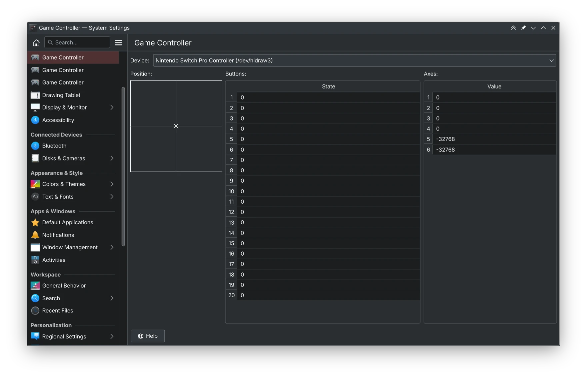
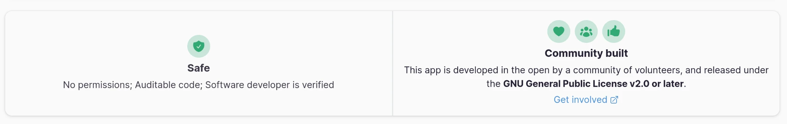

We're already in November, but I managed to do a lot of work this month which I'm really happy about.

Quickly something that's not strictly programming: I was accepted as a member of [KDE e.V.](https://ev.kde.org/) early this month, thank you all very much! I was also given moderation powers on [Discuss](https://discuss.kde.org) so maybe it will stop rate limiting me when moving posts around.

I also went on a crusade of merging and triaging merge requests on Invent, which some of you might've seen. Notably I was able to take care one or two pages worth of open MRs, which I'm really happy about.

Without further ado, let's begin.

# Plasma

 Merged [the Game Controller KCM into Plasma](https://invent.kde.org/plasma/plasma-desktop/-/merge_requests/1787), starting with a simple rewrite in QML. I'm aiming to add back the visual representation in 6.1 (which still exists in [the standalone repository](https://invent.kde.org/redstrate/gamepad-kcm) if you want to take a shot at it.) At least for right now the code is much better and it supports more devices than the 5.X Joystick KCM ever could. 

My hope is that since it's much cleaner and easier to work with, it would invite more contributors... [and it's already doing that as we speak](https://invent.kde.org/plasma/plasma-desktop/-/merge_requests/1868)! :-)

# NeoChat

 [Blockquotes now look more like quotes](https://invent.kde.org/network/neochat/-/merge_requests/1396), and no longer just somewhat indented blocks of text. 

 You [can now right-click (or long tap) on rooms to access the context menu without switching](https://invent.kde.org/network/neochat/-/merge_requests/1408 ) to it. I gave the [treatment for spaces a while back](https://invent.kde.org/network/neochat/-/merge_requests/1142). 

 [Added UnifiedPush support](https://invent.kde.org/network/neochat/-/merge_requests/1416)! It's functional already and I have used it to receive push notifications even when NeoChat is closed. 

# Tokodon

 I merged [the post redesign I was teasing on Mastodon](https://invent.kde.org/network/tokodon/-/merge_requests/397), which includes better margins and standalone tags. 

 The [language selector is now a regular dialog and not the buggy custom combo box](https://invent.kde.org/network/tokodon/-/merge_requests/405) we had before. It now displays the native language name, if available. 

 [Muting and blocking users has been accessible through profile pages, and now those actions are present in the post menu](https://invent.kde.org/network/tokodon/-/merge_requests/417) like on Mastodon Web. Useful for taking action against harmful users without navigating to a cesspool of a profile too. 

 [Added a report dialog](https://invent.kde.org/network/tokodon/-/merge_requests/418). It's a little basic right now, which I want to improve before release. 

 [Rebased and merged Rishi's Moderation Tool](https://invent.kde.org/network/tokodon/-/merge_requests/420), which works fantastic and I used this to test my reporting feature! 

 Added [a way to filter out boosts and replies from timeline pages](https://invent.kde.org/network/tokodon/-/merge_requests/427). 

 [Added supports for lists](https://invent.kde.org/network/tokodon/-/merge_requests/434). You can't add people to lists (you must use another client to do that) but you can at least view and manage them. 

# Kiten

 [Marked the X11 socket as fallback](https://github.com/flathub/org.kde.kiten/pull/44). This removes a warning on the Flathub page about the deprecated windowing system. 

 [Numerous UI improvements, such as improving the margins of configuration dialogs](https://invent.kde.org/education/kiten/-/merge_requests/46). I also redid the toolbar layout. 

 Added [a search function to the Kanji browser]((https://invent.kde.org/education/kiten/-/merge_requests/49)). 

# Kirigami

 [Fixed an edge cases of ToolBar incubation, which liked to spam logs](https://invent.kde.org/frameworks/kirigami/-/merge_requests/1362). I squashed some other log spam, so Kirigami applications should be less noisy. 

 Added a property to [FlexColumn that allows you to read the inner column's width](https://invent.kde.org/frameworks/kirigami/-/merge_requests/1365). We use this in Tokodon to set the width of the separator between posts. 

# Craft

I'm getting addicted to fixing Craft recipes, and there's a lot to fix in the upcoming 6.0 megarelease:

* [Preparing Tokodon for Qt6](https://invent.kde.org/packaging/craft-blueprints-kde/-/merge_requests/694)
* [Preparing MPV for an eventual Windows build](https://invent.kde.org/packaging/craft-blueprints-kde/-/merge_requests/698) by only requiring Linux-specific video APIs on Linux
* [Added a blueprint for MpvQt](https://invent.kde.org/packaging/craft-blueprints-kde/-/merge_requests/699) for future use in Tokodon and PlasmaTube
* [Added a KUnifiedPush blueprint](https://invent.kde.org/packaging/craft-blueprints-kde/-/merge_requests/701) for future use in Tokodon and NeoChat
* [Preparing KWeatherCore for Qt6](https://invent.kde.org/packaging/craft-blueprints-kde/-/merge_requests/710)
* [Preparing KWeather for Qt6](https://invent.kde.org/packaging/craft-blueprints-kde/-/merge_requests/711)

# KUnifiedPush

 [Improved the look of it's KCM](https://invent.kde.org/libraries/kunifiedpush/-/merge_requests/7). Not only does it look nice, and it's design is more in line with other list based ones.

# PlasmaTube

 [Added better hover effects for video items](https://invent.kde.org/multimedia/plasmatube/-/merge_requests/62). I did a bunch of refactoring to unify the two types (list and grid) so they work better in general (especially for keyboard-only navigation.) 

 [Added a video queue system](https://invent.kde.org/multimedia/plasmatube/-/merge_requests/63), which is exactly what you think it is. You can queue up an entire playlist, or add videos manually like on YouTube. 

 [Different types of search results is supported now](https://invent.kde.org/multimedia/plasmatube/-/merge_requests/66), so you can find channels and playlists. 

 [Public Piped instances are now fetched and displayed on initial setup](https://invent.kde.org/multimedia/plasmatube/-/merge_requests/68). 

 [Features of PlasmaTube that are unsupported by the current video source are now disabled or hidden](https://invent.kde.org/multimedia/plasmatube/-/merge_requests/67). This should result in less buggy and broken looking behavior depending on which video source you use. 

 [Added support for MPRIS](https://invent.kde.org/multimedia/plasmatube/-/merge_requests/70), which is used by the Media Player applet, the lockscreen and KDE Connect. 

# Accessibility

 Fixed our spinboxes not being read correctly by screen readers, since they were editable by default. Now the accessible descriptions and other data is passed down to the text field. Fixed in [QQC2 Desktop Style](https://invent.kde.org/frameworks/qqc2-desktop-style/-/merge_requests/318) (used on Plasma Desktop) and [QQC2 Breeze Style](https://invent.kde.org/plasma/qqc2-breeze-style/-/merge_requests/75) (Plasma Mobile and Android.) 

# Documentation

Found lots more missing Bugzilla links in Invent, and did some more README updating!

* [Added missing Bugzilla link for Ruqola](https://invent.kde.org/sysadmin/repo-metadata/-/merge_requests/274)
* [Updated README for Kiten, adding a screenshot](https://invent.kde.org/education/kiten/-/merge_requests/41)
* [Added Snap store links for NeoChat](https://invent.kde.org/network/neochat/-/merge_requests/1434) and Tokodon
* [Added missing Bugzilla product for kdesrc-build](https://invent.kde.org/sysadmin/repo-metadata/-/merge_requests/276)
* [Expanded plasma-integration's README](https://invent.kde.org/plasma/plasma-integration/-/merge_requests/118)
* [Wrote the README for our new Accessibility Inspector](https://invent.kde.org/accessibility/accessibility-inspector/-/merge_requests/2)
* [Expanded the README for qqc2-desktop-style](https://invent.kde.org/frameworks/qqc2-desktop-style/-/merge_requests/324), and now contains usage information and why it's different than qqc2-breeze-style. Did [the same for qqc2-breeze-style too](https://invent.kde.org/plasma/qqc2-breeze-style/-/merge_requests/81)

# KWeather

 Fixed [the setup wizard](https://invent.kde.org/utilities/kweather/-/merge_requests/92). 

# Upcoming

 Not merged yet, [but I'm adding a pen calibration tool to the Tablet KCM](https://invent.kde.org/plasma/plasma-desktop/-/merge_requests/1833). If you have the required equipment and can test, please help out! It's cutting it close to the feature freeze, so this will most likely be pushed off until 6.1.

See you in December!
