 
---
title: "My work in KDE for October 2023"
date: 2023-10-28
draft: false
tags:
- Linux
- Open Source
- KDE
- Qt
toc: true
series:
- My Work in KDE
---

Happy October and other related holidays! The list of work is a bit smaller, as predicted I was busy this month. However, I have some really exciting work done in PlasmaTube - some of which you may have already seen if you follow me on [Mastodon](https://mastodon.art/@redstrate).

I also added a better way to discern bugfixes from features in these posts! It also details which branches and versions the change will appear in. I will be adding this slowly to older posts. I'm also really close to completing a whole year of this blog series, which I started back in [January 2023]()! 🎉 I'll be detailing more of 2024 plans in December.

# Tokodon

 I added support for viewing [server announcements](https://invent.kde.org/network/tokodon/-/merge_requests/331)! It doesn't  support emoji reactions yet, because I want to also implement emoji reactions in general (if your server supports it.) 

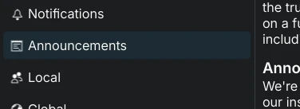

 Fixed more cases where [media attachments wouldn't load](https://invent.kde.org/network/tokodon/-/merge_requests/383), if some of the metadata was invalid.  

 The [window geometry and position (if on X11) is now saved and restored](https://invent.kde.org/network/tokodon/-/merge_requests/387). 

 A profile's [featured tags are now shown in the filter bar](https://invent.kde.org/network/tokodon/-/merge_requests/393). You can select between them or reset it by tapping on "All". 

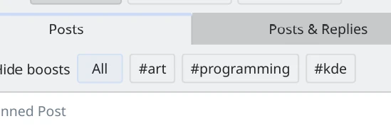

 The selected post in a thread is [now scrolled to initially](https://invent.kde.org/network/tokodon/-/commit/141cd723d68eaa039f53d63cf12b90d2bffa4d2e), so you don't have to scroll so much when viewing replies. 

 When scrolling to the very end of a timeline, [a message is now shown that it's really the end](https://invent.kde.org/network/tokodon/-/commit/8e8f213aa21455c88b7f5ee97da46cb26869ac1d) and you didn't encounter some kind of bug. 

 Tokodon [now supports basic notification actions](https://invent.kde.org/network/tokodon/-/merge_requests/382) such as viewing the post or the user's profile. More actions are planned in the future, but this is a good start. 

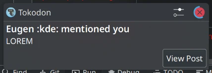

 I [cleaned up and merged the offline testing system](https://invent.kde.org/network/tokodon/-/merge_requests/380) that was originally pioneered by [Rishi Kumar](https://blog.rishikumar.dev/about/). This doesn't affect users, but means that Tokodon can be tested more easily. Aka, more stable software! :-) 

 Add [missing PulseAudio, FreeDesktop Secrets and notification permissions](https://github.com/flathub/org.kde.tokodon/pull/37) for the Tokodon Flatpak.  

# NeoChat

 NeoChat state (such as event cache) will [now be stored in it's own state file, called "neochatstaterc"](https://invent.kde.org/network/neochat/-/merge_requests/1354) in `~/.local/share/KDE/neochat`. This matches the behavior of other KDE applications, instead of the weirdly named "data" file like before. 

 The [event cache is now compacted so it's a little bit smaller, and easier to read](https://invent.kde.org/network/neochat/-/merge_requests/1355). 

 The [recent emojis are now saved in the state file, instead of the regular config file](https://invent.kde.org/network/neochat/-/merge_requests/1356). Less state in there, woohoo! 

# Kirigami

 You can now [control the isMask property of a Chip](https://invent.kde.org/frameworks/kirigami/-/merge_requests/1303). Otherwise, this property is inaccessible, preventing you from changing the icon color. 

# PlasmaTube

I did a _ton_ of work improving PlasmaTube this month. If you haven't been using PlasmaTube yet, or haven't tried it in a while... 24.02 in February will be packed with new features and bugfixes!

 PlasmaTube is [now Qt6, complete with the new declarative type registration system](https://invent.kde.org/multimedia/plasmatube/-/merge_requests/58). For users, it means that it's marginally faster and that it's ready for the February mega-release. 

 [Different video sources other than Invidious is now supported](https://invent.kde.org/multimedia/plasmatube/-/merge_requests/59)! The current plan plan is to support [Invidious](https://invidious.io/), [Piped](https://github.com/TeamPiped/Piped) and [PeerTube](https://joinpeertube.org/) by 24.02. The feature set of the new video sources are currently limited compared to Invidious, but will be expanded. 

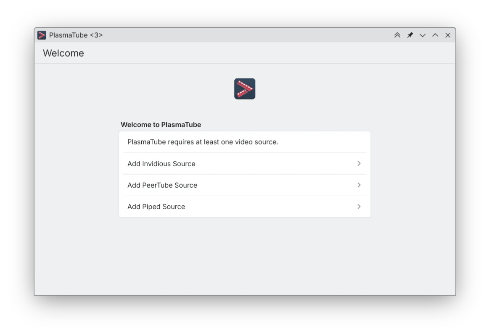

 Selecting between video sources is now supported, for example if you have a Invidious instance but also want to watch PeerTube content. 

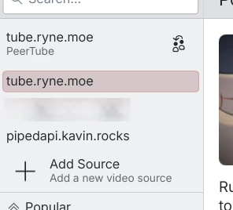

 Along with that, the overall login flow is overhauled to match other Kirigami applications. You can even select from a list of public instances. (Keep in mind that the UI is still a work in progress and will be improved before release.) 

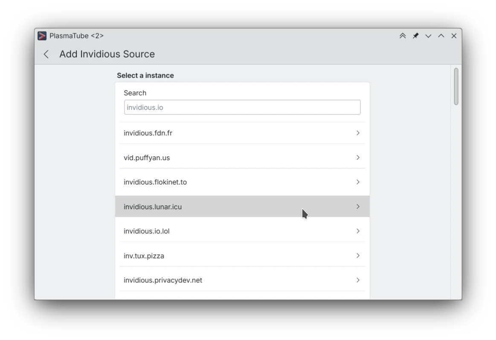

 The sidebar is no longer icon only, and matches the UX of other Kirigami applications such as [NeoChat](https://apps.kde.org/neochat/), [Tokodon](https://apps.kde.org/tokodon/) and [Arianna](https://apps.kde.org/arianna/). There are now several tabs such as "Popular", "Trending", "Subscriptions", "Playlists" and "History". Some of these are disabled depending on if you're logged in and if the video source supports them. 

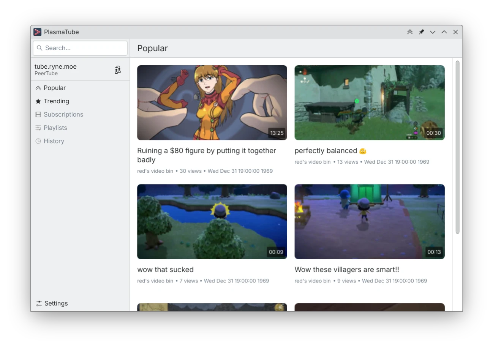

 The "Trending" page [has been overhauled to use tabs](https://invent.kde.org/multimedia/plasmatube/-/commit/1a60f02c7826788310e8a023c4a82a267517adb5) instead of stuffing all of the different types into the page's actions. 

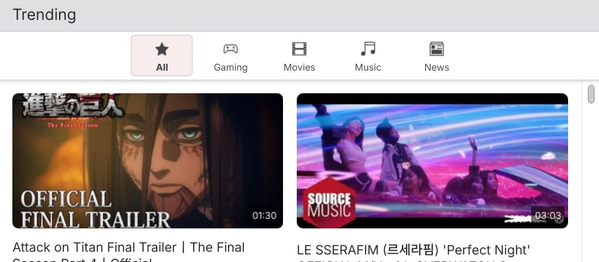

 Added [a "Playlists" page](https://invent.kde.org/multimedia/plasmatube/-/commit/3cc3cadaeda73d083db9dc444593d9283baac84f)! Right now you can only view playlists, but I plan on adding more advanced playlist management soon. 

 Added [a "History" tab, which of shows you recently watched videos](https://invent.kde.org/multimedia/plasmatube/-/commit/e06eb6c2f501831c0aae495cd6b05e7fc9fc44d8). 

 Added [a new context menu](https://invent.kde.org/multimedia/plasmatube/-/commit/e272b55555ecc4b89c38d630c6ca468b5ba4188e), shown while long tapping or right-clicking on a video item. You can mark a video as watched or unwatched, add it to a playlist and more. 

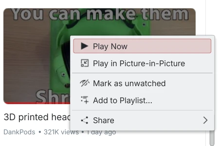

 Added [a picture in picture mode](https://invent.kde.org/multimedia/plasmatube/-/commit/afc573b49cf2e9125b15572f9a626e6d2a259cef)! It's even possible to control the video using the normal controls in the main window. When closing the PiP window, it will also restore the position in the main player too. 

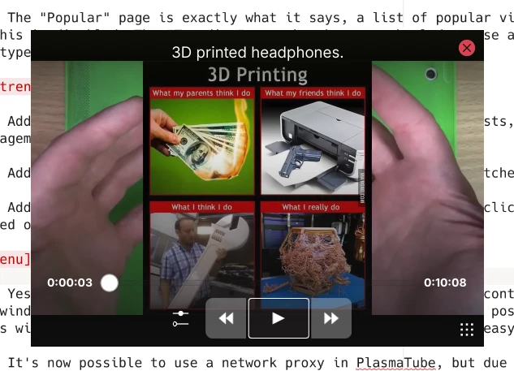

 It's [now possible to use a network proxy in PlasmaTube](https://invent.kde.org/multimedia/plasmatube/-/commit/48d486975e3ec5e936b7b3c8931ba1610d2a8333), but due to FFmpeg limitations you can only set a HTTP proxy unlike other KDE applications which support a SOCKS5 proxy. 

 You can [now change the default homepage for Invidious sources](https://invent.kde.org/multimedia/plasmatube/-/commit/5a9f817dace1e7b9d3f028e3cf509b5b9cfebeda), which also syncs to the Invidious web frontend and any other clients that support this key. More settings will be available in the future, such as autoplay (which currently does nothing.) 

 You [can now view comments on a video](https://invent.kde.org/multimedia/plasmatube/-/commit/9541fa0e3eea2f847d947fca8a2d014a9d9ce520), which is supported in Invidious, PeerTube and Piped sources. They aren't very detailed yet, and threading is not yet supported. 

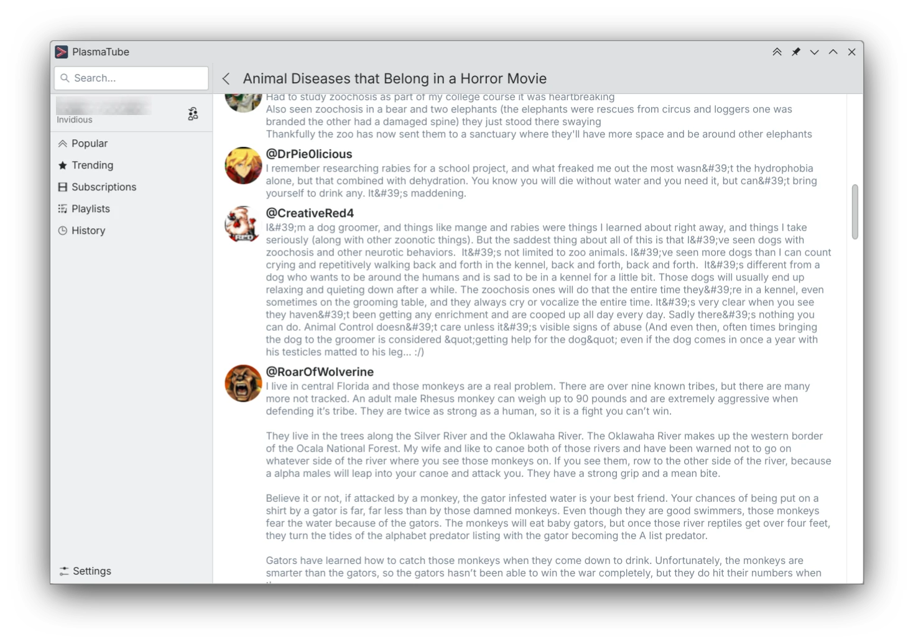

 A [channel's avatar, banner and description is now shown on the channel page](https://invent.kde.org/multimedia/plasmatube/-/commit/23b9cb286256830d60f3c138e485488c8676f5b9). Eventually other channel tabs like playlists will be available here too! 

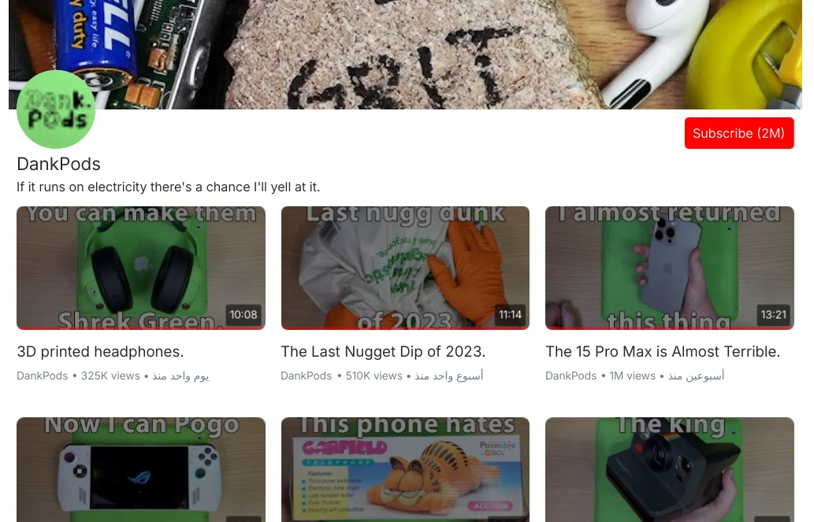

# Merkuro

 Fixed a bug [where certain locales would be unable to use the date picker](https://invent.kde.org/pim/merkuro/-/merge_requests/410).  

# KWallet

 Fixed [the "Configure KWallet..." menu item not working](https://invent.kde.org/utilities/kwalletmanager/-/commit/5a07e6c38fcbd76f38398606bfdfda59301bf364). 

 Added a [visible error message for conditions where KWalletManager could fail and display nothing](https://invent.kde.org/utilities/kwalletmanager/-/merge_requests/35), like the DBus service failing to activate. 

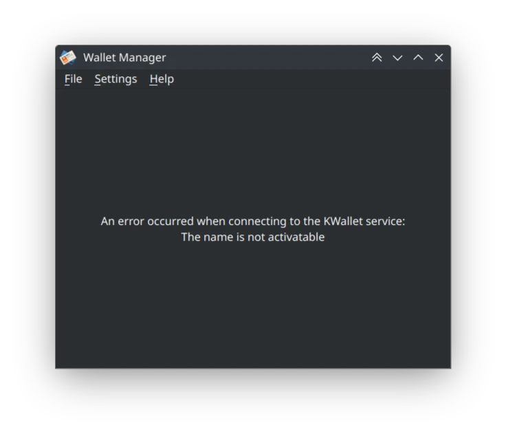

# KWin

 Fixed the [default keybinds for "Switch to Next/Previous Desktop" not being set properly by default](https://invent.kde.org/plasma/kwin/-/merge_requests/4519), when they probably should.  

# Plasma

 A bunch of [small improvements and fixes for the "Show Activity Manager"](https://invent.kde.org/plasma/plasma-desktop/-/merge_requests/1772) applet. This is mostly fixing stuff that was broken due to KF6 changes. 

# Kirigami Addons

 Prevent [a crash when calculating initials in names that _only_ have parenthesis](https://invent.kde.org/libraries/kirigami-addons/-/merge_requests/183), such as "(gobble)". This affects the new Avatar component. 

See you next month!
