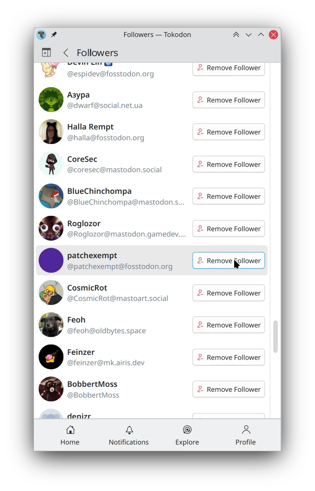
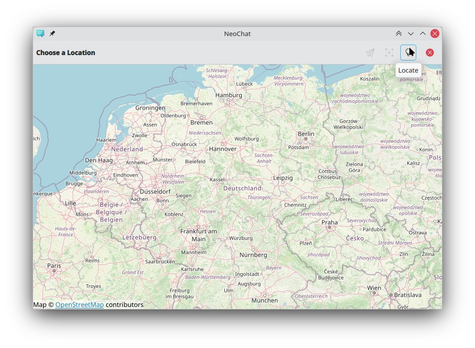

Hello again, sorry it's been a while since the last post. In this case, I'm doing a never-before-seen multi-month post!

This may be **the last post in this series**, as the KDE Promo team has launched ["This Week in KDE Apps"](https://blogs.kde.org/categories/this-week-in-kde-apps/) which covers my work here (and I also have plans to contribute to... 😅) Nate Graham typically reports on my Plasma changes in his ["This Week in Plasma"](https://pointieststick.com/category/this-week-in-plasma/) series. All that would be left is the uninteresting changes, so I was thinking it might be more sensible to do an [emersion](https://emersion.fr/blog/)-style "Status update" that's isn't strictly KDE related. We'll see!

# Plasma

 You can [now tweak the pen pressure](https://invent.kde.org/plasma/plasma-desktop/-/merge_requests/1972). This is useful if you prefer a specific style to your strokes, and you can't change this directly in your preferred application. We plan to have add "soft" and "hard" presets to make using the curve easier. This is one of the last items paid for by [our NLnet grant](https://nlnet.nl/), so it's exciting to see it finally come to fruition! 

 The [stylus cursor is now hidden on the Calibration page](https://invent.kde.org/plasma/plasma-desktop/-/merge_requests/2578) but this will only work once your distribution switches to Qt 6.8. The credit belongs to [Nicolas Fella](https://nicolasfella.de/) as he's the one who put in the work upstream in Qt! 

 The [calibration accuracy is now improved slightly](https://invent.kde.org/plasma/plasma-desktop/-/merge_requests/2579) and refining your existing calibration further should work closer to how you expect. 

 Added more [safety rails in the Calibration code to prevent possible crashes](https://invent.kde.org/plasma/plasma-desktop/-/merge_requests/2577). 

 Made sure the [calibration matrix is reset when you hit the "Defaults" button](https://invent.kde.org/plasma/plasma-desktop/-/merge_requests/2576). 

 Now the [Calibration window opens on the correct screen](https://invent.kde.org/plasma/plasma-desktop/-/merge_requests/2575). 

 Now the [action dialog doesn't show up in the wrong place](https://invent.kde.org/plasma/plasma-desktop/-/merge_requests/2585) when your KCM scrolls a lot, like mine. 

# Tokodon

 The [welcome page when you first open Tokodon now looks much nicer and friendly](https://invent.kde.org/network/tokodon/-/merge_requests/524). Hopefully it makes it clearer what Tokodon is, and also includes an even clearer badge to indicate what service it connects to. 

 Display [public servers to ease registration for first-time Mastodon users](https://invent.kde.org/network/tokodon/-/merge_requests/531). Right now there's not any filtering options, but this is a huge improvement over an empty textbox and expecting users to know where to find a server. 

 My [post tag display improvement was merged](https://invent.kde.org/network/tokodon/-/merge_requests/470), which limits tags to one line. Note that this isn't the final design we'll go with, but they will no longer spill onto multiple lines. 

 It seems people want [Cohost's "Following" feed for Mastodon](https://mastodon.social/@mcc/113223217966405584), and of course Tokodon could do it! So that's what I did, and [implemented Cohost's "Following" feed](https://invent.kde.org/network/tokodon/-/merge_requests/537). Albiet it's currently limited due to the Mastodon API we have available, so it comes with two big caveats currently: You only see when people were last active by the day, and the pagination kinda sucks. 

 Added support [for managing your social graph within Tokodon](https://invent.kde.org/network/tokodon/-/merge_requests/544). For example if you don't want someone to follow you anymore, or to quickly unfollow someone from your "Following" list. 

 Self-identified bots are [now correctly identified on the profile page](https://invent.kde.org/network/tokodon/-/merge_requests/543). 

 Due to limitations in the Mastodon API, we [now put a button on the account page to denote there are more settings available online](https://invent.kde.org/network/tokodon/-/merge_requests/550). 

 Changed the [media tab to a grid view](https://invent.kde.org/network/tokodon/-/merge_requests/540), making it easy to see a user's media all at once. This works different compared to Mastodon Web as you can even filter by featured tag in this mode - but it's not shown in this screenshot. 

 Laid [the initial groundwork unread notifications](https://invent.kde.org/network/tokodon/-/merge_requests/555). You now have a number indicator in the sidebar for unread notifications, and mark them as read. 

 Added [list user management](https://invent.kde.org/network/tokodon/-/merge_requests/557), so now you can use lists to their full advantage within Tokodon itself. 

 The warning iconography for "Content Warnings" are now removed, and [replaced with "Content Notice" to denote it's true and more generic purpose](https://invent.kde.org/network/tokodon/-/merge_requests/556). 

 Added [support for read markers, allowing you to continue reading where you last left off](https://invent.kde.org/network/tokodon/-/merge_requests/364). 

 Now the [authorship of links are displayed in link preview cards](https://invent.kde.org/network/tokodon/-/merge_requests/559) including a Mastodon account, if available. See [this official Mastodon blog post](https://blog.joinmastodon.org/2024/07/highlighting-journalism-on-mastodon/) for more details. 

 Added a [way to view poll results before voting, finally](https://invent.kde.org/network/tokodon/-/commit/5591e679abcf56d162a0d6df51eb55d7e184d710). 

 Now it's possible to [see which poll options you voted for](https://invent.kde.org/network/tokodon/-/commit/17fc24af68da6c608bbd977a9bd16e8c58f92ded). 

 When clicking [the "ALT" button, the media description pops up](https://invent.kde.org/network/tokodon/-/commit/5ee4a2199ed7c6764038a8d6db47bcc684d18ec7). This could be useful if you want to quickly view what the media is, before unhiding it. 

 Tokodon now supports [displaying admin report, severed relationship and moderation warning notifications](https://invent.kde.org/network/tokodon/-/commit/fd242b280e7df1b726d2d636d6529dea55bceb18). These [notifications can then be configured in the notifications settings as per usual](https://invent.kde.org/network/tokodon/-/commit/80b5f1d551e465f20a284bc540cdf206227bf09c). The details shown in the notifications can still use a bit of work, though. 

 The [Notifications page is redesigned, to better suit non-English languages](https://invent.kde.org/network/tokodon/-/commit/1ffa1aa7a067c9a6617157c5f24e1cf73a47fed2). I also added a [button to go straight to Notification settings from here](https://invent.kde.org/network/tokodon/-/commit/173150dacb417c2bc107021316a5346e3d0b0ba5). 

 When you're using Tokodon on a newer and emptier Mastodon account, the application is much [friendlier with more helpful explanatory text everywhere](https://invent.kde.org/network/tokodon/-/commit/34f67749ca3572fe6f54a0b23b7e9d48ed20b8b0). 

 Tokodon's UI is now [more responsive](https://invent.kde.org/network/tokodon/-/commit/1b8c98dece63c60a323c7d41c15ff4dc4dd85b89). The sidebar will appear on mobile devices if their screen is wide enough, like the Android tablet I use Tokodon on. 

 [Timeline streaming and read markers can be turned off, if you prefer](https://invent.kde.org/network/tokodon/-/commit/cb433cffc571a66a5a0f868bb753157e2417c2d3). 

 When viewing [someone's profile, a list of people you follow that you have in common is now shown](https://invent.kde.org/network/tokodon/-/commit/f810398de3c1a810f206bb7b30a532d6191cf27d). Hopefully this will make it easier to find new friends on Mastodon! 

 You can now [edit your profile fields within Tokodon, without having to do it through Mastodon Web](https://invent.kde.org/network/tokodon/-/commit/a8768cd85f0b00b2b26bffcc1dff2300ddf429d6). 

 You can now [see trending links (or "news") on the Explore page](https://invent.kde.org/network/tokodon/-/commit/743f7745e552fa6857057b34c15f5fd47a62220b), and [also suggested users](https://invent.kde.org/network/tokodon/-/commit/6c8de3552cef75f4897a3b36a3b0a862fb2ea15b). I'm intentionally not showing a screenshot since it doesn't look very good yet. 

 The [font size in the post composer now follows your preferred font setting](https://invent.kde.org/network/tokodon/-/commit/f08208beda12b247a38e28d37874a60cb2b3ae32). 

 Tapping a [post only works by tapping on the content itself, not the margins](https://invent.kde.org/network/tokodon/-/commit/593193e9b1d105d099fbc4aeba5c36b20cb0d7a7). 

# NeoChat

 You can [open location links in your preferred map application](https://invent.kde.org/network/neochat/-/merge_requests/1859). This is the same Map application under the Applications KCM, so you can choose something like [OpenStreetMap](https://openstreetmap.org) or even [Marble](https://apps.kde.org/marble/). 

 The [location chooser is now better in general](https://invent.kde.org/network/neochat/-/merge_requests/1858). There's a toolbar button to re-center the map, and if your device supports positioning then it can use that to center itself. 

 The [security page is overhauled and now contains more relevant settings from other pages](https://invent.kde.org/network/neochat/-/merge_requests/1869). 

 NeoChat's [welcome page when you first open it now looks a bit nicer](https://invent.kde.org/network/neochat/-/merge_requests/1853). 

 Now when you [only have friend invites and no messages a better icon is displayed](https://invent.kde.org/network/neochat/-/merge_requests/1856), instead of none at all. 

 The [buggy look of the date section header is _finally_ fixed](https://invent.kde.org/network/neochat/-/merge_requests/1854). 

# Itinerary

 I added support [for United Airlines reservations](https://invent.kde.org/pim/kitinerary/-/merge_requests/127), so they can be imported to [Itinerary](https://apps.kde.org/itinerary/) and show up in KMail. Paired with [Kalendar](https://apps.kde.org/kalendar/), this makes it really easy to keep track of my travel plans! I hope to add support for more North American airlines as I fly them, it's surprisingly easy to write extractors. 

# Frameworks

 Added [support for separator actions in ToolBarLayout](https://invent.kde.org/frameworks/kirigami/-/merge_requests/1506) in Kirigami. 

 Added [command names for "Remove Spaces" and "Keep Extra Spaces"](https://invent.kde.org/frameworks/ktexteditor/-/merge_requests/723) in KTextEditor, for a secret future project. 

You can now [disable the scrollbar interactivity on ScrollablePages](https://invent.kde.org/frameworks/kirigami/-/merge_requests/1640) in Kirigami. 

Initial support for [QML bindings to the KTextAddons emoticons API](https://invent.kde.org/libraries/ktextaddons/-/merge_requests/18). This means that eventually our applications will no longer need to have their own special emoji picker, and our Unicode data will be unified! 

# Libraries

 The [caption text in applications that use the Kirigami add-ons fullscreen image viewer is now copyable](https://invent.kde.org/libraries/kirigami-addons/-/merge_requests/277). I usually write alternative text for my artwork in Tokodon first, and then copy it elsewhere. So it's really cool to be able to do this within Tokodon itself and not have to go through Mastodon Web. 

# KDE Goals

The goal I championed for, _"We care about your Input"_ was selected! You can check it out on the [goals page on the KDE website](https://kde.org/goals/), which also includes links to our public workboard, chat and the original proposal. Let's make KDE Plasma the perfect desktop environment for artists! (And everyone else too, I guess 😜)

# Akademy

I also attended Akademy this year! You can read [more about it in it's dedicated blog post]() if you missed it.

---

It's [been almost a year]() since I started this series, and I can't believe I've done almost a dozen of these. People seem to really like them, and I'm really appreciative of that! Like I said in the beginning, there will most likely not be a next part as it will be rolled into someone else's blog posts now.

If you want a hint as to what I'll be about blogging next, you might want [to remember where this all began]().


