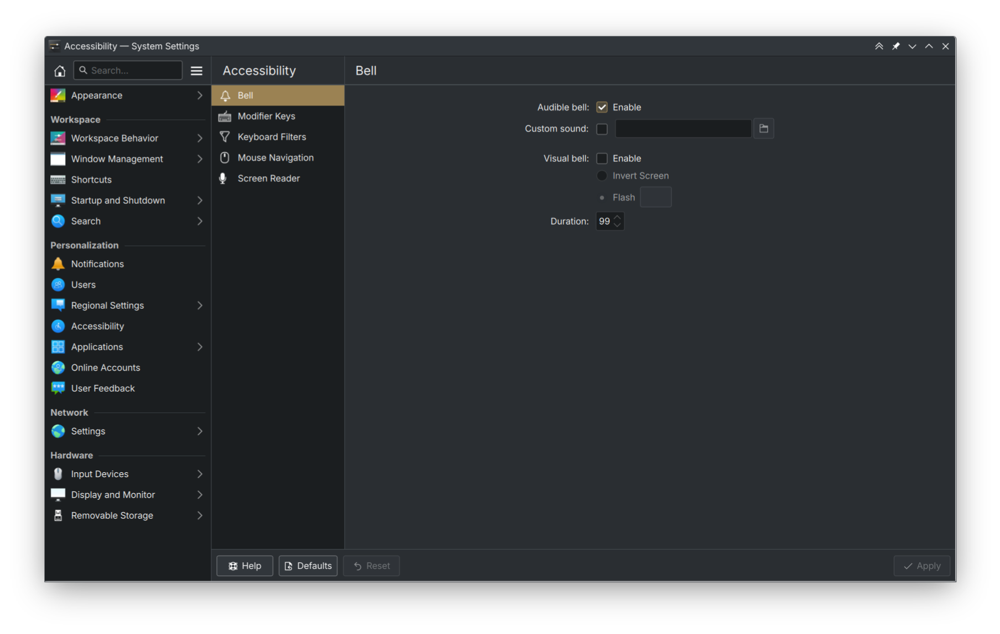
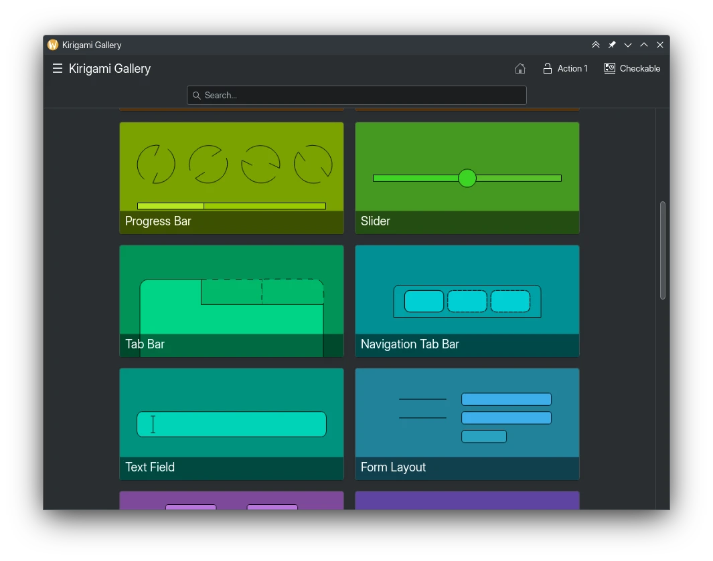

I might be busy early next month, so I'm posting this a few days early so I get it out of the way! I managed to do a lot of big stuff this month, and pretty happy with my pace. I still have way too many open MRs though, I really need to get that sorted.

Sorry about the shoddiness of some of the screenshots. We are the midst of our Qt6 transition, and sometimes my Breeze is broken and fell back to a built-in Qt theme. I promise it won't look that ugly in a couple of months!

# Plasma

I redid the [Accessibility KCM](https://invent.kde.org/plasma/plasma-desktop/-/merge_requests/1737) to make it look a bit nicer, by using the newer sidebar view we use in other KCMs. This still needs some time in the oven, though.



The [kaccess daemon now reloads it's config files properly](https://invent.kde.org/plasma/plasma-desktop/-/merge_requests/1736), causing odd behavior like the screen reader never turning off.

# Tokodon

The [Send button in the composer now changes depending on why you opened it.](https://invent.kde.org/network/tokodon/-/merge_requests/352). This is an easy way to confirm you're resending, editing and so on.


I implemented a lot of [UX improvements for the profile page](https://invent.kde.org/network/tokodon/-/merge_requests/355). It's way harder to mess up the timeline state by clicking through tabs too quickly. Oh yeah, and [that's fixed for the notification page filters too](https://invent.kde.org/network/tokodon/-/merge_requests/359).

The settings [are overhauled and using the new CategorizedSettings component](https://invent.kde.org/network/tokodon/-/merge_requests/358) which will make it easier to add more. This has already made space for [granular per-account notification controls](https://invent.kde.org/network/tokodon/-/merge_requests/372)!


High character count posters rejoice, as [the status composer](https://invent.kde.org/network/tokodon/-/merge_requests/357) is now usable for you! This will also appear in 23.08, so you don't have to wait until the next major release.


The alignment of the top row of buttons in posts is [ever so slightly fixed now](https://invent.kde.org/network/tokodon/-/merge_requests/360) so it looks prettier, and has better clickable areas.

| Before | After |
| ------ | ------ |
|   |  |

I ported the [whole application to Qt6 declarative type registration, and other niceties](https://invent.kde.org/network/tokodon/-/merge_requests/367). This doesn't mean anything for users, but Tokodon should be a bit faster.

If you were ever frustrated with logging into Tokodon, fear not as in the next release [the entire process is redone](https://invent.kde.org/network/tokodon/-/merge_requests/373). I rewrote the entire UX to be way more user friendly, less buggy and it supports some cool features like a integrated authorization flow and registration!


Tokodon will now show you a visible warning and explain why your account did not log in, instead of kicking you back to the login page like before:


Finally, a few [media attachment improvements](https://invent.kde.org/network/tokodon/-/merge_requests/378) such as media attachments being blacked out if the blurhash is missing (which happens, apparently) and an "Alt" tag that shows up in the top right if the image has alt text. Saves me a click or two, and especially useful for video.


# NeoChat

I'm attempting to fix the [lack of formatting when re-editing messages](https://invent.kde.org/network/neochat/-/merge_requests/1283). It won't be finished this month, but I'm close!



Two event source dialog changes, including it [not showing any data](https://invent.kde.org/network/neochat/-/merge_requests/1284) and [only showing the option if you have developer tools enabled](https://invent.kde.org/network/neochat/-/merge_requests/1285).

The error message when [your device encryption keys are somehow different than what's currently in your database](https://invent.kde.org/network/neochat/-/merge_requests/1152) is now clearer, and tells you to log back in.

# PlasmaTube

The [sidebar is reorganized so more pages are separated as you might expect](https://invent.kde.org/multimedia/plasmatube/-/merge_requests/49). There's still some work to be done here.


Added support for [passing a video URL via the commandline](https://invent.kde.org/multimedia/plasmatube/-/merge_requests/56).

Made sure PlasmaTube [inhbits sleep like other well-behaving video applications](https://invent.kde.org/multimedia/plasmatube/-/merge_requests/57) when fullscreen.

# Kirigami

Finally merged the [Navigation Tab Bar](https://invent.kde.org/sdk/kirigami-gallery/-/merge_requests/42) page for Kirigami Gallery! It's a simple example of this component that we use quite often on mobile.



I changed the fullscreen image viewer used in NeoChat, Tokodon and more to [stop listening to swipe events with the mouse](https://invent.kde.org/libraries/kirigami-addons/-/merge_requests/157) and stop wrapping key navigation. For application developers, make sure you [set the focus properly when opening it](https://invent.kde.org/network/tokodon/-/merge_requests/365) so key navigation works.

I [fixed the FormArrow bug in Qt6 where it would point the wrong direction](https://invent.kde.org/libraries/kirigami-addons/-/merge_requests/161) and thanks to Ivan Tkachenko for pointing out that we could use the existing enum in Qt. All consumers of this component have already been ported.

The CategorizedSettings component got some fixes as well, including the [ability to filter out invisible actions](https://invent.kde.org/libraries/kirigami-addons/-/merge_requests/163) (useful for hiding certain pages on other platforms, e.g. Android.) and [fixing the stuck checked state](https://invent.kde.org/libraries/kirigami-addons/-/merge_requests/162). There's still a lot of work to do on this component, but it's a start!

# KCoreAddons

I added a [QML singleton for grabbing the applications' KAboutData](https://invent.kde.org/frameworks/kcoreaddons/-/merge_requests/377) instead of it being reimplemented for every single QtQuick application. I have no idea why we didn't do this before!

```qml
import QtQuick
import org.kde.kirigamiaddons.formcard as FormCard
import org.kde.coreaddons

FormCard.AboutPage {
    aboutData: AboutData
}
```

# Qt

We are [trying to adopt qmlformat](https://invent.kde.org/teams/automation/issues/-/issues/7) in KDE. I spend a unreasonable amount of time fixing formatting, so it would be nice to have it automatically happen like we already use clang-format for with C++. I have managed to make some really good headway here, and squash lots of little nagging bugs we have hit. These have not been merged into Qt yet, but I hope we can get them reviewed soon. (If you have approver rights, I would appreciate if you took a look!)

I fixed a bug where [qmlformat would indent call expressions twice](https://codereview.qt-project.org/c/qt/qtdeclarative/+/503777) causing weird indentation like this:

```qml
onTestChanged: {
fooBar(test, {
        // Testing
        "foo": "bar"
        });
}
```

[qmlformat shouldn't insert newlines in empty components and objects](https://codereview.qt-project.org/c/qt/qtdeclarative/+/502964) which we use in a lot of QML code. Normally qmlformat would format them like this, which wastes space and looks kinda ugly:

```qml
QtObject {
}
```

Oh yeah, and [object declarations in arrays should look less insane](https://codereview.qt-project.org/c/qt/qtdeclarative/+/503822).

If you use spaces to delineate groups of import statements, [qmlformat should now try to preserve that instead of destroying it](https://codereview.qt-project.org/c/qt/qtdeclarative/+/503775).

And two more small things: [fixing the command line arguments not overriding anything](https://codereview.qt-project.org/c/qt/qtdeclarative/+/502966?usp=dashboard) and [fixing the QML coding conventions documentation](https://codereview.qt-project.org/c/qt/qtdoc/+/502965?usp=dashboard).

