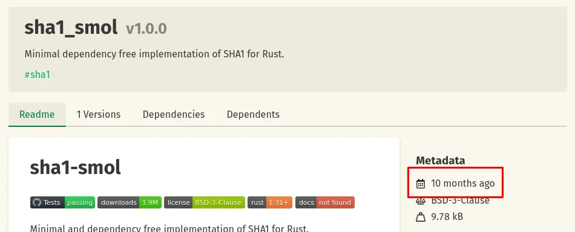
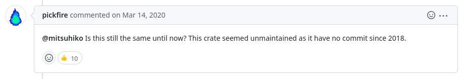
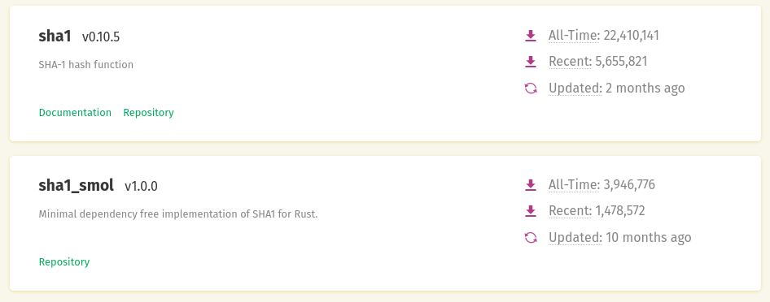

If you've been a part of any language that upheaves the traditional C way of pulling in dependencies,
like Rust or Go - you might have heard of this statement before, or something like it:
<!--more-->

> "I suggest not choosing X, it hasn't received updates in a couple of months. You'd better choose Y."

However, when I gave it some more thought and reflected on my own projects this is not necessarily a bad
thing - in context. For example, I was looking for SHA1 crates for Rust and I came across one called
[sha1-smol](https://github.com/mitsuhiko/sha1-smol). However, look at when it last received an update:

Now if this made you shudder a little, I don't blame you. I don't know when I started to pay attention to
_when_ something got updated and I naturally gave this _SHA1 crate_ a second thought because of this. However
if you give it a couple minutes of thought, maybe it's okay that this isn't updated?

Think about it, this is not a GUI crate or anything that else is high maintenance with moving targets,
many maintainers or complex stacks. This is a _SHA1_ crate, for an algorithm that hasn't been changed since
1995. This crate is
not "unmaintained", in fact it's pretty well maintained as there is a commit fixing some small things in
January of 2022 (as of writing). The fact of the matter is that the surface area of this crate is so small,
the scope of functionality is too simple that it's actually better to **not change anything at all**. This
library serves it's purpose very well and I've used it without trouble. If it doesn't need changes, but yet
still has a maintainer that will make fixes as needed - is it truly unmaintained and should we be counting the
last commit as a good indicator of maintainability?

I think this is a much newer problem that these languages face _because_ crates.io makes it very clear which libraries are "updated" and which
ones aren't:

Now I'm no crates.io designer, but it is a really odd choice that they choose to display "Updated" and not some
clear "maintained" or "unmaintained" symbol. After all, it's possible that "sha1" could become unmaintained despite
it appearing more "maintained" due to the last update date. Just a thought though.

For my own projects, I practice "dogfooding" as in - I create software that I personally want to use and then
improvements and bugfixes naturally come[^1]. If I don't use my own software, there's a good chance that it won't
be updated as often. [Astra](/software/astra) and [Silica Viewer](/software/silica-viewer) are examples of software that isn't _frequently updated_ but still maintained - I _still_ use this software but they're mature enough where I don't need to make
hundreds of commits each month.

[^1]: This is one reason why I highly, highly recommend for programmers to not get so keen on completing tutorials.
There's only so many examples you can replicate out there. However everyone has a niche, a problem that other software
can't solve. That niche you fill will teach you much, much more than any canned tutorial will and make it all the
more memorable to learn.
