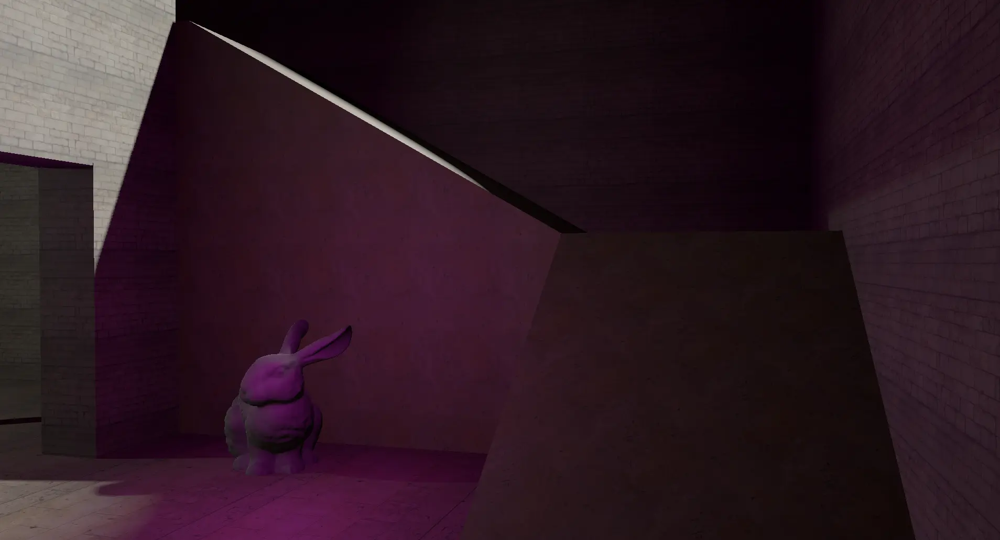
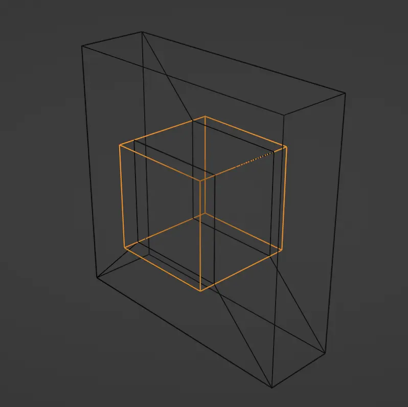
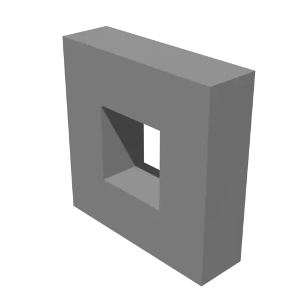
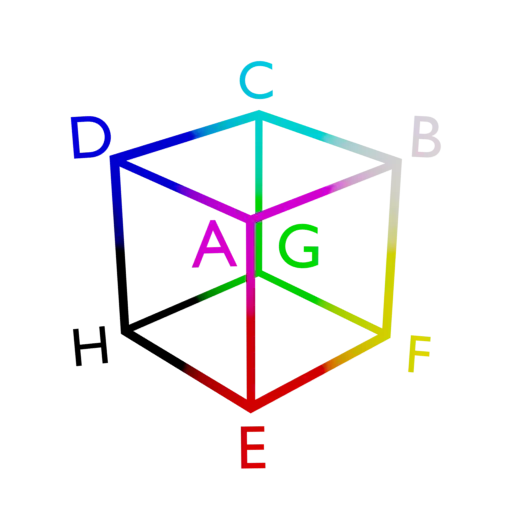

I've always been fascinated with CSG, as someone who has spent some time messing around in Valve's Hammer and Unreal Editor. However, when trying to implement CSG level geometry in my engine there's surprisingly little information! Here's a CSG tutorial I wish existed, so maybe it can help you too.



Much of the example code is ripped out of my engine, but this should give you a good enough walk-through to replicate it on your own.

# Constructive Solid Geometry

CSG stands for [Constructive Solid Geometry](https://en.wikipedia.org/wiki/Constructive_solid_geometry), a helpful technique to create complex geometry using simple primitives and boolean operators. Using CSG, it's possible to create a model in a procedural, non-destructive fashion and has been a popular tool in game engines (and CAD applications).




I like video games, so naturally my first-hand experience with CSG is Source games. This is how much of the level geometry was built in those games:

.](hammer.webp)

# Integration

I wanted to use CSG in my game engine, but searching online you'll get very few tutorials or even discussion about integrating it. If you have the enough prerequisite math knowledge, you might be able to get something going but I was hoping for a ready-made solution I could integrate.

Fortunately, there is one fantastic and almost-all-batteries-included library created by [Luka Aleksić](https://github.com/laleksic) called [tiny_csg](https://github.com/laleksic/tiny_csg). It's written in C++, and is perfect for the brush building tooling I wanted. Since the library uses CMake, it was easy enough to vendor into my source tree as well.

## Defining brushes

Before we can start using tiny_csg, we need some way to define the brushes in our map first. Brushes are defined by a list of planes that enclose a primitive. I'm focusing on cube primitives in this article, so we only need to worry about six planes: _front, back, left, right, bottom and top_.

Let's define an array of eight points, which correspond to each corner of the cube. Here is the points visualized:



And it can be defined like this in C++:

```cpp
std::array<float3, 8> points = {
    float3{1, 1, -1}, // A
    float3{1, 1, 1}, // B
    float3{-1, 1, 1}, // C
    float3{-1, 1, -1}, // D
    float3{1, -1, -1}, // E
    float3{1, -1, 1}, // F
    float3{-1, -1, 1}, // G
    float3{-1, -1, -1}, // H
};
```

Now that we have the points of our cube well-defined, let's move onto defining each plane that we need. Here is a list of the planes, and the points they contain:

* **Front:** B, A, E, F
* **Back:** D, C, G, H
* **Top:** A, B, C, D
* **Bottom:** H, G, F, E
* **Right:**: C, B, F, G
* **Left:** A, D, H, E

(Note that the ordering is important, and should be _counter-clockwise_.)

Using a group of these four points, you can calculate the center of a plane:

```cpp
center = (a + b + c + d) / 4.0f;
```

However a plane isn't defined by only a center, you also need to calculate a normal which is used to find the face direction. This is easy to do however, first you need a function that gives you the normal of a triangle:

```cpp
float3 triangle_normal(float3 p1, float3 p2, float3 p3) {
    return normalize(cross(p1 - p2, p1 - p3));
}
```

Given a plane (a, b, c, d), you can calculate two triangles: (c, b, a) and (a, d, c). Finally, average the normals of those two triangles and you completed the plane!

## Using tiny_csg

Now that we have our list of planes defined, we can start building the level geometry using tiny_csg. This library will do the heavy lifting for us, and give us a list of triangles to render with.

First, create the world and set the void volume:

```cpp
csg::world_t world{};
world.set_void_volume(AIR);
```

There is no predefined volume types, so you need to define your own:

```cpp
constexpr csg::volume_t AIR = 0;
constexpr csg::volume_t SOLID = 1;
constexpr csg::volume_t WATER = 2;
...
```

Create a brush_t with `csg::world_t::add()` and set the planes and the kind of volume it is:

```cpp
auto brush = world.add();
brush->set_planes(get_planes()); // a list of the planes we created earlier.
brush->set_volume_operation(csg::make_fill_operation(SOLID));
```

Next, call `world_t::rebuild()` to begin the level building process. The result is faces and fragments we can then use to rasterize the brushes! It's a linked list, so to iterate it start with `world_t::first()` and get the next brush in the list using `world_t::next()`:

```cpp
csg::brush_t* brush = world.first();
if (brush) {
    while (brush) {
        ...
        brush = world.next(brush);
    }
}
```

To start looping through the triangles, use `brush_t::get_faces()` and loop through the faces, and then the fragments of said faces:

```cpp
auto faces = brush->get_faces();
for (csg::face_t& face : faces) {
    for (csg::fragment_t& fragment : face.fragments) {
        const auto triangles = csg::triangulate(fragment);

        // process the triangles...
    }
}
```

You'll want to discard any fragments that are touching two of the same volume type. For example, air touching air would contribute a lot of unnecessary geometry:

```cpp
const csg::volume_t front = fragment.front_volume;
const csg::volume_t back = fragment.back_volume;

// Discard air/air and solid/solid polygons
if (front == back)
    continue;
```

Now let's deep dive into how to process these triangles, and some pitfalls you might run into.

## Triangulation

tiny_csg will triangulate the brush fragments for you, but it's up to you to calculate things like texture coordinates, normal, tangents/bitangents and more. Those are all pretty easy though, so let's start with normals.

### Normals

To calculate normals, you can just take the normal of the plane the face is part of:

```cpp
for (auto triangle : triangles) {
    float3 normal = face.plane->normal;

    ...
}
```

However, make sure that when the back is a void volume (like `AIR`), that you _flip_ the normal:

```cpp
for (auto triangle : triangles) {
    float3 normal = face.plane->normal;
    if (back == AIR) {
        normal = -normal;
    }
    ...
}
```

When you intersect a solid with a void brush, the new geometry created to fill the hole is calculated _from_ the void brush - meaning that the normals are facing the wrong direction. It's technically correct for the void brush, but not the hole.

If you are building an index list, I think you also want to flip it as well but it might not be needed.

### Texture coordinates

Texture coordinates are relatively easy to calculate as well, first set up a loop iterating through all the triangles.

```cpp
for (std::size_t i = 0; i < indices.size(); i += 3) {
    const float3 v1 = vertices[indices[i]].position;
    const float3 v2 = ...;
    const float3 v3 = ...;
}
```

Calculate a face normal, and also check if all of the components do not equal zero:

```cpp
float3 normal = cross(v3 - v1, v2 - v1);
if (normal.x == 0.0f && normal.y == 0.0f && normal.z == 0.0f) {
    continue;
}
```

Next we want to create a rotation that looks "towards" this normal:

```
Quaternion rotation = look_rotation(float3{0, 0, 1}, normal);
```

Then for each vertex in this triangle, we can multiply it component-wise to create a pretty nice distribution. I included an extra `scale` variable that I can adjust on the whole brush.

```cpp
vertices[indices[i]].uv = float2{(rotation * v1).x, (rotation * v1).y} * scale;
vertices[indices[i + 1]].uv = float2{(rotation * v2).x, (rotation * v2).y} * scale;
vertices[indices[i + 2]].uv = float2{(rotation * v3).x, (rotation * v3).y} * scale;
```

## Tangents and bitangents

This one is a little bit more difficult, and I ended up going with a widely used library called Mikktspace to calculate these. It's interface is a little obtuse at first too. You need to create a `SMikkTSpaceInterface` and assign a bunch of functions it will use to grab and store triangle data. I used lambdas for these, and assigning userdata:

```cpp
SMikkTSpaceInterface iface = {};
iface.m_getNumFaces = [](const SMikkTSpaceContext *ctx) -> int {
    const CSGMesh *m = static_cast<const CSGMesh *>(ctx->m_pUserData);
    return m->indices.size() / 3;
};

iface.m_getNumVerticesOfFace = [](const SMikkTSpaceContext *, const int) -> int {
    return 3;
};

iface.m_getNormal = [](const SMikkTSpaceContext *ctx, float normals[],
                       const int iface, const int ivert) {
    const CSGMesh *m = static_cast<const CSGMesh *>(ctx->m_pUserData);

    int i = iface * 3 + ivert;
    memcpy(normals, m->vertices[i].normal.ptr(), sizeof(float3));
};

iface.m_getTexCoord = [](const SMikkTSpaceContext *ctx, float texcoords[],
                         const int iface, const int ivert) {
    const CSGMesh *m = static_cast<const CSGMesh *>(ctx->m_pUserData);

    int i = iface * 3 + ivert;
    memcpy(texcoords, m->vertices[i].uv.ptr(), sizeof(float2));
};
iface.m_getPosition = [](const SMikkTSpaceContext *ctx, float position[],
                         const int iface, const int ivert) {
    const CSGMesh *m = static_cast<const CSGMesh *>(ctx->m_pUserData);

    int i = iface * 3 + ivert;
    memcpy(position, m->vertices[i].position.ptr(), sizeof(float3));
};
iface.m_setTSpaceBasic = [](const SMikkTSpaceContext *ctx, const float tangent[], const float sign,
                            const int iface, const int ivert) {
    const CSGMesh *m = static_cast<const CSGMesh *>(ctx->m_pUserData);

    int i = iface * 3 + ivert;
    float4 t{tangent[0], tangent[1], tangent[2], sign};
    memcpy(m->vertices[i].tangent.ptr(), t.ptr(), sizeof(float4));
};
```
(This code could absolutely be improved!)

After you created your interface, you can then create a context and assign your userdata and then start the tangent process.

```cpp
SMikkTSpaceContext ctx;
ctx.m_pUserData = &cgMesh;
ctx.m_pInterface = &iface;
genTangSpaceDefault(&ctx);
```

## Bullet

It's also really easy to plug the triangle data straight into Bullet too, if that's the physics engine you're using. Here's the snippet if you also want Bullet integration:

```cpp
csg::brush_t* brush = scene.world->first();
if (brush != nullptr) {
    while (brush) {
        auto faces = brush->get_faces();
        for (csg::face_t& face : faces) {
            for (csg::fragment_t& fragment : face.fragments) {
                const csg::volume_t front = fragment.front_volume;
                const csg::volume_t back = fragment.back_volume;

                if (front == back) // discard air/air and solid/solid polygons.
                    continue;

                const auto triangles = csg::triangulate(fragment);

                for (auto triangle : triangles) {
                    brushes_positions.push_back(fragment.vertices[triangle.i].position.x);
                    brushes_positions.push_back(fragment.vertices[triangle.i].position.y);
                    brushes_positions.push_back(fragment.vertices[triangle.i].position.z);
                    brushes_indices.push_back(brushes_indices.size());

                    brushes_positions.push_back(fragment.vertices[triangle.j].position.x);
                    brushes_positions.push_back(fragment.vertices[triangle.j].position.y);
                    brushes_positions.push_back(fragment.vertices[triangle.j].position.z);
                    brushes_indices.push_back(brushes_indices.size());

                    brushes_positions.push_back(fragment.vertices[triangle.k].position.x);
                    brushes_positions.push_back(fragment.vertices[triangle.k].position.y);
                    brushes_positions.push_back(fragment.vertices[triangle.k].position.z);
                    brushes_indices.push_back(brushes_indices.size());
                }
            }
        }
        brush = scene.world->next(brush);
    }
}

auto *index_vertex_array = new btTriangleIndexVertexArray(brushes_indices.size() / 3,
                                                      const_cast<int *>(reinterpret_cast<const int *>(brushes_indices.data())),
                                                      sizeof(int) * 3,
                                                      brushes_positions.size(),
                                                      const_cast<btScalar *>(brushes_positions.data()),
                                                      sizeof(btScalar) * 3);

const bool quantized_aabb_compression = false;
auto *shape = new btBvhTriangleMeshShape(index_vertex_array, quantized_aabb_compression);
```

# Results

The result is pretty amazing, here is a quick walk-through of a level I made using CSG:



# Credits

* Luka Aleksić for the amazing tiny_csg library!
* This [StackExchange answer](https://gamedev.stackexchange.com/a/147030) by "DMGregory" which suggested using Mikktspace for creating tangent and bitangent vectors.
* This [StackExchange answer](https://gamedev.stackexchange.com/a/139955) by "DMGregory" again which suggested how to calculate texture coordinates for arbitrary triangles.


