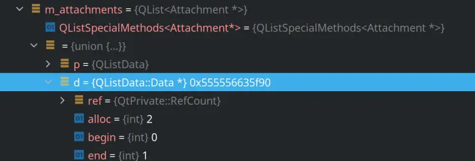

**Edit:** This was written before my projects were switched to Qt6, and I'm not aware of a Qt6 pretty printer solution (if you do, let me know in a comment below.) If you're using CLion, check out the [Qt6 pretty printer plugin](https://github.com/winseros/Qt6Renderer).

Outside of Qt Creator, GDB has a hard time understanding Qt times and you'll regularly get garbage or unusable debugging output.



Luckily, [GDB has a system where you can use Python scripts](https://github.com/ruediger/Boost-Pretty-Printer/blob/master/HACKING.org) to print information from custom types[^1]. The printers we're using is [Ezike Ebuka's GDB_Printers](https://invent.kde.org/ebuka/gdb_printers). First clone the repository, and extract it somewhere where you won't accidentally delete it. Here I copy it into my Development folder:

```bash
$ cd ~/Development
$ git clone git@invent.kde.org:ebuka/gdb_printers.git
```

Then edit your `~/.gdbinit` file and add this to it (or create it if you haven't already):

```python
python
import sys

# change the path below to the correct path
sys.path.append('/home/josh/Development/gdb_printers')

from printers import register_qt_printers
register_qt_printers(None)
end

set print pretty on
```

Now if you run GDB again, you'll get pretty prints for a lot of Qt types! This includes QString, QVector, and of course QList:


If you want a full list of supported types, take a look in [qtprinters.py](https://invent.kde.org/ebuka/gdb_printers/-/blob/master/printers/qtprinters.py).

[^1]: Just make sure your GDB has been compiled with Python support, or else this won't work.
